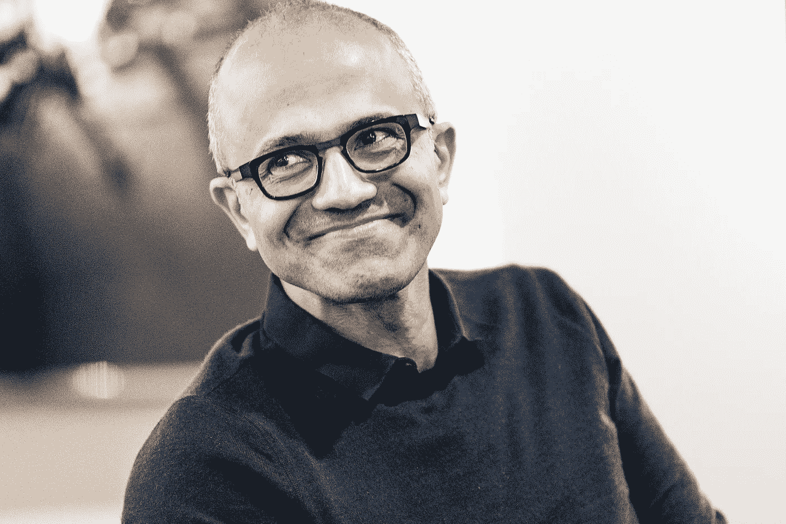

# 塞特亚·纳德拉:我们一直在等待的领袖

> 原文：<https://medium.datadriveninvestor.com/satya-nadella-the-leader-weve-been-waiting-for-3cbec4c4011d?source=collection_archive---------9----------------------->

塞特亚·纳德拉担任微软首席执行官已经有几年了。在他的领导下，微软内部发生了翻天覆地的变化。他已经在微软工作了 20 多年，他将自己的生命和热情贡献给了微软的使命，那就是让这个星球上的每个人和组织都有能力取得更大的成就。

> 我们的使命是让地球上的每一个人和每一个组织都有能力实现更多。—微软的使命

塞特亚·纳德拉非常热衷于让人们做更多的事情。他承诺要做的事情之一是在微软培养一种强调同理心的文化，同理心应该是微软创造惊人产品的创新的核心。

现在，“同理心”如何能够帮助萨提亚实现他的使命——微软的使命？在回答这个问题之前，我们首先需要定义共情。那么什么是共情呢？

> 同理心是理解和分享他人感受的能力。

萨提亚认为，如果我们开始与他人建立共鸣，如果我们开始真正花时间倾听彼此，理解彼此，那么我们就可以一起找到解决我们目前正在处理的问题的办法。

由同理心驱动的创新可以改变一个人的生活方式，甚至可能改变一个人的一生。想象一下，如果我们练习换位思考，我们开始真正思考彼此的问题，并真正尝试提出解决彼此问题的方法。

这是他在 2014 年被宣布为微软首席执行官的那一天的首要任务，即改变微软的文化，让移情成为公司通过技术带来解决方案的动力，从而赋予人们权力。

我们可以看到，萨提亚真的很真诚地通过微软赋能人们和企业做更多的事情。就在最近，微软在他们的 Youtube 频道上上传了一段视频，宣布他们将与诺华合作，通过使用机器学习来帮助加快新药的开发，从而解决医疗保健中的问题。

Satya Nadella announces collaboration with Novartis

微软正在适应他们的文化和业务的这些变化是由于萨提亚的领导和激情。

我认为 Satya 正在做的事情将影响其他大型技术公司，让他们真正问自己，他们正在开发的产品和服务是否真的为用户增加了任何价值。

我认为萨提亚明白公司盈利意味着什么。我想他知道公司应该盈利，作为为人们提供有意义产品的回报。通过这种方法，微软倾向于在公司应该如何开展业务方面引领技术行业前进。

最后，我认为 Satya 是我们一直在等待的领导者之一，他将推动技术行业的变革，并可能再次改变世界，就像微软曾经通过向大众介绍图形模式界面所做的那样。