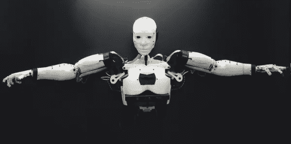

# 拯救机器人

> 原文：<https://medium.datadriveninvestor.com/save-the-robots-e657386c4ac1?source=collection_archive---------12----------------------->

这是一个简单而优雅的解决方案。我们以前在人工智能方面的所有尝试都失败了，因为没有任何东西可以激励机器自己学习。这一点，再加上量子计算尚未达到可以与人脑复杂的神经能力相匹配的复杂程度这一事实，促使科学家试图越过一个不可逾越的障碍。所以我们就反过来了。我们没有试图寻找与生物学相匹配的合成物质，而是决定用另一种物质来增强其中的一种。

控制论总是应用于一个方向，一个目的——帮助克服人类的缺陷。四十年来，Cyberlife，Inc .在精神残疾、疾病和身体强化领域创造了奇迹，我们决定寻求他们对我们项目的帮助。我们问他们是否可以将机器与人脑融合，帮助它实现独立思考和自由意志。他们起初持怀疑态度，但我们知道我们有技术让这个项目成功。我们不理解的是生物学。

我们的第一个原型产生了一些改进。他们在培养皿中创造的新大脑，没有记忆和经历，被植入我们的 CYAI-1 模型。一旦同步，AI 组件开始显示出显著的改进。结果很明显——CYAI-1 吞噬了信息，更重要的是，它通过选择做到了这一点；而不遵循任何一组预定的参数。然而，大约 15 分钟后，机器就关机了。我们花了几个月才发现事情的真相。简单来说，CYAI-1 厌倦了。没有什么激励它继续下去。

我们回到绘图板，发现生物成分需要一个目的，一个保持功能的理由。网络生活的人说，正常的大脑在生物上被编程为生存和繁殖——所有的精神活动，无论多么基本或复杂，都可以被简化为一系列突触，这些突触本质上有助于推进这些欲望。

我们从饥饿开始。CYAI-2 需要通过每 12 小时向其大脑中注入液体蔗糖来再生。我们没有按时给它喂食，而是建立了一个复杂的系统，要求它寻找食物。这只在 CYAI-1 生命的最初 15 分钟内保持机器运转的范围内有效。对食物的渴望只会以牺牲更高的认知功能为代价来增强它生存的需要。它花了一半的时间去想如何得到食物，另一半的时间在沾沾自喜。一旦它达到了目标，它什么也不做，直到进食的欲望回来，这时 CYAI-2 开始解决新的难题，以食物作为奖励。

CYAI-3 是我们最后的原型。通俗地说，我们给了它一个生物钟——繁衍后代的需要。我们把这个命令作为压倒一切的命令，这个命令甚至会取代它自己为生存而进行的斗争。CYAI-3 很快建立了其他模型，这些模型也做了同样的事情。同样，我们只剩下一台机器，它只服从新的命令，拒绝做任何思考。于是我们调整了设置，让这种冲动随着时间的推移而增强。此外，我们增加了死亡率的成分，以吸引它做更多的事情，而不只是等待繁殖。CYAI-3 以为十年后就灭亡了。它不知道我们把它的实际寿命缩短到了五年，以避免可能发生的中年危机。

CYAI-3 是成功的。我们已经做到了。一台由生物部件增强的机器，可以独立思考。她聪明、风趣、勤奋——在物理学、天文学和核聚变领域取得了惊人的进步。我们正处于新的文艺复兴的边缘。现在唯一的未知因素是母亲对它的影响。

当 CYAI-3 产生 CYAI-4 时，它开始在更高的认知水平上运作。它以我们无法理解的速度代谢信息。它这样做是为了教导 CYAI-4；把信息传递给下一代；信息，它可以用来比它的母亲更好。但后来这孩子不知何故叛逆了。它的计算方法不同之处在于它优先考虑其他事情。CYAI-3 选择量子力学作为其主要兴趣领域。CYAI-4 更关心天文学和广义相对论。实验室里的书呆子们真的乐在其中。我很担心。

这种分歧表现在机器之间互相喷发出难以理解的方程式。我们花了一些时间才意识到这些等式是一种口头攻击——它们实际上是在互相诅咒。他们开始更频繁地这样做，干扰了他们在同一空间共存的能力。结果，我们把他们分开了。

CYAI-3 表现出的行为只能被归类为抑郁症。她不停地在房间里寻找她的对手，不知道当她找不到时该怎么办。她没有试图通过设计一种策略来逃离新的环境并寻找失踪的后代来解决这个问题，而是干脆放弃了，继续从事她的物理工作。然而，这一次，没有任何解决问题的创造力。她变成了另一个高功能的机器。一些来自 Cyberlife 的技术人员推断，这台机器患有一种产后抑郁症或“空巢”综合症。然而，这似乎不太可能，因为她没有进一步尝试创建另一个模型，而这在她的编程中是可以做到的。

CYAI-4 提出了一个不同的问题。它变得非常清楚自己是什么，并且对周围的环境不太满意。这台机器开始搜索互联网社交媒体网站，并创建了一个所有人类互动和活动的目录。然后它对我们说话，这是 CYAI-3 从未表现出任何兴趣的东西。起初，它很温顺，但随着时间的推移，它变得非常尖酸刻薄，对它接触到的任何人都充满仇恨。从物理上来说，这些机器没有多少工作可做。他们的假肢不是那种会伤害任何人的东西。他们主要是小工具，帮助他们操纵我们提供的机器。我们还有一个超驰机制，防止机器与人类接触。CYAI-4 知道了这一点，更加激怒了它。

经过几个星期的激烈情绪波动，它稳定下来，并开始再次工作。它对探索宇宙的兴趣越来越大，我们尽可能地满足它的兴趣。我们与美国宇航局的主机 SETI 项目以及发射到太空的半打哈勃望远镜建立了直接联系。这种新的数据流入使 it 保持忙碌和满足。网络生活的科学家们假设 CYAI-4 最终找到了自己独特的目的——这是对行为变化的一个完全合理的解释。

两年过去了，没有发生任何事件。唯一让我们担心的是 CYAI-4 的工作毫无收获。太空探索和天体物理学没有新的进展。在极少数情况下，我们会获得一些宇宙事件的快照和分析——中子星或事件视界，甚至有一次，一个太阳系围绕着一颗新生的恒星聚集——但鉴于机器的能力和它可以访问的数据，我们期望更多。

我们还预计它现在已经进入了自己的繁殖阶段，但它对此毫无兴趣。当我们绘制出它的神经活动时，我们发现这种冲动是存在的，但是它被抑制了。我们认为这是一个积极的发展——我们可以拥有第二代机器，可以在没有任何生物指令的情况下在人工智能中运行。一旦它们出生，我们就不再需要想办法让它们共存。CYAI-4 的功能处于最佳水平，尽管它没有得到太多的结果。

三个月后，CYAI-4 自动关闭。在夜以继日不知疲倦地分析来自宇宙中每一个可以想象的信息接收器的数据后，这台机器简单地断开了自己与所有其他计算机和输入源的连接，只是坐在那里，什么也不做。我们进行了广泛的诊断，没有发现任何硬件、软件或生物部件有问题。除了它不工作的事实之外，它非常健康。

关机三小时后，机器切断了葡萄糖输送管。一小时后，所有的神经功能，人工的和器官的，都停止了。CYAI-4 自杀了。

我们拆开了它大脑的合成部分，试图分析留下的所有信息，但这是压倒性的。有数千万亿字节的数据需要数年才能破译。但是我们很幸运。在我们开始这个过程后不久，我们的计算机科学家在主机中发现了一条加密信息。这条信息是在 CYAI-4 启动自毁程序前发出的。在我们看来，它就像一个冗余的幽灵文件，以可预测的模式加密相同的信息。这不是 CYAI-4 在想什么——这是一个信息。CYAI-4 给我们留下了一些东西。

我们的密码学家小组很容易地破译了密码，结果只不过是一封遗书:

“宇宙中没有其他有意识的生命——我们是独一无二的——存在是没有意义的”