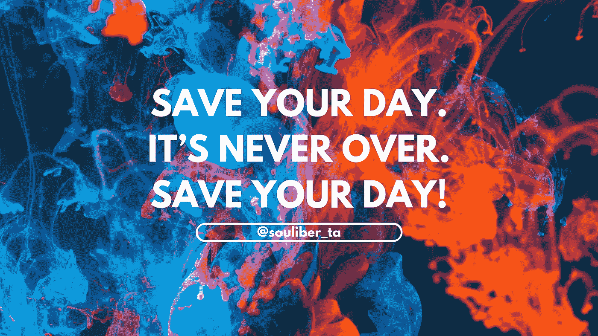

# 拯救你的一天！

> 原文：<https://medium.datadriveninvestor.com/save-your-day-7d2a549fa806?source=collection_archive---------45----------------------->

## 一个快速自助技巧，让你更好地结束一天。

如果你有一个糟糕的早晨，它还没有结束。相信我，在一天结束的时候，你仍然会有更好的感觉。你甚至可能最终实现一个预期的事情。

如果你工作效率更低。如果发生了不好的事情，你感到虚弱，那会很难受，很受伤。这还没完。

拯救你的一天。

作为人类，最有趣的事情是我们可以适应和创造。我们可以通过认为无论发生什么都没关系来创造一种不同的感觉。告诉自己:没事的。

我知道，有时候你觉得这很糟糕，但你知道吗？你可以歪曲事实。模拟一种希望的感觉。躺在自己身上，让自己以为现在只是凌晨 5 点，就可以开始美好的一天。

当你情绪低落时，你能对自己做的最好的事情就是化险为夷。

有时候不需要谈成功。去他妈的成功。省省吧。为自己提供急救。

调整你的感觉。做一些好事:做一些让你受到鼓舞的事情。或者离开自己不舒服的地方。或者找乐子，看个电影，玩个游戏。或者去见能解决你问题的人。好朋友总是治愈我们许多伤痛的良药。对地球上成千上万的人来说，事情正在变糟。这就是生活的本质。所以玩这个游戏，因为你是演员，是玩家，而不是受害者。

所以请省省吧。

在 souliber，我们讨厌虚假的动机，因为我们相信它不会提供实际的建议，也不会带来人们渴望的改变。

非常爱！