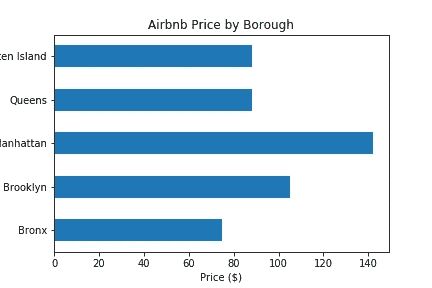
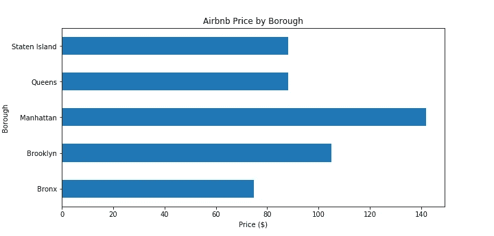
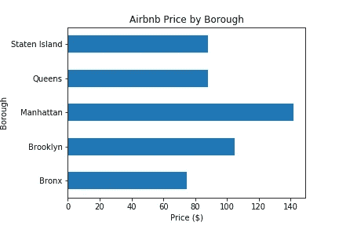
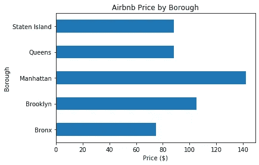
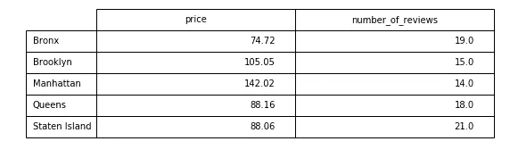

# 保存用于演示的 Python 数据可视化

> 原文：<https://medium.datadriveninvestor.com/saving-as-png-fcfaf04b586f?source=collection_archive---------1----------------------->


Photo by [Carlos Muza](https://unsplash.com/@kmuza?utm_source=medium&utm_medium=referral) on [Unsplash](https://unsplash.com?utm_source=medium&utm_medium=referral)

数据可视化是使用图表、图形和地图等可视化元素来表示信息和数据。这是传达您的分析结果的重要方式之一。它支持你编的引人注目的故事。

如何将可视化内容导出到您的演示文稿(博客、PowerPoint、报告等)中？)?以下代码允许您将 Matplotlib 和 Seaborn 图保存为. png 文件(在可视化函数的末尾包含它们)。

[](https://www.datadriveninvestor.com/2019/01/23/which-is-more-promising-data-science-or-software-engineering/) [## 数据科学和软件工程哪个更有前途？数据驱动的投资者

### 大约一个月前，当我坐在咖啡馆里为一个客户开发网站时，我发现了这个女人…

www.datadriveninvestor.com](https://www.datadriveninvestor.com/2019/01/23/which-is-more-promising-data-science-or-software-engineering/) 

## Matplotlib:

```
plt.savefig("image.png")
```

## Seaborn:

```
image = sns.boxplot(data)
image.figure.savefig("image.png")
```

也可以其他格式保存图，例如。pdf，。jpeg 等。在文件名末尾指定所需的格式。

## 保存而不切除任何部分

保存绘图后，确保它显示了所有零件。即使您在运行代码时看到了完整的图形。png 文件可能不会显示所有的部分。你不会想显示一个不完整的图表，如下图所示。



要防止这种情况发生，您可以通过不同的方法更改地块和图形空间的格式。

一种方法是改变图形大小，增加宽度和/或长度以包括被切掉的部分(默认图形大小为 6.8、4.8)。

```
plt.figure(figsize=(10, 4.8))
```



下面的方法保持原来的图形大小，但是移动了位置并改变了绘图的大小，以适合原来图形空间中的所有内容。

```
plt.subplots_adjust(left=0.2)
```

您可以根据图形所需的空间量(数字代表绘图与图形边界的距离)来更改数字和方向(左、右、下、上)。



以上两种方法涉及测试不同的数字，无论是图形空间的大小还是边距。以下选项自动调整绘图的位置，以适合图形空间，默认或指定，边缘没有多余的空白。

```
#changes the layout first before saving the plotplt.tight_layout()
plt.savefig("test.png")
```

或者

```
#changes the layout for only the saved versionplt.savefig("test.png", bbox_inches="tight")
```



## **保存数据帧**

如果需要显示数据表，也可以将数据帧保存为文件。您可以将其导出为. csv 或。xlsx 文件，然后在 excel 中创建表格。但是，如果您更喜欢在 Python 中而不使用 Excel，您可以使用 Matplotlib 通过下面提供的代码将数据帧转换成表格，然后将表格保存为图像(。png，。jpeg)或 PDF 文件(。pdf)。

