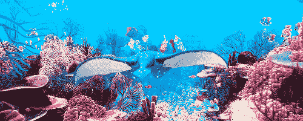
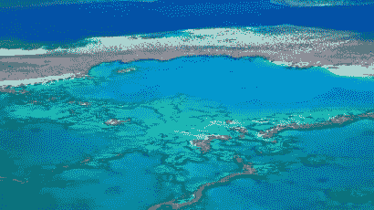
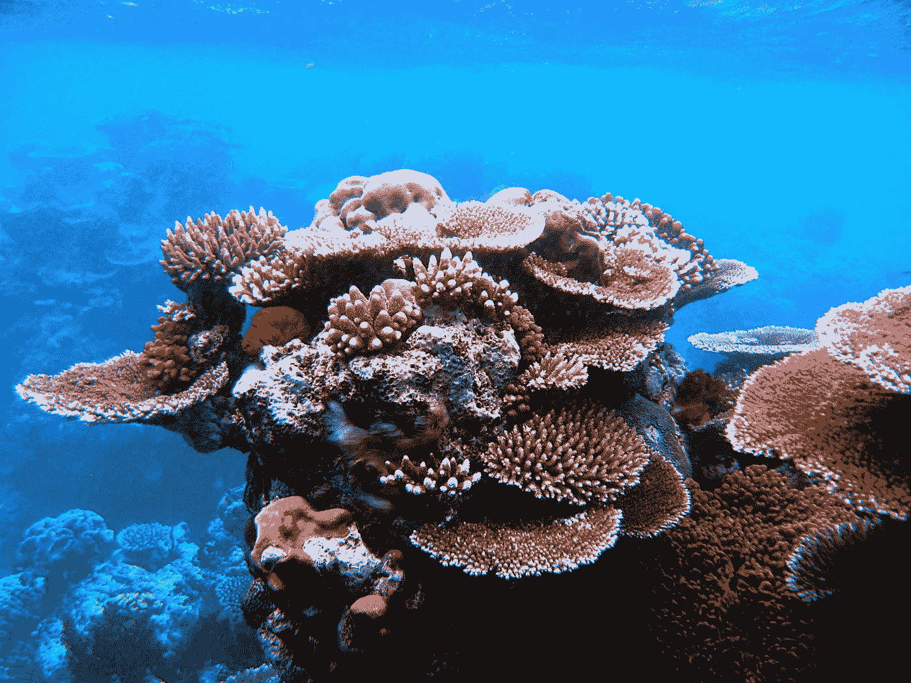
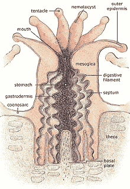
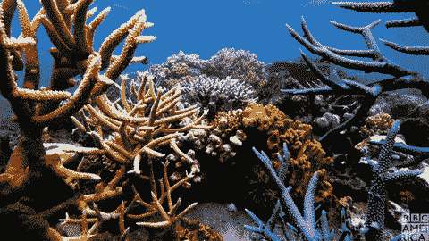
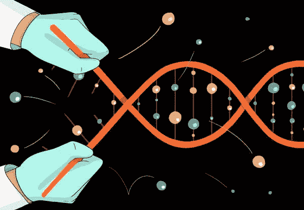
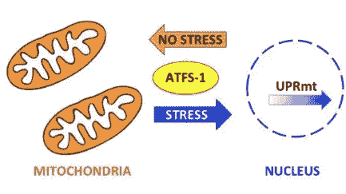
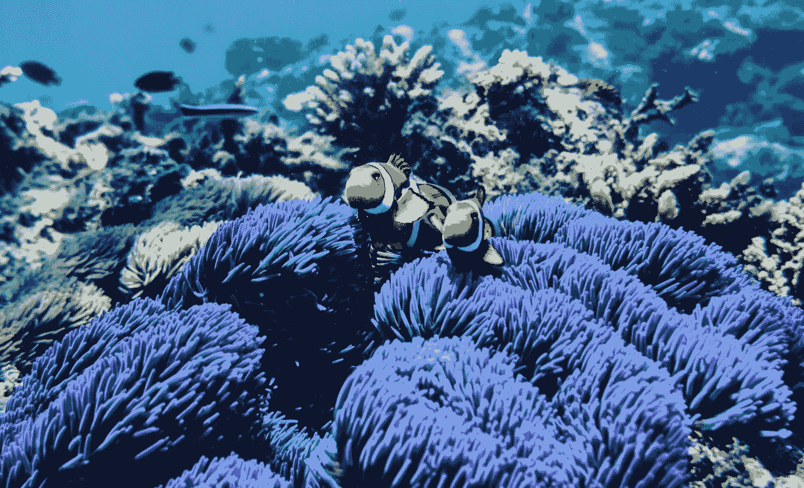

# 用遗传学拯救珊瑚

> 原文：<https://medium.datadriveninvestor.com/saving-coral-with-genetics-669335a07b24?source=collection_archive---------8----------------------->

## 珊瑚危机和诱导 UPRmt 途径在珊瑚中产生免疫力。

(Credit: Disney Pixar) 🐟🐠🐙🦀

# 珊瑚礁是地球上最重要的生态系统之一！

迪士尼皮克斯公司的《海底总动员》发生在世界上最大的珊瑚礁系统“大堡礁”

在电影中，珊瑚礁因生命和令人惊叹的色彩而茁壮成长。

它是所有当地海洋生物的家园，是海洋生物的重要生态系统。

电影屏幕之外…

The Great Barrier Reef from above. 😍(Credit: Australia News)

## 大堡礁是我们星球上最大的生物！

它是无数海洋物种的家园，包括:鱼、鲨鱼、海豚、软体动物等等。🦈

它是澳大利亚昆士兰海岸外 2300 公里长的生态系统，拥有数千个珊瑚礁和 600 多种珊瑚(硬+软)。

可悲的是，由于全球变暖导致海洋中的⬆️️酸度水平和海平面温度上升，我们的珊瑚礁正在以惊人的速度消失。

截至 2018 年，**由于全球变暖导致的*珊瑚白化*，大堡礁 50%的珊瑚礁已经消失**(国家地理)。同样，这种情况正在世界各地的珊瑚礁中发生，预计大约一半的珊瑚礁已经被杀死。🤯

这是数量巨大的珊瑚礁，它们都有自己独特的生态系统，是成千上万种海洋生物的家园！

情况变得更糟……按照这种速度，预计到 2050 年，世界上 90%的珊瑚礁将会消失。😞

当我听到这个统计数据时，我很震惊，并想知道我如何才能提供帮助。

在我讨论我们可以帮助拯救海洋中剩余的珊瑚礁的方法之前，这里是为什么你应该关心珊瑚礁的存在(以及没有它们的世界会是什么样子):

 [## 气候变化、ESG 和对更好数据的追求|数据驱动的投资者

### 在地球上许多地方经历了另一个令人难以置信的炎热夏季后，来自 S&P 的最新发现…

www.datadriveninvestor.com](https://www.datadriveninvestor.com/2018/08/24/climate-change-esg-and-the-quest-for-better-data/) 

# 在一个没有珊瑚的世界里，呼吸会困难得多。

海洋产生了我们呼吸的几乎 80%的氧气。🌊

珊瑚对海洋的整体健康非常重要！

For every breathe we take, we can thank the ocean and coral reefs for 80% of the oxygen.

一个不健康的海洋，会产生⬇️氧气。这对人类和地球上的其他生命将是毁灭性的。

超过 25%的🐠物种的部分生命周期是在珊瑚礁中度过的。

依赖珊瑚生存的海洋生物将受到巨大影响，降低海洋的健康程度。

**没有珊瑚的世界的其他结果:**

*   ⬇️ **鱼给我们吃**
*   **失去世界上最美丽的生态系统之一。**😞
*   某些物种的灭绝和濒危。
*   ⬆️ **海岸线的侵蚀和破坏。**🌧️ **珊瑚礁是风暴潮和强大海浪的天然屏障。**
*   **影响从事渔业、娱乐和旅游业的人的工作和收入。**
*   **失去治愈疾病的可能和新的药物**💊**来自珊瑚及其所支持的生命。**
*   **珊瑚消失→很多人经常忘记的是生物。**🔑

# 珊瑚是动物。

加上最后一点可能的结果(见上一节)，*珊瑚是活的有机体。*

它们实际上是由小型无脊椎动物组成的。

Diagram of a Polyp. Summary: They’re mostly stomach.

👋遇到**息肉:**

珊瑚虫*生活在骨骼结构的顶部，它是由* ***分泌石灰石或碳酸钙创造的。*** 😎

(Credit: National Geographic)

当海洋温度上升时，气候不再适合这些珊瑚虫，珊瑚漂白现象就会发生。

# 当水温过高时，珊瑚虫开始排出生活在其组织中的藻类，就会发生漂白。

正常情况下，海藻和珊瑚虫有一种内共生关系，珊瑚从海藻中获得 90%的能量。

当珊瑚白化时，它们会完全变白。

The coral bleaching process. 😭

珊瑚有可能在漂白中存活下来，但恢复需要大约十年的时间，随着温度的升高，在热浪再次袭来之前，珊瑚没有足够的时间恢复。

# 让我们对此做点什么。

阻止珊瑚漂白的最好方法是阻止全球变暖，但解决这一问题需要解决许多相互关联的问题。在本文中，我将坚持更可行的选择。

以下是一些你可以做的保护珊瑚的行为

*   **使用氧化锌防晒霜(礁石安全)。**远离任何含有*二氧化钛*(不可生物降解)和*羟苯甲酮* + *辛氧酯*(两者都可能导致漂白)的防晒霜。☀️
*   🚫不要碰珊瑚。触摸珊瑚会摧毁整个群体，因为我们皮肤中的油脂对保护珊瑚虫免受疾病侵袭的黏膜有害。

虽然这些要点很重要，但它们不会阻止全球变暖对珊瑚的伤害。

那么，我们能做些什么来保护珊瑚呢？

我认为答案在于遗传。

# 迷你遗传学速成班:

如果你已经知道遗传学是如何工作的，那么跳过这一节，继续阅读。😎

简单地说，所有像珊瑚一样的生命体都有一个**基因组**(查看[这篇我写的关于基因组的文章](https://medium.com/datadriveninvestor/a-journey-into-the-genome-a6235c8eb81f)了解更多)。

一个基因组是一个 ***DNA*** 的*全序列，特定于一个生物体。🧬*

DNA 是生命的代码，代码中的细微变化(A，C，T，G)是息肉和人类的区别。

基因**是这一串 DNA 中编码特定特征的一小段序列。**

例如，珊瑚虫体内可能有一种基因，使它们能够免疫全球变暖带来的环境压力。😉

Gene-editing. (Credit: New York Times)

💡如果你想改变或表达生物体基因组中的某个基因，你可以使用基因编辑(CRISPR Cas-9，Prime Editing 等)等技术。)或者后生工程来做这个。

# 利用基因知识帮助提高珊瑚的存活率。

前几天，我看到了这篇关于珊瑚研究人员发现的一种基因途径的研究论文，这种基因途径可以提高珊瑚的存活率。

德克萨斯大学的研究人员能够识别出一种可以帮助维持免疫应激下生物体健康的途径。

这个途径就是**线粒体未折叠蛋白应激反应途径(UPRmt)** 。

这种蛋白质发出的细胞应激反应可以帮助珊瑚获得先天免疫和抗热应激保护。😎

这种压力途径包含几个参与保护线粒体的基因，有望在其他珊瑚物种中诱导以保护它们。

# 诱导 UPRmt 途径将有助于珊瑚对环境压力具有免疫力。

该途径在免疫应激下被诱导。

该途径的诱导上调了-ATF5 基因的**的表达。**

The UPRmt mitochondrial unfolded protein stress-responsive pathway. 😍(Pellegrino Lab)

研究表明，Of-ATFS-1 是介导线粒体保护基因网络的目标基因。

**当珊瑚受到两种环境压力时，它会这样做:**

1.  **疾病**🤧
2.  **过热温度**🔥

总结这项研究，*在珊瑚中诱导 UPRmt 途径和表达 Of-ATF5 基因可以帮助保护它们免受热应激，并赋予它们对环境应激源的先天免疫力。*

这对于珊瑚礁的健康+未来来说太神奇了！🎉

# 🔑外卖食品

*   珊瑚礁是地球上最重要的生态系统。
*   **自 2018 年以来，由于全球变暖，超过 50%的大堡礁已经消失。**
*   我们可以通过使用氧化锌防晒霜和不接触珊瑚来解决这个问题。
*   **诱导 UPRmt 线粒体未折叠蛋白应激反应通路可以上调 Of-ATF5 基因的表达。**
*   Of-ATF5 是一种基因，可以帮助介导线粒体保护基因网络，从而保护珊瑚免受环境压力。
*   **诱导 UPRmt 途径和表达 Of-ATF5 基因将赋予珊瑚先天免疫和抗热应激的保护作用。**

随着对 UPRmt 途径的诱导和珊瑚中 Of-ATF5 基因表达的持续研究，有希望保护珊瑚免受全球变暖的影响(直到我们能够阻止全球变暖😉).

我希望能帮助创造一个未来，在这个未来里，珊瑚礁白化只是你在历史教科书上读到的事情，珊瑚礁生态系统会再次繁荣。🌎

如果我们一起努力完成这个目标，我们就可以回去看《海底总动员》而不用担心珊瑚数量的减少！🎉

在你走之前…

**这是我对所有阅读这篇文章的人发出的行动呼吁:**

> “支持有助于解决重大问题的项目和研究，例如保护世界上最重要的生态系统(珊瑚)，倡导保护我们的星球，因为这是我们唯一拥有的星球。”

A picture of a once thriving Great Barrier Reef. I hope our future looks like an ocean full of these! (Also, real life Nemo + Marline are in this picture 😍).

👋嘿，我是阿达拉！我是一名 16 岁的活动家、作家、有抱负的植物遗传学家、遗传工程师、海洋生物学家和宇航员。

非常感谢您阅读这篇文章！它对我来说意味着一切。💙

更多关于遏制气候变化、基因组学+基因编辑和新兴技术的文章，请关注我的博客。

如果你想跟随我的旅程，帮助解决一些世界上最大的问题，你可以在 Linkedin 和 Twitter 上找到我。

想聊聊基因编辑、技术，还是想让我写点什么？在上面的一个平台上给我发消息。

下次见！

✌️Dara