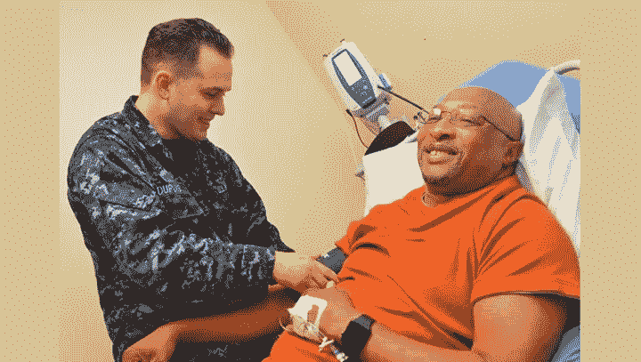
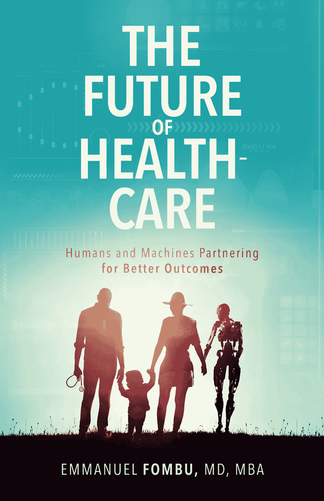

# 用数据拯救医疗保健，未来的医院和预防医学

> 原文：<https://medium.datadriveninvestor.com/saving-healthcare-with-data-the-hospital-of-the-future-and-preventative-medicine-e77063c0a914?source=collection_archive---------11----------------------->

> “预防胜于治疗。”
> 
> **——伊曼纽尔·丰布**

[最近有消息称，谷歌联合创始人拉里·佩奇和谢尔盖·布林在执掌 Alphabet 超过 20 年后，将辞去他们在母公司 Alphabet 的 CEO 和总裁职务。](http://on.mktw.net/googlestepdown)

毫无疑问，佩奇和布林对现代科技行业产生了巨大的影响，但我在这里想说的是前谷歌首席执行官埃里克·施密特。施密特有一个拯救医疗保健行业的计划，它几乎完全依赖于数据。在播客*理论与实践*中，[施密特解释说](http://bit.ly/googleschmidthealthplan)随着越来越多的电子病历和医疗记录存储在云中，数据访问将得到改善，允许“深度数据科学”和预测分析相结合，为医生提供决策建议。

“如果你看看美国的医疗系统，”施密特说，“它从来没有被设计成你我都认为合理的方式。激励机制错位；数据库很差。我相信，由于在机器学习和数据分析方面的收获，我们有机会重新思考一些潜在的假设。”

施密特还呼吁实现互操作性，并转向更好的数据存储方式。“当我去看医生时，”他说，“我想给他们一个登录名和密码，当他们登录时，我想让他们看到我在任何地方的所有医疗数据。”他还建议，当涉及到将患者数据用于研究目的时，我们应该转向选择退出系统。换句话说，除非患者明确要求退出，否则患者数据应默认用于研究。

 [## 医疗保健的未来正在被一场大型技术入侵所塑造|数据驱动型投资者

### 过去十年，全球经济的所有部门都经历了大规模的数字颠覆，而卫生部门现在…

www.datadriveninvestor.com](https://www.datadriveninvestor.com/2018/11/02/the-future-of-healthcare-is-being-shaped-by-a-big-tech-invasion/) 

“现在，”施密特说，“大多数医疗数据甚至不在电子健康记录系统中，而是在医院里的其他系统中。但是这项工作正在进行中，很快所有的电子病历都将基于云。有了云计算，你知道系统不会崩溃。”

电子病历仅仅是一个开始，施密特认为云可以“从医院系统收集其他临床数据，最终收集医疗保健行业的所有临床数据。”我想更进一步，并建议我们也应该从可穿戴设备和智能手机上收集数据，以更清楚地了解患者每天实际在做什么。毕竟，这些生活方式因素会对我们的健康和任何既定治疗计划的成功(或失败)产生巨大影响。

施密特说，如果这种情况发生，“我们将对医疗保健环境中发生的事情有一个更全面的了解，这将使我们能够进行更好的数据分析，更好的预测和更好的医疗保健。我希望计算机能够说‘这是你的历史和我们认为正在发生的事情’，并使用深度数据科学、深度预测分析和人工智能给出建议，以预测医生接下来应该做什么。我认为这将在生产率方面引发一场医疗保健革命，最重要的是，我的健康、你的健康和其他所有人的健康。”

# 未来的医院

在过去的几年里，我在迪拜和阿拉伯联合酋长国呆了很长时间，因为我已经完成了我的演讲任务，并传播了关于医疗保健未来的消息。迪拜以走在科技前沿而闻名，所以他们正在建造未来博物馆也就不足为奇了，BBC 称之为“有史以来最具挑战性的建筑项目”

这座博物馆位于迪拜金融区的边缘，俯瞰着迪拜的无人驾驶地铁系统，预计将于 2020 年 10 月迪拜举办世博会时开放。建筑师将其描述为看起来像一个巨大的呼啦圈，他说“结构的实心部分代表了我们今天拥有的知识”，而“空心部分代表了我们还不知道的一切——换句话说，未来”。

然而，这个项目最有趣的是，一种人工智能算法在建筑的建造中发挥了重要作用。英国广播公司解释说，“接下来是钢框架的设计，被称为 diagrid，因为它是由对角交叉的横梁组成的，以及轻质的外墙。对于这种形状和复杂程度的建筑来说，这些都是最可行的解决方案，而不是钢壳或混凝土壳。由于 diagrid 有无数种可能的排列，BuroHappold 编写了自己的增长算法来达到最佳排列。结果是，diagrid 在连接点的数量、钢管的直径甚至所用钢材的总重量方面都得到了优化，据 BuroHappold 称，这为客户节省了成本和时间。”

现在，你可能想知道所有这些和医疗保健有什么关系。别担心，我快到了。伯罗汉坡未来博物馆的项目主管托拜厄斯·鲍利(Tobias Bauly)说，他希望这座博物馆能成为其他现代建筑的标杆。伊丽莎白·贝恩斯(Elizabeth Bains)在为英国广播公司(BBC)撰写的文章中解释道:“它的非传统形状意味着，从火灾疏散和排烟策略到外部清洁，一切都已经提前建模、分析和优化。整个建筑内人员流动的参数模型被用于确定如何减少排队时间，并通过走廊宽度、电梯数量、浴室设计和售票大厅布局来帮助流动。”

这激发了我的想象力，因为我发现自己在问为什么我们不能为医疗保健做些类似的事情。对于未来的博物馆来说，重点是建筑的效率和开放后的盈利能力。对于医院和其他医疗保健实践来说，重点可能是拯救生命，而不是增加利润，人工智能可能是我们实现这一目标所需的工具。我认为用不了多久，人工智能算法就会在整个建筑行业中得到更普遍的应用，如果这意味着更智能的医院设计能够考虑到患者的医疗保健结果，那只会是一件好事。

# 预防医学

预测固然很好，但如果我们不付诸行动，它们就不会给我们带来任何好处。想象一下，能够以 80%的准确率预测下周的彩票号码。这很酷，但是除非你用这个预测去买票，否则不会有太大的不同。

归根结底，虽然我们的基因肯定会对我们的健康产生重大影响，但我们每天做出的决定也是如此。基因只是你人生故事的开始。仅仅因为你有某种疾病的基因，并不意味着你会得这种病。你的决定至关重要。

环境和社会经济因素在决定疾病发生的概率方面发挥着重要作用，尤其是饮食和锻炼对于过上无病生活至关重要。人们可能会因此活得更长，但这几乎是次要问题。更重要的是，除了延长生命，预防性医疗保健还可以提高我们的生活质量，而在我们当前的体系下，这往往是事后才想到的。

每个人都是独特的，因此我们每个人都应该有自己独特的饮食计划、药物和治疗方案。问题是这还不是普遍的做法。以临床试验为例。在绝大多数情况下，临床试验中分析的药物是在一小部分人群中进行测试的，通常由白人男性组成，很少包括女性。如果一种药物通过了这个小样本的试验，它就会进入市场进行更广泛的应用。

当今医疗保健领域最令人沮丧的事情之一是我们看待医学的方式。两个患糖尿病的人是不一样的。即使是拥有相同基因库的双胞胎也不一定会患上相同的疾病。一些研究甚至强调了基于社会经济因素的同一城市不同地区发病率的差异。这方面最重要的例子之一是德尔玛鸿沟。

但是德尔玛鸿沟远不是唯一的例子。以中国的糖尿病为例。从 1980 年的 0.67%上升到 2011 年的 9.7%。他们的基因改变了吗？还是人们变得更富有，开始吃更多的垃圾食品？如果我们及早发现并采取措施阻止它，同样的事情会发生吗？没有办法确切知道，但在我看来，这不会有什么坏处。

# 想了解更多？

我在我的书《医疗保健的未来:人类和机器合作获得更好的结果》中更多地谈到了新技术及其对医疗保健行业的影响。点击此处为自己购买一份。