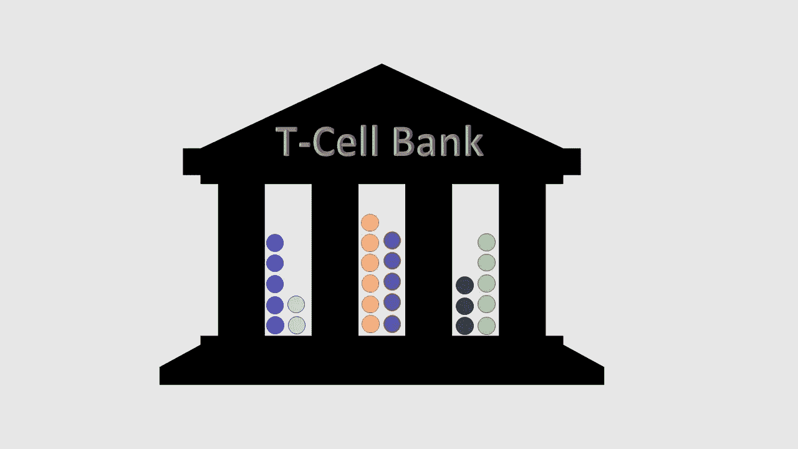

# 为以后的癌症治疗保存免疫细胞

> 原文：<https://medium.datadriveninvestor.com/saving-immune-cells-for-cancer-therapy-later-ec5a8296ac?source=collection_archive---------7----------------------->

Cell Vault is a T-cell cryopreservation and cryobanking company. [Credit, Nancy R. Gough, BioSerendipity]

## 公司正通过提供血细胞冷冻保存来利用汽车 T 细胞和相关疗法

随着癌症疗法越来越多地包括使用患者自身的免疫细胞来对抗癌症，一种新产品已经出现在市场上。Cell Vault 是一家新公司，它将向任何人发送一个血液收集包，在家里或办公室抽取血液，然后将处理后的样本冷冻保存，以备后用。和其他低温保存公司一样，储存费是公司赚钱最多的地方。

其他低温保存和冷冻银行服务包括冷冻和储存精子、卵母细胞(女性的卵子)、受精胚胎和脐带血细胞。像脐带血细胞一样，由细胞库保存的细胞旨在用于治疗疾病。脐带血细胞是有价值的，因为它们包括造血干细胞，造血干细胞是可以再生血液中所有类型细胞的干细胞。与骨髓不同，脐带血中这些血液干细胞的数量非常少，这目前限制了这些细胞主要对儿童的有用性。脐带干细胞唯一被批准的用途是用于治疗一部分血液疾病，这种治疗对儿童最为有效。一些被批准的用途是儿童血癌，如白血病。

细胞库收集和储存外周血单核细胞(PBMCs)。这些包括淋巴细胞(T 细胞、B 细胞和 NK 细胞)和单核细胞，不包括红细胞、血小板或粒细胞(中性粒细胞、嗜碱性粒细胞和嗜酸性粒细胞)。PBMC 也包括少量造血干细胞，但 PBMC 人群中的数量远小于骨髓中的数量。Cell Vault 不仅依靠 CAR T 细胞疗法治疗血癌，还依靠这种细胞治疗实体瘤的研究。Cell Vault 将收集和储存 13 岁及以上的人的细胞，尽管我想象大多数 25 岁以下的人在没有某种形式的经济帮助的情况下将难以支付储存细胞的年费。18 岁以下的儿童需要父母同意才能抽血和冷冻保存。为了确保质量，Cell Vault 与 CLIA 认证的公司合作，包括 Brooks Life Sciences，进行加工和冷冻保存。

尽管 Cell Vault 将自己标榜为“T 细胞银行”公司，但研究表明，NK 细胞也可能被改造成抗癌细胞。因此，Cell Vault 可能会发现 T 细胞和 NK 细胞对他们的客户同样有价值。事实上，NK 细胞比 T 细胞更有优势，因为 NK 细胞不会引起移植物抗宿主病。研究人员正在利用先进的基因工程技术创造具有嵌合抗原受体的 NK 细胞(CAR T 细胞中的 CAR)，从而创造出 CAR NK 细胞。事实上，CAR NK 细胞和其他类型的基因未改变或改造的 NK 细胞正在进行 900 项临床试验，用于治疗从子宫内膜异位症到血癌和实体瘤等疾病。因此，Cell Vault 可能已经在新兴市场找到了一个甜蜜点，因为越来越多的人选择在他们发病前和他们的细胞处于功能高峰期时保存他们的 PBMCs。

# 代表性精子库公司

https://cellvault.com/[的地下室](https://cellvault.com/)

https://www.cryo-cell.com/[的冷冻牢房](https://www.cryo-cell.com/)

加州精子库[https://californiacryobank.com/](https://californiacryobank.com/)

美国唱片[https://www.americordblood.com/](https://www.americordblood.com/)

# 相关资源

名词（noun 的缩写）一个 T 细胞精子库。*生物安全检测*(2019 年 7 月 19 日)[https://www.bioserendipity.com/a-cryobank-for-t-cells/](https://www.bioserendipity.com/a-cryobank-for-t-cells/)

名词（noun 的缩写）用免疫系统对抗癌症:CAR T 细胞疗法的教训。*生物安全鉴定*(2017 年 5 月 15 日)。[https://www . bioserendipity . com/lessons-from-car-t-cell-therapy/](https://www.bioserendipity.com/lessons-from-car-t-cell-therapy/)

名词（noun 的缩写）癌症免疫疗法中的自然杀伤细胞。*生物免疫疗法*(2017 年 6 月 5 日)https://www . BioSerendipity . com/2017/06/05/癌症免疫疗法中的自然杀伤细胞 [/](https://www.bioserendipity.com/?p=424&preview=true) :

Cell Vault 加入了对抗癌症的行列，为第一个 T 细胞冷冻库筹集了 100 万美元的早期资金。 *CISION 美通社*。[https://www . prnewswire . com/news-releases/cell-vault-joins-the fight-against-cancer-raising-in-100 万早期资助-首次 t 细胞冷冻保存-bank-300885336 . html](https://www.prnewswire.com/news-releases/cell-vault-joins-the-fight-against-cancer-raising-1-million-in-early-funding-for-first-ever-t-cell-cryopreservation-bank-300885336.html)(2019 年 7 月 19 日访问)

脐带血库和捐献的选择。*卫生资源&服务管理局，美国卫生与人力资源部*。[https://blood cell . transplant . hrsa . gov/CORD/Options/index . html](https://bloodcell.transplant.hrsa.gov/CORD/Options/index.html)(2019 年 7 月 19 日访问)

脐带血干细胞:当前的应用和未来的挑战。*欧洲干细胞*。[https://www . eurostemcell . org/cord-blood-stem-cells-current-uses-and-future-challenges](https://www.eurostemcell.org/cord-blood-stem-cells-current-uses-and-future-challenges)(2019 年 7 月 19 日访问)

批准的细胞和基因治疗产品。*美国食品&药品管理局*。[https://www . FDA . gov/vaccines-blood-biologics/cellular-gene-therapy-products/approved-cellular-and-gene-therapy-products](https://www.fda.gov/vaccines-blood-biologics/cellular-gene-therapy-products/approved-cellular-and-gene-therapy-products)(2019 年 7 月 19 日访问)

引用自:N. R. Gough，为以后的癌症治疗保存免疫细胞。*中*(2019 年 8 月 8 日)。