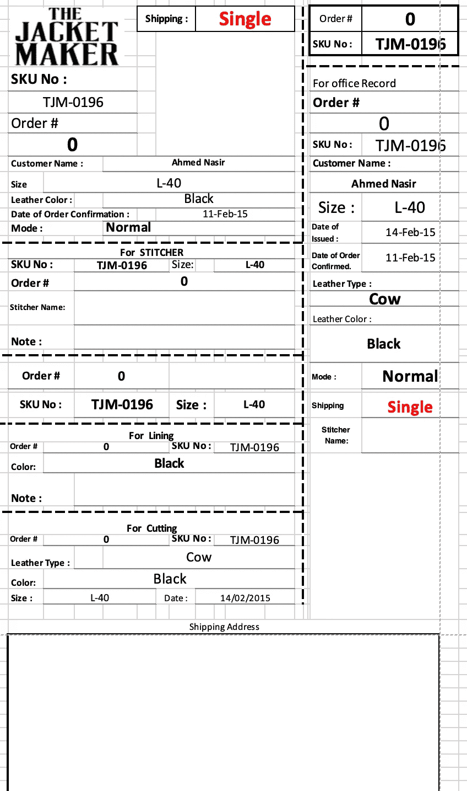
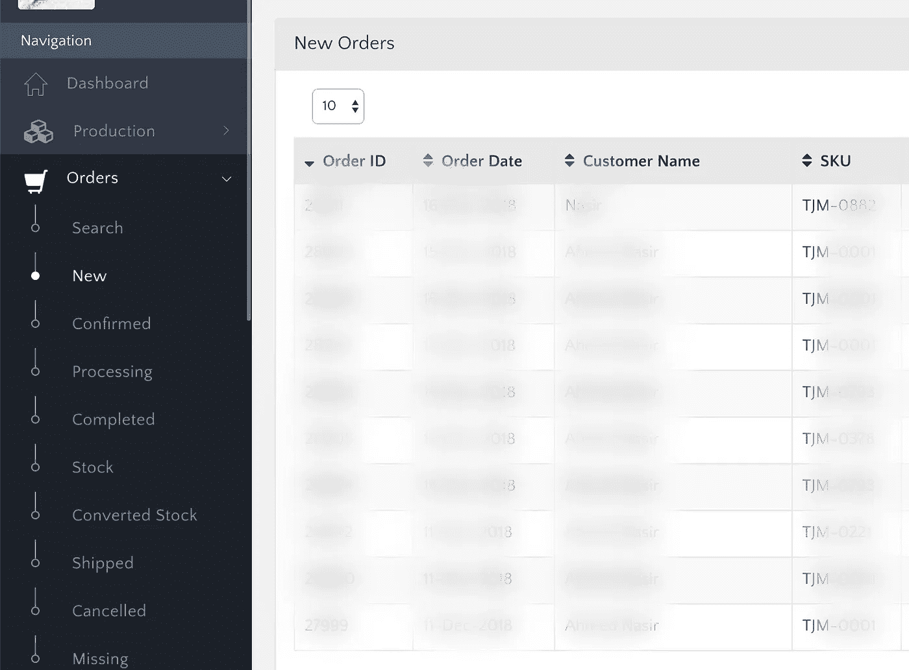
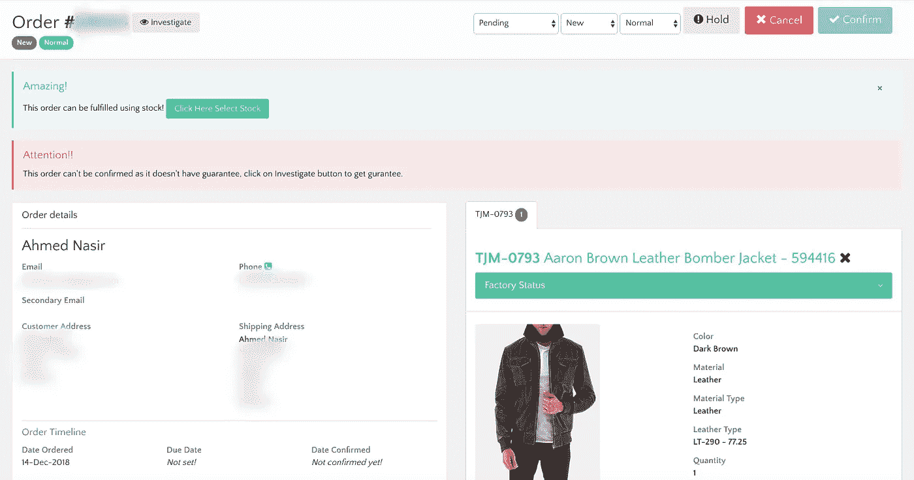

# 用技术扩展您数千美元的业务

> 原文：<https://medium.datadriveninvestor.com/scaling-your-multi-thousand-dollar-business-with-technology-cc64dda30fc2?source=collection_archive---------42----------------------->

你经常会读到公司分享技术如何帮助他们成为价值数十亿美元的企业的故事。中小型企业呢？他们能在追求增长的过程中通过适应技术而获益吗？

在这个故事中，我们想分享适应技术如何帮助我们数千美元的创业。几年前，我的朋友创办了[皮夹克制造商](https://thejacketmaker.com)，作为一家面向漫画迷销售皮夹克的在线商店。

Photo by [Dương Trần Quốc](https://unsplash.com/photos/FQ83tBxftJc?utm_source=unsplash&utm_medium=referral&utm_content=creditCopyText) on [Unsplash](https://unsplash.com/search/photos/stitching?utm_source=unsplash&utm_medium=referral&utm_content=creditCopyText)

他们获得了一个域名，由 GoDaddy 托管，并使用 [OpenCart](https://www.opencart.com/) 框架作为商店前端，在发布后不久订单流就开始了。当时的订单处理非常人工。

1.  客户下订单
2.  客户支持收到电子邮件通知，验证付款和送货地址。
3.  然后，订单被添加到与制作团队共享的 Google 表单中。
4.  生产印刷使用复制所有细节的表格在 Excel 中创建工作卡。
5.  一件典型的夹克制作至少需要 4 个步骤，包括样板制作、皮革裁剪、缝合和整理。
6.  一旦夹克通过整理和质量控制检查，就会打印运输标签和出入证。
7.  然后，夹克被交给快递公司，然后创建并打印空运提单，并将夹克装入箱子进行最终运输。
8.  快递公司会发送一份已发货夹克的每日摘要，然后支持代理会将发货添加到 OpenCart 的订单中，并向他们发送一封电子邮件，我们使用了一个插件，因为 OC 不提供开箱即用功能。

所以有很多手工工作，但在开始时，我们每天都有个位数的订单，很快就出现了一个旺季，随着万圣节的临近，生产出现了混乱，因为订单必须在万圣节前装运，每天都有超过 20 个订单。更糟糕的是，一些顾客收到了他们没有订购的夹克。

Job Card as a spreadsheet.

过去，每天大约需要 4 个小时来验证付款细节、地址和打印生产作业卡。那时，我们意识到是时候摆脱手动步骤并实现自动化，以避免导致数千美元损失的复制粘贴错误。

因此，我们决定，我们应该实现工作卡印刷的自动化，这是我们发展的主要瓶颈，而且很容易实现自动化。每当我们想在 OpenCart 中添加一些东西时，我们就开始搜索插件，然而这次我们决定开发一个自定义门户，因为不会有任何适合我们需求的插件。

我作为一名兼职开发人员正式加入了这个团队，我们购买了一个基于引导程序的 dashboard 主题，并创建了一个 [Laravel](https://laravel.com/) 应用程序。我们使用 [Heroku](https://www.heroku.com/) 来托管我们的仪表板应用程序，主要是因为它只需要“git push”就可以轻松部署，我们可以在免费层上生存几个月。

我们将应用程序连接到主网站数据库，并开始按状态显示订单类别。对于相同数量的订单，我们能够将订单验证和工作卡打印时间缩短到不到 30 分钟。

List of new orders that are waiting for review.

“订单详细信息概览”页面提供了订单的整体情况以及与订单相关的所有内容，还包括客户信息、封套信息、打印工作卡、更改订单状态以及与客户的通信。

Order overview page

随着时间的推移，我们不断增加更多的功能，报告，与 Zendesk(客户支持票务)的集成，用于 SMS 通信的 Twilio，Aftership 跟踪交付。

这在简化我们的操作、避免人为错误和提高客户满意度方面帮了我们大忙。

从长远来看，我们采用定制解决方案的决定被证明是正确的，后来我们很快就从 OpenCart 转向了定制解决方案，这将在下一个故事中分享。

一个小企业甚至可以利用自动化来简化他们的业务，甚至从一个软件工程师开始，所以一个小的投资技术价值很大。如果你仍然在工作表中运行你的整个业务，是时候投资技术了！