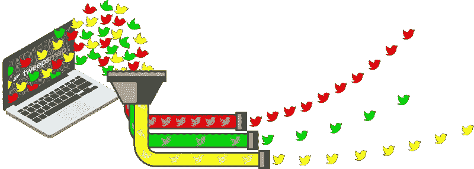
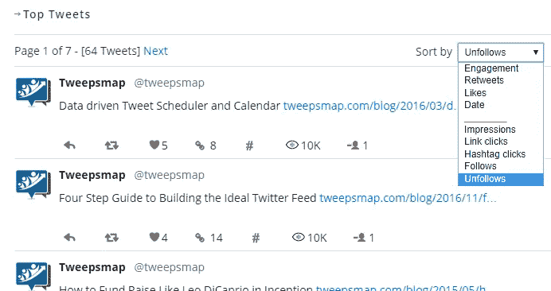
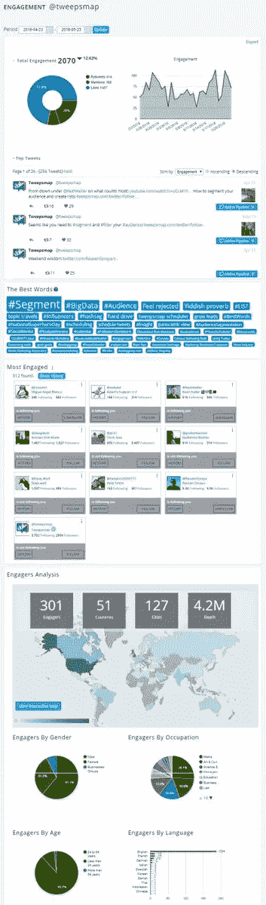
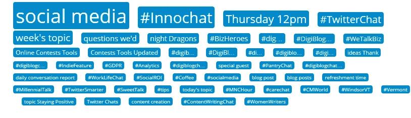

# 日程安排者让社交媒体保持正轨

> 原文：<https://medium.datadriveninvestor.com/schedulers-keep-social-media-on-track-8f5813729d94?source=collection_archive---------27----------------------->

## 利用生产力工具优化您的发布

如果人们想达到并保持最高效率，他们就会坚持使用系统。这是 [Tweepsmap](https://twitter.com/tweepsmap) 和 [RentCompass](https://twitter.com/rentcompass) 背后的前提，这两家公司分别帮助加快数据驱动的参与和房屋搜索。

并非巧合的是， [Samir Al-Battran](https://twitter.com/Connexinet) 创立或共同创立了这两家公司，这是他的企业家和开发者激情的一部分。他与 Twitter、脸书、YouTube 和 LinkedIn 的企业家 Carol Stephen 讨论了如何实现出版优化。

自然，Al-Battran 为他的社交媒体帖子使用了一种调度服务，这给他带来了几个优势:

*   在最佳时机在社交媒体上发帖。
*   释放我们的时间，专注于与观众直接对话。
*   甚至在晚上也能接触到不同时区的观众。

 [## 掌握生产力可以缓解焦虑

### 一致性是成功在线互动的关键

medium.com](https://medium.com/datadriveninvestor/mastering-productivity-eases-anxiety-97bb78e776fa) 

他按照主题或活动对他的帖子进行分类，这确保了他每天覆盖不同的类别。

Al-Battran 说:“我们根据受众或主题建立了不同的渠道。“我们有博客管道:一个用于行业文章，一个用于当前新闻。

“我们有专门针对欧洲、非洲和中东，或者亚洲-澳大利亚的管道，”他说。"每个管道都以自己的节奏发布."

# 连接管道

当 Al-Battran 从他的社交媒体活动中跟踪网站流量时，他根据每次努力对内容进行细分。

“我们在日程安排中启用了 URL 跟踪，”他说。“这将自动在我们的 Google Analytics 仪表板中添加管道名称作为活动。每次访问都将按管道名称进行分类。

他的一篇博客解释了系统如何告诉[谷歌流量来自](https://tweepsmap.com/blog/2019/02/how-to-track-social-media-traffic-with-google-analytics/)。

这个经过深思熟虑的系统扩展到选择 tweet 标签。

“第一个标签通常很容易，但我们使用嵌入 Tweepsmap 调度程序的标签建议工具，”Al-Battran 说。

这有助于他确定哪些词或标签最能引起他的追随者的共鸣。

“有时这很明显，但我们会定期检查我们的订婚仪表盘，”Al-Battran 说。“这告诉我们哪些单词或短语让我们的推文获得了最高的参与度。

“很多时候，结果是令人惊讶的，”他说。“然后，我们试图在我们的常规推文中重复使用这些单词或短语。”

 [## 对于 SEO 来说，文字是关键

### 以下是搜索引擎优化的基础

medium.com](https://medium.com/datadriveninvestor/for-seo-the-words-are-key-691ed1fb8d1e) 

例如，Stephen 通过 Tweepsmap 发现#marketing 与她的观众产生了共鸣。

# 自动过账

“我们喜欢自动化基本任务，”Al-Battran 说。“有许多支持 RSS 提要集成的日程安排服务。

“每次一篇新文章发表在博客上，它就会自动被发布到社交媒体上。当然，我们使用 Tweepsmap 调度程序，”他笑着说。

Stephen 问 Al-Battran 是否跟踪哪些推文产生了最多的点击，关注或不关注。

“不是所有时间，但我们经常在我们的参与仪表板上快速浏览，”他说。

“这有助于我们避免不受欢迎的推文，并专注于那些创造最多流量的推文，”Al-Battran 说。“这也为我们提供了反馈，让我们知道哪些话题最受关注。”

他区分跟踪个人账户和企业账户上的约定。

“就个人而言，这并不重要，”Al-Battran 说。“对于商业客户，我们会进行跟踪，通常会给予那些参与的人额外的关爱。我们还会随着时间的推移跟踪参与者，以确保我们不会损失人员。”

 [## 从内心创造，而不是分析

### 真正的内容让读者着迷

medium.com](https://medium.com/datadriveninvestor/create-from-your-heart-not-the-analytics-4b3807d057c4) 

# 交叉过账时交叉

斯蒂芬和 Al-Battran 都管理着多个账户，注意不要向同一批追随者传教。

“我不喜欢交叉投递，尤其是在完全相同的时间，”斯蒂芬说。"如果帖子是重复的，就没有动力跨平台跟进."

Al-Battran 经营他的个人和商业账户，这样两个受众就不会有交集。

“我们的许多客户有多个商业账户，他们想知道他们的受众是否不同，”他说。为此，他推荐了 Tweepsmap 的普通关注者功能。

使用 Tweepsmap，Al-Battran 发现在 Stephen 的#DigiBlogChat Twitter 聊天中最流行的短语或话题是“社交媒体”，这并不奇怪。然而，“夜龙”似乎潜伏在暗处。

Al-Battran 的 Tweepsmap 收集了所有的聊天数据，编写了一份[完整的统计报告](https://tweepsmap.com/hashtag/2229DE61031C63)，说明是什么让#DigiBlogChat 成功。

**关于作者**

吉姆·卡扎曼是拉戈金融服务公司的经理，曾在空军和联邦政府的公共事务部门工作。你可以在[推特](https://twitter.com/JKatzaman)、[脸书](https://www.facebook.com/jim.katzaman)和[领英](https://www.linkedin.com/in/jim-katzaman-33641b21/)上和他联系。

*原载于 2019 年 3 月 11 日*[*www.datadriveninvestor.com*](http://bit.ly/2tYbs4C)*。*