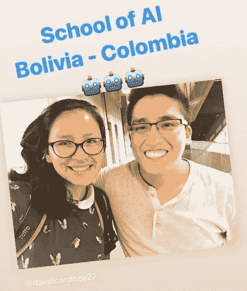
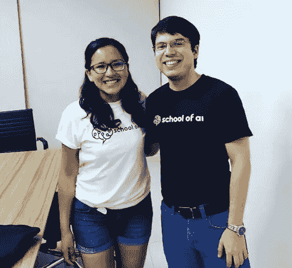

# 人工智能学院:连接世界。拉丁美洲特别版 2018

> 原文：<https://medium.datadriveninvestor.com/school-of-ai-connecting-the-world-latin-america-special-edition-2018-ea0e4e1d7174?source=collection_archive---------12----------------------->

2018 年对我来说是最具挑战性的一年，因为我已经重新开始了我生活中的许多活动，并准备搬回南美，但学习更多人工智能(AI)的热情一直是经历所有这些挑战的巨大动力。

大约在 2017 年年中，我了解了 [Siraj](https://twitter.com/sirajraval) 和他的人工智能教育运动，在那里，我在他教学时非常关注视频。不仅是技术方面的信息，也是“容易获得”的信息(解释)。从那以后，我通过 [Siraj 的 YouTube 频道](https://www.youtube.com/channel/UCWN3xxRkmTPmbKwht9FuE5A)不断学习和更新。

2018 年初，我了解了[这座城市。AI](https://city.ai) 我对学习建立一个 AI 社区非常感兴趣和渴望，几个月后，我看到了 Siraj 成长社区 AI 学院院长的招聘信息"[**AI 学院**](https://www.theschool.ai) "！(@the-school-of-ai-official)这是一个与众多人工智能爱好者、专家、学生和教师分享更多信息的绝佳机会。

从那以后，多亏了 [Beril 在 YouTube 上的采访](https://www.youtube.com/watch?v=v139CaUpD9Y&t=1s)，我了解到了世界各地的人们是如何学习、构建和分享人工智能的。

这个大社区的另一个事件是，当我在哥伦比亚旅行时，我可以接触到哥伦比亚三个城市的 AI 学院的院长:波哥大、麦德林和巴兰基亚。除了非常繁忙的日程安排之外，他们自己在当地城市经营这样一个令人惊叹的社区的动机让我深受鼓舞。

David, dean in Medellin and Ricardo dean in Barranquilla

我有机会了解了大卫在麦德林最大的创业公司之一所做的工作，他和我分享了机器学习工程师的生活。
同样，我有机会在 2018 年在巴兰基亚与[里卡多](https://twitter.com/ricardopretelt)的最后一次会面中做了一次关于神经网络的陈述。

感谢每一个正在建立这个伟大社区的人，感谢他们能够分享他们所知道的关于人工智能的或多或少的知识。#AI4All

## 来自 DDI 的相关故事:

 [## 用 7 个步骤解释深度学习

### 和猫一起

medium.com](https://medium.com/datadriveninvestor/deep-learning-explained-in-7-steps-9ae09471721a)  [## 数据科学和软件工程哪个更有前途？

### 大约一个月前，当我坐在咖啡馆里为一个客户开发网站时，我发现了这个女人…

medium.com](https://medium.com/datadriveninvestor/which-is-more-promising-data-science-or-software-engineering-7e425e9ec4f4)