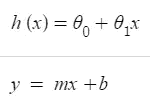
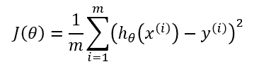
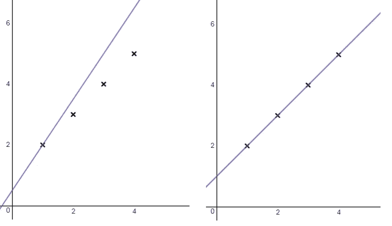

# 高中教我机器学习？

> 原文：<https://medium.datadriveninvestor.com/school-taught-me-machine-learning-e0aa80663663?source=collection_archive---------38----------------------->

人工智能、机器学习和深度学习都是与颠覆性技术相关的时髦词汇，我认为我无法理解。当涉及到它们背后的基本原理时，我所拥有的只是表面的知识。因此，我开始了一门关于 ML 基础的课程，也就是吴恩达著名的 ML 课程。当我进一步研究 ML 背后的数学时，我的脑海里突然灵光一现。

我意识到的是，我在学校学的东西，在我高中数学的第一年，是 ML 算法背后的一个关键组成部分。一元线性回归，Y = MX + B，最基本的，数学类的‘闺蜜’方程。当我意识到我在学校学到的东西在现实世界中也有作用时，我暴跳如雷。像斜率和截距这样的术语浮现在脑海中。

# 线性回归在 ML 中的作用:

当查看数据集时，线性回归与 ML 一起发挥作用。特别是最佳拟合线；最能代表数据的线。与在学校和 ML 课程中学到的不同之处在于简单的语法和格式。

Equation Comparison

θ₁*x*MX 和θ₀ & b 之间有相似之处。我们看到，θ₀ & b 代表我们的 y 轴截距。而θ₁*x*MX 代表斜率。

线性回归的目标是确定最佳拟合线，该线接近我们的训练数据集，有助于我们预测训练数据集之后数据的未来趋势。这条线被称为假设函数，为了确定我们的假设函数与我们的数据集的相关性有多精确，我们使用“均方误差”函数。

Mean Squared Error

Hypothesis Regression VS. Objective Regression

均方误差用更简单的术语找到数据集和直线之间距离的平均平方差，给出数据集和假设函数之间平均距离的变化。目标是得到一条线，使我们的均方差最小。

# 那又怎样？

当前教育体系的许多方面丰富了学生的知识，而这些知识在工作场所并不重要。数据集、线性回归和寻找均方差的结合是我在课堂上学到的数学知识。令人惊讶的是，课堂上的一些课程确实在工作中发挥了作用。

# 关键要点

*   学校课程在现实世界/工作场所有价值
*   线性回归是最大似然法的基础
*   均方差是最大似然法的基础
*   基本概念在工作场所发挥着重要作用