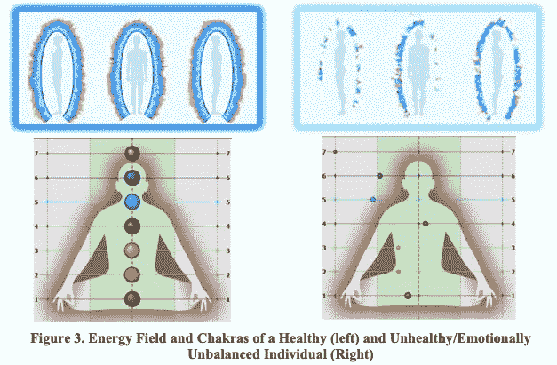
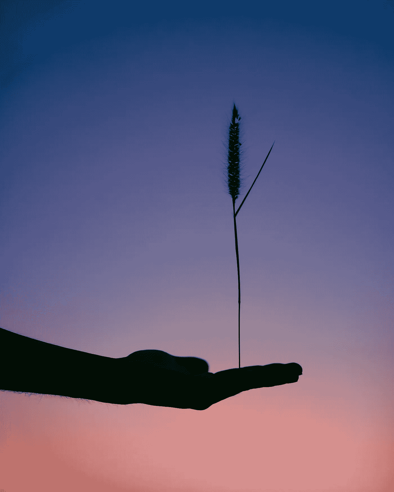

# 科学赶上了精神

> 原文：<https://medium.datadriveninvestor.com/science-catching-up-with-spirituality-c74b6e604b5d?source=collection_archive---------2----------------------->

所以昨天听说[经络系统是经过科学验证的](https://gostica.com/aura-science/proof-energy-chakras-confirmed-science-finally-proves-meridians-exist/)。首尔国立大学证实了经络[原始血管系统](https://link.springer.com/content/pdf/bfm%3A978-1-4614-0601-3%2F1.pdf)的存在。他们说这个系统是[心血管系统](https://www.youtube.com/watch?v=CWFyxn0qDEU)的关键部分，心血管系统在全身循环血液和氧气。

此外，俄罗斯圣彼得堡联邦信息技术、光学和机械大学的教授康斯坦丁·科罗特科夫研究了人类波长的可视化。像宇宙中所有的物质一样，我们存在于能量之中，发出辐射，否则我们在可见光谱中是不可见的。科特科夫想知道，通过使用 [GDV](https://www.youtube.com/watch?v=DhBYqkos-Xk) 系统观察他们的生物电足迹，你是否能看出健康人和情绪失衡者之间的区别。

[Can the Excellence of the Internal Be Measured? — A Preliminary Study](http://cdn3.collective-evolution.com/assets/uploads/2014/03/Can-Internal-Excellence-be-Measured_Deshpande.pdf) by Pradeep B. Deshpande*1, P. Krishna Madappa2 & Konstantin Korotkov

能源系统科学探索的基本结构足够深刻，可以进行更深入的研究。但是它还没有进入西方的主流医学研究。

 [## 医疗保健的未来正在被一场大型技术入侵所塑造|数据驱动型投资者

### 过去十年，全球经济的所有部门都经历了大规模的数字颠覆，而卫生部门现在…

www.datadriveninvestor.com](https://www.datadriveninvestor.com/2018/11/02/the-future-of-healthcare-is-being-shaped-by-a-big-tech-invasion/) 

# 医学体系的冲突

而印度医学传统阿育吠陀承认自己的局限性，并利用了两种医学体系。西方医学仍然认为，他们对身体的还原论观点是人类经验的最佳代表。

> 西方和东方的差异之一是话语的使用。

我们使用战争术语，比如对抗癌症，对抗疟疾；医院在西部救了我的孩子。而在东方，这一切都是为了达到和保持体内的平衡。

Photo by [Javardh](https://unsplash.com/@_javardh_001?utm_source=unsplash&utm_medium=referral&utm_content=creditCopyText) on [Unsplash](https://unsplash.com/search/photos/balance?utm_source=unsplash&utm_medium=referral&utm_content=creditCopyText)

在西方医学传统中，我们说疾病的起源，是遗传的或生理的，所以我们试图解决症状。在东方医学文化中，这种状况是体内毒素积累的结果，只有永久改变生活方式，身体才能完全康复而不复发。

以吃饭为例。在西方，脂肪和糖被认为对健康有害。相反，蛋白质有助于减轻体重或增加/恢复肌肉。因此，我们在有益和有害的食物之间划出了一条清晰的界线。在阿育吠陀中，没有食物是天生有害或有益的。根据你生活中的不同情况，你会吃不同的味道。基本原理是，这个星球上的每一种可食用物质都可能是药物或毒素。

# 混合精神和物质

如果你在荷兰有背部问题，去看全科医生，他或她会建议你先去上瑜伽课。因为根据荷兰的研究，通过加强背部肌肉来消除背部疼痛是最好的方法。

可视化实践在顶级运动员中变得更加主流，以在高压力和高节奏的环境中保持冷静。

小学开始教导孩子们冥想的重要性。商业变得更加以“为什么”而不是“如何”为导向

因此，我们生活在一个试图弥合西方消费主义和东方唯灵论之间差距的世界。为了彻底改变范式，科学界需要证明轮回的存在。

> 我们对死亡的集体恐惧将会被化解。这样做将地球上的普通人从怀疑和风险的边界中解放出来。

这样一个过程的影响将会改变我们的星球，让它成为天堂。

*这篇博文是 30 天博客挑战的第 8 篇。*

*注:本文包含了我对医学界的个人观点。我不是医生，也不是学医的学生。此外，我不是能量工作的实践者。虽然，我是瑜伽士和现代萨满教的信徒大约有两年了。我试图在精神和医学层面上进行研究，在经验调整我的观点之前，我一直持怀疑态度。*