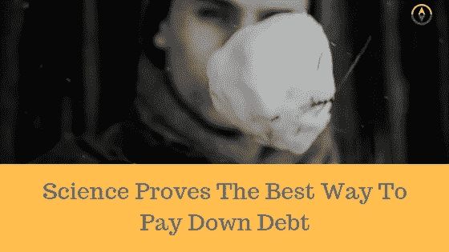

# 科学已经证明了偿还债务的最佳方式。想知道是什么吗？

> 原文：<https://medium.datadriveninvestor.com/science-has-proven-the-best-way-to-pay-down-debt-want-to-know-what-it-is-1ef077835af3?source=collection_archive---------26----------------------->

我在加拿大长大，经历过雪。小时候，冬天的时候，我们会滑雪橇、堆雪人，甚至偶尔打打雪仗来打发时间。

现在有了三个小女孩，我在寻找其他方式度过冬天。堆雪人！今年冬天，我的目标是教他们如何堆雪人。如果你曾经有机会建造一个，你会知道它是从一把雪装进一个小雪球开始的，把它滚一点点，很快你就会得到一个巨大的球体。这正是债务雪球的运作方式！

你的收入是你积累长期财富的最佳工具。
让你的钱被束缚在还款上，将会限制你为退休做准备、为孩子上大学存钱、为房子还贷、外出度假和极端慷慨大方的效率！开始一个债务偿还计划是你财务成功的最佳计划！

**超级马里奥**
当我还是个孩子的时候，我非常喜欢超级马里奥。对于新的学校游戏玩家来说，这是一个经典！超级马里奥是市场上第一款三维视频游戏，我会花几个小时试图征服它！

偿还债务类似于玩电子游戏，目前有三种偿还债务的方法。合并法、债务雪崩法和债务滚雪球法。

债务合并是指你把所有的债务，高息的、低息的、1000 美元的、10000 美元的、5000 美元的以及其他任何债务，合并成一笔债务，一次性付清。乍一看，这似乎是一个简单的好主意，然而，它被证明是糟糕的，让贷款人赚更多的钱，并让你的债务比你应该的时间更长。

债务合并的工作方式有两种。首先，你把所有的债务合并成一次还款，并延长还款期。例如，你可能有 500 美元的学生贷款和 300 美元的信用卡还款。使你每月的总还款额达到 800 美元。合并贷款将承诺给你 450 美元的月供。看起来不错，对吧？谁不想花 450 美元而不是 800 美元呢？

问题是为了给你更低的付款，他们不得不延长你负债的时间，让你多花几百美元，如果不是几千美元的话。你可能只用了 4 年就还清了债务，但合并贷款可能需要 6 年。

第二种方式的贷款巩固工作，是你把高利率贷款，结合他们与低利率贷款，你得到一个中间的道路利率。所以也许你有几个 18%，24%，5%，和 9%的利率。在你的新合并协议中，你现在可能有 11%的利率，看起来你得到了更好的结果。

合并的问题是，它没有解决习惯或行为，大多数使用合并方法贷款的人可能会回到债务中。类似于不良饮食。它们不起作用！合并贷款是一个骗局！不要使用它们，如果有人推荐，就跑吧！

债务雪崩
债务雪崩是我经常听说的另一种方法，下面是它的工作原理。债务雪崩首先针对较高的利率。回到上面的例子，假设你有一张 24%的信用卡，一张 18%的信用卡，一张 9%的贷款证明和一份 5%的学生贷款。雪崩方法会说，不管付款金额或贷款金额，首先还清最高利率，然后继续到下一个最高利率，等等，直到你还清所有债务。

从数学上讲，这是有道理的，应该是最有效的还债方式。然而，根据哈佛大学的一项研究，并没有奏效。原因如下。

让我们回到我们的超级马里奥游戏。使用雪崩方法偿还债务就像从超级马里奥的第一关开始，必须首先面对第十关的大坏蛋。如果没有合适的工具、技巧和提示，你将会在每一关都获得成功，击败他将会花费很长时间，最终你会放弃。

债务雪崩也是同样的道理。大多数人不会保持动力，因为他们感觉不到动力。

**这是心理学上的**
这给我们带来了最后一个消除债务的方法。债务滚雪球。

根据哈佛的研究，偿还债务与数学无关，而是与习惯和行为有关。心理学告诉我们，当你还清第一笔债务时，你就获得了一个小小的胜利，并保持继续还债的动力。

和减肥差不多。当你开始去健身房减肥时，你希望很快看到进步。在头一两周减掉一两磅会激励你继续回到健身房！

## 它是如何工作的？

把你所有的债务(除了你的抵押贷款)从最小到最大列出来。不要担心利率。接下来，除了最小的债务之外，你要支付所有东西的最低还款额。我要你用强度去攻击最小的债务！把你所有的额外现金都投入进去，让它出局！

加班，卖东西，提供服务。一旦最小的债务没有了，它就永远离开了你的生活！从下一个最小的债务开始前进。进攻进攻进攻。在你把那一个击倒后，继续前进，攻击下一个债务。继续前进，直到你解决了所有的债务，你就没有债务了！

## 债务滚雪球在行动

信用卡 1 530 美元(最低还款额 30 美元)
信用卡 2 2075 美元(最低还款额 75 美元)
汽车贷款 8195 美元(最低还款额 195 美元)
学生贷款 10090 美元(最低还款额 90 美元)

在这个例子中，你将从最小到最大列出你的债务，不考虑利率……除了信用卡 1 之外的所有东西都要付最低额。你想把所有额外的钱都花在这上面。比方说，你可以通过修改预算、加班加点、改变生活方式，每月多挣 500 美元。如果你能发挥创造力，找到牺牲的方法，这是完全可行的。在向前发展的第一个月
中，你打掉了信用卡 1。你从信用卡 1 中取出 530 美元，再从信用卡 2 中取出 75 美元，4 个月后，信用卡 2 被全部付清。

继续你的汽车贷款，你开始用 605 美元(来自两次信用卡支付)加上 195 美元的汽车贷款支付来偿还，你每个月用 800 美元来偿还债务！！你开始看到债务雪球越滚越大了吗？..9 个月后，你的汽车贷款被赶走，再也看不到了！拜拜！

最后是助学贷款……用了一年多一点，打啊，抓啊，抓啊。但是债务雪球越滚越大，可以看到终点线了！是时候解决学生贷款问题了，让莎莉·梅永远滚蛋吧！在学生贷款上投入 890 美元，你将在 10 个月内还清。在不到两年(23 个月)的时间里，你会用债务雪球支付超过 20，000 美元！

## 不要放弃！

坚持下去并保持动力将是你面临的挑战。记住个人理财 80%是行为，20%是脑袋知识。你越快还清第一笔债务，你就能越快在情感上赢得胜利，让你有动力还清下一笔债务，如此循环，直到你还清债务！

***消除债务的关键是保持动力！你有信用卡余额吗？试试麦克的信用卡破解吧！您目前有信用卡余额吗？你想知道怎样才能少付利息，多付原则，帮助你提前几年还清信用卡吗？点击下面的按钮重定向到我的免费信用卡黑客资源。***

你有信用卡余额吗？然后加入 Mike 的免费信用卡黑客资源，他将向你展示如何协商并找到一张低息或无息信用卡。开始赢钱，打破债务的循环！[在此了解更多信息。](https://www.moneycoachmike.com/creditcardhack)

金融蔻驰，演讲者和个人金融博客。Mike 的目标是帮助尽可能多的人，教授帮助他和他的妻子 Steph 制定财务游戏计划的财务原则，永远战胜债务，让他们今天过上最好的财务生活。

Mike 是北美年轻家庭和企业的个人理财教练，最近推出了他的第一门课程，教授他在一对一辅导课程中使用的原则和策略。

你正在寻找一个计划，永远战胜债务，积累财富吗？联系 Mike，参加免费的辅导课程，了解如何在今天过上最好的理财生活！访问:【www.MoneyCoachMike.com】T4 了解更多信息。