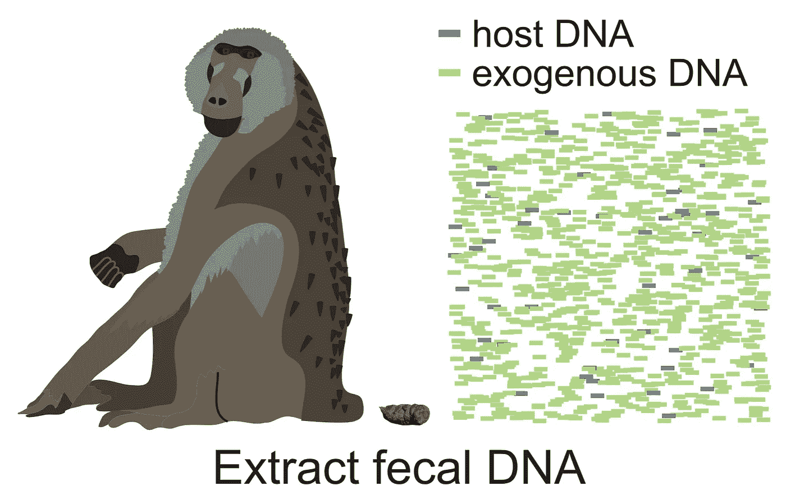
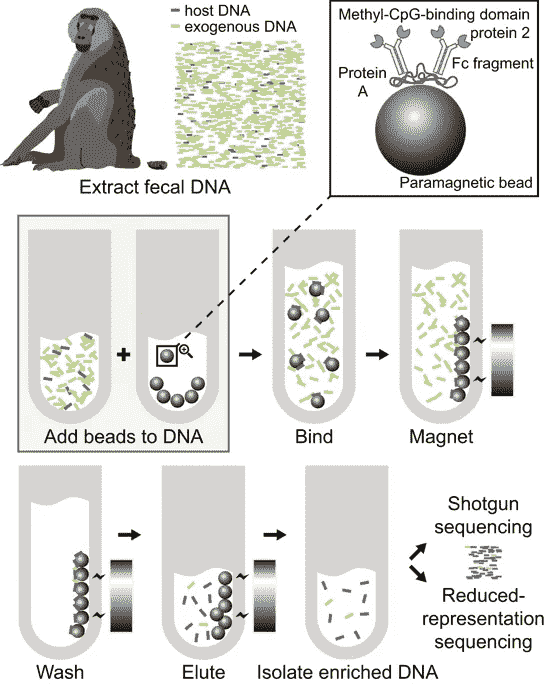
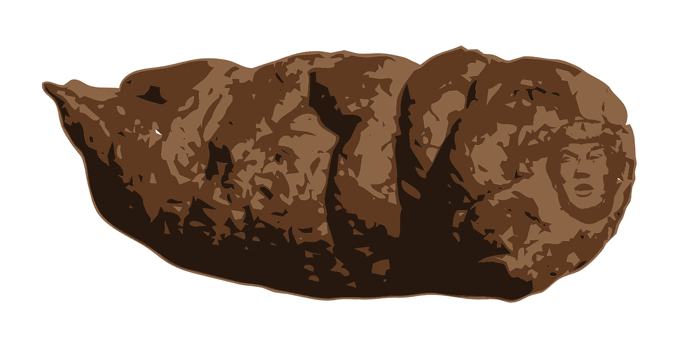

# 科学家把特朗普放在一坨屎上，推特吓坏了

> 原文：<https://medium.datadriveninvestor.com/scientists-put-trump-on-a-turd-and-twitter-freaked-out-620c76772140?source=collection_archive---------2----------------------->

Figure 1, the infamous image, from [the Nature paper](https://www.nature.com/articles/s41598-018-20427-9).

自特朗普当选总统以来，科学家一直是反对他的反科学议程的最直言不讳的倡导者之一。科学家和科学支持者抗议川普政府对煤炭的支持，T2 拒绝巴黎气候协议，T4 继续否认人为的气候变化。

一些科学家走上街头游行，公开抗议。其他人写了强烈的社论，或者[甚至竞选政治职位](https://www.sciencemag.org/news/2018/02/meet-scientists-running-transform-congress-2018)。他们中的一些人在自己的专业工作中加入了对特朗普毫不隐晦的抨击，比如一个团体拍卖了一种新发现的两栖动物的命名权。这只无腿、失明、将头埋在沙子里的生物现在将被命名为*Dermophis donaldtrumpi*。

 [## 数据驱动的投资者

### 事实上，在各行各业，数据的大规模激增正在改变我们感知世界的方式。而且只有…

www.youtube.com](https://www.youtube.com/channel/UCdKDq7Tu9f8xtooSLZ92AEw) 

但是，什么时候政治上的嘲弄有损于科学批判性的、不带偏见的理想呢？科学家的政治信仰应该影响他或她的研究吗？

> 上周，一篇发表在著名高影响力杂志《自然》上的科学论文的作者揭露了他们自己对美国总统的嘲弄:他们把他的照片放在粪便上。

[该论文描述了一种从粪便中捕获宿主生物 DNA 的新方法，截至本文发表之日，该论文仍可在《自然科学报告》](https://www.nature.com/articles/s41598-018-20427-9)上获得。(简短的 everyman 解释:粪便中的大部分 DNA 来自细菌，但也有一小部分 DNA 来自脱落的肠细胞。通过利用哺乳动物和细菌 DNA 之间的差异进行分类，作者能够容易且廉价地提高用于分析的宿主 DNA 的产量。)

在这篇论文中，科学家们提供了几个数字。第一张图集中展示了他们从粪便中提取宿主 DNA 的方法所涉及的步骤:

没有人注意到任何不妥之处，包括批准论文(包括图片)出版的编辑们。论文发表于 2018 年 1 月 31 日，干净利落地滑过，没有溅起太多水花(抱歉)。隐藏图像的细节没有曝光，直到微生物组科学家和受欢迎的社区倡导者乔纳森·艾森在推特上发布了它们:

我将省去您下载论文的麻烦，并展示放大的图像:

是的，在大便的右边是总统的脸。

这条推文引发了一场名副其实的狗屎风暴(抱歉)式的讨论，双方都有科学家参与其中。一些人认为这是无礼的、幼稚的、不恰当的。其他人认为这是一个绝妙的讽刺。其他人对这样一个事实表示失望:撇开政治不谈，这个笑话是基于编辑们无法准确识别他们出版的内容。不管有趣与否，这可能为试图欺骗审稿人的科学作者开创了一个危险的先例。一些人表示担心，这个肤浅的笑话破坏了科学的严肃性，并贬低了其他针对特朗普政府的一些反科学政策提出强有力和令人信服的论点的努力。

总的来说，Twitter 上其他科学家的反应似乎很积极。他们中的大多数人看到了这个笑话中的幽默。当然，聚会总有结束的时候:

在最初发表近一年后，特朗普的头像被从粪便中移除(尽管它仍然通过 Twitter 上的图像和 bioRxiv 上发表的论文预印本而存在:[https://www . bior XIV . org/content/bior XIV/early/2017/02/02/032870 . full . pdf](https://www.biorxiv.org/content/biorxiv/early/2017/02/02/032870.full.pdf))。

虽然大多数观众对隐藏的图像窃笑不已，但也有很多评论指出这一行为的不当之处。科学应该政治化吗？许多人的立场一直是，科学应该采取的唯一立场是可以用事实量化证明为真的立场；科学不应该支持政治右翼或左翼，而应该坚定地支持真理。

像这样的行为会把科学变成马戏团吗？是否应该允许对一个政治人物进行卑鄙的攻击，不管他们的立场是否完全反科学？通过发表这种无聊的幽默(抱歉)，科学家们是不是堕落到了和一个过度偏见的政治漫画家一样的水平？

这个问题没有简单的答案。单个科学家的观点跨越了很大的范围，就像整个美国的政治情绪一样。一些科学家站在光谱的一端，声称科学永远不应该支持任何政治团体；它只是尽力陈述客观的、可证明的事实。其他科学家宣称，科学家应该是最强有力的活动家，为有压倒性证据支持的行动而努力奋斗。

最后，虽然这个笑话很有趣，但自然杂志的编辑们可能最好还是把它从记录中抹去了。正如埃利泽·尤德科夫斯基所说，“在争论中变得聪明不是理性，而是合理化。”

如果科学要战胜无知，它必须通过教育和知识，而不是通过青少年的谩骂和侮辱。