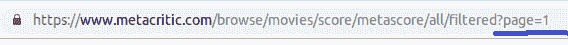
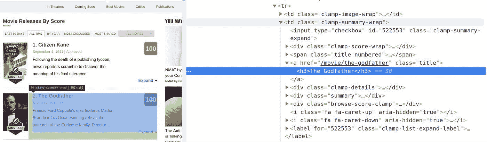
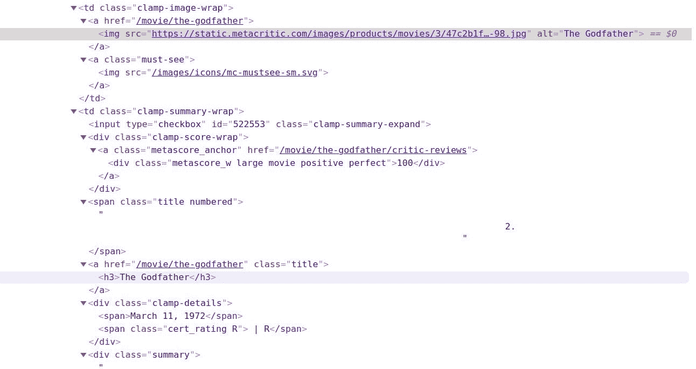
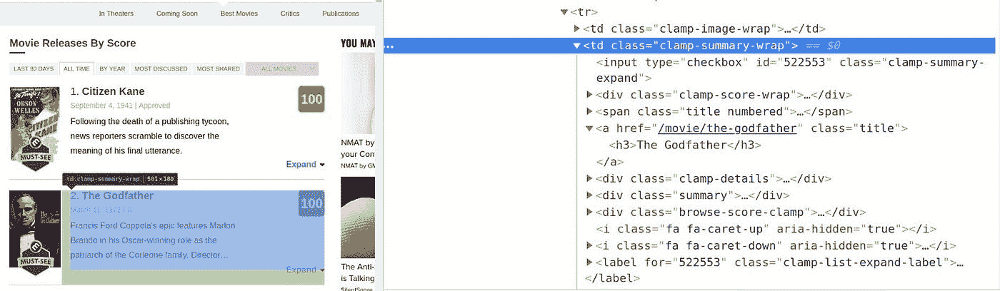
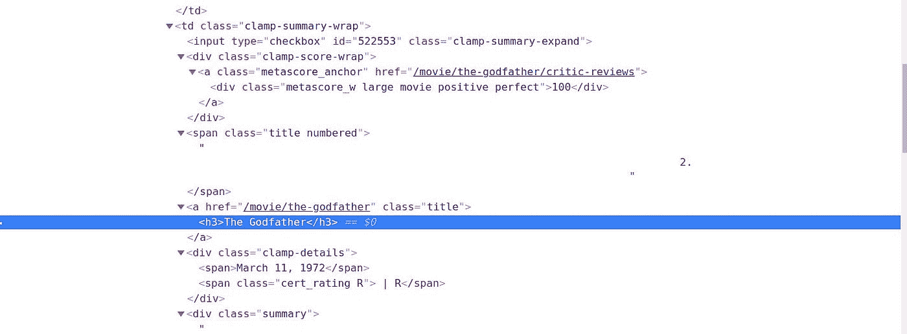
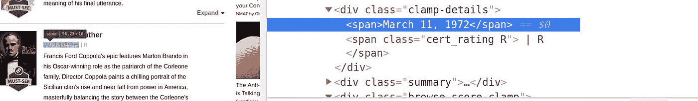
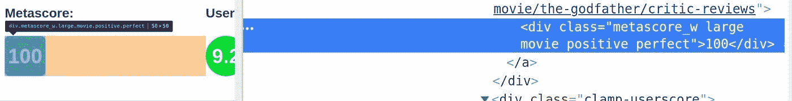
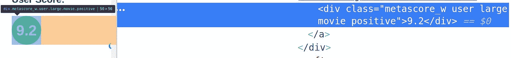
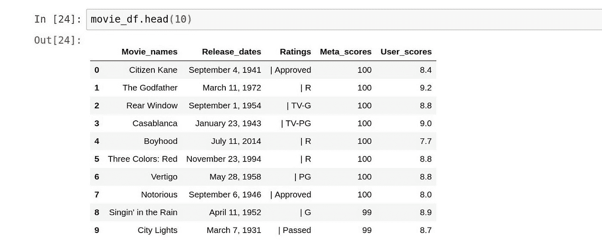

# 用美汤 4 和 Python 3 刮影评

> 原文：<https://medium.datadriveninvestor.com/scraping-movie-reviews-using-beautiful-soup-4-and-python-3-32b0ceeee538?source=collection_archive---------0----------------------->


Photo by [Matt Duncan](https://unsplash.com/@foxxmd?utm_source=unsplash&utm_medium=referral&utm_content=creditCopyText) on [Unsplash](https://unsplash.com/s/photos/hills?utm_source=unsplash&utm_medium=referral&utm_content=creditCopyText)

大多数情况下，您需要的数据可能不容易下载，数据库可能不是最新的，API 可能有使用限制。正是像这样的例子，网络抓取成为一个宝贵的技能，拥有你的军火库。

在本教程中，我们将学习如何使用 Python 美丽的汤和请求库从[Metacritic.com](https://www.metacritic.com/)中收集有史以来最好的电影评论。我们将使用 Python Pandas 库将抓取的数据解析成 CSV 格式。

[](https://www.datadriveninvestor.com/2019/01/23/which-is-more-promising-data-science-or-software-engineering/) [## 数据科学和软件工程哪个更有前途？数据驱动的投资者

### 大约一个月前，当我坐在咖啡馆里为一个客户开发网站时，我发现了这个女人…

www.datadriveninvestor.com](https://www.datadriveninvestor.com/2019/01/23/which-is-more-promising-data-science-or-software-engineering/) 

**入门**

在我们开始报废之前，先简单介绍一下我们将要使用的库，以及如何在我们的计算机上安装这些库。我们将使用的库有:

1.  美丽的汤:
    美丽的汤是一个 Python 模块，用于从网页中提取信息。您可以使用 python 包安装程序 pip 或 anaconda 包管理器 conda 来安装 beautiful soup。

```
pip install BeautifulSoup4 
Or
conda install BeautifulSoup4Beautiful Soup:
```

2.Requests
Requests 是一个用于下载网页的 Python 库。requests 库有一个 get 函数，我们可以解析我们想要访问的网站的 URL，它将下载网站的 HTML 内容。您可以使用下面的代码片段安装请求

```
pip install Requests
Or 
conda install Requests
```

3.Pandas
Pandas 是一个提供数据结构的 Python 库。这是我们将存储我们收集的数据的地方。您可以使用下面的代码片段安装 pandas:

```
pip install pandas
```

现在我们已经准备好了依赖项，让我们开始废弃。

**识别 URL 结构** 我们将要抓取的网站是[Metacritic.com](https://www.metacritic.com/)。具体来说，我们将提取电影聚合网站上最佳电影的名称、上映日期、评级、元评分和用户评分。

既然我们的目标已经确定，下一步就要了解网页的概况，并理解其 URL 结构的逻辑。相关的是，我们广泛地理解了逻辑，所以当我们在开发刮刀时经历一些颠簸时，我们可以导航通过。

通过 Metacritic 的网站，我们想搜集网站上有史以来最好的电影的信息。所以我们转到电影图标，从下拉列表中选择有史以来最好的电影。


在选择了有史以来最好的电影之后，我们到达这个 [URL](https://www.metacritic.com/browse/movies/score/metascore/all/filtered?page=0) 。观察 URL，我们可以看到当切换到列表的第二页时，唯一改变的参数是页码。



这样一来，我们只需更改网站 URL 上的页码，就可以轻松地在页面间导航。这一发现极大地有助于我们的事业，因为我们只需编写一个脚本来匹配变化的逻辑并浏览所有网页。

**用请求库解析网页** 从脚本开始，我们可以使用请求模块访问单个页面的内容。在下面的代码片段中，我们将

*   从请求库中导入 get()函数
*   我们给下面的字典分配了标题。这是为了确保我们的请求从我们的 IP 地址被接受，而不是被称为机器人。

```
headers = {‘User-Agent’: ‘Mozilla/5.0 (Macintosh; Intel Mac OS X 10_13_6) AppleWebKit/537.36 (KHTML, like Gecko) Chrome/70.0.3538.77 Safari/537.36’}
```

*   将页面的 URL 和 headers 字典传递给 get()函数，并将其赋给一个变量。
*   获取页面的 status_code，查看页面请求是否下载成功。
*   方法打印响应页面 HTML 标记的一小部分。内容属性。
*   从请求导入中导入请求
    获取
    电影=

```
get(‘[https://www.metacritic.com/browse/movies/score/metascore/all/filtered?page=0](https://www.metacritic.com/browse/movies/score/metascore/all/filtered?page=0),headers = headers)
movies.status_code200
# the status_code returns 200 to show that the page was successfully downloaded.b’<!DOCTYPE html>\n<**html** xmlns:og=”http://opengraphprotocol.org/schema/" xmlns:fb=”http://ogp.me/ns/fb#">\n<**head**>\n <**title**>Best Movies of All Time — Metacritic</**title**>\n \n <**meta** http-equiv=”content-type” content=”text/html; charset=UTF-8"><**script** type=”text/javascript”>window.NREUM||(NREUM={}),*__nr_*require=function(e,n,t){function r(t){if(!n[t]){var o=n[t]={exports:{}};e[t][0].call(o.exports,function(n){var o=e[t][1][n];return r(o||n)},o,o.exports)}return n[t].exports}if(“function’
```

**理解站点页面的 HTML 结构** 从上面的 movies.content 代码片段的第一行，我们可以看到服务器返回了一个 HTML 文档。文档向我们展示了网页的结构和内容。我们想要抓取的所有页面都有相似的 HTML 结构，这对我们来说非常方便，因为我们只需要理解一个页面的结构就可以构建我们的 scrapper。

**开发者工具**浏览器的功能为我们提供了访问网页的 HTML 结构。要访问开发工具功能，右键单击您想要检查的任何元素，选择 inspect，它会将您带到该元素的 HTML 标记。



在浏览 HTML 标签时，我们注意到每部电影的所有信息都存储在标签中，其他标签嵌套在标签中。通过单击每个 HTML 标签旁边的灰色箭头，可以浏览每个标签。通过分解所有嵌套标签，我们可以从所选电影中找到我们需要的所有信息。



**使用美汤解析 HTML 内容**

接下来，我们将使用 Beautiful soup 解析网页的 HTML 内容。这个对象将使我们能够从网页中提取我们想要的信息。在下面的代码片段中，我们将

*   进口美汤
*   将 movies.content 解析为漂亮的 Soup 对象和“html.parser ”,将结果对象指定为 movie_soup。使用 html.parser 参数是因为我们希望 Python 内置的 html 解析器解析我们的响应内容。

```
from bs4 import BeautifulSoup
laptop_soup = BeautifulSoup(movies.content, ‘html.parser’)
```

正如我们在浏览 HTML 标签时观察到的，所有电影信息都存储在标签中。接下来，我们需要找出每个元素的区别属性。最常见的情况是，在 class 属性中可以找到区别标志。深入研究标签，还有另一个标签，其类值= clamp-summary-wrap。当您将鼠标悬停在该标签上时，您会注意到页面上突出显示了所有笔记本电脑信息。这个类值对于页面上的所有电影都是通用的。



现在让我们使用 Beautiful Soup 的 find_all 函数提取所有具有 class 属性的

*   容器:

```
container = laptop_soup.find_all(‘td’, class_ = clamp-summary-wrap)
print(type(product))
<class ‘bs4.element.ResultSet’>
```

find_all 函数返回一个 ResultSet 对象，该对象包含提供页面上所有笔记本电脑信息的所有标签。

```
len(container)
100
```

从 len(容器)函数中，我们可以看到容器通过返回 100 来捕获所有的电影

**提取单台笔记本电脑的数据** 假设页面上所有< td >标签对所有笔记本电脑都是通用的。我们将使用单个标签来描绘每部电影的 HTML 文档的全貌，并将其应用于所有页面。我们将要使用的笔记本电脑的标签可以使用容器[1]来访问。下面的代码显示了第一个 laptop 元素的 HTML 文档的前几行。

```
<td class=”clamp-summary-wrap”>
<input class=”clamp-summary-expand” id=”540575" type=”checkbox”>
<div class=”clamp-score-wrap”>
<a class=”metascore_anchor” href=”/movie/citizen-kane/critic-reviews”>
<div class=”metascore_w large movie positive perfect”>100</div>
</a>
</div>
<span class=”title numbered”>
 1.
 </span>
<a class=”title” href=”/movie/citizen-kane”>
<h3>Citizen Kane</h3>
</a>
<div class=”clamp-details”>
<span>September 4, 1941</span>
<span class=”cert_rating Approved”> | Approved</span>
</div>
<div class=”summary”>
```

从上面的 HTML 标签中，如果你仔细观察，你可以看到我们想要提取的一些信息，这些信息表明我们在正确的道路上。我们将在下面的章节中深入挖掘这些 HTML 标签。

**电影名称** 我们要提取的第一个信息是电影名称。要访问相应的 HTML 文档，右键单击元素并选择 inspect 以显示名称的 HTML 行。浏览 HTML 行，我们可以看到名称嵌套在< h3 >标签中。
下图显示了所有嵌套标签分解到包含名称的最后一个标签。



我们使用下面的代码片段访问了名称和规范:

```
movie = container[1]
movie.find(‘h3’).text
The Godfather
```

**电影的上映日期** 然后我们提取第一部电影的上映日期。发布日期的数据嵌套在 span 标签< span >标签中，该标签包含在具有 clamp-details 类值的 div 标签中。为了访问这些标签，我们将使用来自 [CSS 选择器](https://developer.mozilla.org/en-US/docs/Learn/CSS/Building_blocks/Selectors)的选择方法


我们使用下面的代码片段访问了发布日期:

```
first_movie.select(‘div.clamp-details span’)[1].text‘March 11, 1972’
```

**电影的收视率** 接下来，我们继续提取电影的收视率。评级数据也存储在 div 标签中的< span >标签中，div 标签的类值为 clamp-details。
下图显示了笔记本电脑价格的所有嵌套标签的明细。



我们还将使用来自 [CSS 选择器](https://developer.mozilla.org/en-US/docs/Learn/CSS/Building_blocks/Selectors)的 select 方法来访问这些信息。select 方法返回一个列表，所以要访问我们需要的文本，我们必须指定列表中我们需要的条目的编号。

笔记本电脑的评级是列表中的第二项，因此我们将使用数字[1]进行访问。下面的代码片段解释了这一点:

```
first_movie.select(‘div.clamp-details span’)[1].text
| R
```

**Metascore** 接下来我们为电影提取 Metascore。下图显示了电影 Metascore 的包含标记



我们使用下面的代码片段访问 Metascore:

```
movie.select(‘a.metascore_anchor div’)[0].text
100
```

**用户评分** 最后，我们提取电影的用户评分信息。用户的包含标签如下所示



我们使用下面的代码片段来访问用户分数:

```
Movie.select(‘a.metascore_anchor div’)[2].text
9.2
```

**构建多个页面的脚本** 现在我们已经能够提取一部电影的名称、上映日期、评分、Metascore 和用户评分，下一步是将我们的发现应用到其他页面。下面的步骤将强调我们如何为多个页面构建脚本。

1.  创建一个 for 循环来迭代我们抓取的每个页面的所有请求
2.  控制爬网率，以避免服务器因请求过多而不堪重负
3.  在循环运行时对其进行监控。

**创建一个 for 循环来迭代我们从** 抓取的每个页面的所有请求，正如我们前面提到的，每个页面的 URL 随着网页的变化而遵循一定的逻辑。因此，要发出请求，我们必须改变页面参数的值。为了简化这个过程，我们将创建一个循环来迭代每个页面。下面的代码块说明了这一点。

```
pages = [str(i) for i in range(1,5)]
```

在上面的代码中，我们创建了一个名为 pages 的列表，并使用与我们要抓取的页数相对应的字符串来获取它。

**控制爬取速率以避免服务器被请求淹没** 强烈建议我们控制脚本的爬取速率以避免攻击站点服务器，这会导致我们的 IP 地址被禁止。为了防止这种情况发生，我们将使用 python 的时间模块中的 sleep()函数在间隔内暂停脚本的执行几秒钟。
为了模仿人类行为，我们将通过使用 python 随机模块中的 randint()函数来改变请求之间的等待时间。randint()会在指定的时间间隔内随机生成整数。下面的代码片段给出了一个示例

```
From time import sleep
From random import randint
sleep(randint(1,4))
```

在上面的代码中，时间间隔在 1 到 4 秒之间随机变化。

**运行时监控回路。** 这一部分不是强制性的，但是它可以帮助我们了解我们的脚本是如何运行的，并且在出现不必要的情况时停止运行。

首先，我们从 warnings 模块导入 warn 函数，通知我们是否有问题。下面的代码片段给出了一个例子

```
From warnings import warn 
 if requests > 10:
    warn(‘Number of requests was greater than expected.’)
```

如果我们的请求超过 26 个，上面的代码会警告我们，并打印一条警告消息。

其次，我们创建一个脚本来计算我们的爬虫的频率。为了计算速率，我们将请求数除以自第一次请求以来经过的时间。下面的代码片段给出了一个例子。

在下面的代码块中，我们从 Ipython 的 core.display 模块中导入了 clear_output 函数。clear_output 功能设置为 True，清除频率计算的当前输出，以显示新的输出。

在频率计算器中，我们:

*   将请求设置为零，并为每个请求增加 1
*   计算自第一次请求以来的运行时间，并将其分配给运行时间
*   打印请求的数量和频率
*   为下一次频率计算清除输出。

```
From Ipython.core.display import clear_output
Start_time = time()
requests = 0
requests += 1

elapsed_time = time() — start_time
print(‘Request:{}; Frequency: {} requests/s’.format(requests, requests/elapsed_time))
clear_output(wait = True)
```

**完整脚本** 现在我们来计算完整脚本。下面的步骤解释了最终代码的每一部分。

*   创建空列表来存储抓取的数据
*   初始化监控回路
*   遍历页面列表以改变 URL 的页面参数
*   将页面传递给 GET 请求以迭代每个页面。
*   暂停时间间隔在 8 到 20 秒之间
*   监控每个请求
*   发出非 200 状态代码的警告
*   将响应 HTML 转换成漂亮的 Soup 对象
*   从漂亮的 Soup 对象中提取笔记本电脑的名称和价格，并将它们添加到各自的列表中
*   将数据解析为 Pandas 数据框，并将其存储在 CSV 文件中

完整的代码块可以在访问

**将数据解析成数据帧并存储到 CSV 文件中** 最后，我们将抓取的数据解析成 pandas 数据帧，以便保存为 CSV 文件。为了做到这一点，我们导入了 Pandas 模块，并将我们刚刚搜集的列表传递到一个字典中。字典中的每个键将构成数据帧的列。

```
import pandas as pd
movie_df = pd.DataFrame({‘Movie_names’: names,
‘Release_dates’: release_dates,
‘Ratings’: ratings,
‘Meta_scores’: meta_scores,
‘User_scores’: user_scores})
print(movie_df.info())
```



交叉检查我们搜集的数据和网站上的信息，我们可以看到我们的方向是正确的，因为前 100 部电影和网站上的是一样的。

然后，我们将结果数据帧存储到一个 CSV 文件中。

```
movie_df.to_csv(‘movies.csv’)
```

**结论**

好了，我们已经成功地从 [Metacritic](https://www.metacritic.com/) 中提取了有史以来最佳电影的评级，并将其保存到 CSV 文件中。你可以在这里访问完整的代码片段[。您可以随时尝试类似的项目，也可以修改代码以满足您的需求。](https://github.com/Oluwabukunmige/Web-Scrappers/blob/master/Movie%20Reviews%20using%20Beautiful%20Soup)