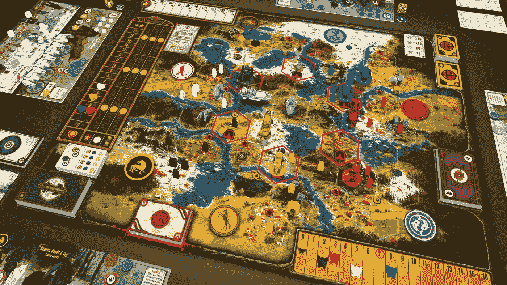
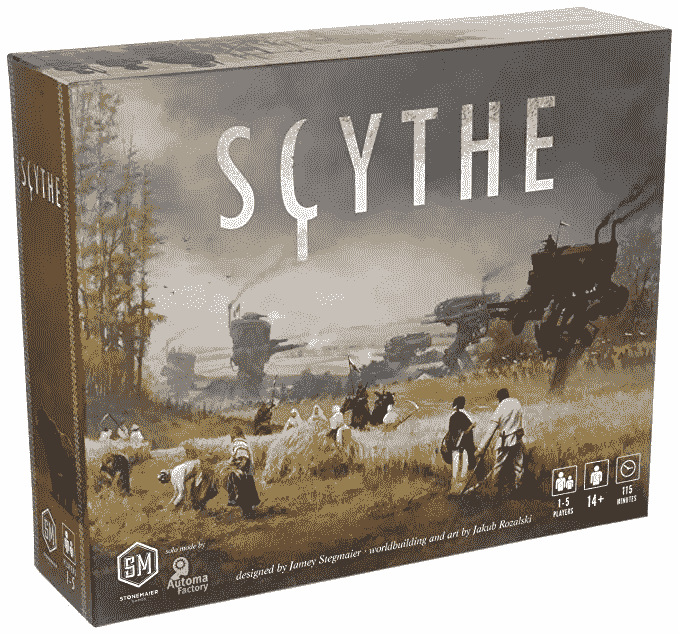
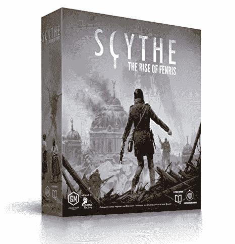
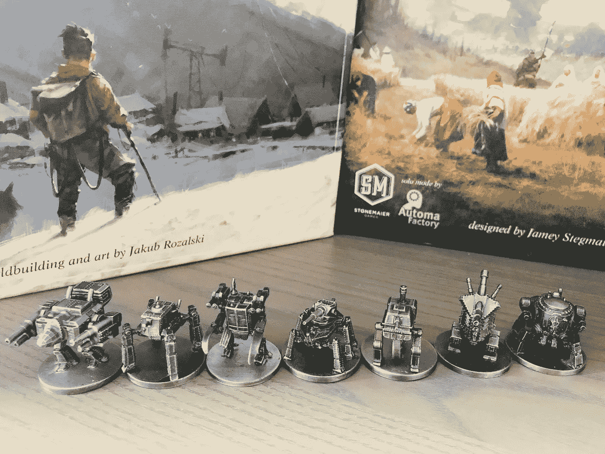

# 镰刀可能是我们这个时代最好的棋盘游戏。

> 原文：<https://medium.datadriveninvestor.com/scythe-might-be-the-best-board-game-of-our-time-57f3ffa4c0cd?source=collection_archive---------1----------------------->

## 这款屡获殊荣的 4X 战略棋盘游戏越来越好。

Scythe Board Game (Image Credit: StoneMaier Games.)

《镰刀》是一款棋盘游戏(也有数字版)，在我心中占有特殊的位置。自从我在 Kickstarter 的电子邮件中发现这个游戏在等我，我就知道我必须拥有它。《长柄大镰刀》设定在一个柴油朋克世界，由雅各布·罗萨斯基(Jakub Rozalski)的惊人艺术作品赋予了生命，它承诺在一个强大、有趣的世界中建造无与伦比的世界，这个世界仍在从一场永远改变了人类道路的机械化战争中恢复。

*声明:我与斯通迈尔游戏公司没有任何关联。*

> **那是 20 世纪 20 年代欧罗巴动荡不安的时候。第一次世界大战的灰烬仍然使雪变暗。这个被简称为“工厂”的资本主义城邦用重甲机甲为战争推波助澜，它已经关闭了大门，引起了几个邻近国家的注意。-斯通梅尔游戏。**

Scythe box art (Image Credit: Stonemaier Games.)

镰刀本身让人想起 4X 类型的其他棋盘游戏，让玩家控制一个帝国，并让他们从卑微的开始建立起一个伟大的帝国。4X 游戏类型是由 Alan Emrich 在 1993 年创造的，它代表探索、扩张、开发和消灭。

> Scythe 是一款以 20 世纪 20 年代交替历史为背景的制造引擎的不对称竞技棋盘游戏。这是一个农耕与战争、破碎的心与生锈的齿轮、创新与勇气的时代。-斯通梅尔游戏。

在 Scythe 中，你将试验一个阵营，并获得一个随机的生产委员会，该委员会将决定你如何才能最好地获得收入(胜利点数以及可消费的货币)，以及你在制作和升级时最有效率的东西，这取决于你的阵营在每场游戏中保持不变的起始领土。当你玩镰刀时，你将开发一个更高效的引擎，允许你扩展，收集更多的资源，建造更多的东西，变得更强大。

每一个镰刀游戏都是不同的，并提供了新的机会来提高。很少有沉闷的时刻，你会发现自己在计划几个回合，试图击败做同样事情的对手。

该游戏还在很大程度上降低了运气，取消了掷骰子，并利用了一个更类似于虚张声势的战斗系统。你想现在有目的地输掉一场比赛以赢得以后更多的比赛吗？还是应该现在就粉碎敌人，努力向前推进，创造可持续的优势？镰刀给了你这些选择和更多，虽然战斗经常很少并且很快结束，但即使是一场战斗的结果也可以决定游戏的其余部分如何进行。

不像其他 4X 游戏，即使是一个单一的错误都不能原谅，长柄大镰刀是不那么苛刻的，没有角色或单位死亡，让你有机会从看起来像是战斗失败的惨败中回来，或者像单一工厂游戏空间那样的高价值区域的控制翻转。毫无疑问，战斗中的失败是代价高昂的，如果你投入了大量资源试图赢得战斗，你可能会经历一场艰难的战斗来从失败中恢复过来。

即使只有基本游戏，镰刀对我和我的朋友们来说也是不可思议的。这很简单，可以很容易地学会并教给新手，也很难，变化很大，每个游戏都是不同的，独一无二的。让事情变得更有趣的是，有许多不同的派别，每个派别都有不同的起始资源，他们自己的领域，以及他们建造的角色和机甲的不同能力，

> 你学会了喜欢游戏中的变化，欣赏每个派系帝国独特的优点和缺点。

## **镰刀扩展三部曲——扩展一个已经很棒的游戏。**

《镰刀》带来了资料片三部曲的承诺，第三部也是最后一部于 2018 年 8 月上映。资料片三部曲增加了大量的新内容、新派别和玩镰刀的新方式，增加了更多的深度、7 人游戏的功能等等。但真的就这样结束了吗？就主要内容而言，也许吧...

The Rise of Fenris, the conclusion to Scythe’s Expansion Trilogy. (Image credit: Stonemaier Games.)

StoneMaier Games 仍在发布 Scythe 内容，不过，创建了一套新的粉丝创建的遭遇卡，为游戏中受欢迎的[遭遇](https://stonemaiergames.com/games/scythe/encounters/)增加了更多乐趣和多样性，通常给玩家提供了获得对手优势的机会。还有一些超酷的金属机甲[我迫不及待地想要拥有一个超酷的桌面显示器，让这个可能是我有史以来最喜欢的桌游永生。四套这些金属机甲(如果你想替换游戏及其资料片中包含的所有塑料机甲，你将需要这些机甲)将花费你 200 美元，并且它们首次限量生产，这使得它们对于想要将游戏升级到传家宝质量的粉丝来说很稀缺。](https://stonemaiergames.com/games/scythe/metal-mechs/)

Full-metal mechs for display or gameplay, provided you can get them. (Image Credit: Stonemaier Games.)

## **那么接下来是什么？**

镰刀的下一步是什么？真的就这样结束了吗？我认为不是。《镰刀》从每个角度来看都取得了巨大的成功，在零售发行之前，它在 Kickstarter 上获得了超过 17，000 名支持者的支持，筹集了近 10，000 美元的 2M 美元。自那以后，Scythe 在首次发布后不久就在顶级棋盘游戏中占据了棋盘游戏极客的前十名。

衍生游戏 Scythe 的潜力令人难以置信，如果它能够引入新的令人信服的机制，从原游戏及其扩展中捕捉一些精神，Scythe 作为一个 IP 只有增长的空间。这就引出了镰刀下一步可能会去哪里的想法…

在另一个 20 世纪 20 年代，大镰刀在欧罗巴上演，尽管两个来自远方的入侵派别出现了。但是在交替的美洲发生了什么？美国并没有出现在《镰刀》或者任何资料片、内容或者世界建筑中。这是一个以美国为背景的新镰刀游戏，有新的派别，新的斗争，以及从第一次世界大战的传统技术中分离出来的新技术。

镰刀还远未完成，在这个引人注目的宇宙中，新游戏的机会是巨大的。有新的领域有待探索，有新的时间框架来构建引人注目的故事，有机会让新的镰刀游戏忠实于原作。在下一次冒险准备好之前，我会很高兴在未来的许多年里继续和我的朋友们一起享受这款桌游杰作。

*你玩过镰刀吗？你认为一个新的镰刀标题会探索哪些地点/内容？参与讨论吧！*