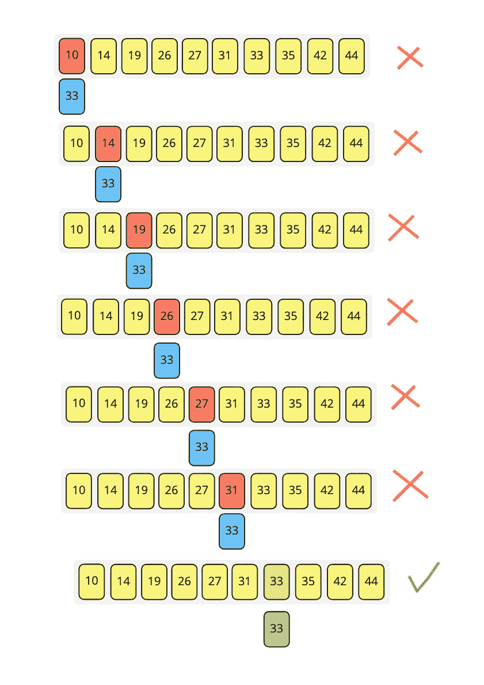
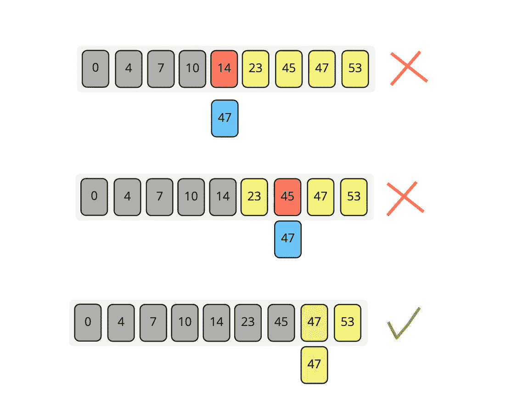

# 搜索算法(线性和非线性)

> 原文：<https://medium.datadriveninvestor.com/search-algorithms-linear-and-non-linear-739de13ceaf8?source=collection_archive---------3----------------------->

在本文中，我们将讨论第一组算法，即“**搜索算法**”。

**搜索算法**用于在一组数据中找到特定的值。

[](https://www.datadriveninvestor.com/2019/02/21/best-coding-languages-to-learn-in-2019/) [## 2019 年最值得学习的编码语言|数据驱动的投资者

### 在我读大学的那几年，我跳过了很多次夜游去学习 Java，希望有一天它能帮助我在…

www.datadriveninvestor.com](https://www.datadriveninvestor.com/2019/02/21/best-coding-languages-to-learn-in-2019/) 

假设我们需要在一个数组中搜索某个元素，我们需要使用两种搜索算法中的一种

*   线性搜索算法。
*   二分搜索算法。

# **线性搜索算法:-**



这个算法非常简单明了，它用于通过循环数组中的元素来查找数组中的元素，在每次迭代中，我们将每个元素与所需的元素进行比较，当找到所需的元素时，返回其索引，如果没有找到匹配，我们可以返回-1。

该算法可用于**未分类的数据**。

线性搜索的时间复杂度为 O(n) = n。

其中 n 是数组中元素的数量。

线性搜索是一种非常容易实现的算法，但是对于大量的元素来说，它并不实用，当我们稍后讨论二分搜索法时，这一点就清楚了。

示例:-

```
/*
 values: an array of n elements
 targetValue: desired value to be found
*/
int linearSearch(int values[], int targetValue)
{
    n = values.length; //length of the array elements
    for(int i = 0; i < n; i++)
    {
        if (values[i] == targetValue) 
        {       
            return i; //return the index of targetValue in array
        }
    }
    return -1;
}
```

# **二进制搜索算法:-**



该搜索算法与**排序数据**一起使用，查找特定元素，如果找到则返回其索引，如果没有找到则返回-1。

**使用二分搜索法的步骤:-**

1-查找数组中的中间元素

2-比较目标值和中间元素

3-如果目标值等于中间元素，则返回其索引

4-如果目标值小于中间元素，则忽略右半部分，并在左半部分再次重复步骤 1

5-如果目标值大于中间元素，则忽略左半部分，并在右半部分再次重复步骤 1

这个算法的时间复杂度是 O(n)= log(n ),因为每次我们将数组分成两半，并处理其中的一个数组，这样就减少了所需的时间。

示例:-

```
/*
  values[] => given sorted array
  targetValue => value to be searched
*/
int binarySearch(int values[], int targetValue)
{
    int len = values.length;
    int max = (len - 1);//max index in the array
    int min = 0;//min index in the array

    int middle;  // this will hold the index of middle elements

    while(max >= min)
    {
        middle = (max + min) / 2; //index of middle value

        if(values[middle] ==  targetValue)
        {
            return middle; //in case middle element == target value
        }
        else if(values[middle] >  targetValue) 
        {
            max = (middle - 1); 
           //update max index to repeat search on left half
        }
        else
        {
            min = (middle + 1);
           // update min index to repeat search on right half
        }
    }

    return -1;
}
```

请随意查看这个 git 库[以了解如何实现线性和二分搜索法](https://github.com/hebatarek1989/data_structure_algorithms.git)

接下来:[排序算法—第一部分](https://medium.com/datadriveninvestor/sorting-algorithms-part-1-5758f6ff90f6)
上一部分:[渐近注释和算法复杂度](https://medium.com/datadriveninvestor/asymptotic-annotation-and-algorithm-complexity-8825eec87d24)