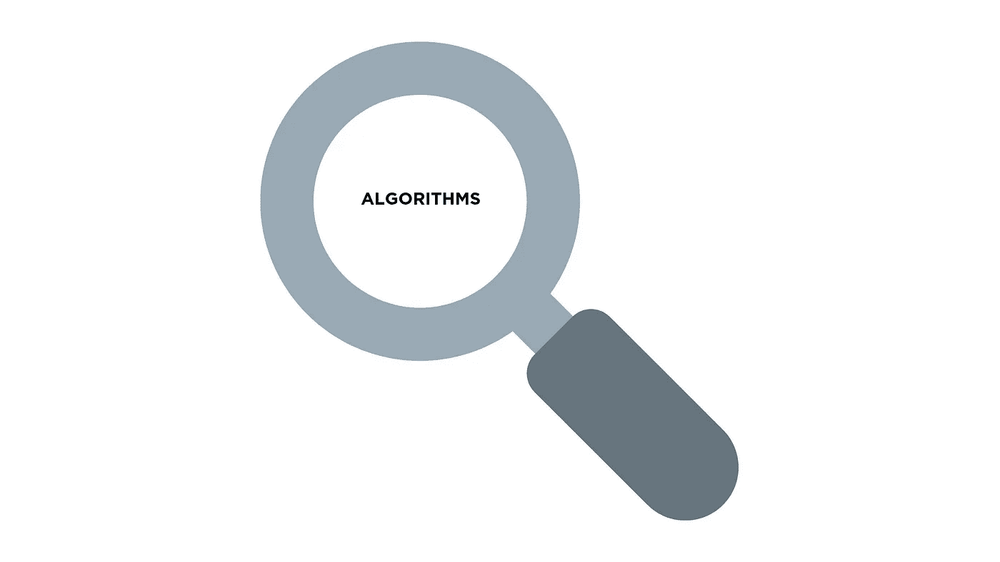
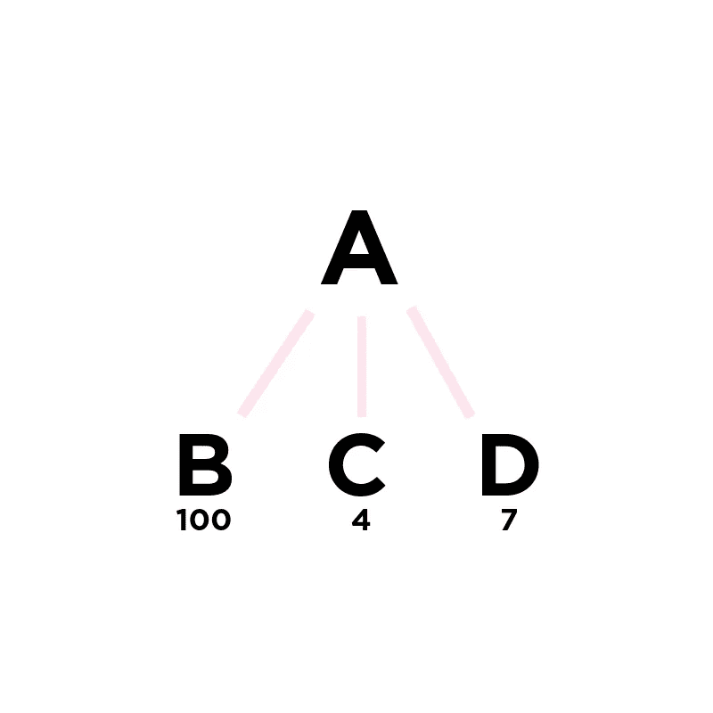
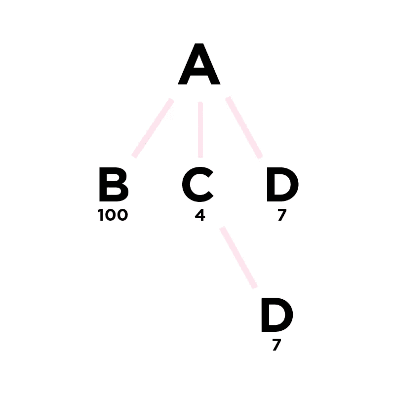

# 人工智能的搜索算法

> 原文：<https://medium.datadriveninvestor.com/searching-algorithms-for-artificial-intelligence-85d58a8e4a42?source=collection_archive---------0----------------------->

*人工智能的盲目、知情和最优搜索算法概述*。

搜索算法被[定义为](https://en.wikipedia.org/wiki/Search_algorithm)一种在给定的数据结构中识别和寻找特定值的方法。它们不仅允许你找到你正在寻找的价值，而且搜索算法也是人工智能的一个关键要素；他们教计算机“理性行动”，用一定的输入值达到一定的目标。本质上，人工智能可以通过使用搜索算法找到给定问题的解决方案。

我们将讨论三种不同的搜索算法:盲目的、有知识的和最优的。无论您选择使用哪种算法，都完全取决于您希望如何遍历数据结构，以及您希望优化什么(例如，时间与速度)。

 [## 创建折衷书架的程序员指南|数据驱动的投资者

### 每个开发者都应该有一个书架。他的内阁中可能的文本集合是无数的，但不是每一个集合…

www.datadriveninvestor.com](https://www.datadriveninvestor.com/2019/03/25/a-programmers-guide-to-creating-an-eclectic-bookshelf/) 

# 盲目的

**盲**搜索算法在搜索时不考虑路径的任何数量元素。换句话说，它们完全忽略了所有潜在的指示性值，例如试探法和边权重，从而盲目地进行搜索。

**大英博物馆**是我最喜欢的搜索算法，完全是因为它的绝对混乱。想象你在字面上的[大英博物馆](https://www.britishmuseum.org/)里，你没有地图或指南知道某些画在哪里。那么，你怎么能找到莱昂纳多·达芬奇关于圣母子和猫的研究呢？你选择将一些猴子放入博物馆，让它们随机跑来跑去，直到其中一只发现这幅画。如果你愿意，你的猴子可以记住他们已经走过的路，这样就不会重复了。这正是算法的工作原理:就好像在大英博物馆里猴子被放出来一样。

**广度优先搜索**遍历比大英博物馆更有序的图；先横向移动，然后向下移动。由于它是从横向移动开始的，BFS 使用一个队列来存储它访问过的节点。这是因为在访问了某个节点`A`之后，BFS 将查看`A`的所有直接扩展，然后返回到`A` *、*并沿着图的宽度返回。因此，像队列这样的 FIFO 数据结构是必不可少的，因为它允许 BFS 快速访问它所查看的最老的节点。

**深度优先搜索**在遍历中是相反的:它在横向移动之前一直沿着一条路径移动。因此，与 BFS 不同，深度优先搜索需要一个 LIFO 数据结构，如堆栈，因为它最近访问的节点是它想再次访问的节点。

# 见多识广的

与盲算法不同，有信息的算法在搜索时确实会考虑量化值，例如启发式算法，从而做出更多关于沿着哪些路径遍历的*有信息的*决定。

节点的**启发式**值是其可用信息的度量，也是遵循哪个分支的指南。例如，节点`N`的启发式值通常是从节点`N`到我们的目的地目标`D`的估计成本。试探法永远不会高估真正的成本，是搜索算法为了找到更快和“足够好”的东西而牺牲精确性和准确性的一种方式。

**爬山**是一种信息搜索算法，在搜索时考虑节点的启发式。它基本上是深度优先搜索，除非 DFS 考虑启发式值。因此，像 DFS 一样，爬山使用堆栈来存储其最近访问的节点，并在横向移动之前向下遍历树。在向下移动之前的每个节点处，HC 选择哪个“成本最低”的节点向下遍历；无论哪个具有最低的启发值。

**波束**本质上是广度优先搜索如果 BFS 考虑启发值，*和*限制了我们在每一层可以观察到的节点数量。假设我们有以下节点，这些节点具有以下启发值和宽度上限`w = 2`:

我们将从节点 A 开始，向下观察它的每个子节点。但是，使用`w = 2`，我们在每个级别上最多只能观察到`2`个孩子。在 beam 中，我们修剪具有最高(或最昂贵)启发式值的节点。在这种情况下，我们删除节点`B`，只查看节点`C`和`D`。从这些节点开始，我们可以向下扩展，并对新的节点级别重复相同的过程。

与其他搜索算法相比，Beam 的有趣之处在于`w`的给定值会显著影响我们的结果。如果我们的目的节点是从`B`扩展而来的，并且我们由于它错误的启发值而错误地删除了那个节点，那会怎么样呢？这就是为什么在所有的搜索算法中，**光束是唯一一个不能保证找到你正在寻找的路径**的原因，如果它存在的话。

最佳优先搜索与 DFS 非常相似，除了它基于两个因素对整个议程进行排序:首先，基于最低成本的试探法，在出现平局的情况下，按照字典顺序排序。*这意味着什么？！？假设我们有下面的树:*

我们从节点`A`开始，向下看节点`C`，因为它是`A`的子节点，具有最低的启发值，或者成本更低。然而，一旦我们到达`C`，我们就有了接下来观察哪个节点的启发值:我们可以去从`C`延伸出来的节点`D`，或者向上回到从`A`延伸出来的节点`D`。如上所述，Best First 通过按字典顺序对路径进行排序来打破僵局。因此，如果我们从`C`向下延伸，我们会以路径`ACD`结束，如果我们向侧面延伸，我们会以路径`AD`结束。我们知道我们必须从`C`向下延伸，因为`ACD`在字母表中排在`AD`之前。问题解决了！

# 最佳的

当其他算法保证找到从起始节点`A`到目的节点`Z`的路径时，最佳搜索算法是唯一保证找到从`A`到`Z`的最短*路径的算法。因此，最优搜索算法在遍历时都考虑树中的边权重。*

**分支&边界**描述了一种算法，其本质上与 DFS 和 BFS 操作非常相似，除了它只探索比当前解决方案更好的*附加路径。这意味着，与盲算法不同，只有在最坏的情况下，B 才会遍历所有可能的排列。常规分支&界限仅基于边权重而不是*试探法来考虑路径的成本。**

**+启发式。**当你给 B & B 添加一个启发式算法时，你现在正在考虑基于`[edge weight] + [heuristic value]`的每条路径的成本。执行中唯一的区别是您试图找到一种更精确的方法来遍历树。然而，两种常规的 B&B and B&B+启发式算法都保证能找到从起点到终点的最短路径。

**A*** 是一种最佳搜索算法，在确定哪些路径成本最高时，该算法还考虑了边权重&启发式值。通常[被认为](https://en.wikipedia.org/wiki/A*_search_algorithm)是 [Dijskra 算法](https://www.geeksforgeeks.org/dijkstras-shortest-path-algorithm-greedy-algo-7/)的扩展，A*被认为是非常高效的，并且在图遍历中经常优于其他算法。

在 python 中实现上述算法并不比树的遍历复杂，将访问过的节点存储在数据帧中，并在整个遍历中考虑特定的值。搜索算法是大多数应用程序的关键部分，能够决定使用哪种算法对于确保你的程序快速高效地实现你想要的目标来说是非常重要的[。](https://stackabuse.com/search-algorithms-in-python/)

如果你正在训练人工智能程序来得出某些结论，或者如果你只是想完成一个问题集，我希望这篇文章能帮助你找到你正在寻找的东西……)

这篇文章是在一个晴朗的周二晚上写的，为周三早上麻省理工学院人工智能入门课 6.034 的测验做准备。是的，写这篇博客是我选择学习的方式。祝我好运！

如果你正致力于用 python 实现搜索算法，我很想听听你的意见！