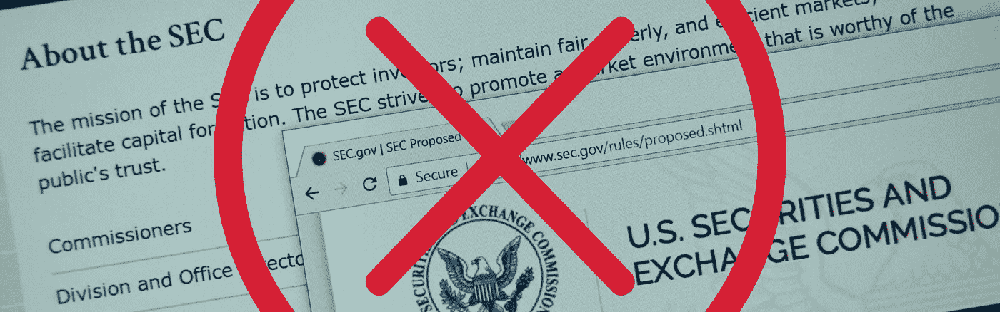

# SEC 法规扼杀创新:主要 Stablecoin 因监管风险而关闭

> 原文：<https://medium.datadriveninvestor.com/sec-regulations-killing-innovation-major-stablecoin-shuts-down-due-to-regulatory-risk-7d57e6cfb7c8?source=collection_archive---------31----------------------->

让我以这样的话开始今天的文章，我认为大多数为证券交易委员会工作的人都是真诚地想让社会变得更好的好人。这些年来，我见过许多证交会的律师，他们都很聪明、能干，而且关心如何把事情做好。

虽然我并不完全同意 SEC 迄今为止对加密监管的做法，但我确实理解它面临的困难局面。一方面，SEC 希望保护投资者。另一方面，SEC 希望鼓励资本形成和有效市场。这是一个艰难的平衡动作，它的难度不应该被忽视或忽略。

到目前为止，人们可以说，美国证券交易委员会在没有扼杀创新的情况下追捕坏人的工作做得还可以。这与其他一些美国联邦机构形成了鲜明的对比，这些机构花时间逮捕那些犯有买卖比特币“罪行”的人。

但上个月，发生了一件事，改变了我对美国证券交易委员会的加密监管方法及其管理冲突指令的能力的看法。请继续阅读，了解发生了什么，以及为什么我对 SEC 在不扼杀创新的情况下有效监管加密的能力从未如此悲观。

# 为什么主要稳定币基础关闭

让我们来看看曾经很有前途的加密项目， [Basis](https://www.basis.io/) ，一种旨在解决大多数加密货币面临的极端波动性的稳定货币。

为了防止其代币价格波动，Basis 被设计成像中央银行一样运作。从本质上说，这意味着它将“干预”以维持稳定的价格。当对基差的需求上升时，它创造了更多的代币。当需求下降时，它会回购这些代币。

该项目由三个独立的标志组成，它们都在其生态系统中扮演着重要的角色。基础货币是核心，与美元挂钩。此外，还有债券代币作为补充，这将有助于无缝和安全的融资拍卖。最后，分享代币，这将有助于用户赎回债券代币，同时从股息中获取其价值。

这个复杂的 stablecoin 生态系统有可能与 Tether 和 MakerDAO 等 stablecoin 巨头竞争，核心团队已经筹集了 1.33 亿美元的风险资本来实现这一目标。在所有观众看来，该项目似乎蓄势待发，突然 Basis 领导层宣布他们自愿关闭该项目。该项目的所有资金都返还给了投资者，而项目背后令人印象深刻的团队也离开了。

罪魁祸首？

对 SEC 监管的恐惧和不确定性。

在其主页上发布的一封公开信中，Basis 领导层接受了其总法律顾问的结论，即该项目的补充债券和股票令牌将不可避免地被 SEC 归类为证券。

这将使它们受制于 SEC 对注册和合规的苛刻要求。这不仅会花费一大笔钱，而且还会严重影响项目的活动。

作为未注册证券，核心团队必须采取措施，确保债券和股票令牌只提供给“合格投资者”。这将意味着创建一个可接受投资者的“集中白名单”，并监控每笔交易，以确保其符合 SEC 的规范。

这破坏了项目的基础。集中交易限制将大大减少市场的流动性，而流动性对于维持联系汇率至关重要。最重要的是，它将允许当局审查交易，这违背了该项目的原则。最终，团队别无选择，只能关闭。

# SEC 正在扼杀创新

Basis 为加密生态系统提供了真正创新的解决方案。这不是一个试图欺骗投资者的见不得人的经营者。它的资金是通过复杂的风投筹集的，而不是通过 ICO。它的投资者获得了透明度和尊重。这正是我们在加密货币行业需要的项目类型。这就是这个故事如此悲惨的原因。

Basis 并不是因为财务或管理不善而关闭的。它被迫停业是因为严格的监管限制，这些限制试图将 80 年的判例法应用于一个新的技术系统。

尽管美国证券交易委员会(SEC)声称，为了保护投资者，它对陈旧规则的应用是必要的，但显而易见，过度保护往往弊大于利。Basis 的投资者是理解稳定币的风险投资人，他们想把钱投入到这个项目中，但是他们最终被拒绝了这个机会。

毫无疑问，我完全支持 SEC 关于关闭欺诈活动和骗局的规定。这种程度的监管有助于该行业合法化，同时为机构资本提供了一个入口。但是，当它惩罚公司的创新和为市场带来急需的解决方案时，我就划清了界限。

SEC 对加密监管的做法让合法的企业家和风险投资者感到紧张，因为没有人希望在 SEC 的调查中成为错误的一方。但这种担心要么导致他们不敢启动新项目，要么导致他们搬到其他司法管辖区去创业。不管怎样，结果都是严重扼杀美国的创新。

# 这对密码法律内部人士意味着什么？

*局内人*需要了解规则，并在规则内游戏。尽管我们非常不同意证交会的做法，但与这个体系对抗是没有意义的。如果你想赚钱并获得成功，你需要遵守美国证券交易委员会制定的规则。

而且规则越来越严了！

一位关系密切的*内部人士*告诉我，SEC 将“打击”已经通过 ico 的现有项目。它已经向行业参与者发出了大量传票，Basis 显然明白了其中的意思:“创新的金融体系在美国不受欢迎。”因此，其领导层采取了痛苦和令人沮丧的行动，自愿关闭并向投资者返还 1.33 亿美元。

就个人而言，我仍然希望立法者看到资金和企业离开美国，并决定制定新的法律，比现有的法律做得更好。但是我没有屏住呼吸。相反，我在帮助人们寻找想要密码创新者的 T4 辖区。世界之大。去你想去的地方。

*原载于 2019 年 1 月 8 日*[*cryptolawinsider.com*](https://cryptolawinsider.com/sec-killing-innovation/)*。*