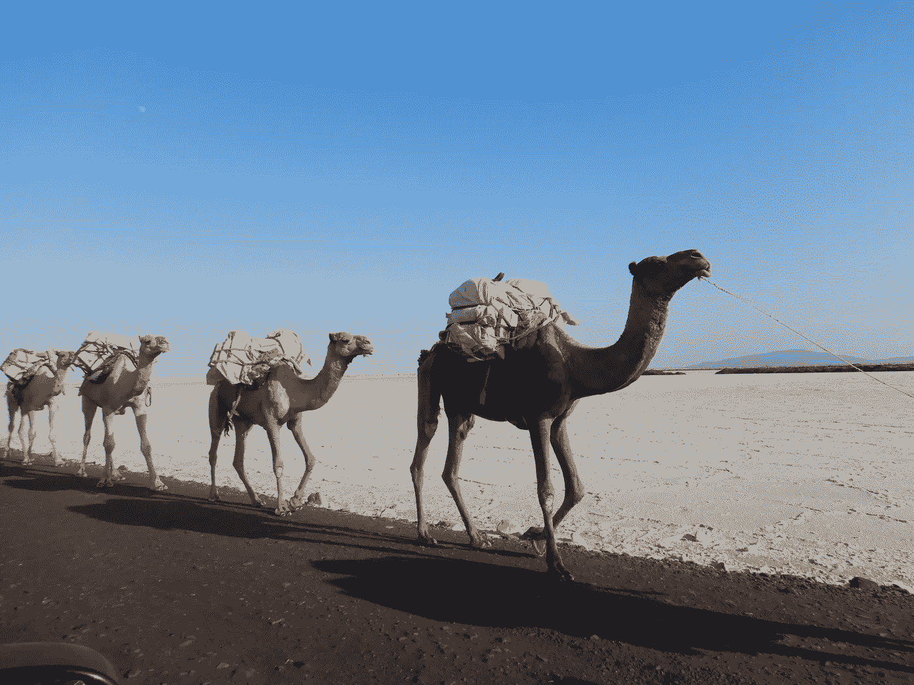
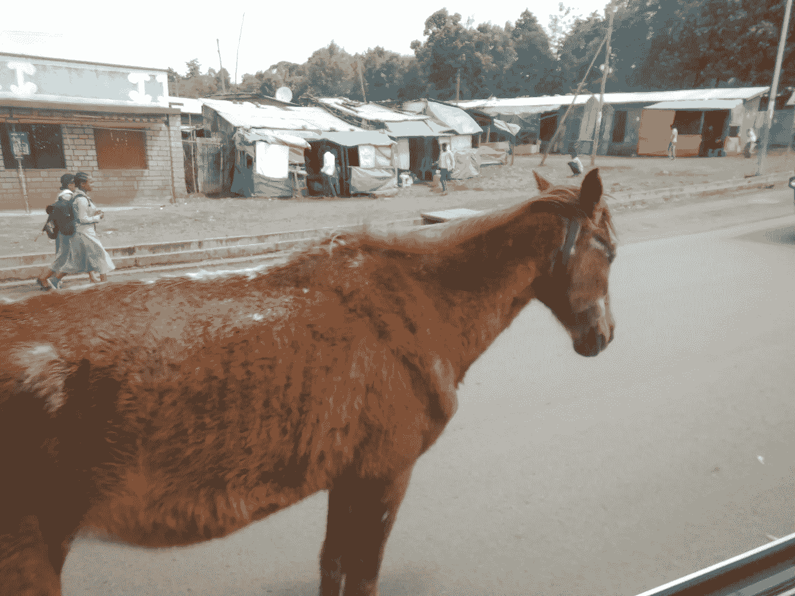
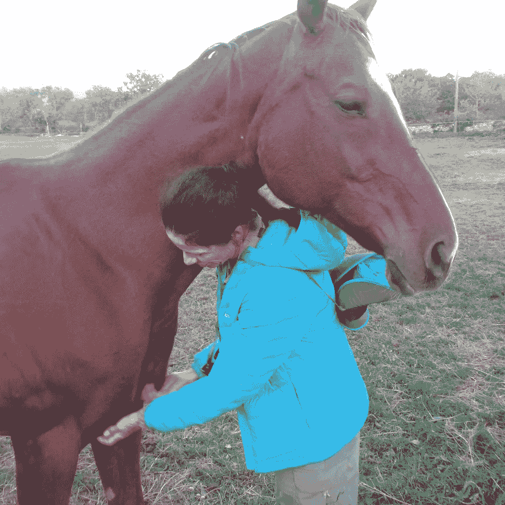
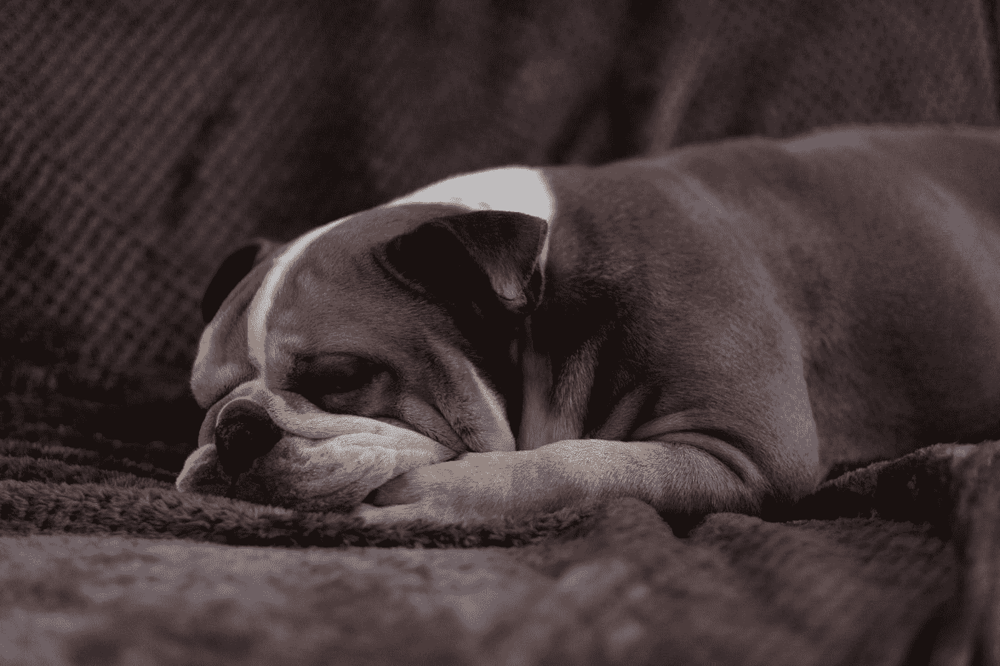

# 保持每天都有动力的秘密

> 原文：<https://medium.datadriveninvestor.com/secrets-to-staying-motivated-all-day-every-day-a6d5bbe0fdbf?source=collection_archive---------14----------------------->

Camels carrying salt blocks in Ethiopia. Julia Hubbel

## *劲量兔和一些死去动物的教训*

在非洲的这一地区，驮兽的生活是残酷的。你出生，训练，带着沉重的货物，更重的货物，更重的货物。在烈日下工作，被棍棒和鞭子抽打。

直到你躺在灿烂的阳光下死去。

你的负担被卸下，加到下一只骆驼/驴/马身上。直到他们躺在烈日下死去。

算不上什么生活。

当我驾车穿过埃塞俄比亚的山丘时，我看到一头接一头的驴在明显是他体重 8 到 10 倍的重负下艰难地行进，它的主人在驴背上重重地打着。

 [## 面向 Noobs |数据驱动型投资者的数字身份

### 聪明人如何在增强现实中创造身份价值？我最近刚满 40 岁。作为一个生物…

www.datadriveninvestor.com](https://www.datadriveninvestor.com/2019/02/28/digital-identity-for-noobs/) 

直到它折断了它的背，于是它将被丢在那里，成为食腐动物。

我看到了很多尸体。来往于盐湖路边的骆驼。阉牛，驴子。马，勉强活着，站在公路中间，无精打采，瘦骨嶙峋，等死。

Dying horse in the middle of the highway, Ethiopia Julia Hubbel

我想到的是我们西方人对工作的价值观。

有很多很多文章都是关于如何保持动力，如何无论如何都坚持推动。如果你和我一样，是一名企业家，你应该熟悉每周 90 小时的工作制。

问题是，没有人，尤其是爱我们的家庭成员和那些希望在我们与工作无关的公司呆上一小段时间的人，会为自我牺牲派发英雄徽章。因为我们把自己扔进了无尽工作的砂轮里，残酷的工作时间。

然而，我们被告诫要努力，努力，再努力。我们的雇主非常乐意利用我们的牺牲。当然，直到我们通过发展健康问题给他们带来不便。到那时，他们会卸下我们的负担，把它交给其他倒霉的莫克，把我们丢在路边让拾荒者等死。

# 没有英雄按钮。

我上一个男朋友也是类似的驱动。这是回避亲密关系，避免任何和所有情感参与的完美借口。工作是最理想的借口。在一个和我很亲近的家庭里，一位年轻的父亲选择了工作，而不是对孩子和妻子的承诺，这毁了他的婚姻。不管他声称多么爱他们，不管他做出什么承诺，工作是第一位的。直到他再也没有家人，他非常害怕失去的家人，因为他更担心给他们买玩具，而不是做一个父亲和丈夫。

这个年轻人的世界(和我的前任一样)几乎没有什么参数:不停地工作，锻炼一会儿，短暂地休息一下撒尿、拉屎和遛狗，甚至更短暂地休息一下做家务，甚至更短暂地休息一下做爱和吃饭。然后回去工作。工作是他毁掉整个生活的熔炉，是他没有生活的借口，是他不能生活的完美理由(聊天、看电影、过夜等等)。休假是疲惫的表现，当然不要和可能影响他工作心态的人分享。

一只精力充沛的兔子，除了工作什么也不做，不断增加负担，直到有一天他会倒在路边。他的客户会把他们的负担转移给其他傻瓜，他会腐烂。

他很有动力。一直都是。如果他退休了，他会找些别的事情来打发空闲时间。因为无所事事似乎是死罪。

也许质疑我们的动机是有意义的。比如，我们在逃避什么，或者奔向什么(如果有的话)？是什么让我们如此恐惧和不安，以至于休假、平衡、休息或长时间的休息都是不可能的？

牛顿物理学讲述了运动和重力定律，它指出，如果我们在运动，我们倾向于继续运动(直到一辆卡车撞上我们，因为我们没有注意交通)，我们静止的身体倾向于保持静止(直到凤尾鱼披萨决定以新的形式离开你的身体)。

我在一个小农场长大，在四岁时应征为父亲工作，我从来没有做过工作或体力劳动。我碰巧喜欢它，但那种基于我所做的事情而不是我多年来被告知的人来获得认可的冲动。尽管当我 57 岁写第一本书时，我终于意识到，如果我一周工作 90 个小时，没有一个人会在乎。没有人会竖立一座雕像，没有人会歌颂我。

# 一个该死的灵魂都没有。

如果我想找乐子，度假，过自己的生活，我必须为自己做。被激励不是问题。激励我的是这个问题。我渴望得到认可，在我大脑的某个密集层次上，我真诚地相信，社会，就像我去世已久的父亲一样，会以某种方式给我加分，因为我自杀了。

有一种东西长期以来被称为白人盎格鲁-撒克逊新教工作伦理，或新教工作伦理。作者 Daniel Luzer 在*太平洋标准报*发表的这篇耐人寻味的[文章](https://psmag.com/economics/protestant-worth-ethic-real-65544)触及了美国加尔文主义理想的历史，以及如果我们不工作，新教徒(以及这些天来我们中的许多人)是如何受苦的。随着时间的推移，这种想法当然已经被贬低了，虽然宗教*本身*现在与这些价值观已经没有太大关系，但它们从一开始就如何通知我们的国家，这与为什么我们有一个时间魔鬼(双关语)休假一天，直到我们的眼球出血有很大关系。

我们喜欢，喜欢，喜欢说自己很忙，太忙了。这让我们觉得自己很重要，就像在飞机上用最大音量说话让你觉得自己很重要一样。但是暴露了你的无用和愚蠢。还有你极度的不安全感。蒂姆·克莱德在《纽约时报》上发表了一篇很棒的文章(已经快八年了，但是听起来仍然很真实),他打破了我们对逃避生活的鲁莽承诺的推理。

我们都有自己的理由。大部分都是扯淡。忙碌是一种瘾，就像其他事情一样。我用这个借口逃避了一千次糟糕的会议，糟糕的友谊，我被骗去参加的 MLM 会议，以及几乎所有其他的人类借口。为了逃避生活。在我的家庭里，做什么就等同于有价值，不去装鸡蛋、不去扔干草、不去修剪草坪，这是一种无法形容的道德品质缺失。

那很难摆脱。

Photo by [Holger Link](https://unsplash.com/@photoholgic?utm_source=medium&utm_medium=referral) on [Unsplash](https://unsplash.com?utm_source=medium&utm_medium=referral)

说你太忙是软弱的表现。诚实是强大的。

"我更喜欢独处一会儿。"

“我想看一会儿书。”

“我要休息一下，享受(阳光、海浪、我的孩子、我的丈夫、我自己庄严的公司)。”

**忙的坦白说是蛮牛**。因为我们是我们每一天、每一分钟的作者，我们不断地制定我们的时间表，出于我们不理解的原因，对我们不应该做的事情说是，并不断地期待别人关掉旋转木马或无休止的事情要做。

我的待办事项清单有三页长。上面有两年前的东西。真相？我不在乎他们。真实的真相？他们需要去，因为我的强迫性大脑尖叫，我应该得到他们完成。

走吧。我操。你自己，大脑。如果这些项目真的那么重要的话，它们现在应该已经完成了。

克莱德写道，我不得不同意，“我不禁想知道所有这些戏剧性的疲惫是否是掩盖我们所做的大多数事情都无关紧要的事实的一种方式。”(作者加粗)。

该死，真相很伤人。

# 我们确实做了，所以我们可以有，这让我们没有时间。这也是世界变成现在这个样子的一个重要原因。

当然，这才是重点。学习如何融入这个世界。在我们的皮肤里。与我们自己、我们所爱的人、我们的思想在一起，与大自然在一起(那些我们的所作所为没有杀死、烧毁或掩盖我们想做、做、拥有的东西)。

当我去埃塞俄比亚、阿根廷或任何我能找到自己的地方时，我不可避免地会寻找小动物来按摩。这里也是。昨天早上在利特尔顿的一家家具店外面，我在停车场碰到了杰姬。杰基有一只 5 个月大的蓝色斑纹恶霸。令杰基惊讶的是，在她的允许下，几秒钟之内，我就让巴基趴在了他的背上，在空中挥舞着他的腿，舌头伸出来，像便便里的猪一样高兴，并试图铲掉他在我身上相当大的咬痕，来一个邋遢的吻。80 英镑的幸福在一个斑纹恶霸，超越快乐，一些广泛停下来让他的一天。

没有结果。没有商业目的。没意义。只是乔依。巴奇当然这么认为。在商店里，每次他在过道的另一端看到我，他都差点把杰基拽过来。

There is no point. That’s the point. Julia Hubbel

这才是重点。只要有可能，我都会绕道去善待动物，与人交谈，放慢脚步，注意兰花、蜘蛛或瀑布。那时，当我眺望秘鲁的圣谷时，旅伴们从我身边飞驰而过，争论着孩子们的数学成绩。他们错过了这一切，而他们分心的时间顺流而下，永远看不见了。

来自克雷德的文章:*清教徒把工作变成了一种美德，显然忘记了上帝发明它是作为一种惩罚。*

虽然有相当多的宗教历史证明，努力工作(以及英俊或漂亮)是我们在上帝眼中被选中的证明，但一个稍微开明一点的世界观，在我们证明自己价值的欲望中被夷为平地，可能会认为偶尔坐下来看瀑布可能是一件非常好的事情。对我来说，就是按摩毛球。

考虑到我许多最快乐的时光，我最好的灵感和最快乐的故事想法都来自于我无所事事或安静地擦洗耳朵后面的小动物的时候，认识到我们为自己创造享受世界的空间的时间远比我们可能通过在其中拼命工作而获得的想象中的英雄按钮重要得多，这似乎是一种伟大的智慧。

但是，你可能太忙了，没有时间到这一步。

Photo by [Fabrizio Verrecchia](https://unsplash.com/@fabrizioverrecchia?utm_source=medium&utm_medium=referral) on [Unsplash](https://unsplash.com?utm_source=medium&utm_medium=referral)

但是如果你有，这里有一些保证保持动力的秘密:慢下来。长时间休息。和你的狗、孩子、表弟一起玩。阅读。睡觉。午睡。笑吧。在吊床上休息一下。蜷缩着你的金色。和女孩们出去，一次都不要提到你的饮食。

开始说不而不是是。早点回家。找到很多笑的理由。去长途驾车/乘公共汽车/徒步旅行。坐下。沉默中。

你明白了。保持动力的关键是给自己订婚应该给你的礼物。就像在 *joy* 里。

否则，你和我就和一头倒霉的、无望的埃塞俄比亚驴没什么区别，注定要承担越来越多的负担，直到我们的脊梁断裂。

偶尔逃学。发现存在。

它被严重低估了。

Photo by [freestocks.org](https://unsplash.com/@freestocks?utm_source=medium&utm_medium=referral) on [Unsplash](https://unsplash.com?utm_source=medium&utm_medium=referral)