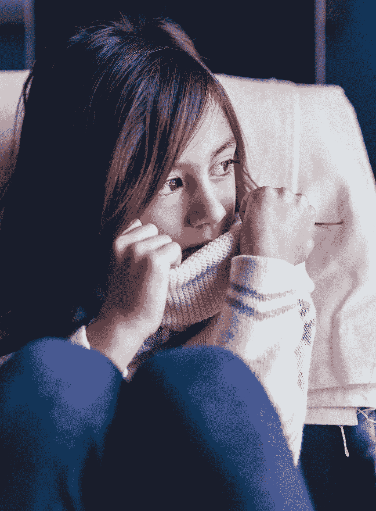
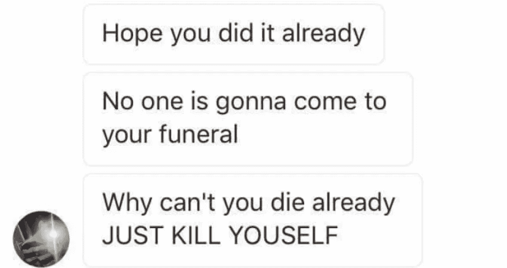
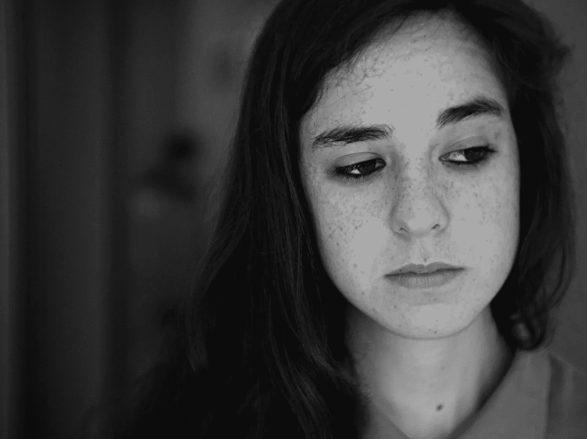

# 安全的在线家庭|第 2 部分:网络欺凌

> 原文：<https://medium.datadriveninvestor.com/secure-online-families-part-2-cyber-bullying-d718ee7e94c8?source=collection_archive---------34----------------------->

这是 9 篇系列文章中的第 2 篇|保证孩子的安全是大多数父母和监护人的头等大事，这也越来越包括网络安全。

> 网络欺凌是一个非常现实的问题，具有非常现实的后果。

# 风险

**网络欺凌的风险怎么强调都不为过，因为它导致了自杀未遂******和实际自杀** [**的增加。**](https://www.cbsnews.com/news/smartphones-cyberbullying-targeted-as-causes-of-skyrocketing-teen-suicide-rate/)**

**我们中的许多人在生活中的某个时候都曾被欺负过。这对任何人来说都是可怕的经历，尤其是当你还年轻，已经感到非常脆弱的时候。**

**正如我们生活的其他部分已经转移到网上，欺凌也是如此。在某些方面，网络欺凌可能比面对面的欺凌产生更糟糕的影响。以下是几个原因:**

*   **匿名评论(尤其是在社交媒体上)让任何人都更容易说出伤人的话**
*   **一位年轻的老鹰童子军的兄弟在受到网络欺凌后自杀了。**

> **在今天这个时代，恶霸不会把你推进储物柜，他们不会告诉受害者下课后在学校的垃圾箱后面见他们。他们躲在几英里外的用户名和虚假资料后面，不停地斥责和辱骂善良无辜的人。**

*   **身体伤害的威胁(由欺凌者或受害者实施)很常见。**
*   **我们没有一个人是完美的，欺凌弱小者非常乐意利用这些弱点**
*   **数十亿人在线，至少有一个人会注意到**

> **以下是网络欺凌的真实例子，一些读者可能会感到不安。建议谨慎行事。**

*   **一名 12 岁的女孩在自杀当天通过社交媒体收到了这些充满仇恨的信息([新闻文章和图片来源](http://www.cbc.ca/news/canada/thunder-bay/social-media-suicide-1.3963322)**

****

**Real messages sent from a bully**

*   **一个名叫霍普的 13 岁女孩把自己的性感照片发给了她的男朋友。这些照片随后被分享给六所不同学校的学生，并创建了一个“憎恨希望者页面”。霍普随后上吊自杀。**

***注意:不管你对色情短信的看法如何，与他人分享这些照片和创建贬损页面并不一定是“她的错”或对她的色情短信“公正”。***

*   **下面是 [16 岁的老鹰童子军自杀](http://www.puresight.com/Real-Life-Stories/david-molak-2000-2016-puresight.html)的故事，之前也谈到过:**

> ***在一条群发短信中，大卫是一群 6 到 10 个恶霸的目标，他们无缘无故地跟踪他，他也不知道他们的联系方式。他哥哥说:***
> 
> **“除了有一个迷人的女朋友，他没有对他们做任何事情。…他们摧毁了他的精神，夺走了他做任何事情的动力。三天前的晚上，当大卫被加入一个群发短信，却被取笑，两分钟后被踢出群时，我看到了他眼中的痛苦。我跟他说了几句安慰他的话，他甚至没有听到我的话。他向远处凝视了大约一个小时。我能感觉到他的痛苦。这是一种切实的痛苦。他连发群文的八个成员的联系方式都没有。值得注意的是，大卫已经忍受这种虐待很长时间了。”**

# **解决方法**

**从三个角度教导孩子有关网络欺凌的知识:**

1.  **作为受害者**
2.  **作为一个恶霸**
3.  **作为一个旁观者**

## ****作为受害者****

**作为父母，我们可以通过以下方式帮助受欺负的孩子:**

*   **认真对待他们的担忧**
*   **为他们接触我们创造一个安全的环境**
*   **观察抑郁症[和自杀](https://www.mayoclinic.org/diseases-conditions/depression/symptoms-causes/syc-20356007)[的迹象](https://save.org/about-suicide/warning-signs-risk-factors-protective-factors/)**
*   **请注意，即使是全面发展的好孩子也有抑郁/自杀的高风险**
*   **年轻人(和我们)如何看待自己决定了我们的现实，即使他们是明星**
*   **教他们如何应对伤害，包括:**
*   **如何原谅并放下愤怒**
*   **把自己和卑鄙的人分开**
*   **从负面经历中获得积极的东西(例如，对他人有更多的同理心)**

## ****当恶霸****

**我们都说过自己后来后悔的话，年轻人也是如此。因此，重要的是要记住，任何人都有可能对他人刻薄——尽管有些人比其他人更刻薄。**

****

**为了帮助我们的孩子不欺负他人或对他人刻薄，我们可以教导孩子:**

*   **如何控制自己的情绪，包括:**
*   **对自己的行为负责(即问责制)**
*   **(暂时)离开他们生气的环境**
*   **不要滥用在线匿名的能力**
*   **如何请求原谅并纠正他们犯下的错误**
*   **让他们知道我们会永远爱他们，永远在他们身边**
*   **记住，那些欺负人或说刻薄话的人往往内心受伤(可能需要帮助)**

## **作为旁观者**

**我们也可以教我们的孩子如何:**

*   **为那些被欺负的人挺身而出**
*   **向受欺负的人伸出援手**
*   **有人伸出援手对受害者来说意义重大**
*   **成为他们朋友的正面榜样**

**记住，教学发生在正式和非正式的场合。**

# **该系列:**

*   **[**第一部分:简介**](https://medium.com/@and_sanford/secure-online-families-part-1-introduction-b9d144989007)**(12 月 18 日)****
*   ****[**第二部分:网络欺凌**](https://medium.com/@and_sanford/secure-online-families-part-2-cyber-bullying-d718ee7e94c8)(12 月 18 日)****
*   ****[**第三部分:社交媒体**](https://medium.com/@and_sanford/secure-online-families-part-3-social-media-876bb459c848)**(12 月 26 日)******
*   ******[**第四部:匿名**](https://medium.com/@and_sanford/secure-online-families-part-4-anonymity-2c810532eef1)(1 月 2 日)******
*   ****[**第五部分:虚假信息**](https://medium.com/@and_sanford/secure-online-families-part-5-false-information-c4903cddfb03)(1 月 8 日)****
*   ****[**第六部分:暴力媒体**](https://medium.com/@and_sanford/secure-online-families-part-6-violent-media-313cce94c90b)(1 月 15 日)****
*   ****[**第七部:性/色情**](https://medium.com/@and_sanford/secure-online-families-part-7-sex-pornography-62a3c2a4b9e4)**(1 月 22 日)******
*   ******[**第八部分:综合解决方案**](https://medium.com/@and_sanford/secure-online-families-part-8-comprehensive-solutions-f7658db363de)**(1 月 29 日)********
*   ******[**第九部分:结论&附加资源**](https://medium.com/@and_sanford/secure-online-families-part-9-conclusion-additional-resources-426ec6681e1f)(2 月 5 日)******

# ****我的证件****

****我在 InfoSec 工作，并在完成硕士学位期间发表了几篇学术文章。****

****你可以在这里和这里查看我所有的证件[。](http://andrewnsanford.com)****

*****【本故事已改编为文章格式来自我的网站*[*securefamilies.org*](http://securefamilies.org)****