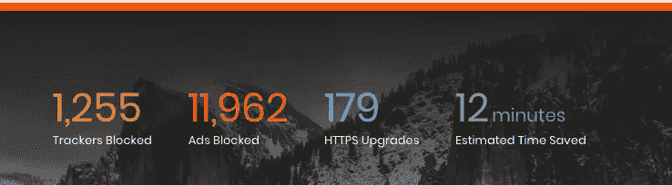
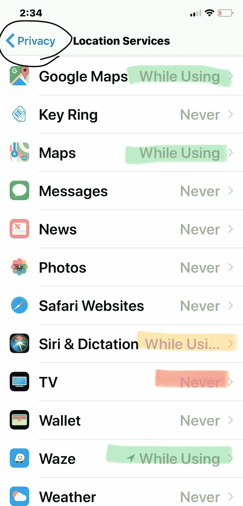
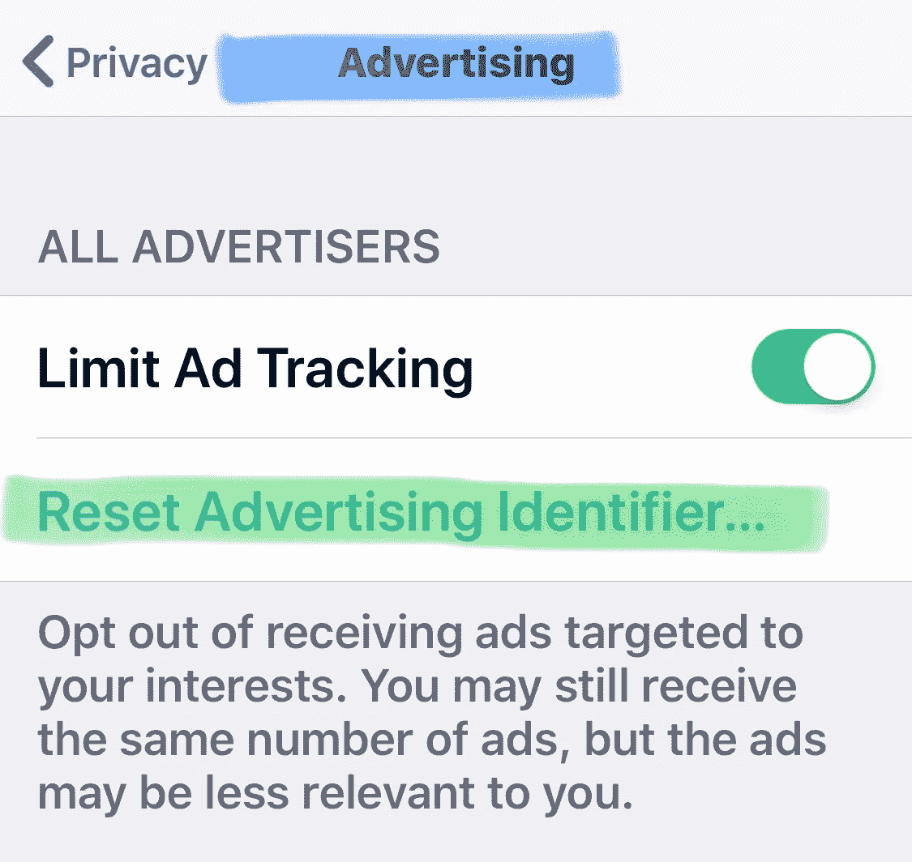
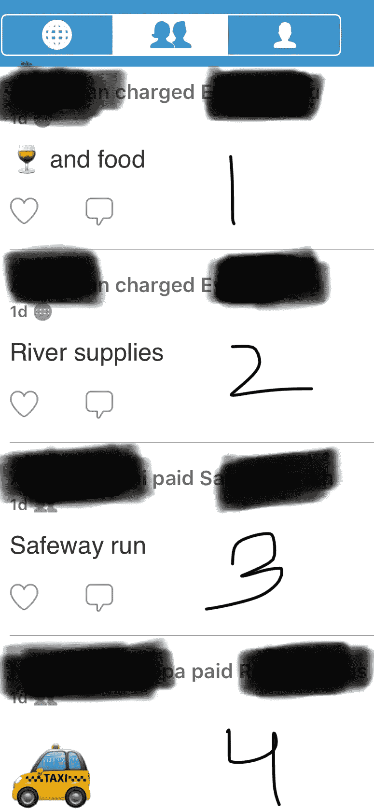

# 傻瓜的可操作在线隐私。礼貌:狮子。

> 原文：<https://medium.datadriveninvestor.com/securing-online-privacy-for-dummies-b2c8e80a2e01?source=collection_archive---------3----------------------->

尽管我们生活在一个黑客对熟睡的婴儿大喊大叫、家庭自动化设备将你的私人争吵发送给朋友的 T2 世界，我还是会以一张信息图表开始，来说明有意识地保护在线隐私的必要性。

Source: Weeklong privacy metrics from Brave browser for Bubbykins

你在上面看到的是基于我晚上随意浏览的一台设备的实际一周指标。

举个例子，我所有的社交媒体账户加起来有 7 个朋友，我单身了大约四分之一个世纪。这让你不禁要问，为什么会有人浪费资源在网上追踪这个家伙？或者有人会因为太无聊而被跟踪吗？

根据那个截图来看，好像不是这样。你可能知道任何一家[大型零售商都可以根据你孩子的购物趋势非常准确地预测她怀孕的时间。一个媒体巨头可以](https://www.forbes.com/sites/kashmirhill/2012/02/16/how-target-figured-out-a-teen-girl-was-pregnant-before-her-father-did/#4a78bb246668)[侵入你的习惯圈来影响你的行为](http://www.effectuation.org/wp-content/uploads/2017/06/Social-interaction-via-new-social-media-How-can-interactions-on-Twitter-affect-effectual-thinking-and-behavior_.pdf)，[引发购买或投票决定](https://www.forbes.com/sites/andrewarnold/2017/12/22/4-ways-social-media-influences-millennials-purchasing-decisions/#2730c465539f)或者[让你盯着电视屏幕看几个小时](https://www.huffingtonpost.com/entry/netflix-watching-trick_us_5b04413ae4b003dc7e46e102)。虽然你可能认为你在控制，但你是你凝视的设备的奴隶。你是一个[奴隶，因为你一直在向它提供数据](https://privacyinternational.org/feature/1064/invisible-manipulation-10-ways-our-data-being-used-against-us)。

虽然我们可以不厌其烦地讨论捕捉一个人生活中如此复杂的细节是否真实、是否道德、是否有价值，但这样的讨论可能没什么意义。大巨人知道[你浏览什么，你去哪里，你讨厌谁，你最黑暗的欲望和你最深的秘密](https://www.theguardian.com/commentisfree/2018/mar/28/all-the-data-facebook-google-has-on-you-privacy)。[数据已经正式超过石油成为最有价值的资源](https://www.economist.com/leaders/2017/05/06/the-worlds-most-valuable-resource-is-no-longer-oil-but-data)。你目前的信用卡价值约为 10 美元，你的在线活动可能高达数百美元，你的敏感病史可能更有价值，可能会在暗网上出售(以后会有更多相关内容)。

我们将尝试关注一些可操作的步骤来减少可追溯性。先说我们的行踪。你可能只需要几个应用程序就能知道你的位置。例如，电视应用程序真的需要知道我晚上在哪里度过吗(在沙发上生闷气)。

我们可以看到哪些应用程序访问了麦克风、摄像头、联系人等。如果您将此扩展到您的在线帐户(例如查看哪些服务可以访问您的数据，这可能需要一段时间。但是就像我说的，我只有 7 个网上朋友，其中 3 个很有礼貌。抽出一个周末的时间，尽可能地避开一切。(几乎)没有人需要知道你认识谁(联系人)，你去哪里(地点和照片)，你说什么(麦克风)或者你长得怎么样(相机/照片)。

iPhone: Settings > Privacy > Location services

在又一个观看盛宴的周末，你可能想在网上找找自己。谷歌一下你自己，你这个小名人！也许，对冰好一点？你看到了什么？7 号环节上？第三页？你骄傲吗？如果没有，[运行一个插件或脚本来删除你的 facebook 活动。](https://www.mariusschober.com/2018/01/20/delete-facebook-activity/)或者[考虑删除账户](https://www.businessinsider.com/delete-facebook-statistics-nearly-10-percent-americans-deleted-facebook-account-study-2018-4)？尝试在[spokeo.com](https://www.spokeo.com/)上搜索自己。你找到所有你过去的家和工作地点了吗？如果没有，你可能做得不对。

虽然你在[发言人](https://www.spokeo.com/)上发现的关于自己的信息可能令人毛骨悚然，但你可以试着[尽量减少你的数字足迹](https://www.cnet.com/how-to/remove-delete-yourself-from-the-internet/)。根据新的隐私法，你可以要求[删除你的数据](https://www.cnet.com/how-to/remove-delete-yourself-from-the-internet/)。冒着听起来像指令性的风险，请尝试下面的设置。

iPhone: Settings > Privacy > Advertising

虽然这些设置是一个好的开始，但几乎没有任何意义。如果你想保持在线搜索的私密性，可以考虑 [DuckDuckGo](https://duckduckgo.com/) 。

想要保持你的电子邮件的私密性吗？试试 [protonmail](https://protonmail.com/) 或 [tutanota](https://tutanota.com/) (这两家公司都位于欧洲，与其他地区相比，欧洲对隐私的关注和需求相对较高。)

当互联网上的小兔子们蹦蹦跳跳地把你的小狗照片送到目的地时，你想保护它们的隐私吗？考虑 VPN。VPN 是一项杰出的发明。担心人们偷拍其私人生活的狮子们发明了虚拟专用网络(VPN)。通过 VPN 发送的任何通信，无论是狮子的胡须胶还是青少年幼崽的爪漆，都可以在没有猫版本亚马逊跟踪他们的情况下订购。狮子购物、银行和性短信纯属机密。 [ProtonVPN](https://protonvpn.com/) 和 [Phantom VPN](https://www.avira.com/en/avira-phantom-vpn) 是人类世界中桌面和移动设备的一些例子。

想保护你所有浏览活动的隐私吗？考虑像 [brave](https://brave.com/) 和 [tor](https://www.torproject.org/) 这样的浏览器。消息怎么样？听说过[信号](https://www.signal.org/)吗？

如果你还没有意识到把网络隐私放在第一位的必要性，只要把你的 venmo 账户连接到你的联系人列表或 facebook 账户，试着跟踪你的前任(crush，针对单身几十年的人)。

Source: Venmo stalking of Bubbykins

最后，仅凭上面的截图，你能看出我的熟人中有谁可能会购买莫斯卡托、喜欢快速晒黑产品、选择送货上门服务或者可能会考虑买车/试用优步的新信用卡吗？

如果你可以根据一张可以压缩成几千字节的图像，为我随机的熟人猜测，想象一下世界一流的算法可以根据你的兆兆字节的数据结合数千兆字节的相关分析数据预测什么，让每个人都一样地思考、想要和行动。

像狮子一样，使用 VPN。另外，[试着和你奶奶一起保护路由器](https://medium.com/@bubbykins/that-dusty-box-loving-grandmas-and-whale-internet-5817fd6c51da)。

点击这里阅读更多布比金[的文章](https://medium.com/@bubbykin)。或许在这里可以找到[这个问题的答案。](https://medium.com/@bubbykin/canadian-pr-application-for-dummies-93837fbdf972)

你可能还会喜欢一些即将到来的批评家们认为可以接受的帖子:

艺术家是由什么组成的？

[那个妖孽司机。](https://medium.com/@bubbykin/the-uber-driver-2f4f2902faf0)

家在哪里？