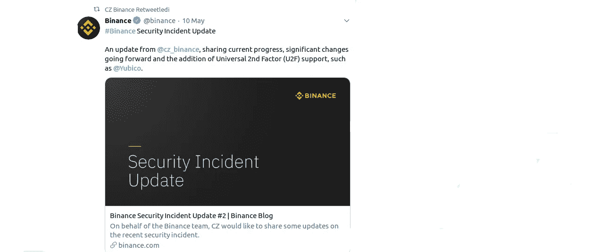
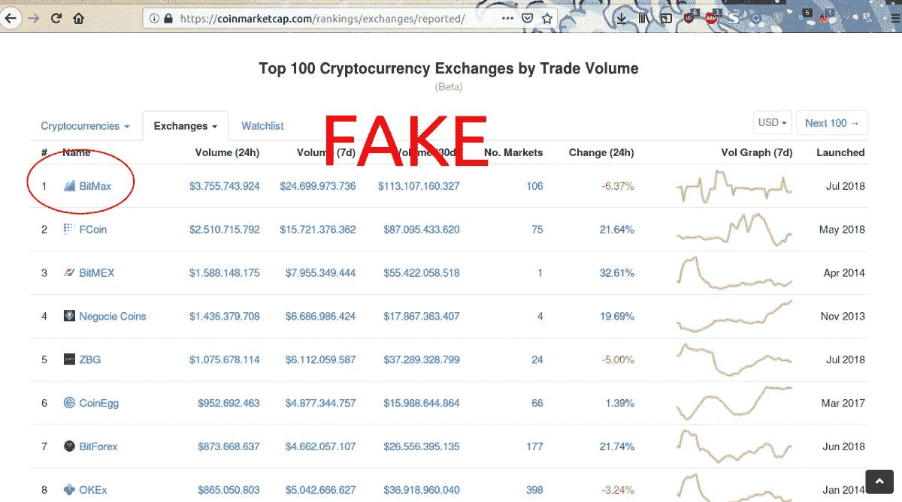
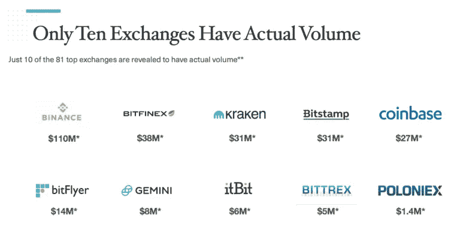

# 安全性、佣金和交易量——寻找合适的交易所

> 原文：<https://medium.datadriveninvestor.com/security-commissions-and-volume-on-the-way-to-finding-the-right-exchange-60d51891733c?source=collection_archive---------9----------------------->

加密交易所是评估你的加密货币的最合适的地方。由于加密货币在日常生活中的适应是一个缓慢的过程，大多数人仍然表现出将加密货币主要变成法定货币的倾向。但至少有一个新的股票市场和一种加密货币。我们需要对交易所有详细的了解，才能选择适合自己的交易所。

此外，每个人对股市的预期可能会有所不同。有些人喜欢集中交换，而有些人喜欢分散交换。此外，证券交易所的位置、每日交易量、安全性和客户服务质量也是我们选择交易所的重要因素。

 [## 创新警报:区块链 3.0、Terra 协议、ICO 门户和更多数据驱动的投资者

### 尽管过去几个月加密货币的价格波动很小，但这项技术并没有停止发展…

www.datadriveninvestor.com](https://www.datadriveninvestor.com/2019/03/16/innovation-alert-blockchain-3-0-terra-protocol-an-ico-portal-more/) 

此外，那些从我们称之为交易者的加密货币的价格变化中获得财务收益的人更感兴趣的是交易所的界面、其实用性、每日交易量和易用性。此外，我不能说我们在寻找完美的股票市场时就能得到我们想要的东西。在这篇文章中，我想告诉你我的一些经验，并谈论一个有前途的项目作为解决方案。

**安全**

> *选择交易所时，最需要考虑的是* ***安全性*** *。*

数字货币交易是一些最臭名昭著的加密事件的主题。2014 年的 Mt.Gox 交易所黑客攻击导致 74 万个比特币丢失，当时相当于 4.3 亿美元。最近，加拿大交易所 QuadrigaCX 承认，在其创始人于 2018 年底去世后，它丢失了约 1.37 亿美元的加密货币，显然是将交易所钱包的所有私人钥匙带进了坟墓。

过去十年来，许多安全漏洞、黑客和骗局一直困扰着加密领域，不幸的是，2018 年已经发生了一些备受瞩目的事件:

*   日本第二大交易所 Coincheck 价值 5 亿美元的 NEM 被盗
*   [【1.95 亿美元被黑客从 BitGrail](http://fortune.com/2018/02/11/bitgrail-cryptocurrency-claims-hack/)——意大利交易所和首家上市 Nano
*   全球最大的交易所之一币安被黑客窃取了 4500 万美元
*   [4000 万美元在 Coinrail hack](https://www.ccn.com/korean-cryptocurrency-exchange-coinrail-suffers-40-million-theft/) 被盗——南韩的一家精品交易所
*   [从 Zaif](http://fortune.com/2018/09/20/cryptocurrency-exchange-hack-zaif-japan-60-million/) —日本交易所窃取 6000 万美元

上个月，币安，世界上最重要的交易所之一，被许多权威机构认为是世界上最好的交易所，被黑客攻击。结果，价值 4200 万美元的加密货币被盗。在此之后，币安已经暂时停止了对交易所的存取款，并增加了安全措施。

上周，当新的安全系统启动时，我们将看到币安是否能回到过去的日子。

**卷**

> *交易所的* ***卷*** *通过允许您立即将您的加密货币转换成不同的加密货币来增加您的盈利能力。*

Bitmax 的成立时间被列为 2008 年。这段时间他们已经走了很长一段路。他们有自己的 Btmx 令牌，价格在 0.1 美元左右。由于股权和采矿证明，您还可以从转会费折扣中受益。在你提到这一切之前，我们先来聊一些数据。我想举一些 Bitmax“特别是在 Coinmarketcap 中报告的交易量大小”的例子，并向您展示表格。

Bitmax 用户界面是一个股票市场，这是伟大的。我也喜欢手机版和它提供的设施以及它托管的替代币。

但最近出现在 Twitter 上的几个视频和发表在 coindesk 上的一篇文章显示，只有少数交易所是市场中的真实交易量。Coinmarketcap 中的数据是由 Bitmax 这样的交易所操纵的。

更多信息，可以访问区块链透明研究所[阅读最新报告](https://www.bti.live/reports-april2019/)

**交易费和支持币**

Circle of Trust

密码交易所(以及其他交易所，如股票、商品等交易所。)收取费用。费用通常因交易所、加密货币和法定货币以及交易规模而异。通常，加密交易所可以收取固定费用，无论交易规模大小都一样。它也可以是交易价值的百分比或两者的组合。

这些费用是加密交易所的主要收入来源。他们让交易所生存下来，向技术支持支付薪水，并提供客户服务。此外，收费允许加密交易所投资于基础设施，这使它们更安全、更快，并允许包括更多的加密货币和法定交易对。

部分交易所和支持币的交易佣金:

*比特币基地:*比特币基地包含每种加密货币 0.50%的差价。比如说。如果一种加密货币的价格是 1000 美元，那么比特币基地将为消费者显示 1005 美元的价格

> 支持币:提供[比特币](https://blocklr.com/bitcoin)(BTC)[比特币现金](https://blocklr.com/Bitcoin-Cash)(BCH)[以太坊](https://blocklr.com/Ethereum)(ETH)[以太坊经典](https://blocklr.com/Ethereum-Classic)(ETC)[莱特币](https://blocklr.com/Litecoin) (LTC)交易。最近，[比特币基地增加了 0x (ZRX)](https://blocklr.com/news/0x-zrx-listed-coinbase/) ，它的第一个 ERC-20 令牌。

*币安:*如果交易量低于 100 个比特币或低于 50 个 BNB，交易者和接受者都要支付 0.10%的费用。

> 支持的硬币:币安支持超过 380 种加密货币和法定货币对。

Hitbtc 向市场参与者收取 0.1%的费用。与其他交易所相比，这不是最低的费用，但不管交易的价值如何，都是一样的。此外，HitBTC 还奖励做市商 0.1%的回扣。

> 支持的硬币:它支持超过 300 种加密货币。

Bitfinex :对于制造商来说，交易额在 50 万美元以下的，费用从 0.10%开始，如果交易额超过 750 万美元，费用将降为零。

> 支持的硬币:它支持大多数主要和小型加密货币。

*库币*:对于交易，库币每笔交易抽取 0.1%的手续费。然而，持有 KuCoin 原生 KCS 代币的用户可以获得高达 30%的折扣，具体取决于他们持有的 KCS 数量。

> 支持的硬币:它位于香港，支持超过 180 种加密货币。

Bitstamp: Bitstamp 不为做市商提供单独的费用，尽管它确实规定对于更高的交易量，他们可以获得定制的费用。除此之外，通常的交易费用根据交易量从 0.10%到 0.25%不等。

> 支持的硬币:。它涵盖了 Ripple (XRP)、比特币(BTC)、莱特币(LTC)、以太坊(ETH)、比特币现金(BCH)和加密货币。你可以存/取美元和欧元。

**法律免责声明**:本文仅供一般指导，不构成法律投资建议。

# 来源

1.  [https://hacker noon . com/its-time-to-address-the-massive-problems-of-centralized-exchange-AC 2 CFB 66 be F8](https://hackernoon.com/its-time-to-address-the-massive-problems-of-centralized-exchanges-ac2cfb66bef8)
2.  [https://hacker noon . com/security-problems-of-crypto-exchange-d5e2f 595 FB 79](https://hackernoon.com/security-problems-of-crypto-exchanges-d5e2f595fb79)
3.  [https://hacker noon . com/how-to-pick-the-best-cryptocurrency-exchange-BC ABC 359 a9 DD](https://hackernoon.com/how-to-pick-the-best-cryptocurrency-exchange-bcabc359a9dd)
4.  [https://hacker noon . com/understanding-decentralized-exchange-51 b 70 ed 3 Fe 67](https://hackernoon.com/understanding-decentralized-exchanges-51b70ed3fe67)
5.  [https://blocklr.com/guides/crypto-exchanges-lowest-fees/](https://blocklr.com/guides/crypto-exchanges-lowest-fees/)