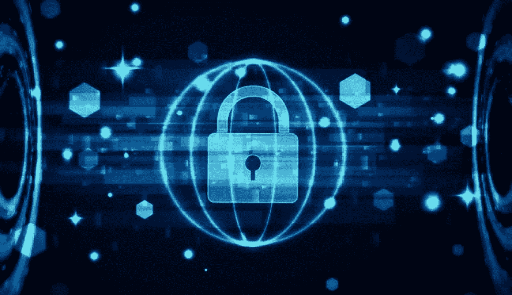

# 安全令牌行业概述

> 原文：<https://medium.datadriveninvestor.com/security-token-industry-overview-eb6995b6f3a?source=collection_archive---------5----------------------->

## 虽然世界各地的监管机构正在加大努力，加强对加密生态系统的监管，但加密领域正在以极快的速度发生变化。与 2017 年相比，区块链行业的风险投资金额翻了一番。安全令牌或令牌化资产部门正在崛起。一个重要的安全级基础设施交换机正在形成，建立了被认为是数字经济有史以来最重要的发展点！

## 行业总结

随着加密领域的机构数量达到前所未有的水平，安全令牌不可避免地成为数字经济行业的主流。

华尔街资本正在积极寻求收购合规、繁荣的企业以及完全符合当前加密货币投资模式的团队。

我们正在见证区块链上提供完全合规的证券交易平台的交易所之间的最后一轮竞争，预计到目前为止，加密货币生态系统中所取得的一切在规模和数量上都将相形见绌。

在可预见的未来，谁将赢得这场竞赛，将决定交易所的格局。

## 目前安全令牌行业的状况

加密市场见证了曾经只是关于华尔街资本打算流入该行业的谣言，现在开始成为现实。对冲基金和养老基金以及其他集体投资计划正在将他们的重点转移到证券代币行业，这是由成熟的市场、证券代币的激增以及为有效交换此类资产而创建的许可市场的到来所带来的。

无数的参与者组成了令牌化的安全生态系统，他们都扮演着重要的角色，每个人都专注于特定的元素，以将崭露头角的数字资产行业转变为现实。涵盖的一些领域包括:

*   发行平台
*   安全令牌交换
*   经纪人/经销商
*   军官训练团
*   托管公司
*   报告
*   投资决策银行业务
*   投资者
*   这份清单还在继续…

尽管与令牌化安全行业相关的所有子行业都发挥着重要作用，但发行平台和安全令牌交易所是最关键的。他们是这个行业的核心。这两方面都取得了显著的进展，然而，阻碍它们全面运行的是缺乏一个协议来保护它们在二级市场上出售代币时免受法律后果的影响。这是目前该行业完全起飞前最后一块拼图。幸运的是，关于这个问题已经取得了很大的进展，并且安全令牌协议正在激烈地开发中，例如以太坊的 ERC-1400、Polymath 的 ST20、overstock 的 Tzero 等等；2019 年将历史性地标志着第四次金融革命的解决，从那时起的可能性是令人兴奋的！

## 顶级安全令牌发行平台

**Polymath** — Polymath 将自己定位为安全令牌的以太坊。他们致力于为区块链的股票、债券和其他资产的证券化提供法律和技术上的答案。

**证券化** —证券化管理投资者从登录到收到资本的过程，以及在资产的整个生命周期中发行和管理证券。

**Harbor** — Harbor 是一个区块链平台，专门用于推出安全令牌，并帮助它们遵守当前的监管框架。他们主要是协助传统资产业务向区块链转型，从而实现其符号化。

**Swarm** — Swarm 的 SRC20 协议，为安全令牌提供加密标准。令牌化的对象包括房地产、可再生能源、农业、科技项目、加密对冲基金等等。任何可以转化为“数字资产”的东西，都可以被快速管理、控制和交易。

**securency**—他们有一个顺畅的拖放程序，只需点击一下就可以发放令牌。它们还涵盖了在 160 多个国家的分销和 KYC，以及加密货币钱包和法定账户的反洗钱。此外，他们还能够执行投资者认证和资金来源检查。

这些平台就像我们到目前为止看到的许多其他用于发布 ico 的区块链平台，如以太坊、Cardano、NEO 和 Zilliqa 尽管这些平台没有被充分设计或甚至定位来发行安全令牌。

## 顶级安全令牌交换

**tZero** — tZero 是 Overstock 的子公司，以一种非常易于使用的方式创建，专门用于交易安全令牌。tZero 的安全措施使交易安全令牌变得简单、用户友好且合规。

**开放金融网络** —开放金融系统是一种创新的安全令牌交易所，允许认证投资者交易安全令牌。该平台现已上线，是美国首个受监管的安全令牌交易平台，专为令牌化的未来打造。

**未来银行(又名 BTF)** —未来银行是一个给有经验的投资者留下深刻印象的在线投资平台。对于准备投资于有远见的项目的投资者来说，这是一个令牌化的二级市场，这些项目可以发行证券令牌，如股票、传统债券或其他类型的数字证券。

**Bancor** — Bancor 也加入了安全令牌部门。Bancor 协议为被称为智能代币的加密货币带来了新的标准，它们可以以算法估计的费用在系统内连续和自主地转换为其他代币。

## 安全令牌市场潜力

想想全球股票市场有多大。根据彭博报告，全球市场估计约为 80 万亿美元。现在想象一下，机构和公司发行的股票中有 25%是证券。这可能使全球范围内的安全令牌产业达到 20 万亿美元。

为了进一步了解市场规模，标准普尔 500 在 2018 年 1 月增加了 6 万亿美元的市值。整个 2018 年，它的市值减少了 2 万亿美元。相比之下，2018 年 1 月，所有加密货币的市值约为 8000 亿美元。在整个一年中，发生了一次极端的市场调整，到 2018 年底达到约 1150 亿美元。与全球证券业相比，公用硬币/代币行业只是一粒沙子。这表明了安全令牌市场有多么巨大。

安全令牌将引导我们大规模采用区块链技术，同时颠覆传统的金融业务格局。资本市场的钱袋将装满安全代币，一旦这种情况发生，金融世界的情况将会大不相同。

*感谢您阅读我的文章，它最初发表在我的个人网站***。如果你想联系我，或者如果有你想让我报道的话题，请给我发电子邮件到 thesparkblog@renatozamagna.com。**