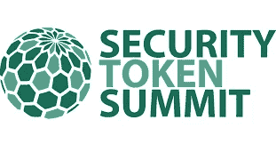
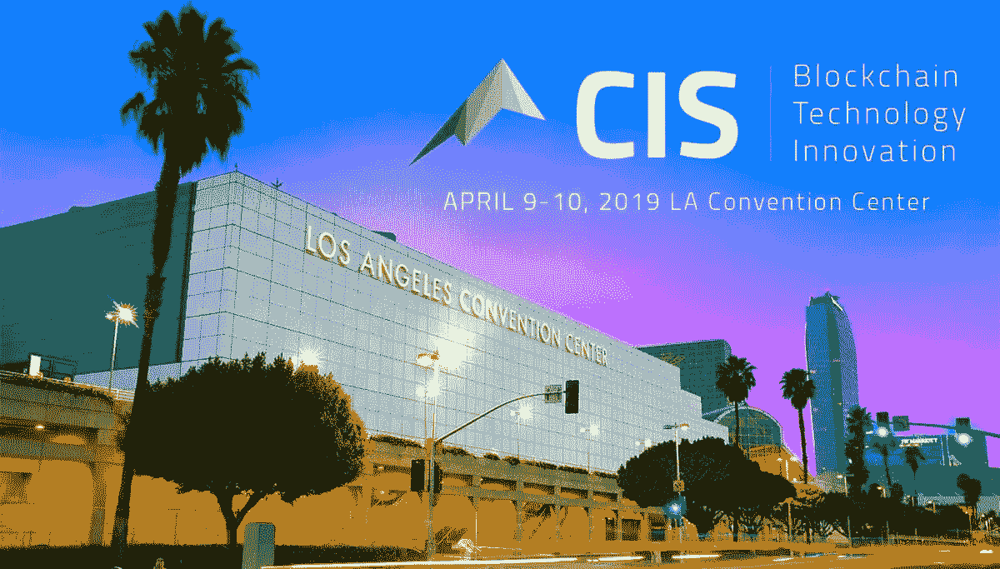
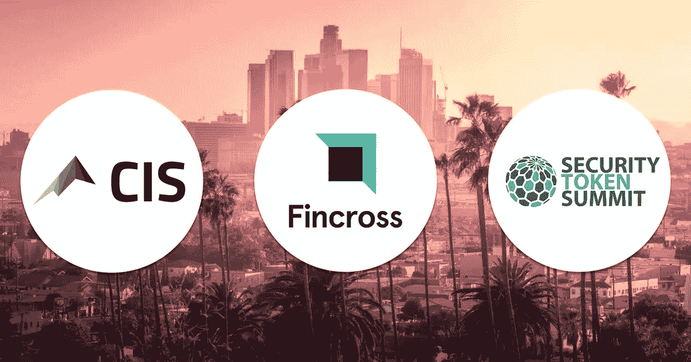

# 安全令牌峰会和 CIS:新一代的建设者。

> 原文：<https://medium.datadriveninvestor.com/security-token-summit-and-cis-builders-of-the-new-generation-688325d7120f?source=collection_archive---------20----------------------->

> 向世界教授数字证券和点对点技术。

区块链技术正在彻底改变互联网的力量，并通过其点对点的无信任网络颠覆了几乎所有的行业范式。

在这样一个爆炸性的革命中，为学习、商业和有趣的社交网络创造成功的环境是一个巨大的挑战。

在洛杉矶……有两个完美的事件做到了这一点！

[https://securitytokensummit.com/](https://securitytokensummit.com/)

# 卓越的数字证券行业盛会

安全令牌峰会是一个高端，安全令牌和数字证券的重点活动。它有一个强大的议程，涵盖各种主题，如托管、合规、监管、投资、营销、令牌化、标准、发行和房地产。

[https://cis.la/](https://cis.la/)

# 区块链技术的新时代

CIS 是专注于区块链技术、企业家、投资者和开发者的领先会议和博览会。这是一场独家、精心策划、影响力大、信息丰富、发人深省的盛会，由区块链生态系统中的一些全球最重要的创新者、变革者和杰出领导者举办。

每年，it 都将成千上万的与会者聚集在一个多元化的团体中，代表着最聪明的头脑、游戏规则改变者、创造者、监管者和内部人士，以及商业专业人士和领先的投资者/风险投资家，帮助人们学习如何、为什么以及在哪里投资和学习自互联网以来最具颠覆性的技术，并理解为什么它会在全球范围内产生巨大的积极影响。

 [## 正在改变行业的 5 个真实世界区块链应用——数据驱动的投资者

### 除非你一直生活在岩石下，否则我相信你现在已经听说过区块链了。而区块链…

www.datadriveninvestor.com](https://www.datadriveninvestor.com/2019/02/13/5-real-world-blockchain-applications/) 

# Fincross International 是 CIS 和安全令牌峰会的冠名赞助商

**下一代数字投资银行与全球最大的区块链和加密货币峰会以及最独家的智能证券峰会合作。**

Fincross International 正在连接传统和数字金融世界。在法国兴业银行(Société Générale)前中东和非洲首席执行官 Eddy Abramo 的领导下，Fincross International 正在建立一个基于专有分布式总账技术的金融产品和服务生态系统，这将为机构、公司、中介和个人客户的新金融产品和数字资产的创建、管理、保护和结算带来革命性变化。这家投资银行由毛里求斯金融服务委员会监管，计划在 2019 年第二季度推出并搭载首批客户。

Fincross International 的分布式银行分类账(DBL)将使客户能够在点对点的基础上进行即时结算交易。DBL 将为传统和数字资产的投资、托管和交易创建一个白名单生态系统。目前正在开发的还有一个发行安全令牌的协议和一个供合格投资者浏览由 Fincross International 投资团队选择的安全令牌产品的平台。

> Goren Holm Group 的创始合伙人 Alon Goren 表示:“Fincross International 为我们不断增长的行业带来了急需的机构质量和领导力。“他们已经建造的和正在建造的将定义我们空间的未来，我们不可能找到更好的合作伙伴和我们活动的冠名赞助商。”

Fincross International 加入了 CIS 和安全令牌峰会的其他知名赞助商，如 Ownera、Totle、美国航空公司、Netki、Blockquake、Prime Trust、TokenSoft、Blockparty、Fisher Broyles 和 Carman Lehnhof Israelsen LLP。

> “我们很高兴成为 2019 年 4 月安全令牌峰会和加密投资峰会的冠名赞助商。我们的公司将服务于多样化的客户群体，从全球投资基金和公司到寻求专业数字资产服务和投资管理的个人，所有这些都集中在一个地方。“历史上，CIS 一直是业内的一个杰出会议，在网络质量、教育、娱乐和代表的性价比方面，我们都名列前茅，因此我们非常期待与参加 STS 和 CIS 的每个人见面。对于行业参与者来说，加州是一个非常特别的做生意和推广业务的地方，我们认为这是展示 Fincross 国际中心舞台的最佳场所。”

## 洛杉矶到处都是欣欣向荣的区块链社区，那里有许多充满激情的领导者，我们都将参加这两个侯爵活动……来加入我们吧！

**关于芬克罗斯国际**

Fincross International 是一家投资银行、证券和投资管理公司，专注于 2019 年推出的传统和数字资产。作为金融科技的先驱，Fincross International 正在开发和利用专有的分布式账本技术，以开放的架构向机构、公司、中介和个人客户提供广泛的金融服务和产品。该事务所成立于 2017 年，在毛里求斯注册成立，受 FSC 金融服务委员会监管。更多细节可以在[fincross.com](https://hm.t.hubspotemail.net/e2t/c/*W2fbkF-46FyNNW2xpB_76VHDgq0/*W2x78qM7s0HjHW5kyjkK6-9Cpb0/5/f18dQhb0J5C3BZ3fV5Q5f699bZQHVX00V71f53_MTp9cZ3R5hFjW4cm2zw4mKLS-W3M3CVk49PHckW1JxwY51Ld4VbW3_QfJ73_YkBwW3P48s049Kwt1W1mp5Cq3K6j0kN4cJ2YP2c72GW43Xxsw3JML-hW3vd6mL3T0nsDVLG53r3H6xvkW2dyN845nQJNRW4fGC1K2dMbQJW3R4SSx3DQGFFW2nT8K04t3y7PW38tyVh3QRKdHW3b9yhQ22TMvmW2-kszT21qXM5W2KTNfV3T2Yw2W215Szz3QCBGLW3glkTT25dWj4W2WsvyK3Chg5FW2FYXpS3Ch_KGW2Tt9Zf3SX5dRW3yPLhY30FH5dW3t_yn22FHQ6tW2HZtCm3R4TymW2dMdxM2lh4ybN2XZgmKmSTJlW3P4GBh41Szx4N3_4l8sBzPlNVmVQh279ZFBQN9jl0pY25wL-W96HPsQ8zjNtTW5r7YVK1G1WTdD2lxqdPyXTf1ct9xR03)找到。

**关于戈伦霍尔姆集团**

由 Josef Holm 和 Alon Goren 领导的 Goren Holm Group 是一些世界顶级区块链和加密货币会议的行业先驱、投资者和制作人。他们在风险投资、众筹和在线投资营销技术方面的背景，使他们能够独一无二地服务于数字证券革命。Goren Holm Group，LLC 及其负责人管理 Goren Holm Ventures (GHV ),并制作 CIS(世界上最大的区块链峰会和博览会)以及 Security Token Summit(顶级、最具排他性的数字证券活动之一)。

**关于区块链海滩**

区块链海滩自 2013 年以来一直在技术教育、新闻、博客、媒体和活动制作方面开展业务。区块链海滩举办活动和工作坊；创建与区块链技术相关的内容和时事通讯；为对区块链技术感兴趣的人进行实践培训；提供建立联系的机会；领导团队建设活动；协助应用程序开发；在区块链空间提供教育；新闻和媒体发布、社交媒体，以及为区块链技术相关人员建立社区。

## 了解我们更多: [www。BlockchainBeach.us](https://www.blockchainbeach.us/)