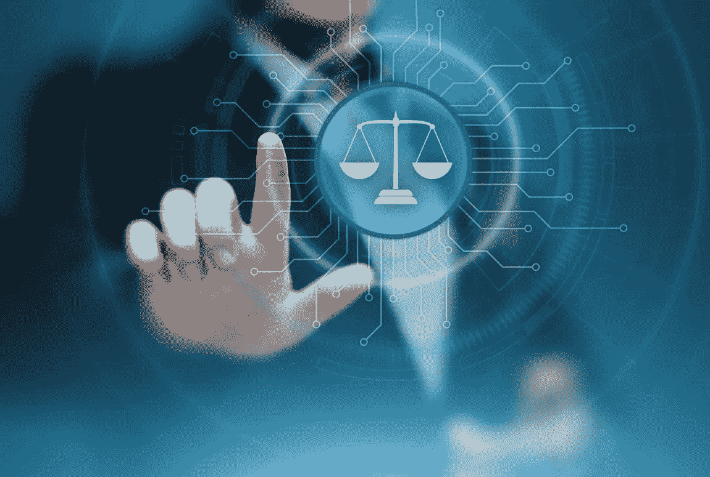
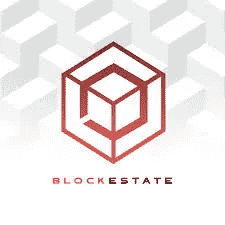

# 安全令牌、效用令牌与加密货币的演进

> 原文：<https://medium.datadriveninvestor.com/security-tokens-utility-tokens-and-the-evolution-of-cryptocurrency-5f1bdcde1845?source=collection_archive---------1----------------------->

安全令牌是加密的圣杯吗？

Source: [pixabay.com](https://pixabay.com/en/morning-bless-sunrise-religion-2243465/)

2017 年是加密货币疯狂的一年，数字代币估计筹集了 56 亿美元。2018 年，ICO 仍然蓬勃发展，尽管它已经成为要么努力遵守美国监管要么决定完全避免这一切的一年。根据普华永道瑞士的一份报告，2018 年 1 月至 5 月，ICO 量已经是 2017 年全年的两倍。

> *“自今年年初以来，总共有 537 个 ico 注册，总金额超过 137 亿美元。相比之下，2017 年共有 552 个 ico，交易额略高于 70 亿美元。此外，自去年以来，ICO 的平均规模几乎翻了一番，从 1280 万美元增加到 2550 万美元以上。”*

**证券还是公用事业代币？**

2017 年发布的大多数令牌都声称是公用令牌，以避免与 SEC 发生任何摩擦，但事实上，它们实际上是安全令牌。

**实用令牌**

公用令牌也称为应用令牌、奖励令牌或用户令牌。这些代币通常由公司发行，以资助他们的项目开发，反对他们提供的服务或产品。实用程序令牌的价值是根据其概念的未来利用价值来衡量的。

如果星巴克提供奖励代币，购买者将获得很大的购物折扣，我会考虑下载数字钱包，在银行验证后上传我的日常货币，然后购买代币。你知道我为什么要买他们的代币吗？在我家周围一英里内的任何方向都有一家星巴克，我每天都喝星巴克。我会从中受益，因为我生活在星巴克的生态系统中。

如果亚马逊提供代币，持有代币会导致巨大的折扣，独家优惠，代币可以用于支付商品等，我会考虑购买他们的代币。为什么？因为他们在一天中的任何时间、任何地点出售几乎所有的东西，这意味着潜在的一个很好的用例。我是 prime 会员，可以用信用卡支付，无需下载钱包和购买加密货币所需的所有其他步骤。我会从中受益，因为我在亚马逊生态系统中。

公用令牌有一些很好的使用案例(游戏、奖励、软件使用等)，但如果你在听某人的令牌结构及其工作原理时开始感到困惑，或者如果他们必须向你展示令牌生态系统的详细图表才能理解，或者如果他们提出有趣的(好得令人难以置信)主张，你可能正在看一枚狗屎硬币或狗屎令牌。

根据 Manzo Porelli 在《城市词典》上的说法，shitcoin(屎币)是“一种没有用途或独特功能的加密货币”根据 bustapost 的说法，同样在《城市词典》中，这个词在一个句子中的正确用法是“看到冰箱盒子里的那个家伙了吗？在 2018 年的 shitcoin 崩盘中失去了一切。”

许多项目需要规模经济才能成功，这意味着他们需要现实世界来采用它们，最终用户并不在乎，在很大程度上，如果你是一个分散的应用程序，甚至是建立在区块链上。这和我咖啡的价格有什么关系？金·卡戴珊在用吗(金·K 在扑克活动上收一个比特币不算)？它是否为我提供了某种独特的东西或成本削减价值(亚马逊),而这种价值是现有的东西无法提供的，除非我拿出美元，打开数字钱包，购买新的加密货币，并在银行验证等之后，才能最终访问该产品？

*澄清一下——安全代币不一定比公用代币更好投资，反之亦然。研究在任何投资决策中都是至关重要的，如果你承受不起失去一切，你就不应该投资。*

Source: Shutterstock

**安全令牌**

证券令牌通常由实物资产支持，如股权、有限合伙公司的股份或商品。安全令牌持有者可以被授予公司的所有权或股份。安全令牌已经发展到在区块链技术的基础上支持传统的首次公开发行(IPO)。安全令牌也受联邦法规的约束。

安全代币用于支付股息、分享利润、支付利息或投资于其他代币或资产，为代币持有者创造利润。这些是具有货币价值的可交易金融工具。公共股本、私人股本、房地产、管理基金、交易所交易基金、债券是证券代币的常见例子。

加密货币行业之外的大多数人在听到有关加密的新闻时，通常会听到与黑客攻击有关的消息，以及价值数百万美元的加密如何消失而永远无法恢复，或者他们听到大量筹集了数百万美元的“项目”，然后这些项目就消失了。这就是为什么业内许多人对安全令牌及其周围的监管感到兴奋。他们觉得 STO 将有助于该行业合法化。

区块链的力量和证券的数字化将为该行业带来急需的变化，并为创新者、传统投资者和成长型公司提供一条全新的财富创造途径，从而改变金融世界的民主化方式。

通过安全代币将当前的股票/金融市场与加密世界融合有很多好处，包括增加流动性，因为代币可以在国际上销售和交易，项目可以吸引全球范围内更多的投资者。

安全令牌可以是房地产、基金、酒店、许可证、连锁餐厅等。看看接下来的一年会有什么样的变化会很有趣。

以下是一些正在上市或即将上市的产品的例子:

[BlockeEstate —美国](https://blockestate.com/)

BlockEstate 正在吸取传统私募基金结构的最佳元素，并将它们与区块链技术相结合。他们“将使用预测分析来管理这些资本，并将其投资于精心挑选的市场部门投资组合，目标是通过 BlockEstate Alpha 基金的令牌化股份为投资者提供进入房地产市场的机会，从而实现回报最大化。

Source: BlockEstate

[Corl — Canada](https://corl.io/)

Corl 使用自动化和人工智能驱动的收入共享模型来连接风险资本家和初创企业。Corl's 创建了一个利用区块链的模型，并使用人工智能来审查申请人并做出合理的投资。Corl 认为其模式有利于投资者和初创企业。自动化和人工智能的使用使 Corl 能够加快传统的风险投资融资，并为企业家提供公平定价的增长资本，而无需放弃股权或控制权。通过使用收入共享模式，企业家被激励表现良好，这最终有利于所有相关方。

[加拿大](http://www.codingfly.com/) —中国&加拿大

CodingFly 是一个全球 IT 开发人员生态系统，为商业机构提供可展示的高质量 IT 解决方案，而无需高昂的基础设施成本，同时保护开发人员的知识产权。一个对所有参与者都有益的独特的“技术经济社会”。

CodingFly 平台是围绕/为技术人员搭建的，面向产品、研发、测试等领域。在保证项目数量和质量的基础上，丰富平台功能，构建成长体系，吸引程序员留下来。此外，它通过高质量的产出和服务吸引项目方。

旨在服务于未来的“技术经济社会”，基于 Codingfly 的产品和主链甚至可以帮助一些发展中国家在未来建立新一代的 IT 技术基础设施。CodingFly 预计该领域将有超过 2000 万参与用户，激活数千亿知识资产。(目前在私下销售——2019 年象征性销售)

Source: CodingFly

你期待有什么象征性的产品上市吗？

我不是金融专家，我不建议任何人在没有进行适当的研究和寻求适当的金融建议的情况下投资上述安全令牌产品。不要投资任何你无法承受损失的资金，因为加密货币市场波动很大。**

**我没有因为这个职位得到经济补偿。我不认识 BlockEstate 或 Corl 的任何人。我确实认识 Codingfly 的一些加拿大团队成员，但没有从 Codingfly 或任何团队成员那里获得任何报酬。这些观点完全是我根据自己的经验得出的。**

原文章发布在 block delta . io[https://www . block delta . io/are-security-tokens-cryptos-holy-grail/](https://www.blockdelta.io/are-security-tokens-cryptos-holy-grail/)

奥黛丽·奈斯比特

[奥黛丽·奈斯比特在领英上](https://www.linkedin.com/in/audrey-nesbitt-0388a52a/)

[@ audreynesbit 11 在推特上](https://twitter.com/AudreyNesbitt11)

# **相关帖子:**

 [## 你需要明白一件事

### 让我解释一下…

medium.com](https://medium.com/datadriveninvestor/uncertainty-now-you-can-handle-it-2e80cefe7e18)