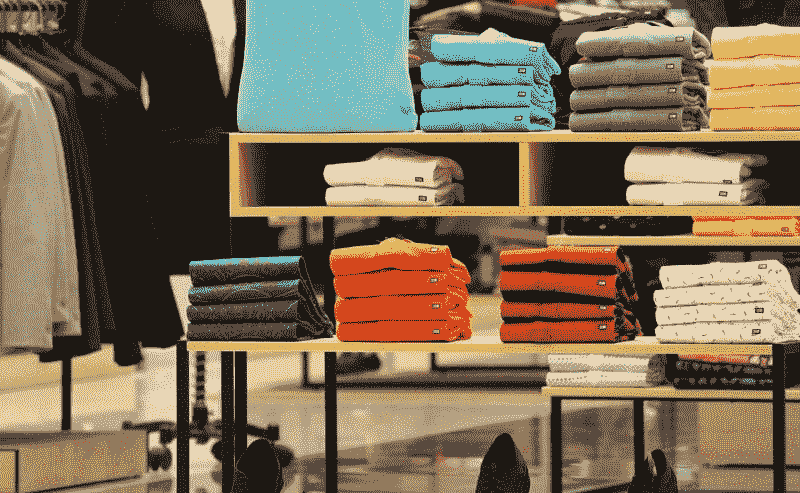

# 看看 JC Penney 的零售启示录——市场疯人院

> 原文：<https://medium.datadriveninvestor.com/see-the-retail-apocalypse-at-jc-penney-market-mad-house-d1d676076c7b?source=collection_archive---------6----------------------->

那些想看看零售业末日是什么样子的人需要访问 JC Penney(纽约证券交易所代码:JCP) 。

尤其是百货公司传奇的财务数据，展示了实体经济末日的现实。JC Penney 在 2019 年 5 月 4 日公布的运营亏损为-9300 万美元，净亏损为-1.54 亿美元，收入增长率为-4.34%。

此外，JC Penney 的季度收入从 2019 年 2 月 2 日的 37.86 亿美元降至 2019 年 4 月的 25.55 亿美元。与此同时，季度毛利从 12.67 亿美元降至 9.25 亿美元。

因此，JC Penney 的运营亏损了 16.3 亿美元的收入成本。因此，JC Penney 正在消耗大量现金。值得注意的是，Penney 公布的负运营现金流为-2.05 亿美元，资本支出为-7100 万美元，投资现金流为-6300 万美元，自由现金流为-2.76 亿美元。

# JC Penney 是如何经营的？

在这种情况下，投资者会问 JC Penney 是如何维持业务的？显而易见的答案是 JC Penney 在借钱维持经营。

事实上，JC Penney 在 2019 年 5 月 4 日报告的债务总额为 50.87 亿美元。因此，Penney 的债务价值超过其总资产的一半，该资产在同一天为 83.42 亿美元。

此外，JC Penney 的债务规模是其 2019 年 7 月 2 日的 10 倍以上；市值 3.4533 亿美元。鉴于这些数字，我看不出 JC Penney 如何偿还这些债务。

相反，JC Penney 将通过抵押其商店借入更多资金来偿还债务。然后，彭尼将试图通过关闭店铺来筹集资金支付债务。毫不奇怪，彭尼将关闭其 864 家商店中的 27 家，*《今日美国》* [报道](https://www.usatoday.com/story/money/2019/02/28/j-c-penney-store-closings/3013368002/)。

# JC Penney's 在百货公司死亡螺旋里吗？

我预测彭尼会有更多的店铺关门，因为这家零售商正处于死亡螺旋中。

我认为 Penney's 处于死亡螺旋中，因为它只有 1.71 亿美元的现金和等价物，但在 2019 年 5 月 4 日却有 19.45 亿美元的负债和 50.87 亿美元的债务。坦率地说，我不认为彭尼会在不出售大量资产的情况下还清这些债务。

部门死亡螺旋通常是这样运作的。首先，零售商借钱来维持运营，因为销售额在下降。第二，零售商关闭或出售地点以偿还贷款。第三，零售商因为缺乏偿还所有债务的资源而破产。

与此同时，零售商的股票暴跌至极低的价格。例如，2019 年 7 月 2 日，JC Penney 股票每股 1.09 美元。

值得注意的是，我们已经在西尔斯(Sears)看到了这一过程，西尔斯在 T2 破产(T3)中挣扎求生。在西尔斯，这导致了一个恶性循环，即出售房地产和其他资产来支付不断增长的债务。

彭尼的情况比西尔斯好一点，因为对冲基金没有掠夺它。值得注意的是，对冲基金经营者[埃迪·兰伯特](https://marketmadhouse.com/sears-is-suing-lampert-and-the-us-treasury-secretary/)彻底洗劫了西尔斯。

# 零售业的末日最糟糕的还在后头

即使避免了死亡螺旋，Penney 的未来也是暗淡的，因为零售业的末日会变得更糟。

据商业内幕 [报道](https://www.businessinsider.com/retail-apocalypse-thousands-store-closures-predicted-2019-4?r=US&IR=T)，瑞银预测，到 2026 年，美国将有 75，000 家实体店关闭。令人不安的是，瑞银(UBS)分析师预计，美国 17%的服装店，即 21，000 家实体店将在 7 年内消失。

这些商店将会关闭，因为瑞银预计，到 2026 年，电子商务将占美国零售额的 25%。值得注意的是，瑞银声称，**亚马逊(纳斯达克代码:AMZN)** 在 2018 年增加了相当于 7700 家商店或 350 亿美元的零售额。

JC Penney 将受到沉重打击，因为它出售的几乎所有东西都很容易在网上销售。比如服装、鞋子、首饰、小家电、家居用品。值得注意的是，美国增长最快的电子零售商 [**Wayfair**](https://marketmadhouse.com/wayfair-the-biggest-online-retail-success-you-never-heard-of/) **(纽约证券交易所代码:W)** 专营家居用品。

彭尼面临的一个相关问题是，日益萎缩的实体店让其黄金地段的购物中心无利可图。尤其是店铺少了，意味着人流量少了，生意也少了。更少的零售商意味着更少的租金，这给了商场经营者另一个关门的理由。

# 零售灭绝正在升温

令人不安的是，零售商的大规模灭绝可能会发生得既快又出乎意料。*商业零售商* [索赔](https://www.businessinsider.com/charlotte-russe-family-dollar-and-abercrombie-to-close-1100-stores-2019-3)，仅 2019 年 3 月 7 日一天，零售商就计划关闭 1100 多家店铺。

具体来说，Abercrombie & Fitch 宣布关闭 40 家店铺，Chico 宣布关闭 150 家店铺， **Dollar Tree(纳斯达克股票代码:DLTR)** 宣布计划关闭 Family Dollar 店铺，并将 200 家 Family Dollar 店铺转变为 Dollar Tree 店铺。此外，夏洛特鲁斯宣布计划清算其 490 家商店的全部业务。

最后，2019 年 4 月 17 日*商业内幕*估计，2019 年第一季度美国有 5994 家商店关闭。因此，*商业内幕*声称，2019 年第一季度关闭的商店比 2018 年全年都多。

这是准确的， *Business Insider 的*估计验证了瑞银的论点，即亚马逊在 2019 年杀死了 7700 家实体店。由于亚马逊的营收从 2017 年 12 月 31 日的 1778.66 亿美元增长到 2018 年 12 月 31 日的 2328.37 亿美元，我认为瑞银的论断是正确的。

因此，现在是所有投资者远离 JC Penney 股票的好时机，因为 JCP 一文不值。彭尼现在是零售业末日的典型代表。

*原载于 2019 年 7 月 2 日*[*https://marketmadhouse.com*](https://marketmadhouse.com/see-the-retail-apocalypse-at-jc-penney/)*。*