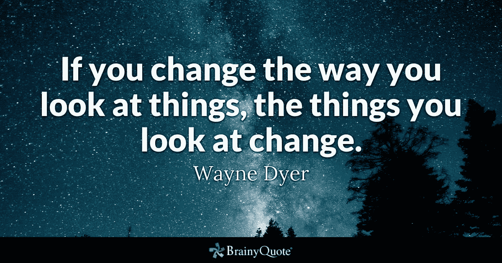

# 改变我们的视角可以极大地影响我们与人交往的方式

> 原文：<https://medium.datadriveninvestor.com/see-world-through-their-eyes-not-yours-2877d173713b?source=collection_archive---------2----------------------->

## 关系的质量和我们看待世界的方式至关重要

把人当人看起来很简单，但是这样一个基本的概念在工作场所却是一个启示。

哲学家[韦恩·戴尔](https://en.wikipedia.org/wiki/Wayne_Dyer)提出，“如果你改变看待事物的方式，你看待的事物也会改变。”

[金伯利·怀特](https://twitter.com/kim_berly_white)亲身发现了这一点。在她的书《 [*《转变:视人如人如何改变一切》*](http://www.amazon.com/Shift-Seeing-People-Changes-Everything/dp/1523094885) 》中，她讲述了一个关于改变我们对周围人的看法如何对员工参与度、关系质量以及我们如何看待世界产生巨大影响的故事。

 [## 授权员工为您的品牌助力

### 利用关系的回报获得员工的支持

medium.datadriveninvestor.com](/empowered-employees-power-your-brand-8d01aa0feeb) 

正如她向福布斯分析师、品牌战略家和首席执行官 Meghan M. Biro 解释的那样，White 在观点和心态上出现了意想不到的变化。

《转变》的核心主题是把人看成人。Biro 和 White 讨论了他们如何将同事和客户视为物品以外的东西。

“每个人都有不同的愿望和需求，”比罗说。“这些因素优先考虑。除非你通过他们的眼睛，而不是你的眼睛来看世界，否则你无法与他们一起工作或为他们服务。

“我努力让尽可能多的互动个性化，”她说。“我非常喜欢通过电话、电子邮件和年度务虚会在我们的远程团队之间建立关系。”

# 问和听

互动始于专注的倾听。

“关注人很重要，”比罗说。“向他们询问关于他们自己的问题，并在个人层面上了解员工和客户，而不仅仅是他们的角色。

“在人们生活和事业中遇到他们，”她说。

 [## 推动员工渴望的人际关系

### 工作的未来就是合作和欣赏

medium.datadriveninvestor.com](/drive-the-relationships-workers-crave-56083c8f5af) 

怀特指出，下意识的反应不是处理人际关系的好方法。

“我总是试图记住，令人恼火和困难的行为只是人们对他们的‘钩子’——对困扰他们的困难和挑战——的反应，”她说。

“没有人只是在那里打扰你，”怀特说。“每个人都有理由和历史。”

第一步，不要物化别人。

“对我来说，很容易陷入视人如物的境地——就像他们只为我而存在，”怀特说。“我必须努力提醒自己，他们做的令人沮丧的事情来自他们自己的现实。

“问问题，了解他们，”她说。“‘那个会计部的女孩发了封唐突的电子邮件’和‘艾米，她患有严重的焦虑症，但仍设法通过零售工作完成了大学学业’之间有着天壤之别。”一个是对象；另一个是人。"

# 知识的力量

负责人需要克服这种心态。

怀特说:“了解员工的领导者拥有巨大的优势。“他们知道自己的优势是什么，也知道如何利用这些优势。

她说:“领导者需要花时间去个别地、有意义地了解他们的员工。”“这是有回报的。”

自我反省提供了洞察力。

“我们都需要照照镜子，问问自己，当我周围的人不做我喜欢的事情时，我会不会把他们当成物品，变得烦躁不安？”怀特说。"或者我是否了解并欣赏他们独特的背景、动机、麻烦和故事？"

 [## 我是不同的。“不要为此烦恼，”

### 多元化和包容性有助于企业与社区联系

medium.datadriveninvestor.com](/i-am-different-let-this-not-upset-you-a685358cb1c9) 

承认并尊重他人的信仰和感受——尤其是当他们与你的信仰和感受不同时。在需要理解而不是专业知识的关系中，与他人合作，而不是强加你的“正确”观点。

“这也是将人视为人的关键之一，”怀特说。“这是理解，他们不一样，他们的观点来自完整的生活经验。我们可以向和我们想法不同的人学习。

“我必须归功于阿尔宾格研究所(Arbinger Institute)，它促进了思维方式的改变，”她说，并引用了该组织的关键信息:

*   当我只想到我自己的时候，我在我能理解甚至想象的方面是如此有限。
*   当我想到其他人——他们面临的压力，他们承担的责任——我的视野更广阔。

“别笑，”怀特说。“当我生某人的气时，我喜欢编一个故事，故事中那个人正在克服巨大的困难，他们的行为——粘人、迟到、粗鲁——是可以理解和原谅的。据我所知，这个故事是真的。

“如果我没有表明我愿意花时间去理解他们的观点，没人会费心去理解我的观点，”她说。

# 错误的批评

诸如此类的洞见可以在冲突开始前阻止冲突。

“如此多的工作冲突是基于误解——而不是任何人做错了什么，”怀特说。“在你花时间去了解一个人之前，千万不要批评他。无论我要批评什么，他们总是有充分的理由。”

 [## 不管有没有科技，在工作中保持真实

### 关注人际关系，在工作中做真实的自己

medium.datadriveninvestor.com](/tech-or-no-tech-keep-it-real-at-work-b931259390e) 

比罗说，开阔的视野也能保持积极的观点。

她说:“重要的是要正确看待工作，并超越工作，放眼更广阔的前景。”。“归根结底，你不仅仅是你的作品。”

以下是 Biro 的其他建议:

*   在一周的特定时间里，只为涉及“工作”的谈话留出时间。
*   花点时间享受这个过程和转变，而不是想太多。
*   放下那些不符合你真正目的的关系，那些不是给予和索取的关系。

Biro 和 White 一致认为，通过了解彼此的工作以及每个人对工作的贡献，人们可以更好地合作。

“沟通——必要时过度沟通,”比罗说。“任何时候，当你不确定或者你在哪里面临矛盾的需求时，澄清。

“无论工作变得多么具有挑战性，或者变得多么苛刻，都要学会放松，”她说。

# 上层影响

通常情况下，一个组织的精神和灵魂是自上而下的。

“责任始于领导者，”怀特说。"将人视为人的领导者会从他人那里获得快乐、承诺和参与."

她向社会心理学家乔纳森·海特寻求建议。

“他已经表明，当一个人感到情绪高涨时——比如从[目睹某人做了一些利他的事情](https://www.tandfonline.com/doi/abs/10.1080/17439760802650519)——他们往往会通过展示自己积极的行为来回应，”怀特说。

“这表明，当一个人表现出荣誉和同情时，会激励其他人做出类似的行为，”她说。"一个谦逊和富有同情心的人可以启动一个改善每个人工作生活的瀑布."

 [## 情商给你力量去为你周围的人服务

### 房间里聪明的人在匆忙行动前会思考

medium.datadriveninvestor.com](/emotional-intelligence-gives-you-strength-to-serve-people-around-you-80f45659e810) 

怀特提倡设身处地为他人着想。

“我们需要理解他们的观点，”她说。“他们几乎总是认为他们所做的是正确的。我问自己，“我怎么会成为别人的问题？”在我关注别人对我来说是个问题之前。

怀特说:“我们每个人——通过让*成为富有同情心和善解人意的人——都可以启动这些步骤。”。*

**关于作者**

吉姆·卡扎曼是拉戈金融服务公司的经理，曾在空军和联邦政府的公共事务部门工作。你可以在[推特](https://twitter.com/JKatzaman)、[脸书](https://www.facebook.com/jim.katzaman)和[领英](https://www.linkedin.com/in/jim-katzaman-33641b21/)上和他联系。