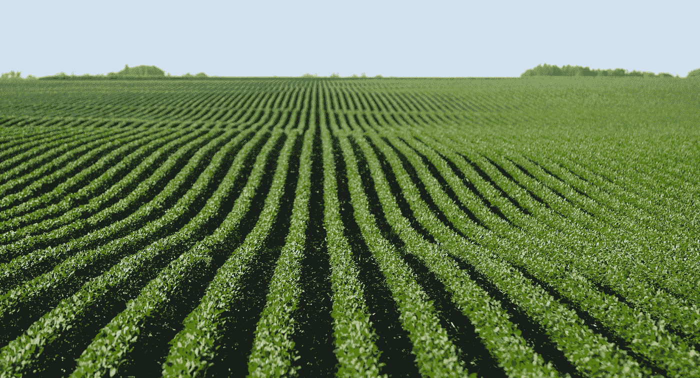

# 种子巨头:种子行业的赚钱机器

> 原文：<https://medium.datadriveninvestor.com/seed-giants-the-moneysuckers-of-the-seeds-industry-8b5fc40f2207?source=collection_archive---------1----------------------->

[Acres upon acres of soybeans in Indiana, the soybean center of the nation.](http://Dicamba-impact-straight-from-farmers-be5eaf32.jp)

孟山都公司为大多数人敲响了警钟，比如 Roundup 的制造商，这种除草剂在家得宝、西尔斯和沃尔玛等大型零售企业中随处可见。这种除草剂已经由批发商广泛分发，并且通常用于旨在短时间内种植大量作物的农场。Roundup 有助于杀死作物周围可能生长的许多杂草，但使所需的作物存活，这使它成为一种有效的除草剂，有助于全美大豆的高产。该公司近年来变得非常强大，据《卫报》报道，它现在控制了美国大约 93%的大豆市场。控制市场不仅意味着它是农民最突出的品牌，而且该公司还能够设定高价格和严格的规定，这些规定对小规模农民的抗议是不可渗透的，无论它们看起来多么不公平。

孟山都公司出售抗农达转基因大豆种子，这种种子可以抵抗 60 磅的除草剂农达。每包 50 美元的包。虽然这看起来不是一大笔钱，但一袋种子只够一个农民种一英亩大豆。根据美国农业部的数据，去年种植了 8900 万英亩大豆。将这些数字加起来，美国农民在大豆种子上花费了惊人的**44.5 亿美元**，为这家已经拥有数百万美元资产的公司增加了巨额利润。

 [## 忘记石油吧，水是未来。-数据驱动型投资者

### 我们不会耗尽燃料的替代品。能源行业曾经是投资者的荣耀，无论…

www.datadriveninvestor.com](https://www.datadriveninvestor.com/2018/11/14/forget-about-oil-water-is-the-future/) 

传统农业包括为下一个种植季节保存种子后代，这意味着一袋大豆基本上可以持续多个种植季节。然而，目前的专利阻止农民保存和再利用专利种子，如孟山都公司生产的高产转基因种子。这种法规迫使农民每年花费数千美元重新购买种子，甚至没有考虑购买化肥和收割工具的财务影响。购买新种子的这种无休止的循环给农民和他们的企业造成了巨大的经济压力，尽管这种情况可以通过调整专利权来轻松避免。

法律将美国专利定义为“任何有用的艺术、制造、引擎、机器或设备，或之前未知或未使用的任何改进。”它授予申请人“制造、建造、使用和出售给他人使用的唯一和专有的权利和自由”。但它的极限在哪里？真正的问题是，像孟山都这样的种子巨头是否滥用了专利权？

食品安全中心表示，他们已经跟踪了孟山都公司对农民提起的大量诉讼，并发现了超过 27 个州的 410 名农民和 56 家小企业的大约 142 起专利侵权诉讼。更令人震惊的是，它没有输过一场官司。一个也没有。但这应该令人震惊吗？当然，像孟山都这样的大公司会粉碎小规模农民对他们的任何请求。它有数百名律师，能够为每个案件找到出路，对那些只是想种植大豆的农民毫不留情。总的来说，该公司从其目标中赢得了超过 2300 万美元，从贫困农民那里拿走了不必要的利润，并将其添加到他们的大型银行账户中。

据发现，世界种子市场的 53%被三家公司控制——孟山都、杜邦和先正达([《卫报》](https://www.theguardian.com/environment/2013/feb/12/monsanto-sues-farmers-seed-patents))。**这三家种子巨头实质上已经垄断了种子行业，慢慢榨干了消费者的每一盎司财富，尽管他们认为自己的行为可能是不公正的。**这对食品行业有着不可否认的影响，它影响着消费者，比如我们，不管我们愿不愿意相信。大豆和玉米等主食构成了一个人的饮食，因此每一次购买这些物品都会满足对这些作物及其专利种子的需求，从而增加种子巨头的权力。当消费者购买食品杂货时，他们没有意识到他们对工业和商业的影响，但事实上，他们正在为更多关于种子专利对国家经济和消费者满意度有多重要的主张提供燃料。

孟山都声称，它需要专利来保护其商业利益，并为花费数百万美元研发更耐寒、抗病的种子提供动力，这些种子可以提高粮食产量。尽管他们被授予对其种子持有专利的权利，但起诉农民仅仅为了榨取更高的利润而重复使用其亲本作物的种子，不仅损害了农民，也损害了种子行业目前可用的种子的流通。

最高法院标志性的案件[鲍曼诉孟山都](https://www.supremecourt.gov/opinions/12pdf/11-796_c07d.pdf)提出了生物专利的权利是否延伸到它们的后代的问题。印第安纳州的农民 Bowman 将通常用作动物饲料的谷物种了下去，他知道其中大部分是孟山都公司的抗农达豆，因为这是印第安纳州农民种植的主要作物。当鲍曼不理会该公司的警告时，该公司提起诉讼，赢得了近 85，000 美元的判决。

尽管孟山都公司再次赢得了另一场官司，但最高法院的这一裁决引起了公众的注意，并提出了这样一个问题:鲍曼使用转基因种子是否合法，或者他是否非法地复制了这项发明。

孟山都公司极力保护其转基因大豆种子，因为它们的活性成分草甘膦在对抗任何阻止大豆生长的因素方面非常有效。拥有专利可以防止它的竞争对手抄袭它的想法，这样农民在市场上将只有一种有效的大豆除草剂产品。这样，如果农民希望他们的大豆高效生长，他们别无选择，只能购买孟山都的产品。通过保护他们的专利，孟山都甚至敢于花费数百万美元的法律费用，与“错误”使用种子的小农场和企业发生纠纷。

购买抗草甘磷种子的农民签署一份协议，声明这些种子只能用于一次种植。尽管这种基因存在于他们种植的新豆中，但农民不能将它们保存起来用于第二次种植，也不能出于这一目的将它们卖给其他人。除了直接起诉农民和一次又一次地将自己卷入法律诉讼之外，孟山都还有很多方法可以保护它的种子。如果孟山都真的试图通过申请专利来改善他们的产品，那么他们肯定会要求谷物升降机对这些种子施加限制，或者找到一种方法来利用他们的利润制造转基因种子，这种种子只会显示一代人的基因。这样，无论谁试图重复使用它们，种子都不再能有效抵抗疾病和病原体，这个复杂的问题也不会发生。

孟山都公司还有很多其他的方法来控制转基因种子的使用。考虑到他们是一个如此大的公司，他们没有必要起诉农民，尤其是那些已经手头拮据的农民。威逼小农场屈服于他们的严格监管是孟山都这样的大公司不能跨越的界限，因为这对农场和消费者都太有害了。相反，孟山都应该想办法从一开始就防止这个问题的发生，例如将转基因种子限制在一轮种植中，这是孟山都肯定可以做到的，因为它是一个如此强大的种子巨头。