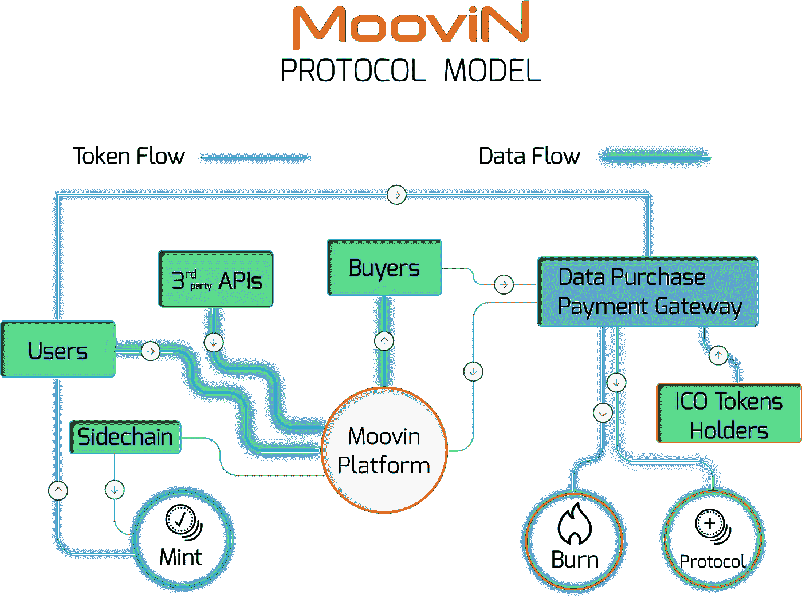

# 超越智慧城市。

> 原文：<https://medium.datadriveninvestor.com/seeing-beyond-smart-cities-9ea1e217863a?source=collection_archive---------28----------------------->

通过设定智能城市的目标，我们不是在回避更大的图景吗？很久以前，我们从智能手机开始，然后转向智能家居，现在我们开始关注联网汽车。互联城市是这一大方向的下一步，但我们需要牢记最终目标。拥有一个相连的星球。

这个星球已经有了一个相当坚实可靠的网络，作为许多智能服务的框架集。很明显，智慧城市是这一大方向的下一个迭代，然而，鉴于目前的技术部署和当前市场的共识，我们可以清楚地看到缺乏可用的平台和协议。考虑到这一点，现在正是构建一个坚实的平台和标准协议，让当前和未来的技术蓬勃发展的大好时机。通过构建这一平台，我们为服务和解决方案的开发创造了一片沃土，并让这一领域的所有参与者都可以使用。它还作为一个公平的竞争环境，支持来自第三方以及个人的努力。

# 人数的力量

在目前的情况下，我们看到许多解决方案在他们自己的封闭平台上运行，并提供了有限的实际情况范围。在全球许多地方，有许多城市密集在一起，彼此之间有共生关系的例子。在大多数情况下，目前的方法对这种非常复杂的关系提供了很少的洞察力。很容易理解，大多数可用的解决方案都不符合要求。此外，大多数平台都是封闭的系统，很少有开放的协作数据共享渠道。就像汽车制造业在处理他们产生的数据时只迎合自己一样，认为一个人可以提出跨越开放和可访问平台的解决方案是徒劳的。以竞争优势的名义使用如此狭窄的范围，这些数据库的所有者(原始设备制造商、智能城市等)只能获得他们收集的数据集的片面故事，因为没有客观的比较或分析。这限制了由此产生的解决方案的深度。然而，当有机会让一个数据库挑战来自类似行业的另一个类似数据库时，我们开始真正了解可以实现什么。

在了解了当前可用协议的限制后，我们清楚地看到了对私有、透明、公平和民主化协议的需求，该协议为所有参与方提供了一个安全的避风港，并为他们当前的产品带来了附加值。

# 一个协议适用于所有人

这就是我们在 [Moovin](https://moovin.io/) 带来的东西。通过提供一个基于区块链的数据库和认证的数据输入，我们允许不断增长的交通领域的各方参与到一个积极的和动态的协议中。一个没有边界、对所有人开放的协议，为我们的世界如何使用交通工具提供了前所未有的范围。通过允许其他人与这个包含所有移动事物的全球数据库合作，我们可以看到更大的画面，并以我们以前甚至无法想象的方式了解我们的世界。想象一下，一个平台可以让你在世界上任何一个城市拍摄快照，包括从自行车到公共交通到汽车等等。所有这些都使用第一人称数据汇总成观察数据。这将对我们的城市如何运转提供前所未有的行为理解，并将深入探讨我们如何应对交通时代的到来。

# 我们如何实现这一点？

从数据链中最重要的一环——最终用户(生成者)开始，我们的目标是让公众在数据收集中发挥重要作用。通过提供对隐私设置和数据传输的完全控制，我们提供贡献补偿(Moov 令牌),这将激励用户提供高质量和相关的数据。然后，我们有一个数据购买者可以通过接受相同 Moov 令牌的自动化数据购买网关访问数据集或人工智能生成的服务。该协议为所有各方提供了公平和透明的机会。它为数据购买者创造了肥沃的土壤，为他们自己的客户群生成解决方案。它为第三方为不断增长的市场带来新的解决方案打开了大门。它允许当前的原始设备制造商为一个统一的数据库做出贡献，该数据库将以更好的洞察力生成他们自己的数据的新视图。

# 大局

记住所有这些，就很容易明白退一步看更大的图景是如何产生意义的。在拓宽我们视野的同时，我们可以让世界成为一个更好的驾驶、骑行或通勤的地方，同时对环境和我们的公民负责。