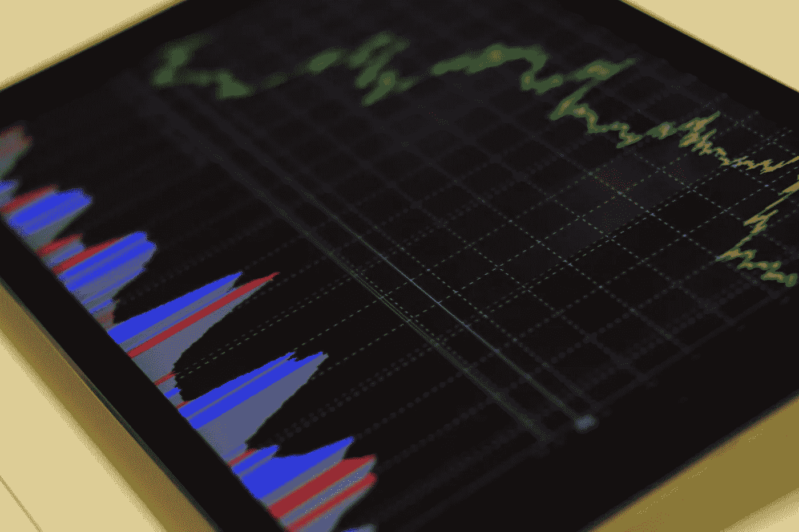

# 在系统投资中寻求永恒

> 原文：<https://medium.datadriveninvestor.com/seeking-the-eternal-in-systematic-investment-dd312f0c3209?source=collection_archive---------46----------------------->

金融市场交易系统的编码过程很吸引人，但它们似乎从来不会持续很长时间，它们的表现也从来不会非常一致。

Quantopian 是一个有趣的装备。多年来，他们一直致力于为美国股市建立一个令人印象深刻的在线回溯测试平台。他们有复杂的软件供所有人使用，并提供价格数据和基本面信息(如美国公司的债务水平和收益)。

他们有一系列令人印象深刻的讲座和教程，涵盖了你接受挑战可能需要的一切。

他们得到了美国对冲基金经理史蒂夫科恩(Steve Cohen)的支持，据说他是非常受欢迎和有趣的电视剧《亿万》(Billions)中鲍比阿克塞尔罗德(Bobby Axelrod)的模特。

根据维基百科:

> **(生于 1956 年 6 月 11 日)是美国投资人，* [*对冲基金经理*](https://en.wikipedia.org/wiki/Hedge_fund) *，慈善家。他是* [*Point72 资产管理*](https://en.wikipedia.org/wiki/Point72_Asset_Management) *和*[*s . a . c . Capital Advisors*](https://en.wikipedia.org/wiki/S.A.C._Capital_Advisors)*两家总部均设在康涅狄格州***。截至 2018 年 3 月，他的* [*净资产估计为 140 亿美元。*](https://en.wikipedia.org/wiki/Net_worth)**

**那么“挑战”是什么呢？**

**Quantopian 寻求将系统设计外包给其 20 万用户，并为少数成功设计出令人满意的算法的人提供奖励和分配。**

**然而，金融市场算法的难点在于:**

> **[*越是样本外，预期收益的可变性越大。*](https://www.quantopian.com/posts/algo-share)**

**系统金融市场交易是多么的矛盾和典型。一群聪明人不遗余力地开发 Alphalens、Zipline 和 Pyfolio。**

**声明的目标是产生市场中性的算法，在上涨和下跌市场中运行良好(平稳)。**

**为此，建议使用各种进/出样本程序，以确保情况继续如此。建议将基本面因素作为预测指标。还有比这更明智的计划吗？从长期来看，盈利增长和强劲的资产负债表才是最重要的。没有这些，一只股票最终会枯萎死亡。有了这些因素，股票就会繁荣。**

**但仍有人认为，“样本越不符合要求，预期回报的可变性就越大。”**

**金融市场中没有常数吗？我们什么都不能指望？我们注定要设计失败的复杂系统吗？似乎是这样。一个系统在阳光下会有它的时间，然后必须被扔进垃圾箱。这完全不是所设想的。市场中立的整个理念是它应该生存和繁荣。相同金额的多头和空头头寸。对任何一个部门或交易风格的风险敞口相等或至少有限。一个精心策划的股票世界(至少每天都在变化)。**

**我们在乎吗？我们应该关心吗？**

**我们人类是短期动物，可能不是。只要我们的算法能持续足够长的时间来填满我们的费用口袋，我们就应该非常高兴。**

**如果我们愿意在交易和投资的背景下思考永生，我们可能会被迫采取一种不同的、不那么花哨的方法。谁敢说晨星的行业定义在今天仍然有效，更不用说明天了？还记得 2000 年代初，稳重的电话公用事业公司是如何突然变成负债累累的怪物的吗？以及动量、价值或其他风格的编码定义。他们撑得住吗？它们是通用的吗？**

**我是个愤世嫉俗的人吗？一个耶利米？如果是这样的话，我有理由这样做吗？或者我只是不善于找到系统永生的金钥匙？**

***原载于 2018 年 11 月 14 日*[*【http://zenothestoic.com】*](https://zenothestoic.com/2018/11/14/seeking-the-eternal-in-systematic-investment/)*。***