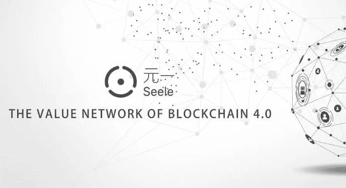
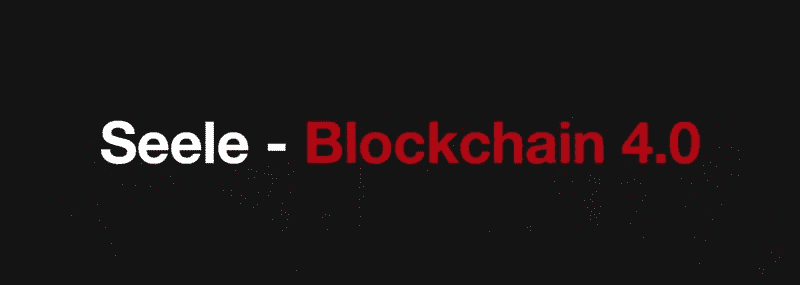

# SEELE —区块链 4.0 已经到来

> 原文：<https://medium.datadriveninvestor.com/seele-blockchain-4-0-has-arrived-433a9b83d9f7?source=collection_archive---------1----------------------->

区块链，几年或者几个月前，还是比较新的。然而，它的存在已经渗透到世界各地，到达了像坦桑尼亚这样的国家，这表明它已经深入到了什么程度，这是一件好事。越多的人知道区块链，技术就越好，因为它允许更多的人投资于它，开发者可以开发更多的产品，以满足随着某种产品或服务的流行而不断增长的需求。在比特币开始在股票市场获得势头后，区块链首次受到关注。从价值几百美元到超过 20000 美元的历史新高，比特币引领了区块链的轰动。人们开始看到它在现实世界中的使用案例，以及它在通过经济各部门的低运营成本来盈利方面的潜力。

# 区块链进展

B itcoin 被区块链领域的许多人戏称为区块链 1.0。它是第一个广泛使用区块链技术的公司，并将其引入世界。比特币的协议现在似乎有点过时了。它推出时可能走在了时代的前面，但比特币的广泛使用导致在该平台上进行的交易延迟长达两周。交易可能会被记录，但比特币的移动可能会被搁置，等待其他交易完成。比特币的协议平均速度约为 7TPS(每秒传输)，考虑到它处理的流量，这个速度相当低。

以太坊协议带来了✅Blockchain 2.0，该协议具有额外的功能，如编写智能合同的能力。这使得区块链扩展到几乎所有的经济领域。智能合同是动态和灵活的，因此在大多数基于区块链的应用程序中很容易应用。大多数区块链应用程序，甚至到目前为止，仍然基于以太坊区块链，因为它能够编写智能合同。它还提高了 TPS 的速率，从比特币的 7TPS 提高到大约 15TPS，这是更好的，但仍然阻碍了大多数应用程序的可扩展性。

区块链 3.0 时代现在可以用 mainnets 来看，例如 EOS 最近推出的一个 main nets 是区块链空间的最新趋势。区块链 3.0 具有以下优势，

➤Improved 和高级治理

➤Ability 将开展大规模业务

➤Better 共识方法

➤High 协议的执行情况

通过改进的 TPS 实现➤Better 可扩展性

这些都是纸上谈兵，EOS mainnet 和其他将显示真正的产品的真正能力。

# [Seele](http://seele.pro/) (区块链 4.0)

区块链之前的几代人更关心个人表现。如果我们能从这个世界学到什么，那就是团队的力量。想一想社交媒体及其在全世界引起的变化。通过团结人们，社交媒体促成了重大成就，例如 2011 年发生在埃及的变革。 [*Seele*](http://seele.pro/) 正在通过创建一个支持跨链通信的平台来促进区块链空间的统一，以便来自不同区块链协议的用户可以跨不同架构访问服务。 [*Seele*](http://seele.pro/) 旨在通过这种联系将和谐带入区块链，世界将从中受益匪浅。

✅Seele's 协议的设计不同于过去的区块链时代。就其旨在提供的服务而言，在构建其平台时，它必须遵循一些关键方向。就平台设计而言，异构森林网络是正确的方向。它允许区块链复杂结构中的单个链独立工作，同时仍然保持连接。Seele 也不得不采取不同的方向与共识的方法，它是使用。它从经过试验和测试的工作证明、利害关系证明和其他机制出发，提出了一种新颖的共识机制，称为神经共识算法。当节点较大时，神经一致性机制运行良好，它具有线性可伸缩性，这使得这成为可能。它还必须使计算共享成为可能，允许链上和链下计算，其中高达 50%的计算可以得到链下支持。所有这些改进都是为了让 Seele 成为区块链 4.0，这将使它的用例变得比以前的时代更好、更高效。

根据 Seele 的说法，✅The 对以前的区块链进行了改进，创建了区块链 4.0，将允许高达 100 万每秒的速度。对于区块链公众来说，这似乎是不可能的。然而，一次又一次，不可能的事情被否决了。为了防止交易延迟或积压，Seele 需要这样的速度来支持每天在其平台上执行的交易数量。

# 区块链 4.0 用例

Seele 协议带来的✅The 改进开创了高效用例的新时代，支持全球的一些主要目标，如全民医疗保健。尽管各国都在努力实现相同的壮举，但仍有不同的区块链公司试图实现医疗保健的普及。Seele 将实现的普遍性是跨边界和协议的服务接收。医疗服务提供商可能使用不同的区块链协议。然而，使用 Seele，用户可以从 Seele 中的任何平台访问医疗保健服务，只要他们在 Seele 协议支持的一个医疗保健平台上注册。这将增加跨境医疗服务的便利性。数据可以在不同的区块链应用程序之间共享，从而确保为正确的人提供正确的治疗。Seele 的 TPS 速率至关重要，尤其是在紧急情况下，需要快速获取患者数据时。

✅Equity 市场和密码交易所可能也会发现 Seele 对他们一天的交易量非常有用。股票市场和密码交易所每天进行大量的交易。这个过程通常非常复杂，如果没有交易机器人，人类甚至不可能完成一天交易量的四分之一。Seele 的 TPS 是 100 万。如果交易能够像纸面上看起来那样无缝，这甚至可能鼓励传统市场转移到区块链平台。

1M TPS 将提供的可扩展性正值物联网流行之际。世界正在展望一个大部分事物都将相互连接的未来。区块链将会保护这些连接。这些设备中的大多数将基于不同的协议，因此 Seele 将提供公司可能需要的跨链通信，以便提供协调的服务。

# 未来协调

通过提供这样一个协调平台，*Seele 也为不同的区块链合作铺平了道路。此时可用的不同协议可能决定具有相似的架构，以便支持彼此的功能。最终目标是提供良好的服务，当提供良好的服务时，利润就会显现出来。Seele 的区块链协议实现了更高的效率，提高了用户对平台服务的满意度。*

*银行等✅With 传统机构正在研究区块链的可行性，Seele 可能会提供他们想听到的解决方案。还是在传输速度上，银行将从 Seele 区块链协议中受益匪浅。这也有助于降低银行费用，尤其是在国家之间进行银行间转账时。税收和其他费用通常会增加国家之间的资金转移成本，但如果银行看到 Seele 协议的可能性，Seele 可以降低这一成本。此外，银行可以通过 Seele 进入加密货币领域，从而从菲亚特银行获得替代收入来源。*

*✅Developers 也将在区块链 4.0 上大展身手。他们可以开发出新的令人兴奋的跨平台的区块链应用程序。他们可以开发通用的、可以在 Seele 平台上托管的产品，而不是将他们的创新建立在一个协议的基础上。随着开发人员致力于不同的创新，它可能会导致对区块链 4.0 真正潜力的新发现。解决可伸缩性问题可能只是个开始，区块链 4.0 还会带来更多。*

# *结论*

*我们还没有看到区块链的最终形态。它不断改变面貌，核心功能保持相似。随着越来越多的设备联网，以及对更好、更高效系统的需求增加，这些调整和改进非常重要。自区块链 1.0 以来所做的改进导致了 [*Seele*](http://seele.pro/) 平台。没有智能合约和总账系统，[*Seele*](http://seele.pro/) 提案就不会存在。[*Seele*](http://seele.pro/)mainnet 将于 2018 年最后一个季度发布，当它最终发布时，它将有很大的发展空间。互联网真的改变了世界，现在区块链正在彻底改变互联网和世界。 [*Seele*](http://seele.pro/) 可能会面临诸如 Cosmos 之类的主网，但其主网的服务交付和使用案例将决定区块链协议领域的市场领导者。区块链的未来一片光明！*

*如果你觉得这篇文章有用，并且想看我的其他作品，请一定鼓掌并关注我的 [*媒体*！](https://medium.com/@salmanmiah) *😎**

**