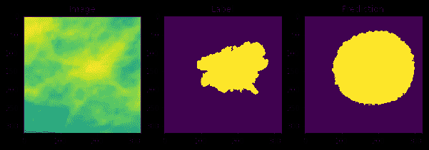
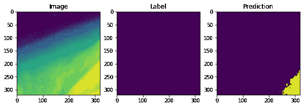
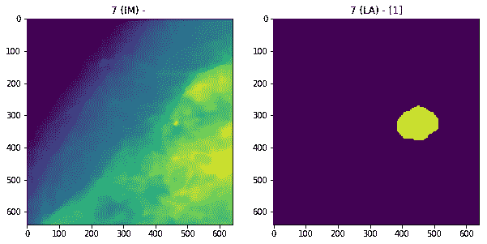

# CBIS-DDSM 图像的密集预测

> 原文：<https://medium.datadriveninvestor.com/segmenation-of-cbis-ddsm-images-f383d3e583ea?source=collection_archive---------0----------------------->

我最初在 DDSM 和 CBIS-DDSM 数据集上的工作在测试和验证数据上产生了良好的准确性和召回率，但当应用于来自完全不同的数据集的 MIAS 图像时，该模型的性能并不那么好。对图像的进一步分析表明，负面图像(来自 DDSM)和正面图像(来自 CBIS-DDSM)在一些微妙但重要的方面有所不同:

1.  负像的对比度较低。
2.  负像具有较低的平均值、较低的最大值和较高的最小像素值。

我们开始关注第一点，因为我们发现增加任何图像的对比度都更有可能被预测为阳性，而不管它的实际标签是什么。并在进一步调查时发现了第二点。当应用我们在组合数据上训练的完全卷积模型来完成扫描，而不是我们训练的 299x299 图像时，我们注意到阳性图像的大多数部分被预测为阳性，即使 ROI 实际上只存在于一个部分中。这表明该模型在其预测中使用了图像的某些特征，而不是 ROI。

当开始这个项目时，我们最初计划分割 CBIS-DDSM 图像，并使用不包含 ROI 的图像作为阴性图像，但是我们不确定阳性和阴性扫描的组织中是否存在差异，这可能使该方法不能推广到完全阴性扫描。当我们意识到扫描已经被不同地预处理时，我们试图以这样的方式调整负像，以使它们更类似于正像，但是在不知道它们是如何被处理的情况下无法这样做。

我们对这两个问题的解决方案是训练模型对扫描进行分割，而不是简单的分类，使用掩码作为标签。这种方法有几个优点:

1.  使用掩模作为标签告诉模型它需要看哪里，因此我们可以确保它实际上使用 ROI 而不是图像的其他特征，例如对比度或最大像素值。
2.  这允许我们排除 DDSM 图像，只使用来自一个数据集的图像，因为大多数扫描的 ROI 只包含图像的一小部分。

我们通过删除最后一个“完全连接”层(实现为 1x1 卷积)和 logits 层，并使用转置卷积对结果进行上采样，重新创建了模型来进行语义分割。为了让上采样正常工作，我们需要让图像的大小是 2 的倍数，这样降维就可以正常进行，所以我们使用大小为 320x320 的图像。

Fig 1–320x320 image with label and prediction

我们能够在这些数据上获得相当好的结果，像素级准确率约为 90%，像素召回率为 70%。使用任何阳性像素的存在作为整个图像类别的预测器，我们分别获得了 70%和 87%的准确率和召回率。然而，我们注意到了某些不正确预测的模式。

Fig 2 — Image with incorrect prediction

包含比图像的其余部分亮得多的片的图像倾向于将亮的片预测为阳性，而不管实际的标签。如图 2 所示，当亮斑位于图像边缘时，这种模式最容易被观察到。

我们知道 ROI 的上下文对于检测和诊断它是重要的，并且我们怀疑在没有上下文的情况下，模型预测任何比其周围环境亮得多的补片是阳性的。虽然对于癌症检测来说，假阳性比假阴性好，但我们认为，当将模型应用于比它所训练的图像更大的图像时，这种模式可能会出现问题。为了解决这个问题，我们决定创建一个更大的图像数据集，并继续在这些图像上训练我们的模型。

Fig 3— 640x640 image with its label

我们创建了一个 640x640 图像的数据集，并调整了现有的模型，将这些图像作为输入。一个示例图像和标签如图 3 所示。由于模型是完全卷积的，我们可以重用在 320x320 图像上训练的模型的权重，而没有任何问题。由于在如此大的图像上训练模型是一个非常慢的过程，在较小的图像上预先训练权重允许我们大大加快训练过程。

目前正在对 640x640 图像进行训练。如果结果是有希望的，那么我们可以增加训练图像的大小，并继续反复微调模型，直到我们有一个在全尺寸扫描上表现良好的模型。