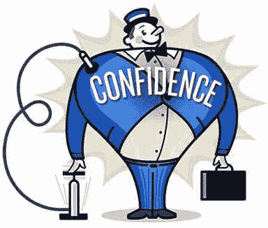
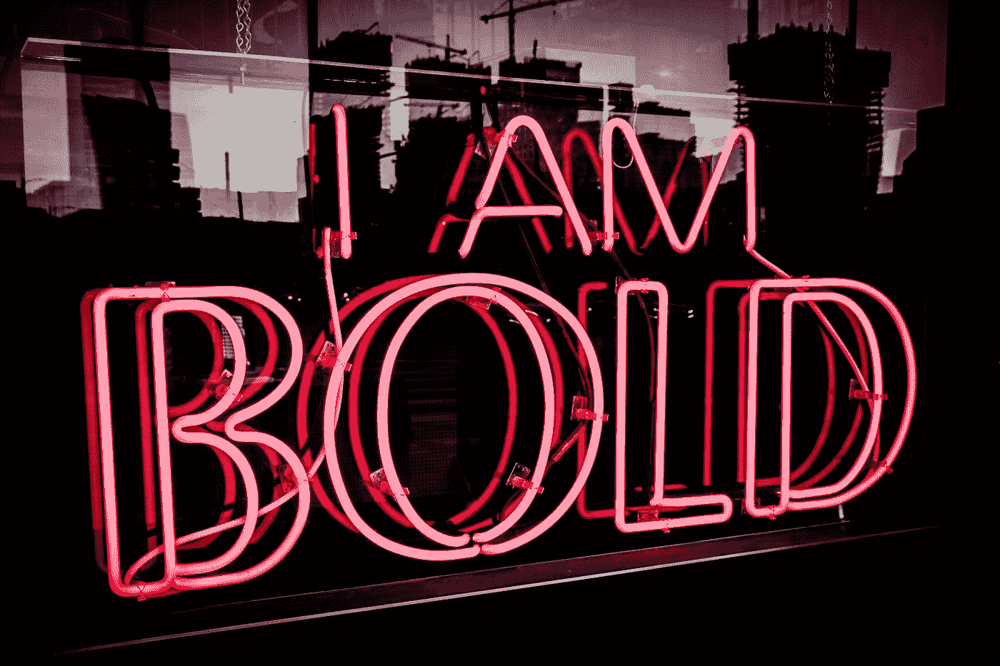

# 自信

> 原文：<https://medium.datadriveninvestor.com/self-confidence-d77d080ff6b8?source=collection_archive---------35----------------------->

你相信你能吗？还是你认为你不能？不管怎样，你都是对的。怀疑主义把我们从我们想去的地方带到了我们不想去的地方。它是进步的敌人。恐惧在怀疑主义的发展和我们缺乏自信中扮演着重要的角色。为了培养自信，我们必须消除恐惧。人类普遍存在六种恐惧。害怕贫穷，害怕衰老，害怕生病，害怕批评，害怕失去爱和害怕死亡。这些恐惧阻碍了我们。试着找出哪些阻碍了你。然后采取行动消除它们。如果我们不这样做，缺乏行动就会削弱我们的决心、意志和决策能力。这将导致我们失去雄心和自信。

为了防止这一点，我们必须发起一场斗争，虽然我知道这似乎是一个令人讨厌的词。真的不是。奋斗让我们变得更强大。不得不为获得东西而奋斗的人是多么幸福啊。就在今天早上，我的妻子告诉我，我的一个女儿抱怨说，生活是一场斗争。她没有意识到在过去的几年里她已经长大了这么多，因为事实上事情并没有传给她。用银汤匙给孩子东西是多么有害。散发自信的人倾向于询问他们想要什么，并决定他们不想要什么。他们认为一切皆有可能。他们愿意冒险。当他们成功时，他们也不会羞于庆祝。

“I Am bold neon signage at night time” by [Steve Harvey](https://unsplash.com/@trommelkopf?utm_source=medium&utm_medium=referral) on [Unsplash](https://unsplash.com?utm_source=medium&utm_medium=referral)

除了你自己，没有什么能带给你成功。这一切都始于自信。这种品质的缺失会让你无法吸引别人。你会击退他们。自信是任何人在生活中取得进步的必要条件。相信自己，相信自己有能力做什么，这是实现人生目标的关键。

自信会被别人说的话摧毁，被我们的父母、老师、朋友摧毁。然而，我们感兴趣的是在我们的思想周围建立一个盾牌，使用咒语和肯定来增强我们的自信。永远不要理会别人或他们说的话。那些反对者，那些对你失败的努力幸灾乐祸的消极的人。通过积极习惯的持续和实际应用，如阅读好书和与成功者相处，我们可以培养自信。

注意你的声音。听听它在告诉你什么。自信与生俱来，除了你自己，没有人能让它成长。