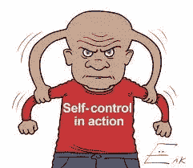

# 自我控制

> 原文：<https://medium.datadriveninvestor.com/self-control-7f21051f812c?source=collection_archive---------11----------------------->

Hold it Joe! Breathe deeply…

自我控制是成功的必要条件。但是，谁没说过一句话只有后悔。或者更糟的是，有多少人屈服于自己的愤怒，攻击别人，结果却后悔终生。有了自制力，你就能引导你的热情，有希望达到建设性的目的。自我控制可以被称为你行动的平衡，所以这些不会被摧毁，而是建立。当你的热情和自制力相等时，平衡就达到了。在位于。如果你不相信我，去任何一所监狱，你都会在他们身上看到缺乏必要的自制力来以积极的方式引导他们的能量的男人和女人。男人，女人，因为没有自制力而制造了他们自己的问题。《圣经》中充满了敦促我们保持克制的告诫。自制力。爱你的敌人，原谅伤害你的人。不抵抗。平和。伟大的领导者拥有这种品质。

如果你练习自我控制，我们就能避免伤害他人和自己。没有人能影响或控制别人，除非他先控制自己。在更基本的层面上，缺乏自制力会让我们过度放纵。这就是为什么我们有如此严重的体重和药物成瘾问题。我们没有自我控制。它几乎适用于我们做的每一项活动。做任何事情都要有分寸。否则，我们的过度放纵会毁了我们。如果你练习自我控制，仇恨、羡慕、嫉妒、恐惧、报复或类似的负面情绪将被抑制。如果你有自制力，你可能对任何人或任何事实验的任何无法控制的情绪对你来说都不是问题。

你欠自己控制感情的能力。甚至爱情也会有害。如果你向另一个人投降，把你的幸福寄托在那个人身上，你就放弃了选择的能力。

由于缺乏自制力，甚至你的消费习惯都会成为问题。看看大多数人的债务就知道了。美国的公共债务是 21.6 万亿美元。超出一个人的需要或手段的花费肯定会走进死胡同。事实上，债务可能会达到灾难性的程度。真正不幸的是，我们大部分时间都在模仿别人。或者我们想赶上邻居。一位智者曾经说过，无节制的支出和债务的积累造就了穷人的国家。

自律是自我控制的近亲，是发展个人能力的重要特征。有了它，我们就能控制我们的食欲，如果我们能控制我们的食欲，我们将是不可战胜的。