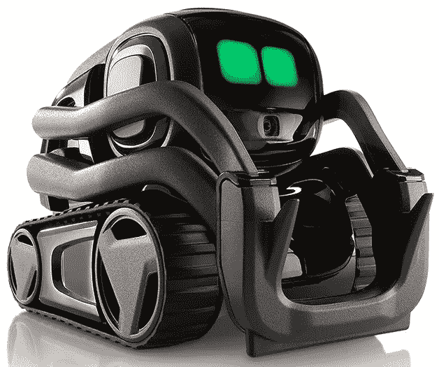
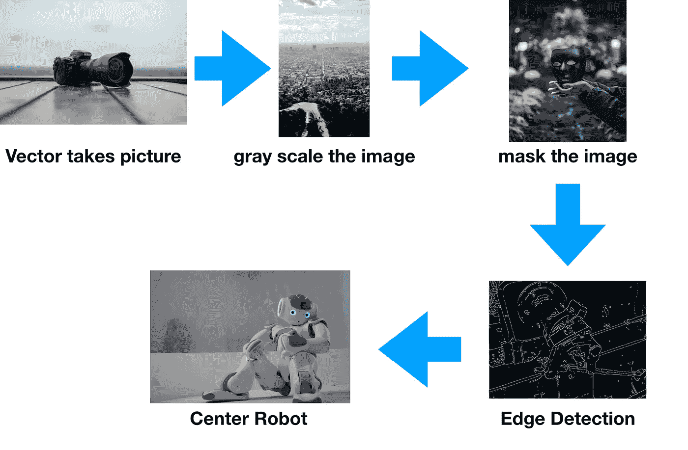
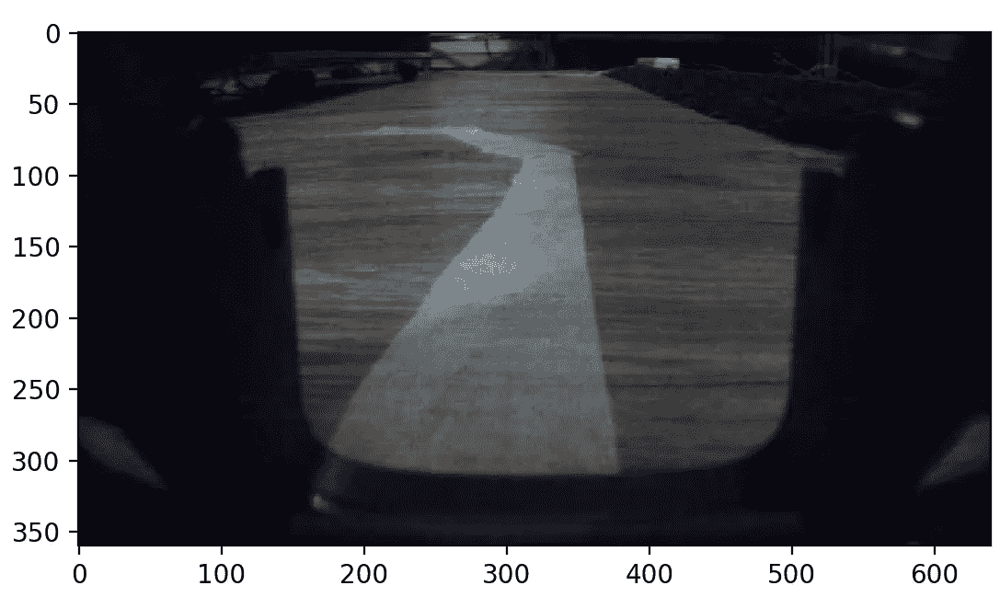
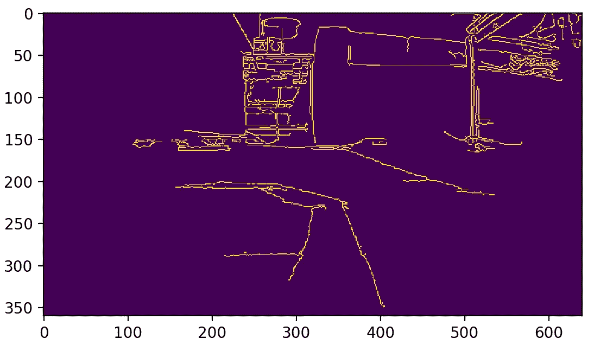
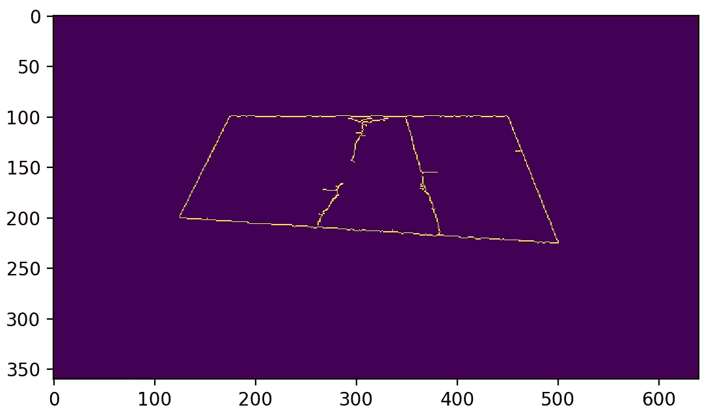

# 自驱动 Anki 矢量

> 原文：<https://medium.datadriveninvestor.com/self-driving-anki-vector-659a5592ade7?source=collection_archive---------2----------------------->

## 将 Anki Vector 变成一个循线机器人

The Coolest Consumer Robot To Date

上周，我参加了卡内基梅隆大学为期一周的硬件黑客马拉松 [Build 18:](http://www.build18.org/) 。我的目标是在不到一周的时间内将 Anki Vector 变成一个循线机器人，同时尽量不要错过太多的课程。使用 Anki Vector 的摄像头和一些常见的计算机视觉技术，我能够做到这一点。看看我是怎么做到的！

# 设置 Vector SDK

在我们可以查看我们的管道之前，我们必须仔细阅读 Anki 开发者网站上的说明，以确保 SDK 被正确安装，并且你的 Vector 得到认证。按照上面链接中的步骤来做——Anki 已经做了很好的工作，使指示易于遵循，所以我将把这一部分留给他们。

# 管道

现在我们已经设置好了 SDK，让我们大致了解一下完整的管道将会是什么样子

Our Pipeline

首先，我们用 Vector 的相机拍一张照片，转换成灰度。然后，我们屏蔽该图像，以仅获得包含我们要跟随的线的部分。接下来，我们对蒙版图像进行边缘检测，最后，我们决定是否需要左转、直行或右转。

我不会在开始时详细解释管道的所有部分，而是在进行过程中解释它们。这将有助于一个更自然的进程，并且会使问题和解决方案更加清晰。现在我们有了自己的管道，我们可以开始编码了！如果你想向前跳，看看完整的源代码，向下滚动到底部。

# 获取图像

我们将从我们需要的所有进口开始，

接下来，我们给我们的向量取一个方便的名字，设置它的头朝下看着它前面的地面，给它一个开始移动的初始方向，

请务必注意，从这里开始的所有内容都将在“with”语句中，因为这样会更容易引用 Vector SDK。现在我们可以从矢量图像中获取最新的图像，并将其转换为灰度图像，

一旦我们完成了所有这些，我们就可以显示图像，看看我们在处理什么，

它显示，

Our Unprocessed Image

# 屏蔽图像

正如你从上面的图片中看到的，有很多图片我们并不需要。例如，电梯总是会在相机的方式，所以我们可以忽略这一点。此外，图像在 *y=100* 标记周围开始变得粗糙，所以我们可以忽略图像中任何比这更远的地方，因为这可能会给出不一致的结果。我们如何忽略图像中的事物？我们[面具](https://en.wikipedia.org/wiki/Mask_(computing))。

Masking Of Pac-Man Sprites

你可以把我们这里要做的蒙版想象成只是裁剪图像。正如我们刚刚提到的，有很多我们不需要的图像，蒙版允许我们制作一个没有不必要的东西的新图像。首先，我们需要选择我们将要“裁剪”的四个角。我看了上面的图，决定左下角应该是(125，200)，左上角应该是(175，100)，右下角应该是(500，225)，右上角应该是(450，100)。把它放入我们现有的 numpy 数组中，

接下来，我们需要创建一个与原始图像大小相同的 numpy 数组，并用值 255 填充蒙版中的值，

直观地说，你可以认为这是制作图像的副本，只是它在蒙版内的像素中包含值 1，而在其他像素中包含值 0。最后，我们应用蒙版，

当我们应用遮罩时，我们将原始图像与包含 1 和 0 的新图像重叠，与 1 重叠的区域将保持不变，而与 0 重叠的区域将变黑。

这是我们原始图像的一个例子，

# 边缘检测

现在我们有我们的图像遮罩，我们可以移动到边缘检测。我们将运行精明的边缘检测，因为它给出了最一致的结果。Canny 边缘检测本身值得一贴，因为它的多步骤过程和广泛使用，所以我只会给出一个快速概述。在 Canny 边缘检测中，有 4 个主要步骤:

1.  使用高斯滤波器平滑图像
2.  计算[水平和垂直索贝尔导数](https://docs.opencv.org/2.4/doc/tutorials/imgproc/imgtrans/sobel_derivatives/sobel_derivatives.html)以找到可能边缘的列表
3.  将非边缘候选像素设置为黑色
4.  为过滤边缘列表设置阈值以获得最终边缘

如果你想更全面地了解[，你可以在这里找到](https://docs.opencv.org/3.4/da/d22/tutorial_py_canny.html)。这是一个应用 Canny 边缘检测的图像的例子，

The best soccer player that’s ever lived

现在我们将真正明白为什么掩蔽是必要的。看看下面的图片，它标识了所有没有被屏蔽的线条，

Edge Detection On Unmasked Image

现在把它和一个相似的，但是被遮盖了的图像进行比较

Edge Detection On Masked Image

看出区别了吗？正如我们在这里看到的，更少的线条和信息实际上是一件好事，遮罩肯定会帮助矢量“聚焦”在图像中必要的部分。

现在我们已经实际了解了为什么我们需要 canny 边缘检测，我们可以继续将它添加到我们的原始代码中，

# 使用霍夫变换对矢量进行中心定位

现在我们可以在开始驾驶前进入流水线的最后一部分:T4 霍夫变换。这是源代码，

霍夫变换的核心思想是，我们可以将我们的图像转换到霍夫空间，这将使我们更容易识别直线。我计划在将来发表一篇关于霍夫变换的文章，我将从头开始实现它，请继续关注。现在，我将留给你 OpenCV 的解释，这是惊人的。

最后，我们需要使用 HoughLines 将我们自己定位在这条线上，

上面的代码是基本的，如果我有更多的时间，我肯定我可以想出更好的东西。它所做的只是选取第一条边，即最左边的边，然后检查它是否居中。如果没有，则移动到该边的中心，反之亦然。但是，请注意，上面的代码是在假设检测到的两条线是线的边缘的情况下工作的。当然，情况并不总是这样，这也是我很快会回来解决的问题，可能会在这篇文章中对我们所做的进行调整和完善。

# 测试

让我们测试一下我们的代码，这是我的 Vector 做的视频，

我知道视频是歪的，但那是在深夜，我的错😋。除此之外，还有很大的改进空间，时间限制也很明显。然而，下一步是做一些调整我们的霍夫参数以及掩蔽和 Canny 参数。不幸的是，我没有时间了，但这是你的机会！您能在多大程度上优化我们的渠道？欢迎在下面告诉我😊

# 摘要和完整的源代码

让我们回顾一下我们所做的，

1.  用 Vector 的相机拍一张照片
2.  将图像转换为灰度
3.  屏蔽图像，这样我们只能看到“重要的部分”
4.  对图像运行 Canny 边缘检测
5.  运行霍夫线变换，给我们我们的线的边缘
6.  使用我们列出的可能边缘进行驾驶

就是这样！咻！对于初次尝试来说，这还不算太糟糕。很快，我将通过调整我们的参数并在我们的管道中添加拐角检测来扩展这篇文章，这将允许我们进行急转弯并穿越任何可以想象的封闭路径。此外，我还将添加车道检测，以便 Vector 可以像自动驾驶汽车一样行驶。到时候见！

The Full Source Code

[Github 回购](https://github.com/cggonzal/Self-Driving-Anki-Vector)

有问题吗？你可以在 www.cggonzalez.com 的[找到我](http://www.cggonzalez.com)