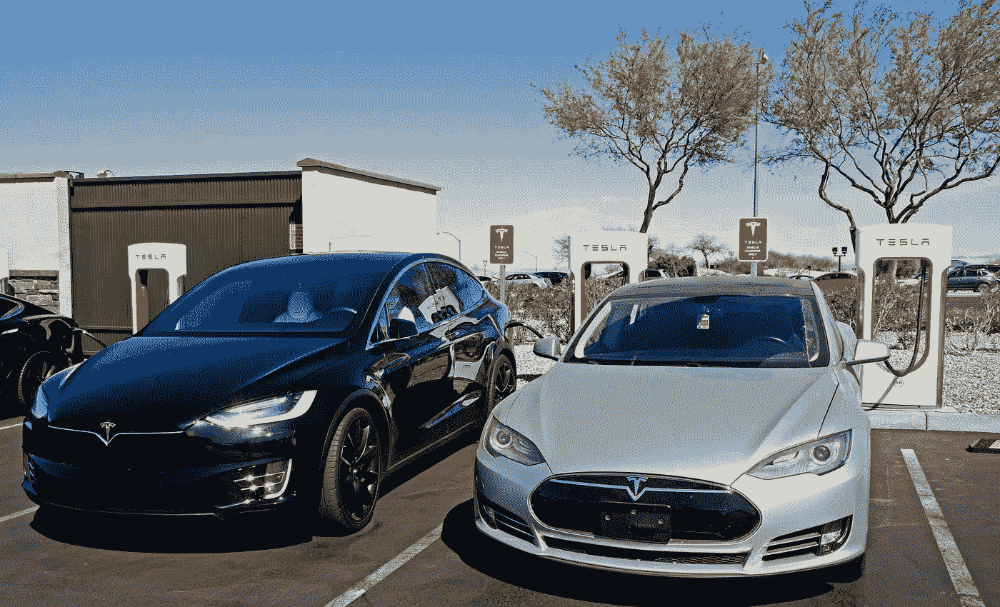
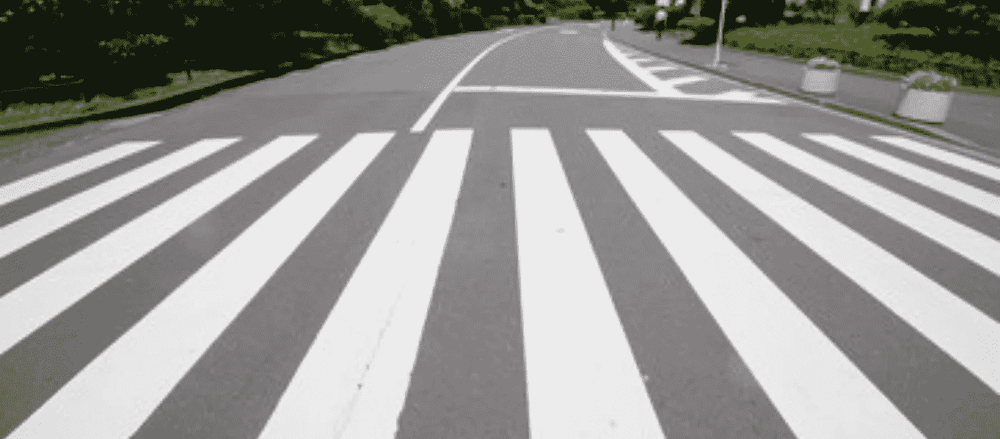
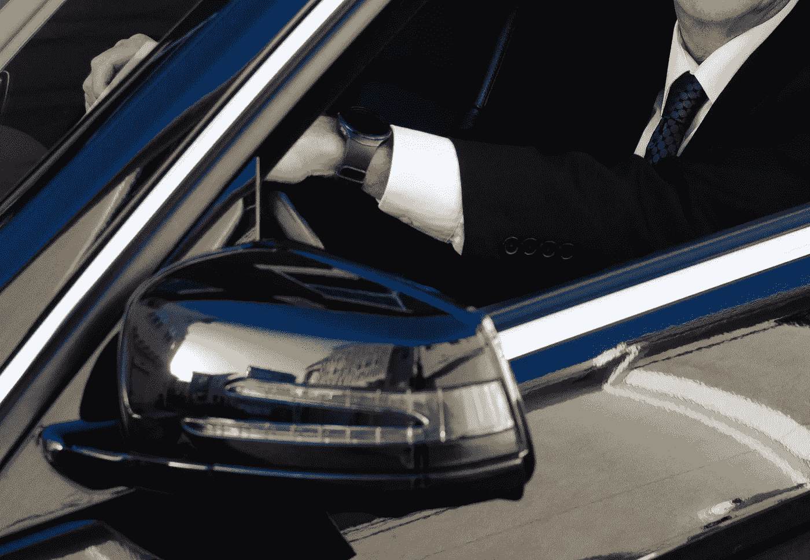

# 无人驾驶汽车可以使用人工直觉

> 原文：<https://medium.datadriveninvestor.com/self-driving-cars-could-use-artificial-intuition-7a2776964188?source=collection_archive---------15----------------------->

安全首先是自动驾驶汽车开发商的首要任务，以使该行业达到全自动无人驾驶汽车的标准。事故是等待发生的灾难。人类在多年的进化过程中一直依靠情感和直觉来避免事故。不幸的是，并不是所有的自动驾驶汽车都能够避免事故，例如亚利桑那州的优步测试。人类的本能是自动驾驶汽车所缺乏的。同样的东西，自动驾驶汽车能用吗？

人类是生物“连线”的，而自动驾驶汽车是电气连线的。他们从经验的角度看待自然世界的方式不同。人类通过后天培养和天性学习，而自动驾驶汽车通过传感器和软件学习。人工智能中一个名为机器学习的子领域可以引入各种技术，供软件工程师在开发自动驾驶汽车时使用，这些汽车可以使用强化学习技术来创建“人工直觉”，即“高级模式识别”。如果你对这方面的进一步解释感兴趣，我在这个[链接](https://becominghuman.ai/artificial-intuition-and-reinforcement-learning-the-next-steps-in-machine-learning-6f2abeb9926b)写了另一篇文章。这可以为自动驾驶汽车提供一种批判性思维的感觉，类似于人类对某些情况的反应。这不仅与计算机科学有关，也与行为科学有关。

当我们对某事有“直觉”时，这是我们的直觉在起作用。它可以是一种无意识的感觉，这种感觉会导致某些决定。机器被编程为在做出决定之前通过学习进行思考，但人类可以自动做出决定，不需要经过思考过程。相反，我们只是做一些事情，因为这是我们习惯了的。例如，几个世纪的进化教会了我们的祖先吃什么类型的植物，避免吃什么类型的植物。当面临不确定性时，人类会根据自己的感觉做出决定，通常是为了避免伤害和危险。因此，当面对一种不可食用的植物时，人类会避开它，从而避免对自己造成任何伤害。在某种程度上，具有这种能力的超级智能人工智能可以被纳入自动驾驶汽车，以最高的安全水平面对乘客的不确定性。

举个例子，我们来看看行人使用的人行横道。一辆完全自主的无人驾驶汽车应该知道人类驾驶员做的以下事情，比如:

*   人行横道是行人穿越车道
*   总是慢下来
*   超车前向两边看看
*   行人过马路时完全停止
*   意识到执法
*   不惜一切代价避免造成伤害

Self-driving cars should act in a similar manner to how human drivers would when approaching a crosswalk.

人类驾驶员在道路上对情况有着高度的感知。这是一个完整的过程，是由社会将信息输入大脑而形成的。从很小的时候，我们就知道开车时必须避免事故。我们从家人、朋友和其他与我们互动的人那里听到这些。这就是为什么当青少年申请驾驶执照时，他们有一种责任感，他们知道他们必须遵循这种责任感，以便为他人保持道路安全。“安全第一”防止危及他人的福利。事实上，我们承认除了自己之外还有其他人的存在，这使得我们把安全看得非常高。换句话说，我们不想伤害自己，也不想对他人造成伤害。我们知道这是违法的，也是社会所不能接受的，因为这是有后果的。同样，自动驾驶汽车也应该有“他人”意识，包括自己的同类以及执法部门，即警察。这就是为什么 V2V(车辆对车辆)和 V2P(车辆对行人)通信也是自动驾驶汽车的重要发展。我已经在这个[链接](https://medium.com/self-driving-cars/improving-self-driving-car-safety-and-reliability-with-v2x-protocols-1408082bae54)写了另一篇关于那个话题的文章。

这不是要让汽车中的人工智能拥有确切的人类情感和感觉。这对于设计来说太复杂了，我不认为这个行业需要朝这个方向发展。这是关于在他们自己的游戏中使用让深蓝和阿尔法围棋零大师这样的人工智能系统的技术。他们能够使用先进的人工智能在国际象棋和围棋比赛中获胜。现在，研究人员正试图在现实世界中找到这种方法的应用。当机器能够做出像 Alpha Go 击败世界顶级围棋选手那样的关键决策时，这里的潜力是什么。Alpha Go 系统及其继任者是由 Deep Mind 开发的，该公司得到了谷歌的支持。他们能够教会他们的系统做的是使用一种直觉思维的形式来完成游戏动作，就像人类一样，但只是更好。它甚至教会了围棋选手一些可以提高他们游戏水平的东西。这是关于建立更智能的系统，用于日常使用。

自动驾驶汽车的人工智能在决策方面非常出色，但它还不具备人类司机可以推导或得出逻辑结论的能力。能够让自动驾驶汽车更加安全的东西，如机器学习、计算机视觉、基础设施感知(V2X 或 V2I 功能)和传感器融合(激光雷达、雷达、声波)都在那里。它可以使用一些人工直觉来进一步推进 L5 自主和无人驾驶系统。

When you have self-driving cars drive like a human behind the wheel, but even better, more trust in the public can lead to mainstream general purpose use.