# 自动驾驶汽车:从 A 到 Z(模块 1) — 3(神经网络介绍)

> 原文：<https://medium.datadriveninvestor.com/self-driving-cars-from-a-to-z-module-1-3-introduction-to-neural-networks-1a581eb2f055?source=collection_archive---------9----------------------->

这篇文章的专业版[在这里](http://theautonomousmachines.com/building-self-driving-cars-4-neural-networks-part-1/)有。在当今的科技世界，最热门的话题是人工智能，当人们谈论人工智能时，他们首先提到的是神经网络。这就是今天帖子背后的直觉。在今天的课上，我们将学习无人驾驶汽车中最令人兴奋的工具——深度神经网络。

我们将从神经网络的基础开始，即感知器、反向传播，随着我们的深入，我们将处理多层感知器和深度神经网络。现在这些术语可能看起来太多了，但当我们结束这一部分时，我们将创建一个项目，展示神经网络在建造自动驾驶汽车中的应用。那么你还在等什么，让我们开始吧…

**神经网络基础知识**

神经网络只不过是一种机器学习算法，可以使用相机图像、传感器读数等输入进行训练，生成识别图像中的对象、分割图像的不同部分和对象分类等信息作为输出。请记住，神经网络能够做得更多，因为我们正在处理自动驾驶汽车，我们将只关注与我们相关的应用。

 [## DDI 编辑推荐:5 本机器学习书籍，让你从新手变成数据驱动专家…

### 机器学习行业的蓬勃发展重新引起了人们对人工智能的兴趣

www.datadriveninvestor.com](https://www.datadriveninvestor.com/2019/03/03/editors-pick-5-machine-learning-books/) 

**为什么是神经网络？**

神经网络的基本构件是感知器。现在让我们理解感知器的概念。我们将借助一个例子来理解它。假设我们在一所大学的招生办公室，我们的工作是根据我们为他们进行的测试结果和他们在学校的成绩来接受或拒绝学生。

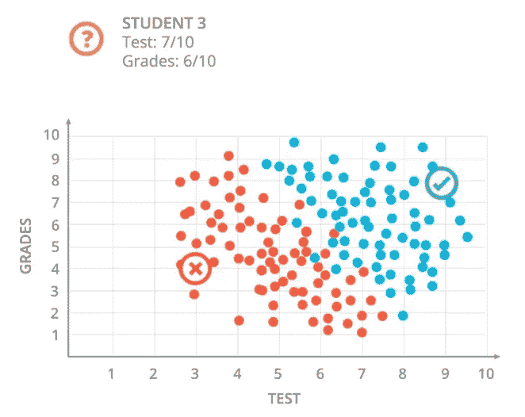

我们有两个学生的数据:S1 在考试和成绩上分别得了 9 分和 8 分，S2 得了 3 分和 4 分，如绿色和红色所示。第一个学生被录取，第二个被拒绝。现在 S3 在考试和成绩上分别得了 7 分和 6 分，我们必须决定这个学生是否会被大学录取。然后，我们查看之前的数据，如下图所示，并画一条线来区分红色和蓝色的学生。按照我们的路线，学生显然被接受了，但是正如我们所看到的，这条路线也做了一些错误的预测，但是这些真的很少，我们不会关心它们。我们可以说，任何高于这条线的学生都会被录取，低于这条线的学生都会被拒绝。

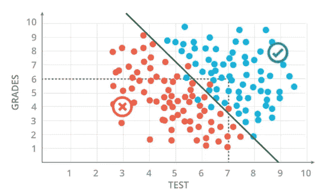

我假设你们知道如何使用像逻辑回归等机器学习技术来创建线。正如我们可以看到的，我们的机器学习算法创建了一个线性边界。该模型是下面给出的等式:

*分数= 2 *考试+1 *成绩-18*

**感知器**

现在我们将使用一个图表来看感知器的概念。感知器所做的是，将机器学习模型嵌入到一个节点中，并从其他节点接收输入，如下所示。在这里，我们向 ML 节点输入学生的测试和分数，然后分数遍历模型方程，如果分数高于黑线，感知器输出该学生被接受。

正如我们在上面看到的模型方程，即分数= 2 *测试+ 1*成绩-18，下面的 gif 解释了感知器的过程，该过程将测试分数和成绩作为输入，将其乘以与每个输入节点(测试和成绩)相关联的权重(边),并添加一个偏差项。如果分数≥ 0，感知器输出要接受的学生，反之亦然。

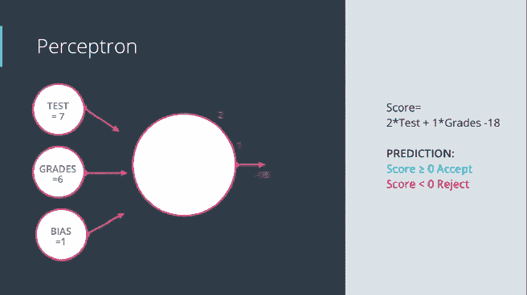

上面的例子只接受了 2 个属性，但是在一般情况下，我们通常会得到成千上万的输入，甚至更多。在现实情况下，感知器将有 X1，X2 …Xn 作为输入节点，这些节点是节点和边之间的点积，看起来像(X1 * W1) + (X2 * W2)…..+ (Xn * Wn) + b(偏置项)。如果这个点积的输出产生一个正数或零，那么感知器输出是或 1，当点积产生一个负数时，则输出否或 0。

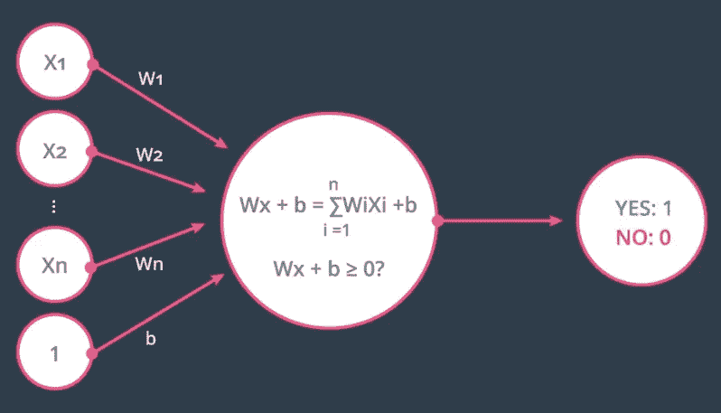

因为我们得到一个分数，要么是正的，要么是负的，你可能会想，感知器是如何产生 1 或 0 的？这是使用阶跃函数完成的。阶跃函数是应用于上面计算的点积输出的函数。有不同类型的阶跃函数可用，但这里使用的是这样一种函数，如果输出值为正，则返回 1，如果输出值为负，则返回 0。

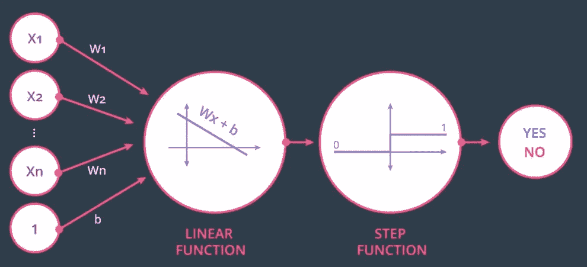

感知器可以被视为节点的组合，其中第一个节点计算输入和权重的线性方程，第二个节点将阶跃函数应用于线性函数的输出。我希望现在已经很清楚什么是感知机，以及它是如何工作的。让我们看看感知器的一些应用。你准备好了吗？？

**作为逻辑运算符的感知器**

这里可以看到如何看 and 运算符的功能和实现。AND 运算符接受 2 个输入(真或假)，只有当两个输入都为真时，输出才为真。

AND operator transformed to perceptron

AND 运算符可以通过分别用 1 和 0 替换 true 和 false 值来转换为感知器。正如我们在图像右侧看到的感知器，中间的节点接受两个输入 0 或 1，并在图中绘制每个点。如果绘制的点在线上，则产生正的结果，否则产生负值。类似地，我们可以看看 OR 运算符，类似于下图中的内容。

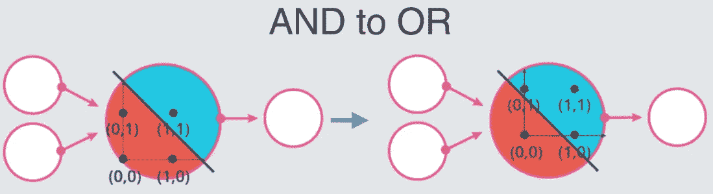

我们可以看到，与 AND 运算符相比，OR 运算符的直线向原点移动了一点。你可能会想，我们如何找到这条线，来解决学生被大学录取的问题。我们先拿一小部分学生来了解一下找这条线的过程。一开始，计算机并不真正理解从哪里开始，所以它随机画了一条直线，如下图所示。

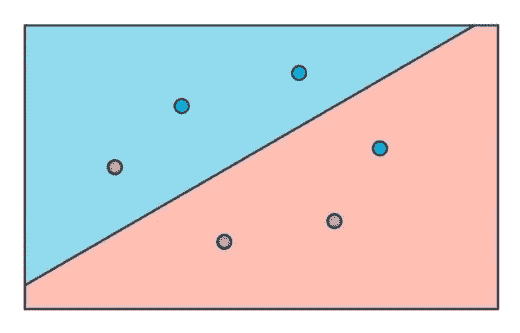

Random linear line

然后，该算法在找到最大数量的阳性样本的地方分配阳性点。在上图中，正点数的最大值在线的上方，因此算法会将线上方的区域指定为正。接下来，该算法尝试确定这条线在对学生进行分类时的表现有多差，并尝试移动这条线以提高其性能。但是我们如何检查这条线的性能呢？

该算法检查该线做出了多少个正确的预测，在这种情况下，两个蓝色点和两个红色点被正确分类。然后，它查看错误分类的点以提供信息，以便我们可以在适当的方向上移动线。

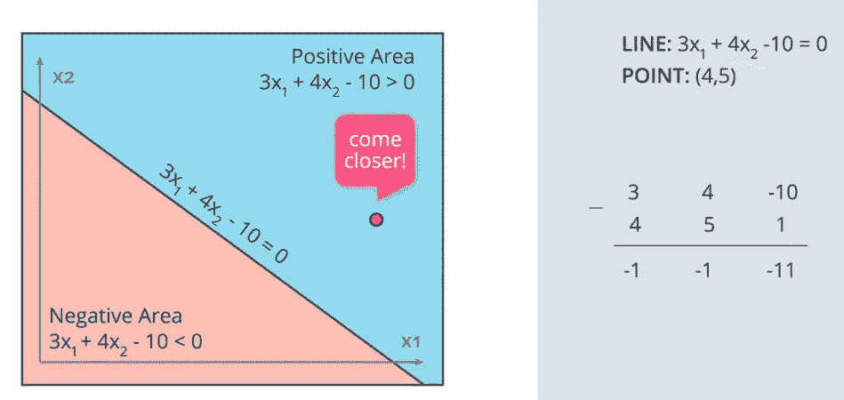

让我们考虑被错误分类的红点，并思考这个点将提供什么信息？它告诉线靠近一点，这样它就能到达正确的区域。我们来详细了解一下这个概念。假设我们有一条直线，它的方程是:(3 * X1) + (4 * X2) -10 = 0。正区域被定义为(3 * X1) + (4 * X2) -10 > 0，负区域在线下方。

考虑被错误分类为正点的点(4，5)。将线移近点的一个方法是从线的系数中减去点的 x，y 坐标，如上图所示。低于-10 的值 1 是偏差，我们现在知道感知器架构。该线的新系数是(-1，-1，-11)，并且该线将显著地向该线移动，并且可能将该点指向右侧区域，即负区域。这种方法是不可行的，因为这个点不是数据集中唯一的点。更正此点分类可能会导致许多其他点的错误分类。

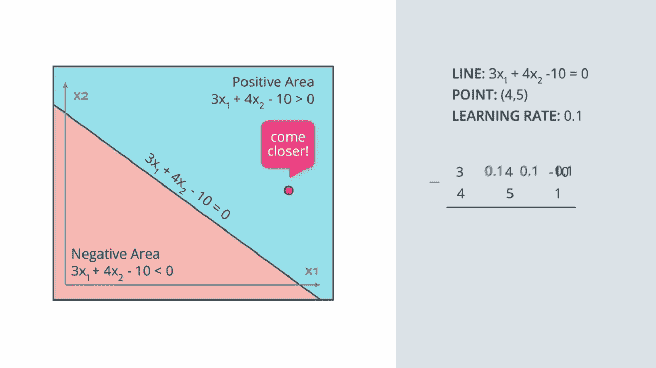

那我们下一步做什么？这里又出现了' ***学习率*** 的概念。学习速度允许我们朝着目标迈出一小步。这里，我们不是直接用线的系数减去点的坐标，而是首先用学习率乘以点的坐标，然后用点的系数减去点的坐标。这个过程帮助我们朝着目标迈出一小步。新直线的方程变成

(2.6 * X1) + (3.5 * X2) -10.1 = 0

类似地，如果正的点在负的区域被错误分类，那么我们不是减去坐标，而是加上坐标。

**感知器的局限性**

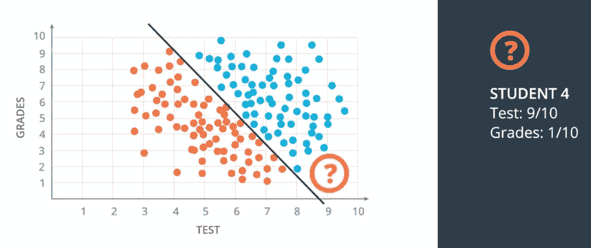

你可能会认为感知器工作得很好，那么它的局限性是什么呢？以被大学录取的学生为例，如果一个学生在考试中得了 9 分，成绩得了 1 分，这个学生仍然会被大学录取。但是在现实生活中不会是这样的。在现实世界中，数据看起来类似于下图中的数据。在这种情况下，一条线不足以区分正负区域。我们需要一条曲线来解决这样的问题。因此，我们需要修改感知器算法。

Perceptron limitation

**误差函数**

现在，可以对感知器进行什么修改，以便我们能够解决非线性问题？误差函数帮助我们识别修改。误差函数定义了我们离问题的最优解有多远或多近。让我们用一个例子来理解误差函数的概念:

假设我们在珠穆朗玛峰的顶端，我们想下来。因为山被云覆盖，我们看不到我们周围的东西，我们看着所有的方向，并在我们发现坡度最陡的那个方向迈出一步。我们一步一步地重复同样的过程，直到到达山脚。这里，误差由山的高度来定义，在任何深度学习算法中，重点是最小化该误差。

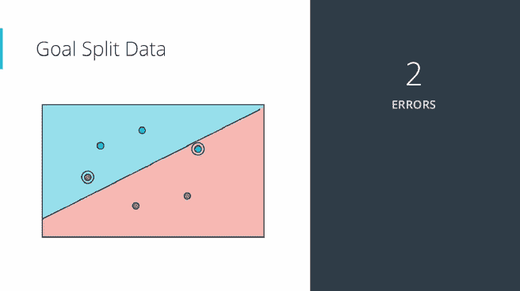

在下山的过程中，我们可能会陷入山谷或局部最小值，这在机器学习算法中发生的次数最多。我们还将看看如何解决这个问题。这种一步一步下山的方法也被称为“梯度下降”。如果我们将这种技术应用到学生接受度的问题上，我们将误差函数定义为错误数。开始时，我们会得到 2 个错误，我们会在任一方向上移动一小步，因为我们移动的是小步，所以我们总是得到 2 个错误。因此，误差函数应该总是一个连续的标度。

让我们来看一个连续误差函数，我们的问题称为对数损失误差函数。它给错误分类的点分配一个大的惩罚，给正确分类的点分配一个小的惩罚。罚值只不过是从错误分类的点到边界线的距离，如果该点被正确分类，该罚值几乎为零。所以误差的值是每个点的所有惩罚的总和。误差现在变得连续且容易微分。现在的目标是通过在适当的方向上移动直线来最小化这个误差。现在，我们如何定义这个误差函数？这就是我们将在本节第 2 部分讨论的内容。

我希望你们能够理解这项技术的基础，这是自动驾驶汽车的支柱，神经网络。接下来，我们将着眼于更多的神经网络概念，包括 Softmax，一键编码，似然，交叉熵，反向传播和前馈网络。在那之前继续学习，很快再见。:)