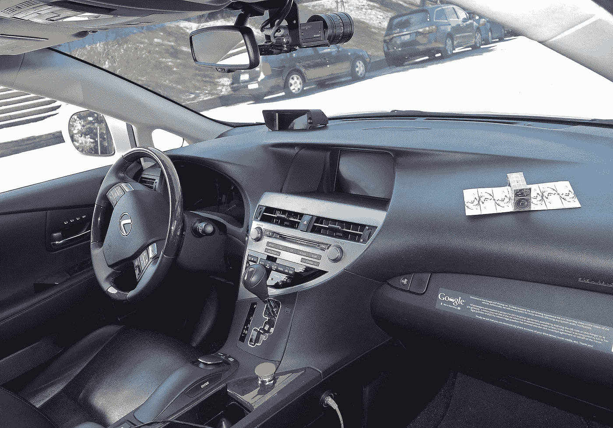
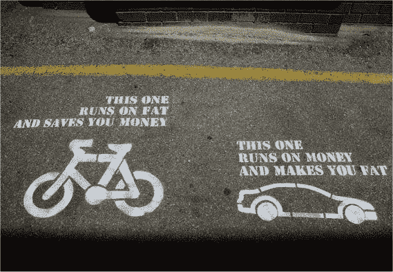

# 自动驾驶汽车:“运动”汽车的终结？

> 原文：<https://medium.datadriveninvestor.com/self-driving-cars-the-end-of-the-sports-car-530d70996e56?source=collection_archive---------0----------------------->

许多人认为，完全自动驾驶的汽车将在未来十年成为现实。特斯拉的[自动驾驶模式](https://www.tesla.com/en_GB/autopilot)已经让我们成功了一半。驾驶自动化意味着从人类手中接管控制权，并将其交给车载电脑和[网络](https://venturebeat.com/2018/02/06/sk-telecom-demos-5g-vehicle-to-everything-network-for-self-driving-cars-plans-2019-launch/)。这引发了一些关于驱动这些汽车的软件的有趣问题。

Inside Google’s RoboCar (jurvetson [CC BY 2.0 ([https://creativecommons.org/licenses/by/2.0](https://creativecommons.org/licenses/by/2.0))], via Wikimedia Commons)

首先，让我们假设一个未来，在那里驾驶自己的汽车通常不再被允许。在这个自动化的世界里，一家汽车制造商生产了两款自动驾驶汽车。经济型轿车体积小，省油，内饰简洁，乘坐舒适。与此同时，豪华型更重，发动机更大，配备齐全，因此用户乘坐舒适。

当谈到完全自动驾驶汽车时，外观和舒适度不是设计决策的终点。对于无人驾驶汽车来说，是*的设计者*，而不是司机，决定了车辆如何行驶。汽车是否应该随着轮胎的尖啸声和一股烟雾离开，在车流中穿梭，一直保持速度限制，并在接近一组信号灯时猛踩刹车，而不考虑燃油经济性？还是应该为了安全和燃油效率而优化汽车的每一个动作？

这些将是多年前在某个办公室里做出的编程决策。制造商会决定将豪华型设计成比经济型更具侵略性吗？这合乎道德吗？这合法吗？

[根据目前的英国广告标准](https://www.asa.org.uk/type/bcapcode/code_rule/20.1.html?_vhid=454AD74C96FEC873E906B253ACB01F9A)，禁止汽车广告“展示动力、加速或操控特性，除非在明确的安全背景下”。严禁宣传危险或不负责任的驾驶。[最近，宝马因鼓励不负责任驾驶的广告而几次陷入麻烦。制造商通常不使用广告，而是依靠杂志和电视节目中睾丸激素刺激的汽车评论来让买家了解他们汽车的性能。](https://www.bbc.co.uk/news/technology-44052613)

> 如果一辆“运动”车开起来和环保车型一样，那它还有什么意义？

虽然宝马 M3 显然比沃克斯豪尔 Corsa 更强大，但司机不应该使用宝马 M3 的力量危险地加速或超速行驶。这就是汽车行业的核心矛盾:你可以买一辆跑车，但你仍然必须按照和其他人一样的规则驾驶。现实是很多性能车车主*不*遵守交通规则。从统计数据来看，这种汽车更有可能导致撞车，从而导致死亡和受伤，这是汽车保险公司熟知的一个因素(这里的和这里的)。

> 汽车不是玩具，而是一项重大的责任。

汽车不是玩具，它是一项重大的责任。我们谈论的是两吨重的金属、玻璃和塑料在高速行驶；这是很大的动能。我知道，你想要跑车，因为它很“酷”，对吗？我也曾经想要一辆法拉利，这样我就可以在蒙特卡洛比赛，想要一辆吉普车，这样我就可以穿越撒哈拉沙漠……但是当我大约 14 岁的时候，我不再想要这些东西，并意识到在每天的通勤或去阿尔迪的旅途中，我不会参加任何公路赛或沙漠测试。车主们是时候成熟起来，认识到他们的车是工作和休闲的绝佳工具，而不是中年危机的解决方案。

自动驾驶汽车的到来是一个重新思考性能/运动/全地形车目的的机会。除了对污染排放征税，还有机会监管自动驾驶汽车的程序，使它们以最安全、污染最小的方式行驶。加速和刹车的极限可以用%g(也叫 G 力)来设定，这样可以防止引擎强劲的汽车进行危险的操作。也许所有汽车背后的编程都将如此相似，以至于“性能”不再是一个卖点。取而代之的是，豪华将集中于乘坐、内部装饰和车内娱乐。

也许“跑车”这个词会完全消失；运动是竞争性的，而驾驶不是，或者说*不应该是*，除非你是在赛道日。无论如何，运动应该能让你变瘦…

大卫·沃森 2018

本作品根据[知识共享署名-相似分享 4.0 国际许可协议](https://creativecommons.org/licenses/by-sa/4.0/)进行许可。