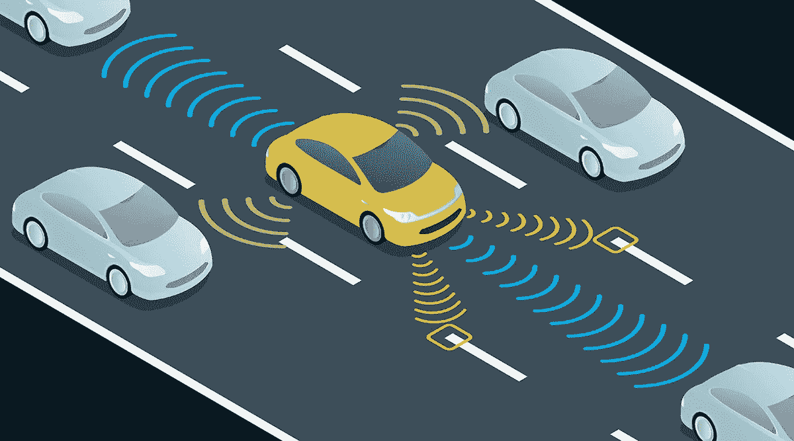

# 使用 5G 技术的自动驾驶汽车

> 原文：<https://medium.datadriveninvestor.com/self-driving-cars-using-5g-technology-7dfac9da8d9f?source=collection_archive---------28----------------------->

self-driving car

经过在深圳华为培训中心为期一周的学习，我了解了所有正在开发和使用的新技术:从 5G、人工智能(AI)、物联网(IoT)、大数据等等…

我已经了解了自动驾驶汽车开发过程中使用的技术，这些技术得到了全新 5G 技术的支持，允许这种汽车进行实时通信。

 [## 在自动驾驶汽车发生事故的情况下，谁应该承担法律责任？-数据驱动型投资者

### 我仍然认为自动驾驶汽车是一种奢侈品，而不是必需品…

www.datadriveninvestor.com](https://www.datadriveninvestor.com/2018/11/02/who-is-legally-accountable-in-the-case-of-an-autonomous-vehicle-accident/) 

借助 5G 技术，正在开发的新型无人驾驶汽车上成功添加和测试了一系列创新功能:

1-将自动驾驶汽车避免碰撞所需的时间从 1 分钟(使用 4.5 克)减少到 1-2 秒(使用 5 克)。

2-通过允许建立连接，帮助自动驾驶汽车受益于部署在附近的物联网设备，使全新的驾驶生态系统可用并随时可用。

3-引入 2 辆或多辆自动驾驶汽车在附近情况下相互通信的能力，使它们能够交换和共享信息。

4-一个 360 度传感器系统，它被部署在汽车的四周，确保对周围环境的全面跟踪，并帮助评估环境的性质。

Artificial Intelligence

这些汽车中的一些已经被制造出来，并由政府在中国进行部署和测试，以确保其安全性和可靠性，并可能很快获得批准和部署。

随着 5G 技术的兴起，越来越多的领域将被一整套技术所滋养，使工作变得更容易、更精确。