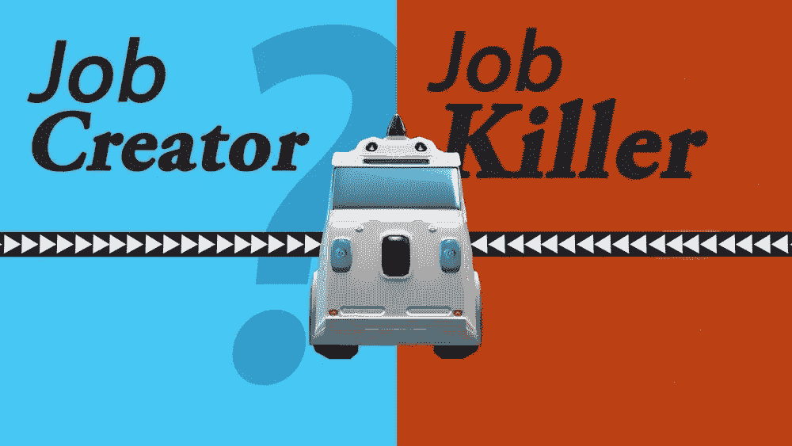

# 自动驾驶技术:工作杀手还是工作创造者？

> 原文：<https://medium.datadriveninvestor.com/self-driving-tech-job-killers-or-job-creators-bf3cf0cc4123?source=collection_archive---------9----------------------->

Photo: [Galactic Public Archives](https://www.youtube.com/watch?v=L1dXTE-seFA)

在我的 a [前一篇文章](https://www.grayscott.com/seriouswonder-/say-goodbye-to-20th-century-transportation)中，我认为自动驾驶汽车将彻底改变交通系统。虽然我袖手旁观这一说法，但我不认为我真的足够深入地解释了自动驾驶*技术*本身将对社会产生多大的破坏性。事实上，我们即将见证历史上日常生活在外观和功能上最具变革性的转变之一。

这就提出了一个问题:这种转变会导致失业多于就业，还是相反？谢天谢地，我们在[银河公共档案馆](http://www.galacticarchives.org/)的朋友已经制作了两个新的视频内容来解决这两种可能性。让我们从自动驾驶技术成为……

# 工作杀手

正如你所看到的，当我说自动驾驶技术时，我不仅仅是在谈论交通系统；我说的是所有的系统和几乎所有的工作都被这项技术改变了。当然，通过讨论自动驾驶技术最终成为就业杀手的可能性，我们不妨先看看它会在交通运输行业扼杀多少就业岗位:

*   **根据**[**(BLS)劳动统计局**](https://www.bls.gov/ooh/transportation-and-material-moving/heavy-and-tractor-trailer-truck-drivers.htm) **的数据，2014 年有近 180 万重型卡车和牵引车司机**，每年增长 5%。也就是说，现在大概有 200 万这样的司机。
*   **2014 年约有******送货卡车司机**133 万人，每年增长 4%。意思是，今天有超过 140 万。**
*   ****2014 年约有**[**23.37 万**](https://www.bls.gov/ooh/transportation-and-material-moving/taxi-drivers-and-chauffeurs.htm) **出租车司机和司机**，每年增长 13%。也就是说，今天有将近 30 万这样的司机。**

**换句话说，随着自动驾驶汽车的全面普及，我们预计未来几年仅在美国就将有大约(+/-)400 万个工作岗位实现自动化，因此不再需要人工。**

**话又说回来，与这些车辆背后的基础技术将对整个社会的其他工作产生的影响相比，这根本不算什么。正如上面的视频所揭示的那样，无论是交警、机械师和修理店，甚至是汽车旅馆/酒店行业，自动驾驶技术都有可能彻底颠覆他们。**

**我们将看到数百万个工作岗位被自动化，只需按一下按钮就能提供。话说回来，自动驾驶技术也有可能成为……**

# **工作创造者**

**当谈到基于订阅、基于应用的自动驾驶汽车车队时，有人可能会认为个性已经过时了。然而，事实可能并非如此。对于数字艺术家来说，这个潜在新兴产业的前景可能会非常好。**

**让我解释一下:正如上面的视频所提到的，可能会有这样一种需求，无论何时你叫一辆车来接你，那辆车都会带着你自己选择的外观和设计来。这意味着，为了使这种事情成为可能，这些车辆的外壳将需要由一种交互式的智能材料制成，这种材料可以实时改变自己的设计和颜色。**

**对于数字艺术家来说，这将是梦想成真。他们可以与拥有这些车队的公司建立合作关系，由此每一个被选中的设计的收益将进入原创艺术家的口袋。因此，数以百万计的潜在艺术家(包括业余和专业)可以从全国性自动驾驶行业的兴起中受益。**

**创造就业的另一个潜力是流动服务、餐馆等。越来越多的旅行者。长期居住在偏远地区的想法将被新一波现代游牧生活所取代——21 世纪游牧民族的诞生。因此，许多创造就业机会的行业可能会出现在这些道路的两侧。**

**正如上面的视频所提到的，这只会加重著名的未来学家 FM-2030 曾经提到的 *mobilia！***

> **“家或公社是你居住的地方。莫比亚是你穿越的任何地方。**
> 
> **这个家庭就其结构而言是保守的。mobilia 的非结构动力。**
> 
> **家庭和公社促进稳定。mobilia 鼓励运动。**
> 
> **家庭因其排他性而导致懒散——无聊——孤独。mobilia 通过其流动性最大化生长和活力。**
> 
> **家庭鼓励占有欲。mobilia 共享。**
> 
> **家庭一直是受传统束缚的、固定的、支离破碎的世界的核心。流动是流动宇宙生命的核心。**
> 
> **通过 mobilias 进行跨生活就是参与到人类大家庭中。"**
> 
> **- FM-2030，[右翼分子:未来主义者宣言](https://slowlorisblog.files.wordpress.com/2015/05/esfandiary-up-wingers-a-futurist-manifesto.pdf)**

***本文原载* [*严重纳闷*](https://www.grayscott.com/seriouswonder-//self-driving-tech-job-killers-or-job-creators) *。***