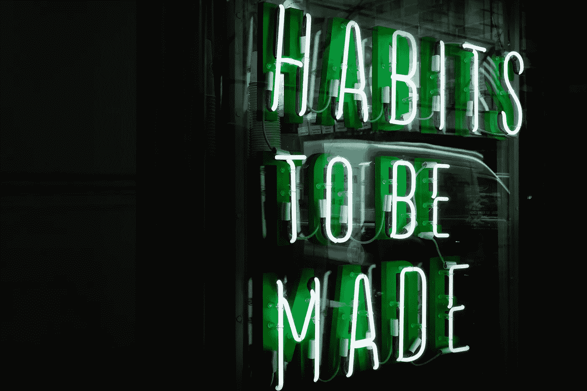

# 自我提升不是一次性的目标

> 原文：<https://medium.datadriveninvestor.com/self-improvement-is-not-a-one-off-goal-ad3033ada234?source=collection_archive---------14----------------------->

习惯堆积与詹姆斯清晰(二手灵感项目)的胜利

Photo by [Drew Beamer](https://unsplash.com/@drew_beamer?utm_source=unsplash&utm_medium=referral&utm_content=creditCopyText) on [Unsplash](https://unsplash.com/search/photos/habit?utm_source=unsplash&utm_medium=referral&utm_content=creditCopyText)

二手灵感项目从一句激励性的引语开始，在创造性道路蜿蜒的任何地方冒险。

> “习惯不是要跨越的终点线。这是一种生活方式。”—詹姆斯·克利尔

意志力本身通常不足以成功地将新的积极习惯融入我们的生活。

 [## 成功人生的 25 种自我提升方式|数据驱动的投资者

### “我活得越久，学到的就越多。学的越多，体会的越多，知道的越少。”―米切尔·莱格兰德时间到…

www.datadriveninvestor.com](https://www.datadriveninvestor.com/2019/03/12/25-self-improvement-ways-for-a-successful-life/) 

我们都可以从一连串被遗忘的新年决心、被放弃的减肥目标和失败的冷火鸡尝试中寻找证据——决心不是改变我们行为的唯一因素。

那么，我们如何快速培养新习惯呢？[一种方法是“习惯叠加”](https://youtu.be/OPw7HODLAyM)

我们的头脑已经习惯于执行我们现有的习惯。这些行为在我们的心理过程中建立了牢固的联系。想想像早上淋浴，黎明时拉开窗帘，或者以一杯咖啡开始新的一天。这些是我们许多人本能地做的日常活动，几乎没有任何想法。

这些现有的实践为我们有效地创造新的实践提供了极好的机会。当谈到培养新习惯时，我们可以精明地利用我们当前行为的力量。把它当成我们个人发展的“作弊代码”。

首先，我们必须确定一个我们已经养成的习惯。然后我们可以在它上面叠加一个新的行为。这是一种利用已经强大的心理联系来快速建立新的日常活动的方法。

我们可以用来堆积习惯的等式很简单:*在我做了*【既定习惯】，*之后，我会做*【新习惯】。例如:

我早上洗完澡后，会冥想五分钟。

我喝完早上的咖啡后，我会服用维生素。

放学回家后，我会完成作业。

吃完晚饭后，我们一家人会把洗碗机装好。

再说一次，这是可行的，因为我们目前的习惯已经在我们的大脑中建立起来了。这些熟悉的模式和行为随着时间的推移得到了强化。通过将新的习惯与已经存在的常规联系起来，我们更有可能坚持新的行为。

只要指出我们已经不知不觉地遵循了这个蓝图，任何对习惯堆积有效性的怀疑都可以平息。我们只是通常没有意识到生活中习惯堆积的力量，因为它经常涉及到禁忌行为之间的联系。例如:

下班后，我总是抽烟来镇定我的神经。

分手后，由于讨厌单身，我马上找了一个新的女朋友/男朋友。

在我感到压力后，我通常会吃一堆甜点和糖果。

我拿到薪水后，总是去赌场。

在某些触发因素后的这些不良行为是习惯堆积的可行例子。他们只是碰巧是把错误的东西堆在一起的例子。

因为我们都曾在某个时候跌入将糟糕的决策联系在一起的陷阱，我们也知道打破这种破坏性的循环有多难。所以，想象一下，如果我们可以利用这种力量来建立建设性的行为？

我们可能有巨大的抱负。但是随着习惯的积累，从小处着手是值得的。如果我们想在每晚入睡前阅读，我们不应该在第一个晚上就一头扎进《战争与和平》的六个章节。如果我们这样做了，我们将会失败并失去动力，因为我们吃掉了太多我们消化不了的东西。我们需要设定一个更现实的目标，比如睡前阅读 5 分钟，然后在此基础上继续努力。

我们应该从小事做起，而不是去做无用功。选择一个或两个我们想每天坚持的基本习惯，大概是在我们的余生中。这些应该是:

1.**便携**——我们可以在任何时间、任何地点、任何条件下完成。

2.**简单**——让它们变得足够简单，即使在忙碌或疲惫的日子里，我们也能保持它们。

3.独立——它们不应该依赖于外部事物的正确发展来应用它们。

我个人是从早上刷牙前的拉伸开始的。但是有很多目标可以选择。一开始我们应该只从几个习惯开始，只是为了找到有效地做这件事的感觉，然后从那里开始扩大我们的努力。

一旦我们掌握了这种结构，我们就可以通过将几个小习惯联系在一起来构建更大的堆栈。这有助于我们利用从一个行为到下一个行为的自然动力。

习惯堆积不是什么闪亮的新概念，但如果我们以前从未使用过它，它可以在我们的生活中彻底创新。这种一砖一瓦的方法可以帮助我们实现一些崇高的健身、职业、创意和个人理财目标。

通过扩大我们每天参与的积极活动的基础，习惯积累可以帮助构建个人进步的基础。这有助于把好习惯变成一种生活方式，而不是把它们变成目标。通过叠加微小的变化，可以实现更大的转变——我们都应该参与进来。

阿德里安·s·波特是一名作家、工程师、顾问和演说家。他写诗歌、短篇小说和各种主题的文章，包括创造力和个人成长。他是诗集[和散文集](https://www.amazon.com/Everything-Wrong-Feels-Adrian-Potter/dp/109519061X/ref=sr_1_4?qid=1560264651&refinements=p_27%3AAdrian+S.+Potter&s=books&sr=1-4&text=Adrian+S.+Potter)[的作者。在](https://e2857002-6118-41be-9746-64261e36cacb.filesusr.com/ugd/21d2c2_03522f10c7c84340a05a8d03a97e1642.pdf)[http://adrianspotter.com/](http://adrianspotter.com/)在线拜访他。