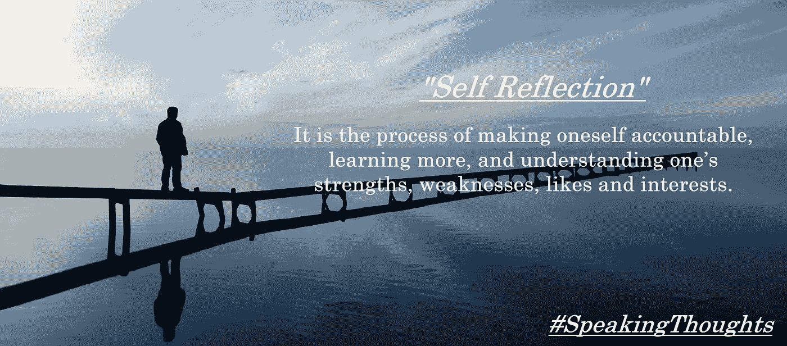

# 自我反思

> 原文：<https://medium.datadriveninvestor.com/self-reflection-c8b698ec6c81?source=collection_archive---------5----------------------->

自我反省和自我发现是让自己负责、学习更多知识、了解自己的优点、缺点、爱好和兴趣的过程。自我反省是为了深入观察我们的活动，从而了解我们是什么样的人，我们真正在做什么，我们打算做什么，以及这是否是一种社会影响。

当我坐在一个角落里，以一个观众的身份观看生活的表演时，一个随机的想法让我焦虑，我到底是什么？我真的在做我想做的事情吗？我是在做我自己吗？还是我是家庭和社会影响的结果？我真的喜欢做我今天正在做的事情吗？还是我只是在遵循社会规范，像成千上万的其他人一样过着典型的生活，而不了解自己？如果我是独一无二的，我真的过着独一无二的生活吗？这个随意的想法让我很焦虑，提出了很多我没有答案的问题。

自我反省是质疑自己，深入自我，更多了解自己的过程。我们通常会质疑周围的人，我们的家人，朋友和社会，但我们从不质疑自己，我们从不怀疑自己在某些时候可能是错的。自我反省是观察我们的活动的过程，无论我们是支持正确的一方还是另一方，并问自己，“我是否在正确的地方并以所需的速度前进？是我太逼自己了还是我太懒了？总的来说，今天的我是我应该成为的样子吗？”

自我反省是从内在和外在认识自己的过程，我们会发现自己的优点和缺点以及原因。让我们快乐的因素是什么，我们不快乐但却失望的部分是什么？。有时我们习惯于生活在未知的障碍和问题中，自我反省让我们意识到我们所处的问题，并让我们制定解决方案。

它让我们思考我们的好恶是什么，为什么我们不喜欢某样东西，为什么我们会如此被某样东西吸引。最重要的是，我们是在做我们真正想做的事情，还是仅仅出于社会影响和其他外部和情感因素？

自我反省让我们明白我们拥有哪些技能，以及我们需要根据我们目前的圈子在各个方面进行改进。这让我们想知道，我们是否对自己目前的生活状态感到满意，有哪些主要成就值得我们骄傲，我们应该在哪些方面和哪些地方进行改进。

例如，让我们假设我们一直在做一些没有任何进展的任务或项目。我们不断努力，不断鞭策自己。然而，我们应该停下来深呼吸，说该休息了，微笑着问自己一个简单的问题，“这是正确的做法吗？我走的路对吗？”因为错误的方法永远不会把我们带到正确的目的地。

自我反省在开始时是一项困难的任务，因为它挑战了我们一直以来的幻想，我们害怕质疑自己，因为这可能会打破我们的幻想。我们对正确的幻想，对正确方向的幻想，对强大的幻想。

重要的是通过自我反省来了解和认识我们自己，这是一个深入发现问题并最终找到解决方案的过程。

[#自我反思](https://www.facebook.com/hashtag/self_reflection?source=feed_text&epa=HASHTAG&__xts__%5B0%5D=68.ARBziYAY6DWybMrWlGf3JCCmjDsnb3wwB9UM0_OA2zYXtXImT2o60y1VRUh0-KYDj6l4Uzm7VSEva0nYDFiE1TAyLOlgj68mGKHlszI7he_NfeoSkx6DHXI9nXllKramh6-flr0hw5sIVbUzYgIq_SavUcDD1IXwpoz1COOMV04UTtlWTPz0A76LJDq97DInajyVffNR1OTK4kXVcUTzgF9cHgQzQJzqmK08WwW1iLLTy6l3iDb7RiKw6cxRfkTgUmM7yJoBdlEHfrehg8h68ksj_3XLF_mXfBOnLhLKd4gDhb1c26q3AmdsBQFoHXsDYaxNRQbAZvwQ4ju-liBNEfs&__tn__=%2ANK-R)[#自我发现](https://www.facebook.com/hashtag/self_discovery?source=feed_text&epa=HASHTAG&__xts__%5B0%5D=68.ARBziYAY6DWybMrWlGf3JCCmjDsnb3wwB9UM0_OA2zYXtXImT2o60y1VRUh0-KYDj6l4Uzm7VSEva0nYDFiE1TAyLOlgj68mGKHlszI7he_NfeoSkx6DHXI9nXllKramh6-flr0hw5sIVbUzYgIq_SavUcDD1IXwpoz1COOMV04UTtlWTPz0A76LJDq97DInajyVffNR1OTK4kXVcUTzgF9cHgQzQJzqmK08WwW1iLLTy6l3iDb7RiKw6cxRfkTgUmM7yJoBdlEHfrehg8h68ksj_3XLF_mXfBOnLhLKd4gDhb1c26q3AmdsBQFoHXsDYaxNRQbAZvwQ4ju-liBNEfs&__tn__=%2ANK-R)[#说话的想法](https://www.facebook.com/hashtag/speakingthoughts?source=feed_text&epa=HASHTAG&__xts__%5B0%5D=68.ARBziYAY6DWybMrWlGf3JCCmjDsnb3wwB9UM0_OA2zYXtXImT2o60y1VRUh0-KYDj6l4Uzm7VSEva0nYDFiE1TAyLOlgj68mGKHlszI7he_NfeoSkx6DHXI9nXllKramh6-flr0hw5sIVbUzYgIq_SavUcDD1IXwpoz1COOMV04UTtlWTPz0A76LJDq97DInajyVffNR1OTK4kXVcUTzgF9cHgQzQJzqmK08WwW1iLLTy6l3iDb7RiKw6cxRfkTgUmM7yJoBdlEHfrehg8h68ksj_3XLF_mXfBOnLhLKd4gDhb1c26q3AmdsBQFoHXsDYaxNRQbAZvwQ4ju-liBNEfs&__tn__=%2ANK-R)[#解脱的想法](https://www.facebook.com/hashtag/dekaythoughts?source=feed_text&epa=HASHTAG&__xts__%5B0%5D=68.ARBziYAY6DWybMrWlGf3JCCmjDsnb3wwB9UM0_OA2zYXtXImT2o60y1VRUh0-KYDj6l4Uzm7VSEva0nYDFiE1TAyLOlgj68mGKHlszI7he_NfeoSkx6DHXI9nXllKramh6-flr0hw5sIVbUzYgIq_SavUcDD1IXwpoz1COOMV04UTtlWTPz0A76LJDq97DInajyVffNR1OTK4kXVcUTzgF9cHgQzQJzqmK08WwW1iLLTy6l3iDb7RiKw6cxRfkTgUmM7yJoBdlEHfrehg8h68ksj_3XLF_mXfBOnLhLKd4gDhb1c26q3AmdsBQFoHXsDYaxNRQbAZvwQ4ju-liBNEfs&__tn__=%2ANK-R)

感谢阅读这篇文章。你可以在这里看到我写的其他文章。也欢迎大家访问我的 Fb 页面[*speaking thoughts*](https://www.facebook.com/speakingthoughts.net/)*。我唯一想要的回报就是对报道进行反思。*