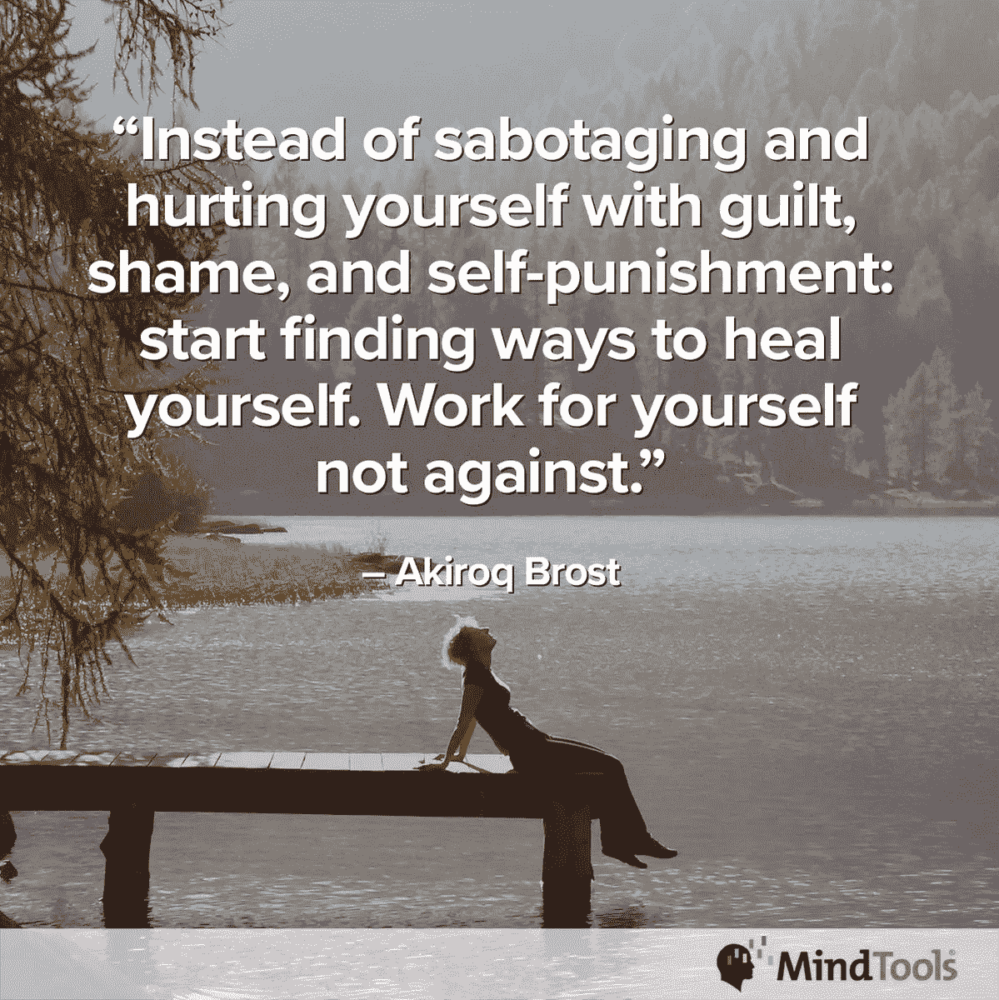
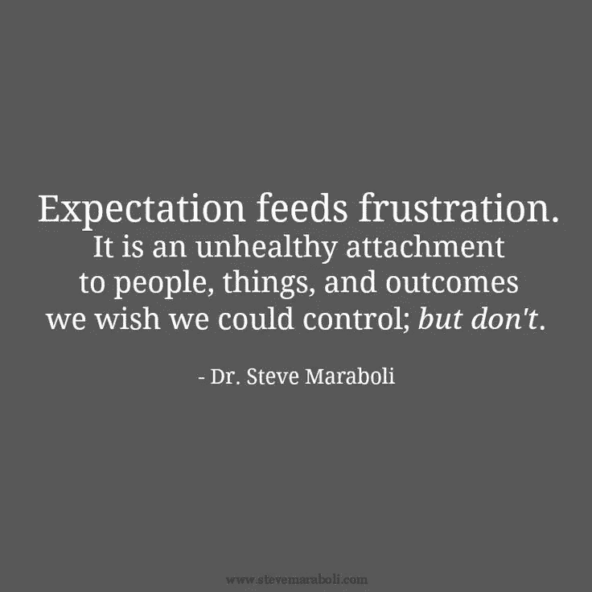

# 自毁会造成不必要的伤害

> 原文：<https://medium.datadriveninvestor.com/self-sabotage-inflicts-needless-harm-1c90df956946?source=collection_archive---------3----------------------->

## 鼓起勇气说不，并重申你的价值

不管是不是有意的，我们中的许多人都犯有自毁的错误。这可能包括从过度思考到怀疑自我价值的任何事情。它可以简单到[不敢说不](https://medium.com/@JKatzaman/just-saying-no-isnt-as-easy-as-it-sounds-b3ed7979860a)。

“出于帮助他人和增加价值的愿望，我可以承担超出我合理承受范围的工作。然后我就不知所措了，”[米歇尔·杜塞](https://twitter.com/MicheleDD_MT)说。她是 [Mind Tools](https://www.mindtools.com/) 的社区参与主持人，该网站“帮助人们发展卓越的领导、管理和个人效率技能。”

缺乏自理和委派；过度劳累；根据头脑工具网站的说法，设定不切实际的目标也是自我破坏的一种形式。“如果你[意识到自己的优势和劣势](https://www.mindtools.com/pages/article/developing-self-awareness.htm?utm_source=social&utm_medium=organic&utm_campaign=tweetchat)，你就有能力有意识地利用你的优势，管理或消除你的劣势。”

你通过不计划、不安排、允许分心和简单的拖延来自毁你的时间。花时间在现在不重要的事情上是另一种自毁时间管理的可靠方法。再加上缺乏纪律性或者没有计划。

 [## 疯狂设定目标背后是有方法的

### 专注于一个目标，为自己或公司制定一个计划

blog.markgrowth.com](https://blog.markgrowth.com/theres-method-behind-goal-setting-madness-9a8ba0a96ee1) 

“我拖延我不喜欢做的事情，”杜塞说。“它们在我的待办事项列表中不断被推后，直到完成任务变成紧急事件。

“我的办公室可以吸引人们来讨论问题，”她说。"我一天的时间表被打乱了，结果我工作到很晚。"

# **降低期望值**

我们通常会拖延做那些最费力的事情——尤其是当我们期望回报很少的时候。

“人们经常拖延做他们不喜欢做的事情，因为这需要更多的精神能量，”Mind Tools 说。“如果你觉得自己缺乏做出决定或执行任务的知识或专业技能，你可能会觉得推迟到以后会更容易。”

拖延与彻底的逃避有关。

“我不喜欢行政工作，”杜塞说。“我宁愿把它扫到地毯下面，也不愿处理它。如果可以的话，我会委派，但这并不总是可能的。

“当我知道某人会变得有戒备心或生气时，我会推迟与他进行艰难的对话，”她说。

 [## 时间管理就是说“不”

### 我们不能管理时间，但我们可以通过选择来管理项目

medium.com](https://medium.com/datadriveninvestor/time-management-is-all-about-no-423998e899b6) 

我们通过对自己说“把它留到明天”来推迟如此困难的任务。

典型的不做某事的借口可能包括，“我害怕犯错”或“我想从一开始就把它做好。”

# **不急**

根据 Mind Tools 的说法，另一个拖延的理由是，“我一准备好就开始”，而不知道“准备好”是什么意思，也没有任何截止日期。

“行政工作可以等等，”杜塞说，并给出了拖延的例子。“我有更重要的事情要做。

“如果我推迟这次艰难的谈话，事情最终会有所改善，”她说。“事实是，我不擅长处理冲突，我担心我会让情况变得更糟。”

一个可能的解决方案是给你的时间附加一个货币[值。这样做可以帮助你专注于高价值的任务，避免没有太大价值的活动。](https://www.mindtools.com/pages/article/newHTE_01.htm?utm_source=social&utm_medium=organic&utm_campaign=tweetchat)

感觉没有得到充分的训练也会导致自我破坏。

“当我觉得自己不能胜任这项工作时，我会犹豫不决，”杜塞说。"然后，我鼓起勇气问自己:接受这个任务我能学到什么？"

变得舒适有助于你自我破坏，尤其是如果不作为没有直接后果的话。

自我自毁行为往往是由消极的自我对话引起的。它源于对我们自己和我们能力的错误的潜在信念。

根据 Mind Tools 的说法，缺乏自信和自卑会导致自我破坏行为:不是你没有能力，而是你不相信自己有能力达到目标。

 [## 信心驱动领导者和教师

### 如何前进和面对挑战

medium.com](https://medium.com/datadriveninvestor/confidence-drives-leaders-and-teachers-6cbb16b3b88e) 

知道你在自我破坏的一个方法是当你试图实现目标时，没有任何理性的理由就停下来了。

“我试图找到我的触发器，”杜塞说。“当我的情绪开始浮出水面时，我会花时间在纸上反思和捕捉当时的情况。我问自己，“为什么会这样？”寻找规律。

“当我们不想做某件事或试图避免做某件事时，我们可以在脑海中编造出各种借口，这真是令人惊讶，”她说。“我们对自己的价值和能力缺乏信心，这可能会阻碍我们抓住面前的机遇。结果，我错过了一些。”

# **完美延迟**

完美主义往往是人们拖延的原因之一。

担忧是拖延的另一个副产品。你担心你是否会做你需要做的事。试图自己做所有的事情也会导致沮丧和责怪他人。

“当我们背上背着一个巨大的负担时，我们会看着别人并开始指指点点，”杜塞说。

当你拖延时，你可能会感到内疚、无助、不满足和羞耻。你可能还会听到“那个声音”告诉你，“你一直都知道自己没用。现在看到了吗？”

根据 Mind Tools 的说法，当你想自己做所有事情时，你可能是出于沮丧、压力、愤怒、不耐烦和失望而这样做。你也可能感到孤独，因为你是你唯一可以依靠的人。

 [## 如何重新获得更大的成功

### 有了弹性，我们从压力中反弹，达到更高的高度

medium.com](https://medium.com/datadriveninvestor/how-to-bounce-back-to-even-greater-success-db10e86791e1) 

“当我坚持自己做每件事时，我会感到不满，”杜塞说。“我的日子越来越长，没有时间留给我。这让我烦躁不安，不开心。”

为了停止自我破坏，有一个伙伴会有所帮助，这样你们可以互相激励——甚至进行一场小小的比赛，给冠军和亚军一个不错的奖励。

根据 Mind Tools 的说法，无论你的个人自毁行为是什么，如果你想充分利用你的职业生涯，你必须克服它。

# **减压**

承担责任将会释放你在自我毁灭时一直背负的压力和焦虑。

根据思维工具，你会有一个更加平静的内心生活。你会练习更多的自我照顾，对自己和他人更加亲切，并开始达到目标和实现梦想。

[激励自己](https://www.mindtools.com/pages/article/newHTE_74.htm?utm_source=social&utm_medium=organic&utm_campaign=tweetchat)，审视并了解自己的需求。然后你就会知道你发现什么是有价值和有回报的。

“我列出了所有能给我的生活带来快乐和幸福的活动，”杜塞说。“我想象我的工作和个人生活会是什么样——如果我能更好地界定我该做什么和不该做什么。”

为了停止自我破坏，相信你足够好。你越早证明越好。也要相信，如果你按时完成工作，你会保住你的工作。

以下信念是有害的:“我不能那样做。”“那太难了。”"如果我尝试，我可能还是会失败。"

“我对自己要求极高，”杜塞说。“这给我的表演带来了很多不必要的压力。

“这是今天的一个共同主题，不是吗？”她问。“如果我们相信自己，我们就有信心迈出下一步。”

如果你想减少自我破坏的行为，在睡觉前，列出你第二天的优先事项。醒来的时候提醒自己。在分心的事情不可避免地出现之前，开始完成你的工作。奖励自己一天的出色表现。洗涤，冲洗，重复。

根据思维工具，注意你对自己说的话以及你对自己说的话。你希望这些事情成真吗？

 [## 倦怠耗尽了简单的答案

### 人们在付出全部甚至更多后会激情四射

medium.com](https://medium.com/datadriveninvestor/burnout-exhausts-easy-answers-143a0840743b) 

“我问自己，什么样的标准仍能产生出色的结果，但不会让我筋疲力尽，”杜塞说。“什么样的结果符合我的老板和客户的期望？

“‘为什么’是至关重要的，”她说。“我们都想做有意义、有贡献的工作。当我们有了目标，我们就会致力于完成任务。”

# **写下来**

想想当你做出自我破坏的行为时，你对自己说了什么。根据思维工具，写下你所有的消极想法，无论它们看起来多么愚蠢或不切实际。养成积极谈论自己和自己的习惯。你不能带着消极的想法过积极的生活。

当你有了[发展出的自制力](https://www.mindtools.com/pages/article/newHTE_74.htm?utm_source=social&utm_medium=organic&utm_campaign=tweetchat)，你就可以有意识地稳步向你的目标前进。

 [## 掌控你的职业生涯，享受刺激

### 在自己身上下注是终极冲刺

medium.com](https://medium.com/an-idea/take-control-of-your-career-and-enjoy-the-excitement-502ae9569995) 

你改变的行为可以改善你在工作、家庭和自己的关系。当你停止自我破坏时，你会更加友善地看待家人、朋友和同事，消除了很多紧张情绪。

你最重要的关系是和你自己。如果你停止自我破坏，你与自己和他人的关系将会改善。

自我破坏可能会导致持续的无价值感、挫败感和愤怒——这些情绪可能会对人际关系产生负面影响。根据思维工具，没有它们你的人际关系会更好。

“当项目和任务没有像我认为的那样快速进展时，我会显得不那么沮丧，”Doucet 说。“随着这一过程的展开，我会感到更加轻松。持续的学习让你保持思维敏捷，消除自我怀疑。”

**关于作者**

吉姆·卡扎曼是拉戈金融服务公司的经理，曾在空军和联邦政府的公共事务部门工作。你可以在[推特](https://twitter.com/JKatzaman)、[脸书](https://www.facebook.com/jim.katzaman)和 [LinkedIn](https://www.linkedin.com/in/jim-katzaman-33641b21/) 上和他联系。