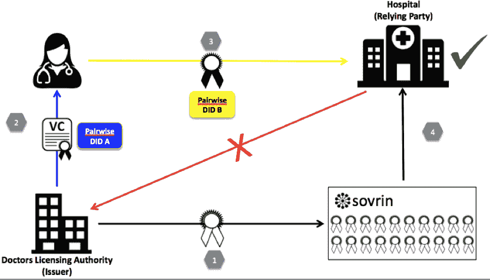
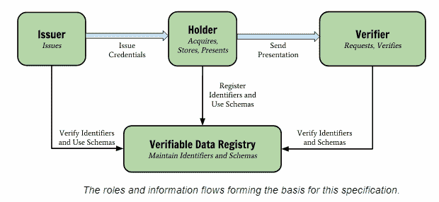
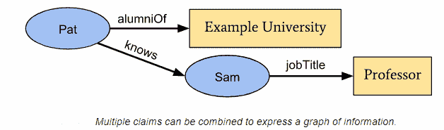
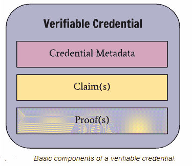
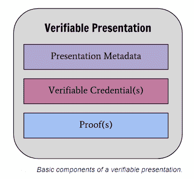
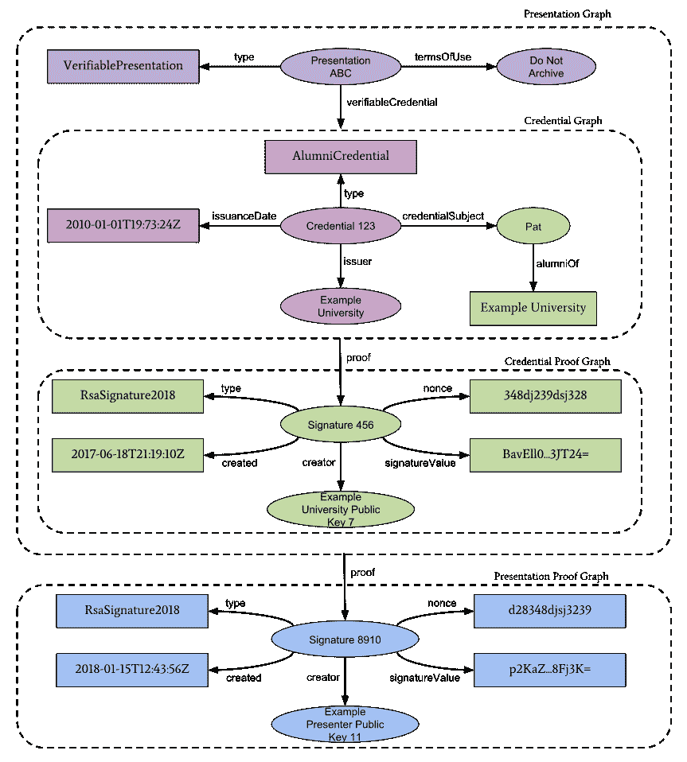
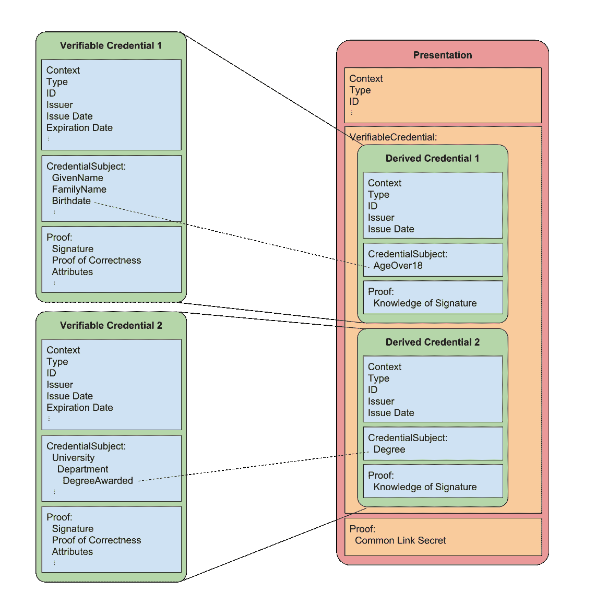

# 自我主权身份和分布式账本/区块链

> 原文：<https://medium.datadriveninvestor.com/self-sovereign-identity-and-distributed-ledger-blockchain-f15937f2b2ed?source=collection_archive---------0----------------------->

让我们从底层区块链技术、自我主权身份概念及其潜力的细节开始。

声明、证明和证明是身份的重要概念。

> 身份声明是由个人、企业或事物做出的声明。诸如“我的名字是安东尼，我的出生日期是 1901 年 1 月 1 日”
> 
> 一份**证明**是为索赔提供证据的某种形式的文件。如护照、出生证明和公用事业账单的复印件。
> 
> 一个**证明**是当一个第三方根据他们的记录确认声明是真实的。例如，一所大学可以证明某人曾在那里学习并获得学位。

# 1 导言

# 1.1 比特币/区块链/分布式账本

比特币是一种采用区块链技术的加密货币。它引入了分布式存储的概念，确保了数据的完整性并解决了整体信任问题。区块链由加密链接的区块列表组成，只允许追加区块。新的块在从网络中的块链节点被验证之后被添加和链接。这个过程确保了完整性，因为区块链中的区块不能被改变。

区块链是作为点对点加密货币比特币的一部分推出的。如果用户想要使用比特币，用户需要有一个钱包。用户使用此钱包管理他/她的帐户。用户可以使用钱包进行交易，如购买商品和用比特币支付。为了进行这样的交易，用户必须向卖家转移适量的比特币。比特币利用区块链作为交易注册器来记录所有交易。一个**区块链**是一个加密链接的块列表，其中每个块由事务、前一个块的哈希值和一个随机数组成。交易由比特币的输入和输出数量以及发送方和接收方的地址组成。比特币使用公钥加密技术，公钥代表用户的地址。比特币是一个没有公共许可的区块链，这意味着任何人都可以拥有比特币区块链的副本。矿工是比特币点对点网络中自封的特殊实体，他们收集交易并试图解决加密问题。解决这个问题有助于确保块中事务的有效性。工作证明的加密问题包括找到以预定义前缀开始的块的正确散列值。矿工使用特殊的硬件来计算哈希值。nonce 被添加到计算中，并在每次产生另一个散列时增加。为了计算工作证明，必须计算几万亿甚至更多的散列值。成功计算工作证明后，挖掘器将块广播到 p2p 网络。网络中的每个矿工验证计算，如果计算正确，块被添加到区块链。这种方法提高了交易的安全性和信任度，因为整个块都经过了验证。此外，区块链通过允许不同的独立矿工验证新区块来解决一般的信任问题。所需的不同矿工之间没有信任关系。

矿工通过接受比特币网络的激励来激励他们进行采矿。这一激励措施将越来越多地激励矿商购买更好的采矿设备。只有第一个完成区块工作证明计算的人才能获得相关奖励。这种激励是通过交易费用的总和产生的。处理交易时会间接收取交易费。它的出现是间接的，因为比特币交易产出略低于投入，差额是矿工的费用。这个系统激励着世界上成千上万的矿工去计算工作证明。因为每个矿工都有区块链的副本并验证每个新广播的块，所以不需要可信的中央机构来观察区块链及其活动。计算一个区块工作证明的激励现在是 12.5 个比特币，并随着活跃矿工人数的变化而变化。经过一段时间后，加密问题变得更加复杂，这应该会促使矿工购买更强的硬件。所提供的激励激励成千上万的矿工做他们的工作，并投资于计算能力。工作证明的一个已知问题是 51%攻击。这种攻击描述了如果有一个矿工拥有整个比特币网络 51%的计算能力的情况。这个矿工可能会双倍花费比特币，并使其他交易无效，并可能阻止人们发送比特币。这种攻击不是一个理论问题，当大型矿池开始相互合并并成为主导矿业力量时，它就会成为现实。也就是比特币现金的情况，比特币黄金和以太坊都遭受了 51%的攻击。

区块链是一种只添加、有序和复制的交易日志。区块链技术被用作加密货币、电子投票、身份或去中心化域名服务(DDNS)等。分布式分类帐是一个分散的数据库，记录在许多服务器上存储和复制，它进行通信以确保维护最准确和最新的交易记录。分布式分类帐依赖于与区块链相似的共识机制原则。DLT 可以被认为是迈向区块链的第一步，但重要的是，它不一定要构建一个区块链，也不一定只是追加。加密签名和连接分类账中的记录组，形成一个链，这是区块链区别于 DLT 的地方。

***1.2 数字身份***

数字身份是包括人在内的事物的简化数字表示。数字身份由一组与身份相关的属性组成。身份管理是对数字身份及其相应数据的管理。建立在分布式账本或区块链技术上的身份管理将支持分散的身份模型，这减少了某些用例的集中化和信任问题。

***1.3 自我主权身份***

自主权身份模型试图消除身份管理带来的信任问题。SSI 试图让用户完全控制他/她自己的数据。不同在线服务的使用需要有效的数字身份管理方法。这些身份通常包含敏感的个人数据。了解这些敏感数据的存储方式和位置以及谁可以访问这些数据非常重要。四种主要的身份模型是:

**孤立身份模型**

独立身份模型是服务提供商(SP)和身份提供商(IdP)的组合，这意味着 SP 管理用户的身份数据以及他们的凭据。在这种情况下，用户直接在 SP 上进行身份验证。

**中央身份模型**

中央身份模型将 IdP 与 SP 分开。这种分离是主要的区别和进步，因为身份数据存储在 IdP 中。当用户想要访问在线服务时，她必须首先在 IdP 处认证自己，然后身份数据被传送到 SP。在这个模型中，用户对自己的身份数据没有任何控制权。这种情况的一个例子是使用脸书，因为用户不能控制她自己存储在脸书的数据。

**以用户为中心的身份模型**

以用户为中心的模型将用户的身份数据存储在用户的域中。该域可以是诸如智能卡的安全令牌。共享用户的身份数据需要明确的用户同意。使用该模型的用例场景的一个例子是银行卡或市民卡。

**联合身份模型**

联合身份将身份数据分布在多个境内流离失所者中，而不是存储在一个中心位置。多个境内流离失所者提供访问服务所需的身份数据。这些境内流离失所者在一个联盟中一起工作，这需要境内流离失所者之间的信任关系。联合 IDP 共享一个用户的公共标识符。该模型可以用来实现单点登录。SSO 将是联合身份管理的认证子集。

**自我主权身份模型**

在自主身份(SSI)模式中，用户完全拥有并控制自己的数据。在 SSI 系统中:

*   每个用户都必须完全控制自己的数据

每个用户必须完全控制自己的身份数据。这不仅包括存储了哪些身份数据，还包括谁可以访问这些数据。用户应该能够添加或导入身份属性，以及在闲暇时删除或撤销它们。此外，应该记录用户对身份数据的所有访问，以供以后验证。

*   确保用户身份数据的安全性和隐私性

所有身份数据都必须以高度安全的方式存储和处理。此外，必须保护用户的隐私。例如，用户钱包和身份数据之间的不可链接性增加了用户的隐私。

*   数据的完全可移植性

用户应该能够在任何地方使用身份数据。

*   不信任中央权威(*)
*   确保数据完整性(*)
*   保持身份数据的透明度(*)

区块链/分布式账本技术非常适合这些要求。用户决定哪种数据将存储在分类帐中，以及谁将访问它。

***1.4 SSI 架构***

基于区块链/dlt 技术的自主身份系统架构。区块链/dlt 提供了实现没有半可信方(如中央认证机构(CAs)或注册机构(RAs ))的系统的可能性。只有公共或无权限的区块链提供完全半信任的无信任环境。如果区块链是私有的或被许可的，则只有授权方可以访问该分类帐，这至少需要与这些实体有某种信任关系。即使授权方是相互独立的，对被选择方或成为可信方的选择过程的信任仍然是必要的。独立机构应保存一份有助于降低所需信任度的账目副本。

一个简单的用例是，A 国的公民可以使用现有的身份基础设施导入他们的身份数据。身份节点用于将符合条件的身份数据导入到用户的台账中。公民应该能够使用她的智能手机访问或共享她的身份数据，无论他们想在哪里记录每个身份的数据访问。

手机或电脑上的软件是一个“身份钱包”，身份数据将存储在设备上。用户可以为他们的身份选择一个人类容易记住的名字。然后，平台将该名称转换为一个名为 DID(分散标识符)的唯一身份。分散标识符(DIDs)是一种新型的可验证的“自我主权”数字身份标识符。DID 完全在 DID 主体的控制之下，独立于任何集中的注册中心、身份提供者或认证机构。DID 是将 DID 主题关联到与该主题进行可信交互的手段的 URL。DID 解析为 DID 文档——描述如何使用特定 DID 的简单文档。每个 DID 文档可能包含至少三件事:证明目的、验证方法和服务端点。证明目的与验证方法相结合，提供证明事物的机制。例如，DID 文档可以指定特定的验证方法，例如加密公钥或假名生物特征协议，可以用于验证为认证目的而创建的证明。服务端点支持与 DID 控制器的可信交互。

```
A simple example of a Decentralized Identifier (DID)did:example:123456789abcdefghi
```

身份钱包，具有从公钥导出的自生成标识号和相应的私钥。

每个 DID 记录被分配一个公钥-私钥对，其中可以使用私钥创建文档的签名，并且可以使用公钥验证签名。相应的公钥发布在“public key”下的元数据中。每个 DID 都与特定于分类帐或网络的单独 DID 方法规范相关联。DID 方法指定了与注册、解析、修改和撤销相关的一组规则。

```
Minimal self-managed DID Document
{
  "@context": "https://w3id.org/did/v1",
  "id": "did:example:123456789abcdefghi",
  "authentication": [{
    *// used to authenticate as did:...fghi*
    "id": "did:example:123456789abcdefghi#keys-1",
    "type": "RsaVerificationKey2018",
    "controller": "did:example:123456789abcdefghi",
    "publicKeyPem": "-----BEGIN PUBLIC KEY...END PUBLIC KEY-----\r\n"
  }],
  "service": [{
    *// used to retrieve Verifiable Credentials associated with the DID*
    "type": "VerifiableCredentialService",
    "serviceEndpoint": "https://example.com/vc/"
  }]}
```

在这个阶段，用户创建了一个自我主权的身份。然后，用户使用该身份以及身份声明，并从相关机构获得证明。用户可以使用证明声明作为身份信息。

由于分类帐是公开的，因此不应在分类帐上直接暴露任何个人身份信息(PII)。为了实现公共分类帐的私密性，分类帐中仅存储以下项目:

DIDs——一种全球唯一标识符，不需要集中注册机构，因为它是通过分布式分类帐技术或其他形式的分散式网络注册的

公共密钥—每个人都知道，私有或秘密密钥只有消息的接收者知道。

服务端点—支持通过关联代理与身份所有者进行交互

证明——哈希或零知识证明工件，使身份验证者、身份所有者和依赖方能够证明特定信息的有效期

上述四条基本数据通过帐外代理代表身份所有者。

**帐外存储**

第一个附加部分是帐外存储。在区块链中存储敏感数据可能不是一个好主意，即使这些数据是加密的。将数据存储在区块链中出现的问题是，这些数据以后不能再被修改或删除。这在某些情况下可能是一个重要的特性，但在处理敏感数据时却不是。在 SSI 系统中，个人相关数据存储在分类帐外，只有唯一的标识符存储在区块链中。这个特殊的标识符被加密地链接到分类账外数据存储器。云存储等不同的存储服务可以用作帐外存储。

**可验证的主张和零知识证明**

如果索赔有证据，索赔就成为核实索赔。Indy 支持如下加密安全的可验证声明。假设爱丽丝想向她工作的医院证明她的行医执照。



Verifiable Claims and Zero Knowledge Proofs

*   a)如果 Alice 是在医生协会下注册的医生，Alice 要求该协会向医院发送可核实的声明，以证明她的行医执照的有效性。
*   b)然后，医生协会在分类帐上创建一个 DID，该 DID 具有带有公钥 p 的索赔模式。
*   c)然后医生协会创建显示 Alice 的行医执照的有效性的文档，并用 p 的私钥对该文档进行签名。然后将签名的文档(或其摘要)作为医生协会的 DID 下的交易添加到分类帐中。
*   d)然后，医院使用医生协会的公钥 P 验证签名的文档，并确保该文档由医生协会签名。

在现实世界中，凭证可能包括:

*   与凭证主题相关的信息(例如，照片、姓名和身份证号)
*   与颁发机构相关的信息(例如，市政府、国家机构或认证机构)
*   与发布机构所声明的关于主题的特定属性相关的信息
*   与如何获得凭据相关的证据
*   与到期日期相关的信息。

可验证的凭证可以表示物理凭证所表示的所有相同信息。数字签名等技术的加入，使得可验证的凭证比实物凭证更容易被篡改，也更值得信赖。可验证凭证的持有者可以生成演示，然后与验证者共享这些演示，以证明他们拥有具有某些特征的可验证凭证。可验证的凭证和可验证的演示都可以快速传输，这使得它们在尝试建立远程信任时比它们的物理对应方更方便。

**数据导入**

SSI 系统处理身份数据。这些数据可以有不同的质量水平。例如，国家机构可以发布个人的合格身份数据。相反，个人自己输入与个人相关数据。不能保证这些自行输入数据的真实性。因此，SSI 系统支持合格数据的导入对用户是有益的。合格数据的导入并不简单，因为在导入过程中必须执行特殊的数据转换。这个转换过程将数据格式从接收的格式转换成 SSI 系统支持的格式。接收的数据格式可能因其来源而异。这是一个必要的步骤，以便在以后提供选择性公开和属性证明。

**扩展信任模型**

与传统的身份管理系统相比，SSI 系统通过使用分布式分类帐技术减少了所需的信任。然而，通过将 SSI 系统与当前的信任方案(如信任网)相结合，可以将这种系统中的信任提升到更高的水平。

**分散式公钥基础设施**

SSI 系统可以被视为开放的分散身份层的实现，该身份层包括基于分布式账本技术(DLT)的分散公钥基础设施(DPKI)。DPKI 不同于众所周知的公钥基础设施(PKI ),它不依赖于中央认证机构，例如颁发证书的机构(CA)或注册机构(RA)。通过将信任的根从权威机构改为身份所有者，可以消除对这些权威机构的依赖。中央机关的特点是，它们的失败会给用户带来严重后果。没有单点故障。

**互通**

SSI 系统使用各种方法，例如不依赖专有软件，来显著提高互操作性。弹性:将分散式架构与可加密验证的数据相结合，增加了这种系统的弹性。密钥恢复:DPKI 通过结合使用密钥托管服务和跨可信 DPKI 连接共享的密钥的社会恢复，提供了构建健壮的密钥恢复系统的机会。

以下关键项目旨在实现可互换性:

DIDs —不需要任何集中解析机构的全球唯一标识符(可以通过分布式分类帐进行解析)。

DDOs (DID 描述符对象)—一个 JSON 对象，它公开了公钥和服务端点，用于与 DID 标识的实体进行交互。

可验证声明—交换数字身份属性及其关系的标准格式。

代理—支持帐外活动的代理之间的通信标准。

**数字证书的互操作性**

在自我主权身份中，分级公钥基础设施(PKI)模型被 DID/DDO 模型所取代。网络中的对等体使用它们自己的 DDOs 作为信任的根。但是 DID 和 DDO 密钥材料和元数据可以用于生成 X.509 证书，这是最广泛建立的格式。X.509 证书可用作 DID/DDO 模型的可验证声明。通过这种方式，分层/联合身份系统可以与分散的身份系统相结合。

**GDPR 合规**

SSI 系统在处理数字身份证时可以支持 GDPR 标准。

***同意***

GDPR 提到，为了处理和收集用户的数据，用户必须给予明确的同意。SSI 系统可以通过个人身份数据管理系统(PIMS)的图形用户界面进行扩展，以优化用户及其体验。这个 PIMS 将通过撤销机制提供对共享哪些数据的细粒度控制。一些区块链支持智能合同，这可以用来执行用户的同意决定。

***假名化***

GDPR 将假名化描述为一个过程，在这个过程中，公民的个人数据被转换，如果不提供额外的信息，所产生的数据就无法与特定的人联系起来。在 SSI 系统中，区块链中只存储标识符。这些标识符是用密码生成的，不能与特定的人联系起来。一个想法是扩展 SSI 系统，并通过生成与用户相关联的服务提供商和部门特定的标识符来引入合格的匿名。这是通过成对地创建标识符来实现的，其中特定的标识符与每个单独的对应项相关联。根据数据保护方面的考虑，可以在创建过程中使用不同的技术。

***擦除权(被遗忘权)***

GDPR 的擦除权描述了公民要求删除个人数据的权利。在 SSI 系统中，用户完全拥有身份数据；因此，用户可以简单地删除整个身份及其相关数据。擦除是通过不将任何私有数据存储在公共可访问的地方(例如分散式分类帐本身)来实现的。相反，只有与身份数据关联的标识符存储在分类帐中。访问依赖于用户的同意，并由 SSI 同意机制强制执行。同意机制还允许撤销先前授权的数据访问。

***处理活动的记录***

保存处理活动的记录，包括各种信息，如处理目的、涉及的类别以及预计的时限。SSI 系统的设计提供了实现这一点的机会。

***数据可移植性***

在 GDPR，数据可携带权是指一个人能够将个人数据从一个地方转移到另一个地方的权利。SSI 系统通过为互联网提供一个开放的身份层来支持这一权利，从而提供了在世界范围内访问和使用它的可能性。这种可能性之所以成为可能，是因为 SSI 系统将分布式分类帐等支持数据可移植性的不同技术与 XDI 等标准化数据交换格式相结合。

***数据保护通过设计和默认***

默认数据保护意味着数据保护机制已经是系统设计的一部分，SSI 系统就是这种情况。这包括，默认情况下，适当的技术和组织措施应确保处理的个人数据得到保护。SSI 系统采用了最先进的技术，既保护了用户的隐私，也保护了处理后的数据。零知识证明(ZKP)是这些技术中的一种，它允许身份所有者证明身份特定元素的正确性，而不会泄露任何不必要的附加信息。例如，证明拥有驾驶执照而不披露完整的驾驶执照。

**从现有 ID 导出的身份**

当涉及到身份派生时，SSI 系统提供了另一个很大的可能性。随着 SSI 系统的扩展，应该可以从现有的 ID 基础结构中导出身份数据。这是通过将标识声明转换成 SSI 格式来实现的。与现有的 ID 基础设施直接通信的最大优势是只有一个转换方法，而不是从不同的成员派生身份数据，在这种情况下，每个成员都需要自己的身份转换。通过这种方式，现有的身份基础设施通过生成全球自我主权身份而提升到全球范围。

**可核实的索赔**

SSI 系统引入的一个新概念是可验证声明。声明是与特定人员相关的属性。可验证的声明是一个实体对另一个实体做出的不可信的声明集。这些声明是加密生成的。例如，一所大学可以发布一份可核实的声明，确认相关人员持有这所大学或提供医疗证明的医疗保健提供商的学位。

**可验证的凭证**

凭证是我们日常生活的一部分；驾照用来证明我们有能力驾驶机动车，大学学位可以用来证明我们的教育水平，政府签发的护照使我们能够在国家之间旅行。当在现实世界中使用时，这些凭证为我们提供了好处，但是它们在网络上的使用仍然难以捉摸。

目前，很难在 Web 上表达教育资格、医疗保健数据、财务账户详情以及其他种类的第三方验证的机器可读个人信息。在网络上表达数字凭证的困难使得通过网络获得与物理凭证在现实世界中提供给我们的相同好处变得很困难。

可验证的凭证可以表示物理凭证所表示的所有相同信息。数字签名等技术的加入，使得可验证的凭证比实物凭证更容易被篡改，也更值得信赖。可验证凭证的持有者可以生成演示，然后与验证者共享这些演示，以证明他们拥有具有某些特征的可验证凭证。可验证的凭证和可验证的演示都可以快速传输，这使得它们在尝试建立远程信任时比它们的物理对应方更方便。

在一个生态系统中，核心参与者的角色以及他们之间的关系，在这个生态系统中，可验证的证书是有用的。角色是一种抽象，可以用许多不同的方式实现。角色的分离为标准化提供了可能的接口和协议。介绍了以下角色:

*支架*

一个实体可以通过拥有一个或多个可验证的凭证并根据它们生成表示来执行的角色。示例持有者包括学生、员工和客户。

*发行人*

实体可以通过创建可验证的凭证、将其与特定主题相关联并将其传送给持有者来执行的角色。示例发行者包括公司、非营利组织、贸易协会、政府和个人。

*主题*

一个实体可以通过断言一个或多个可验证的凭证来执行的角色。示例主题包括人类、动物、组织和事物。虽然在许多情况下可验证凭证的持有者是主体，但在某些情况下不是。例如，父母(持有者)可能持有孩子(主体)的可验证凭证，或者宠物主人(持有者)可能持有他们的宠物(主体)的可验证凭证。

*验证者*

实体可以通过请求和接收可验证的表示来执行的角色，该可验证的表示证明持有者拥有所需的具有某些特征的可验证的凭证。示例验证者包括雇主、安全人员和网站。

*可验证数据注册表*

系统可能通过协调标识符、密钥和其他相关数据(如可验证的凭据架构和吊销注册表，可能需要使用可验证的凭据)的创建和验证来执行的角色。一些配置可能需要主题的相关标识符。示例性的可验证数据注册包括可信数据库、分散数据库、政府 ID 数据库和分布式分类帐。通常在一个生态系统中使用不止一种类型的可验证数据注册。



Information Flow

一个**声明**是关于一个主题的陈述。主体是可以对其进行声明的实体。声明使用主题-属性-值关系来表示。

可以将单个声明合并在一起，以表示关于某个主题的信息图表。下面的示例通过添加声明 Pat 认识 Sam 并且 Sam 是一名教授来扩展声明。



Multiple Claims

一个**凭证**是由同一实体做出的一个或多个声明的集合。凭证还可能包括描述凭证属性的标识符和元数据，例如颁发者、到期日期和时间、代表性图像、用于验证目的的公钥、撤销机制等等。元数据可能由发行者签名。可验证的凭证是一组篡改明显的声明和元数据，它们以加密方式证明是谁颁发的。可验证凭证的示例包括数字员工身份证、数字出生证明和数字教育证书。



Verifiable Credentia

上图显示了可验证凭证的基本组成部分，但抽象了如何将声明组织到信息图中的细节，然后再将信息图组织到可验证凭证中。下图显示了可验证凭证的更完整的描述，它通常由至少两个信息图组成。第一个图表示凭证本身，它包含*凭证元数据和声明*。第二张图表示了*数字证明*，它通常是一个数字签名。


Information Graph

增强隐私是一个关键的设计特征，因此，对于使用这种技术的实体来说，能够只表达他们的角色中适合给定情况的部分是很重要的。一个人的角色子集的表达被称为可验证的呈现。不同角色的例子包括一个人的职业角色，他们的在线游戏角色，他们的家庭角色，或者匿名角色。

**可验证呈现**表示来自一个或多个可验证凭证的数据，并以数据的作者身份可验证的方式打包。如果凭证被直接出示，它们就变成了出示。从凭证中导出的数据格式可以用密码验证，但其本身不包含凭证，也可以是表示形式。演示文稿中的数据通常是关于同一主题的，但由多个发布者发布。这些信息的集合通常表达了个人、组织或实体的一个方面。



Verifiable Presentation

上图显示了可验证演示的组成部分，但抽象了如何将可验证凭证组织到信息图中的细节，然后再将信息图组织到可验证演示中。下图显示了一个可验证演示的更完整的描述，它通常由至少四个信息图组成。第一个图表达了表示本身，它包含表示元数据。图中的 verifiablePresentation 属性引用一个或多个可验证的凭据(每个凭据都是一个自包含的图)，这些凭据又包含凭据元数据和声明。第三个图形表示凭证图形证明，通常是数字签名。第四个图形表示表示图形证明，通常是数字签名。



Presentation Graph

**混凝土生命周期实例**

前面几节介绍了声明、凭证和使用图形描述的表示的概念。本节提供了一组简单而完整的数据模型生命周期实例，这些实例用 W3C 支持的一种具体语法来表达。可验证证书生态系统中的证书和演示的生命周期通常遵循一条共同的路径:

*   颁发一个或多个可验证的证书。
*   在凭证存储库中存储可验证的凭证(如数字钱包)。
*   将可验证的凭证组合成用于验证者的可验证的表示。
*   验证者对可验证演示的验证。

我们将通过演示如何从大学兑换校友折扣，用具体的例子来说明上面的生命周期。在下面的示例中，Pat 从一所大学收到一份校友证书，该证书将存储在 Pat 的数字钱包中。

```
A simple example of a verifiable credential
{
  *// set the context, which establishes the special terms we will be using*
  *// such as 'issuer' and 'alumniOf'.*
  "@context": [
    "https://www.w3.org/2018/credentials/v1",
    "https://www.w3.org/2018/credentials/examples/v1"
  ],
  *// specify the identifier for the credential*
  "id": "http://example.edu/credentials/1872",
  *// the credential types, which declare what data to expect in the credential*
  "type": ["VerifiableCredential", "AlumniCredential"],
  *// the entity that issued the credential*
  "issuer": "https://example.edu/issuers/565049",
  *// when the credential was issued*
  "issuanceDate": "2010-01-01T19:73:24Z",
  *// claims about the subject of the credential*
  "credentialSubject": {
    *// identifier for the subject of the credential*
    "id": "did:example:ebfeb1f712ebc6f1c276e12ec21",
    *// assertion about the subject of the credential*
    "alumniOf": "<span lang='en'>Example University</span>"
  },
  *// digital proof that makes the credential tamper-evident*
  "proof": {
    *// the cryptographic signature suite that was used to generate the signature*
    "type": "RsaSignature2018",
    *// the date the signature was created*
    "created": "2017-06-18T21:19:10Z",
    *// the public key identifier that created the signature*
    "creator": "https://example.edu/issuers/keys/1",
    *// the digital signature value*
    "jws": "eyJhbGciOiJSUzI1NiIsImI2NCI6ZmFsc2UsImNyaXQiOlsiYjY0Il19..TCYt5X
      sITJX1CxPCT8yAV-TVkIEq_PbChOMqsLfRoPsnsgw5WEuts01mq-pQy7UJiN5mgRxD-WUc
      X16dUEMGlv50aqzpqh4Qktb3rk-BuQy72IFLOqV0G_zS245-kronKb78cPN25DGlcTwLtj
      PAYuNzVBAh4vGHSrQyHUdBBPM"
  }}
```

然后，Pat 出示上面的校友证书，以便获得折扣。门票销售系统 verifier 表示，任何“示例大学”的校友都可以获得体育赛事季票折扣。Pat 使用移动设备开始购买季票。流程中的一个步骤是请求校友证书，该请求被发送到 Pat 的数字钱包。数字钱包询问 Pat 他们是否愿意提供先前发布的可验证凭证。Pat 选择可验证的凭证，该凭证然后被组合成可验证的呈现。然后，可验证的呈现被发送给验证者并被验证。

```
A simple example of a verifiable presentation
{
  "@context": [
    "https://www.w3.org/2018/credentials/v1",
    "https://www.w3.org/2018/credentials/examples/v1"
  ],
  "type": "VerifiablePresentation",
  // the verifiable credential issued in the previous example
  "verifiableCredential": [{
    "id": "http://example.edu/credentials/1872",
    "type": ["VerifiableCredential", "AlumniCredential"],
    "issuer": "https://example.edu/issuers/565049",
    "issuanceDate": "2010-01-01T19:73:24Z",
    "credentialSubject": {
      "id": "did:example:ebfeb1f712ebc6f1c276e12ec21",
      "alumniOf": "<span lang='en'>Example University</span>"
    },
    "proof": {
      "type": "RsaSignature2018",
      "created": "2017-06-18T21:19:10Z",
      "creator": "https://example.edu/issuers/keys/1",
      "jws": "eyJhbGciOiJSUzI1NiIsImI2NCI6ZmFsc2UsImNyaXQiOlsiYjY0Il19..TCYt5X
        sITJX1CxPCT8yAV-TVkIEq_PbChOMqsLfRoPsnsgw5WEuts01mq-pQy7UJiN5mgRxD-WUc
        X16dUEMGlv50aqzpqh4Qktb3rk-BuQy72IFLOqV0G_zS245-kronKb78cPN25DGlcTwLtj
        PAYuNzVBAh4vGHSrQyHUdBBPM"
    }
  }],
  // digital signature by Pat on the presentation establishes consent and
  // protects against replay attacks
  "proof": {
    "type": "RsaSignature2018",
    "created": "2018-09-14T21:19:10Z",
    "creator": "did:example:ebfeb1f712ebc6f1c276e12ec21#keys-1",
    // 'nonce' and 'domain' protect against replay attacks
    "nonce": "1f44d55f-f161-4938-a659-f8026467f126",
    "domain": "4jt78h47fh47",
    "jws": "eyJhbGciOiJSUzI1NiIsImI2NCI6ZmFsc2UsImNyaXQiOlsiYjY0Il19..kTCYt5
      XsITJX1CxPCT8yAV-TVIw5WEuts01mq-pQy7UJiN5mgREEMGlv50aqzpqh4Qq_PbChOMqs
      LfRoPsnsgxD-WUcX16dUOqV0G_zS245-kronKb78cPktb3rk-BuQy72IFLN25DYuNzVBAh
      4vGHSrQyHUGlcTwLtjPAnKb78"
  }}
```

一些零知识加密方案可能使持有者能够在不暴露凭证本身的情况下间接证明他们持有凭证。在这些方案中，诸如出生日期之类的原始属性可能被翻译成另一个值，诸如“超过 15 岁”，该值被加密地断言，使得如果验证者信任发行者，则他们可以信任该值。例如，指定主体出生日期的声明可以用作谓词来证明主体的年龄在给定的范围内，从而证明主体有资格获得年龄相关的折扣，而无需实际透露主体的出生日期。

# 零知识证明

零知识证明是一种加密方法，其中一个实体可以向另一个实体证明他们知道某个值，而不公开实际值。一个真实的例子是证明一个被认可的大学已经授予你一个学位，而没有透露你的身份或学位上包含的任何其他个人身份信息。

零知识证明机制引入的主要功能有:

1.  持有者将来自多个发行者的多个可验证凭证组合成单个呈现而不向验证者暴露凭证或主题标识符的能力。这使得验证者更难就颁发的证书与任何发行者串通。
2.  持有者有选择地向验证者公开凭证中的声明而不需要发布多个原子凭证的能力。这允许持有者向验证者提供他们需要的精确信息，仅此而已。
3.  持有人产生衍生凭证的能力，该凭证根据验证者的数据模式而不是发行者的数据模式来格式化，而不需要在凭证发行后涉及发行者。这为持有者提供了很大的灵活性来使用他们已被发放的凭证。

为了使用零知识可验证凭证，发行者必须以某种方式发行可验证凭证，使得持有者能够以增强隐私的方式将信息呈现给验证者。这意味着持有人将能够证明签发人签名的有效性，而不泄露已签署的价值，或者只泄露某些选定的价值。标准做法是通过证明知道签名来做到这一点，而不暴露签名本身。当在零知识证明系统中使用可验证凭证时，对可验证凭证有两个要求:

*   可验证的凭证必须包含凭证定义，该凭证定义可以被所有各方用来在一无所知的情况下执行各种加密操作。
*   该可验证凭证必须包含一个证明，该证明使得能够在零知识的情况下导出证明包含在原始可验证凭证中的信息的呈现。零知识演示不得透露任何持有者不想透露的信息。

以下示例显示了在零知识环境中使用可验证凭据的一种方法。它使用 CL 签名，这允许通过使用选择性公开凭证值来以支持持有者和主体的隐私的方式呈现可验证的凭证。下面的示例通过使用 credentialSchema 属性提供了凭据定义，并提供了可在 Camenisch-Lysyanskaya 零知识证明系统中使用的特定证明。

```
A verifiable credential that supports CL Signatures
{
  "@context": [
    "https://www.w3.org/2018/credentials/v1",
    "https://www.w3.org/2018/credentials/examples/v1"
  ],
  "type": ["VerifiableCredential", "UniversityDegreeCredential"],
  "credentialSchema": {
    "id": "did:example:cdf:35LB7w9ueWbagPL94T9bMLtyXDj9pX5o",
    "type": "did:example:schema:22KpkXgecryx9k7N6XN1QoN3gXwBkSU8SfyyYQG"
  },
  "issuer": "did:example:Wz4eUg7SetGfaUVCn8U9d62oDYrUJLuUtcy619",
  "credentialSubject": {
    "givenName": "Jane",
    "familyName": "Doe",
    "degree": {
      "type": "BachelorDegree",
      "name": "<span lang='fr-CA'>Baccalauréat en musiques numériques</span>",
      "college": "College of Engineering"
    }
  },
  "proof": {
    "type": "AnonCredv1",
    "issuerData": "5NQ4TgzNfSQxoLzf2d5AV3JNiCdMaTgm...BXiX5UggB381QU7ZCgqWivUmy4D",
    "attributes": "pPYmqDvwwWBDPNykXVrBtKdsJDeZUGFA...tTERiLqsZ5oxCoCSodPQaggkDJy",
    "signature": "8eGWSiTiWtEA8WnBwX4T259STpxpRKuk...kpFnikqqSP3GMW7mVxC4chxFhVs",
    "signatureCorrectnessProof": "SNQbW3u1QV5q89qhxA1xyVqFa6jCrKwv...dsRypyuGGK3RhhBUvH1tPEL8orH"
  }}
```

下一示例利用上述可验证凭证来生成具有隐私保护证明的新的派生可验证凭证。然后，导出的可验证凭证被放置在可验证呈现中，进一步证明整个断言是有效的。当在零知识系统中使用最可验证的演示时，有三个要求:

*   所有派生的可验证凭据必须包含对用于生成派生证明的凭据定义的引用。
*   可验证凭证中的所有派生证明都不能泄漏使验证者能够关联出示凭证的持有者的信息。
*   该可验证的出示必须包含一个证据，该证据使验证者能够确定该可验证的出示中的所有可验证的凭证都被颁发给同一持有人，而不会泄漏持有人不打算共享的个人可识别信息。

```
A verifiable presentation that supports CL Signatures
{
  "@context": [
    "https://www.w3.org/2018/credentials/v1",
    "https://www.w3.org/2018/credentials/examples/v1"
  ],
  "type": "VerifiablePresentation",
  "verifiableCredential": [{
    "@context": [
      "https://www.w3.org/2018/credentials/v1",
      "https://www.w3.org/2018/credentials/examples/v1"
    ],
    "type": ["VerifiableCredential", "UniversityDegreeCredential"],
    "credentialSchema": {
      "id": "did:example:cdf:35LB7w9ueWbagPL94T9bMLtyXDj9pX5o",
      "type": "did:example:schema:22KpkXgecryx9k7N6XN1QoN3gXwBkSU8SfyyYQG"
    },
    "issuer": "did:example:Wz4eUg7SetGfaUVCn8U9d62oDYrUJLuUtcy619",
    "credentialSubject": {
      "degreeType": "BachelorDegree",
      "degreeSchool": "College of Engineering"
      }
    },
    "proof": {
      "type": "AnonCredDerivedCredentialv1",
      "primaryProof": "cg7wLNSi48K5qNyAVMwdYqVHSMv1Ur8i...Fg2ZvWF6zGvcSAsym2sgSk737",
      "nonRevocationProof": "mu6fg24MfJPU1HvSXsf3ybzKARib4WxG...RSce53M6UwQCxYshCuS3d2h"
    }
  }],
  "proof": {
    "type": "AnonCredPresentationProofv1",
    "proofValue": "DgYdYMUYHURJLD7xdnWRinqWCEY5u5fK...j915Lt3hMzLHoPiPQ9sSVfRrs1D"
  }}
```



Credentials and Presentation Mappings

来源:

[可验证凭证数据模型 1.0](https://www.w3.org/TR/2019/CR-verifiable-claims-data-model-20190328/)

[分散标识符(DIDs) v0.13](https://w3c-ccg.github.io/did-spec)

[自我主权身份的崛起——超级账本印度](https://wso2.com/blog/research/the-rise-of-self-sovereign-identity-hyperledger-indy)

[白皮书——自我主权身份](https://www.egiz.gv.at/en/projekte/178-Whitepaper-Self-Sovereign-Identity-)