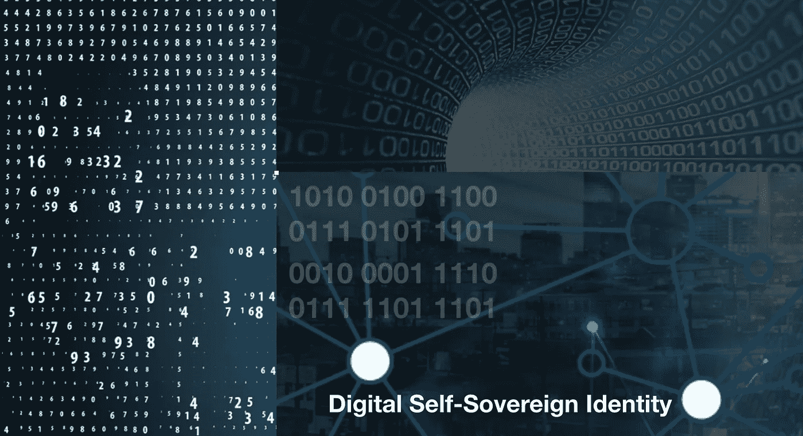
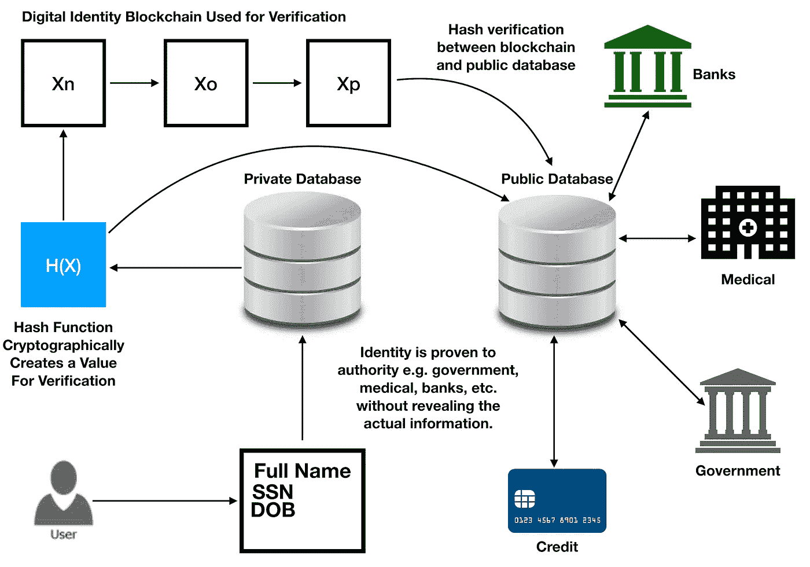
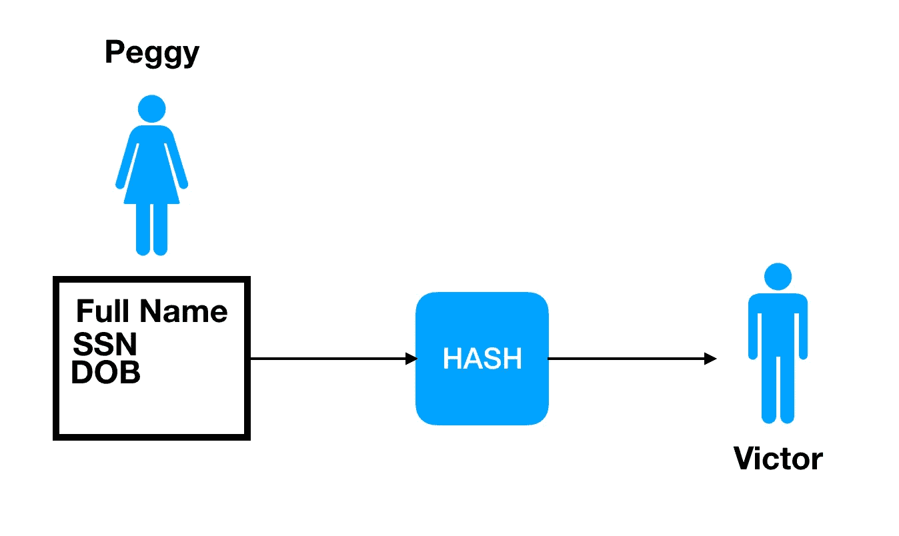
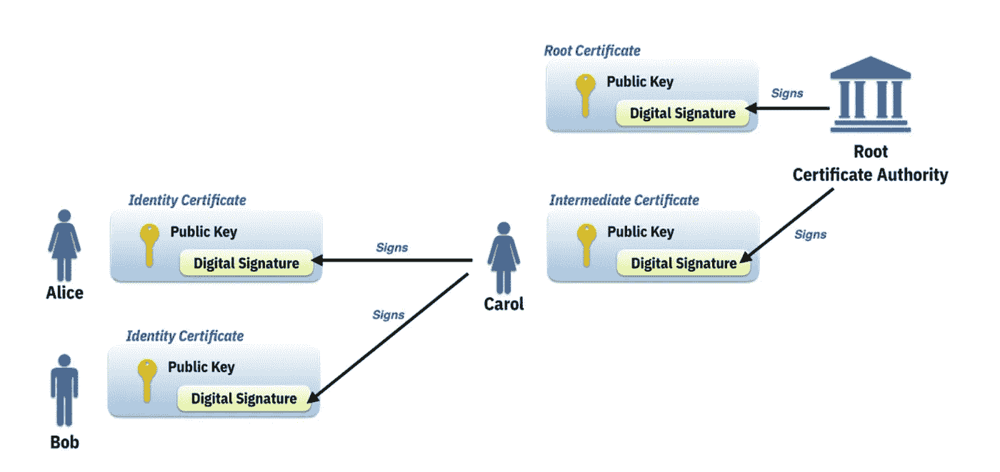

# 零知识证明下自我主权同一性的使用(ZKP)

> 原文：<https://medium.datadriveninvestor.com/self-sovereign-identity-with-zero-knowledge-proof-9a05f36f16da?source=collection_archive---------4----------------------->

## 身份验证的用例

我们的个人信息现在大部分存储在计算机上，这是数字和信息时代的结果。数据库存储数百万条记录，这些记录托管在数据中心的服务器上，这些数据中心通常属于一家私人公司或政府机构。一个人的全名、出生日期(DOB)和社会保障(SS)数据经常被用来获得信贷、融资和医疗等服务。其他个人信息非常敏感，比如医疗记录。这些信息通常存储在由许多办公室共享的各种服务器上的孤岛中。它很容易被窥探的眼睛看到，不管它是谁。只要信息可以访问，任何人都可以访问它。有时，负责安全保护这些数字记录的人会因为某种原因而粗心大意，这种疏忽会导致数据泄露。

所有这些个人信息都已委托给组织和公司，它们也应该负责保护这些信息。然而，情况并非总是如此，例如 Equifax。数据泄露变得如此普遍，据推测已有数百万条记录被泄露。这使得人们容易遭受身份盗窃、信用欺诈和网络犯罪。能够获得这些信息的黑客可以利用这些信息用一个人的信用卡进行非法购物。

Social Security numbers are a proof of a person’s identity in the United States. Only the government and the individual who holds it should actually know it.

如今有许多制衡措施来遏制黑客企图，但这并不总是完美的。一个系统可能会受到多种方式的危害，这些方式通常涉及松散的安全性和糟糕的网络安全实践。数据是黑客们想要窃取的黄金，因为在当今世界，信息作为一种资源，既有力量又有价值。一定有更好的方法来保护它。

对此我们能做些什么？除了政府之外，为我们提供服务的任何人真的需要看到我们的敏感信息吗？

个人往往无法控制自己的身份。个人信息会在对方不知情的情况下定期共享。银行、商家、债权人和代理机构定期共享我们的信息，以供审查，例如申请贷款和抵押贷款。然而，在我们不知情的情况下，这些信息被用于广告定位和营销目的。雇主也有员工的个人信息，这些信息保存在人力资源部门使用的服务器上。

有时数据未经个人同意就被分享和出售。甚至脸书也不道德地将用户信息出售给第三方买家，然后第三方买家出于更不正当的目的收集用户信息，例如剑桥分析 2016 年美国选举。这些信息已经存储在一个数据库中，这个数据库大部分是集中的。这也使得它成为黑客攻击的目标，尽管已经采取了安全措施来满足合规性和法规要求。这并不意味着它是完全安全可靠的。为了进一步保护它，区块链技术是防止篡改信息的一种方法。

我们不需要让全世界都可以看到它，但是我们可以使用一个验证系统，让其他人可以获得这些信息，而他们不知道这些信息实际上是什么。这叫做**【零知识证明】**或者 **ZKP** 。我们只向政府提供我们的信息，然后使用哈希函数在区块链上进行加密保护。这样，那些想要验证您的身份而不必查看您的个人信息的人只能使用哈希值。

This diagram shows an example of how personal information can be obscured by using a hybrid system of blockchain and database to verify an individual’s identification.

这可以被实现为一个名为**的自我主权身份**和**零知识证明**的系统。这使得个人可以完全控制自己的个人信息，而不必向他人透露。虽然政府要求它证明公民身份和个人身份，但它们不必与每个要求它的公司或机构共享。正在发生的是，个人信息被发送到其他地方，存储在可能不安全的服务器上。然后，黑客只需利用一次就能获得这些信息，因此尽管努力保护这些信息，但这可能是有风险的。与 ZKP 的自我主权认同所提出的是在核实个人身份的同时掩盖实际信息。

零知识证明，我们有一个*证明者*，他是个体，还有一个*验证者*，他需要验证个体的身份。在这种情况下，证明者需要向验证者显示的只是 X 的值，而不显示实际的信息。所有这些都需要一个知识证明来验证这个人就是他们所声称的那个人。这是一种可以证明个人身份的数字指纹。证明的有效性在于使用密码散列函数，该函数毫无疑问地证明身份是有效的。

当您在一组可变数据上使用哈希函数时，就像在个人信息的情况下(它们并不都是相同的长度)，输出可以是一致的固定值。这就是验证，因为篡改它是非常不可能的，需要极大的计算能力或运气。当数据被散列时，不能根据输出容易地确定输入。在自我主权身份的情况下，个人的个人信息可以存储在私人数据库中，甚至可以集中在政府之下。但是，信息随后被散列，值存储在单独的公共数据库中，并使用区块链。

Peggy, the prover, provides a hash value to Victor, the verifier. Victor can verify that it really is Peggy without knowing (“zero knowledge”) her personal information by calculating the hash value with a digital identification system that could be implemented on a public blockchain with a database.

在此场景中使用区块链的原因是为了提供一种透明、不变、可靠且可审计的方式来共享公共信息。这可以实现一个 ZKP 协议，该协议允许证明者(个人)向验证者(信用公司、银行、医院等)提供散列值。)以便提供识别。在这个过程中，验证者不需要实际看到它就知道它是正确的。其工作方式是，公共数据库将哈希值存储在分布式分散节点网络上，这些节点通过共识机制验证信息。这是确定真相所必需的。验证者然后将来自证明者的散列值与存储在公共区块链上的散列值进行比较。所以有人可能会说，知道一个人的个人信息，甚至是他们的社会保险号是很容易的。

为了进一步保护信息，需要使用只有该个人才能拥有的数字私钥。这是“解锁”信息所必需的，以便向验证者证明他们的身份。私钥和个人信息一起被散列，并且输出值应该总是唯一的。个人将通过他们的“公共地址”来识别，这个地址是从别人没有的唯一的私人密钥计算出来的。

有了一个在不暴露真实信息的情况下验证身份的系统，网上交易就有了很多优势。当个人在网上交易时，他们不必担心他们的数字身份被窃取。当个人管理自己的信息时，信息的控制者和存储位置就分散了。当个人被允许控制他们自己的数字身份时，更少的控制和更少的故障点。使用身份系统的另一个优点是，它可以与其他系统互操作来验证个人的身份。它会更快，需要更少的麻烦和在计算机系统上输入数据。使用数字识别系统，验证过程可以在几秒钟内完成。

想想申请一张新的信用卡会有多快，而不必填写如此多的表格和输入已经存储在数据库中的冗余信息。这种系统提供了一种更准确和更有效的身份验证方式，也更安全。它还可以限制或防止数据泄露，因为验证者不需要看到个人的完整个人信息。在验证方，他们的开发人员可以创建一个 API 来访问个人信息，并授权自动填写表单等。这只是为数字识别系统提供解决方案的众多可能性之一。

An example that shows an identity verification system that uses a Certificate Authority (CA) server with public key cryptography. (source: IBM)

美国宪法第 14 修正案规定，个人有“隐私权”或“不受打扰的权利”:

“任何州不得制定或实施任何剥夺合众国公民特权或豁免权的法律；未经正当法律程序，任何州不得剥夺任何人的生命、自由或财产；也不得剥夺其管辖范围内的任何人受法律平等保护的权利。”

个人有权拥有自己的个人信息，不受公众监督，没有第三方可以看到或控制这些信息。

ZKP 自主身份的另一个实施是数字身份验证，以符合 KYC 和反洗钱规则。包括银行在内的许多金融机构都有此要求，以满足 SEC 和其他管理法规的要求。这一切都是为了证明身份，但在使用 ZKP 时没有任何风险。所有需要的信息都经过核实，这就是我们所需要知道的。

给出的例子是一个更简单的自我主权身份的解释，零知识证明，没有深入细节。我所描述的系统甚至不是完全分散的，因为由于社会安全号码等的发布，政府控制着个人的个人信息。不过，在未来，这一切都可以由计算机分散和自动化，而不需要政府知道除了散列产值以外的任何东西。在这种情况下，一个人一出生，他们就被分配了自己的数字身份。关于这一点，有许多理论我无法在这里介绍，因此，为了充分保护个人信息，有许多可能性可以探索。

推荐阅读:

https://www.ftc.gov/equifax-data-breach 的 Equifax 数据泄露
T3

区块链和自我主权身份
[https://www . computer world . com/article/3244128/security/how-区块链-makes-Self-Sovereign-identities-possible . html](https://www.computerworld.com/article/3244128/security/how-blockchain-makes-self-sovereign-identities-possible.html)

零知识证明讲解
[https://www . tokens 24 . com/cryptopedia/basics/the-zero-Knowledge-Proof-讲解](https://www.tokens24.com/cryptopedia/basics/the-zero-knowledge-proof-explained)