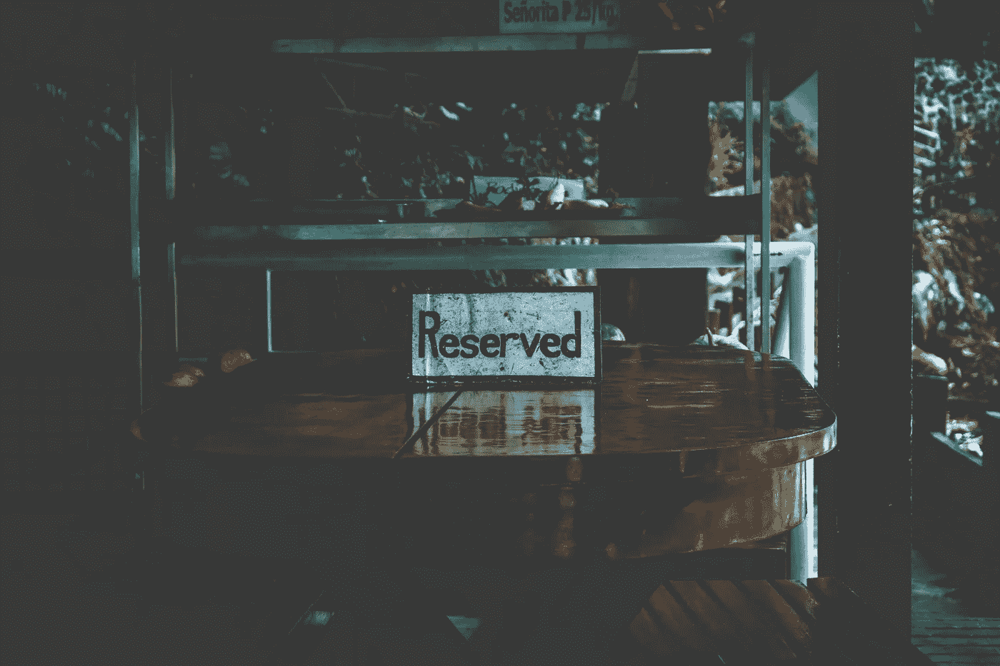

# 我们销售“排他性”

> 原文：<https://medium.datadriveninvestor.com/selling-exclusivity-115488db7ff5?source=collection_archive---------4----------------------->

## —成为“俱乐部”的一员。

**Credits: Photo by** [**Inspired by you**](https://www.pexels.com/@inspired-by-you-540650?utm_content=attributionCopyText&utm_medium=referral&utm_source=pexels) **from** [**Pexels**](https://www.pexels.com/photo/white-reserved-sign-on-brown-wooden-table-1648373/?utm_content=attributionCopyText&utm_medium=referral&utm_source=pexels)

人和动物一样，都是饥饿的生物。我们对更多的渴望是无限的，不可抑制的。

没有什么比“独家”这个词更能抑制这种欲望和渴望。

 [## 为什么包容性财富指数比 GDP 更能衡量社会进步？-数据驱动…

### 你不需要成为一个经济奇才或金融大师就能知道 GDP 的定义。即使你从未拿过 ECON 奖…

www.datadriveninvestor.com](https://www.datadriveninvestor.com/2019/03/08/why-inclusive-wealth-index-is-a-better-measure-of-societal-progress-than-gdp/) 

想想这个臭名昭著的钻石例子，钻石并不罕见。然而他们被认为是。人们是根本不看，还是宁愿看不到这个事实？

排斥这个词，附在任何媒体上，在这个不满足、缺乏安全感、缺乏自尊的世界里，都有一种不可否认的力量。

购买一件独一无二的物品会让人们觉得他们已经征服了曾经被认为不可攀登的山峰。

炫耀“独家”一词并不可耻，我曾有幸参观过一个著名家居服装品牌的仓库。这件事有些不可思议，有些难以捉摸，有些令人不安。

仿佛我正站在下水道里；当我站在那里的时候，我心想‘这个品牌会自豪地向他们的顾客展示存放衣服的仓库的录像吗？’“如果顾客被转移到仓库，而不是铺着长毛绒红地毯和玻璃门的品牌店，他们还会有兴趣支付品牌向潜在顾客索要的价格吗？”

我想到了另一个场景，“如果价格标签突然降低，但这个地方还是一样，会发生什么？”

在这次旅行的最后，我痛苦地意识到“独家”销售。人们很少欣赏产品超过其包装。蛋糕装在有天鹅绒边的盒子里味道会更好。

标榜“独家”一词是指在不存在需求的地方推动需求的能力。如果一个人有幸拥有真正独一无二的产品；他们会发现自己处于一个显赫的地位，拥有说“不”的权威——“对不起，那件东西是非卖品”。

一个企业的繁荣依赖于排他性的公式，无论是名人形象，限量版，还是个人刻在一件衣服上的首字母。都是一回事。

独家买家期待回报；一些他们可以保留的东西，以提醒自己他们现在是“俱乐部”的一部分。一个他们可以向朋友炫耀的图腾，他们是邪教的一部分，不是每个人都可以接触到。

以酒店业务为例，说明如今它是如何受到 Airbnb 等应用程序的挑战的；酒店现在发现自己在与一个帝国竞争，这个帝国并不拥有任何一家酒店，只为第三方代理服务。一个适合你口袋的旅行社。

因此，现在酒店企业应该说什么，而不是“我们只接受尊贵客人，这是我们传统的一部分”，而不是“我们会给你提供折扣价”。我们必须开始重新思考广告对无孔不入的产品的影响力。一枚金币，一枚戒指，一枚徽章；这个符号提供了“排他性”一词的钥匙——当面对自大狂脆弱的头脑时，这个符号不可低估。

‘排他性’是一种毒品；像其他药物一样，它折磨着人性中无法满足的渴望。