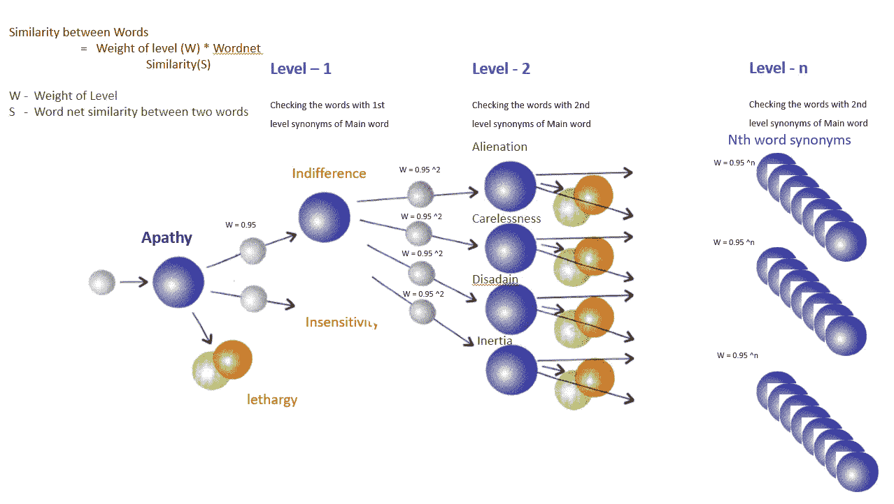
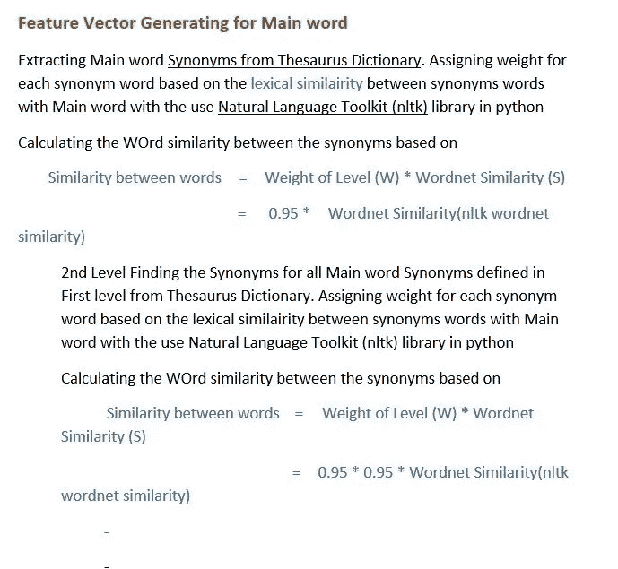
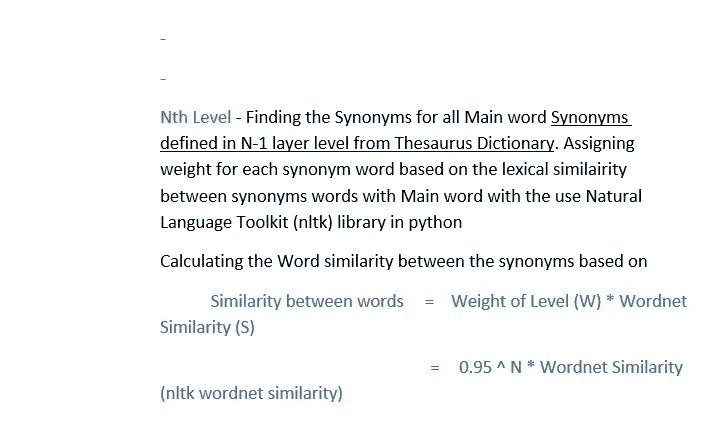
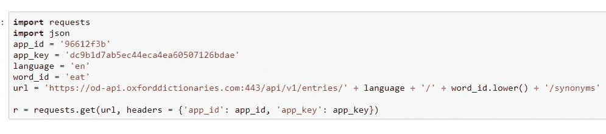
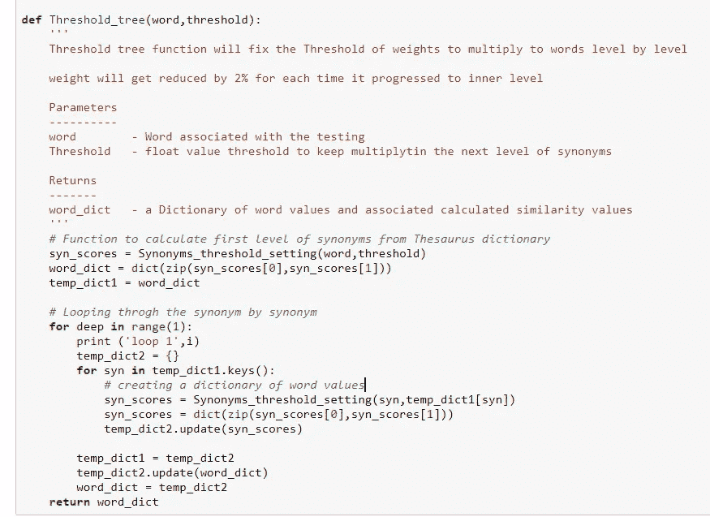
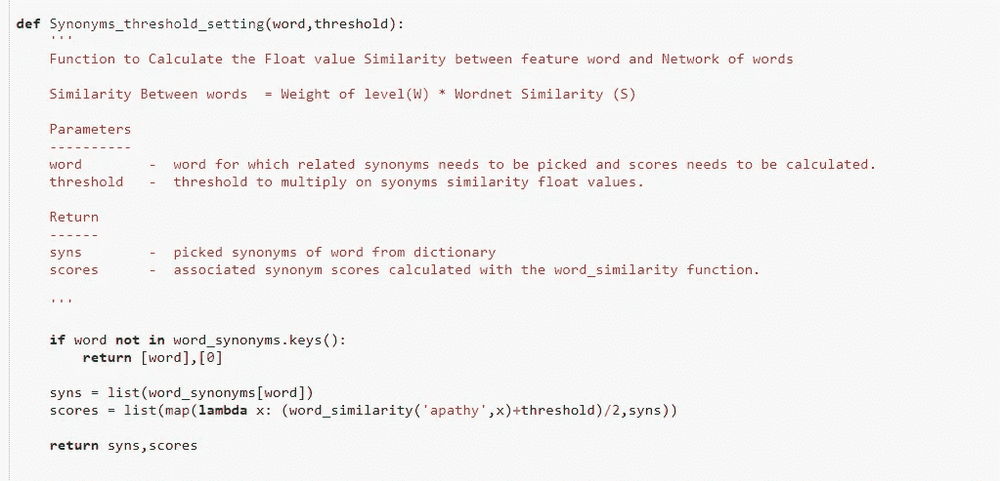
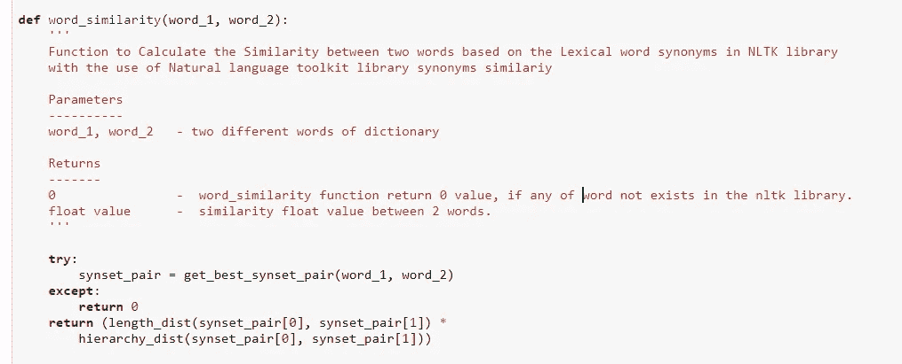
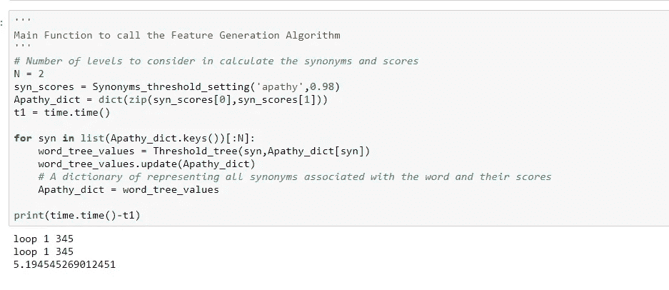
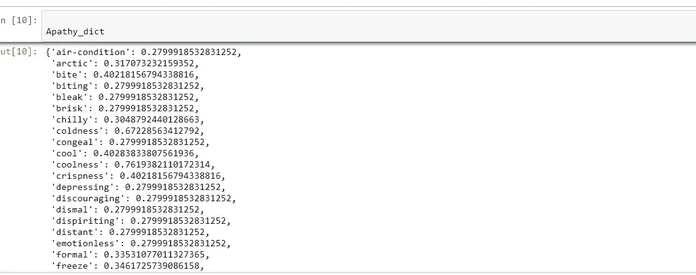

# 词的语义特征生成

> 原文：<https://medium.datadriveninvestor.com/semantic-feature-generation-for-words-9f47251eb5bd?source=collection_archive---------8----------------------->

[](http://www.track.datadriveninvestor.com/1B9E)

> 基于词间同义词距离的特征向量生成

在任何语言建模或文本分析中，单词的语义相似度和特征生成都是非常重要的。

语义特征生成涉及通过逐层计算同义词距离并结合来自自然语言工具包的词汇相似性来生成主词与和主词相关联的所有其他同义词的相似性值(浮点)。

> 这里我们考虑主词为 ***冷漠*** ，冷漠相关的第一级同义词具有最高的相似度值。考虑到阈值(0.95)，同义词下一级同义词的相似度低于最高相似度。

[](https://github.com/Nagakiran1/Semantic-Feature-generation-for-words#feature-vector-generating-for-main-word) [## nagakiran 1/词的语义特征生成

### 通过预处理(去除停用词、数字、URL 和词干分析)构建自然语言响应系统

github.com](https://github.com/Nagakiran1/Semantic-Feature-generation-for-words#feature-vector-generating-for-main-word) 

## **相似度计算流程**

相似函数

计算特征单词和单词网络之间的浮点值相似度的函数

单词之间的相似度=级别权重(W) *单词网络相似度(S)
单词之间的相似度= 0.98 ^ N *单词网络相似度(s)

这里选择的阈值= 0.98，N 代表计算的同义词的级别



Flow diagram



## 特征生成的代码实现

使用 Rest API 从[牛津同义词词典](https://www.thesaurus.com/)中检索一个单词的同义词

牛津同义词词典可以用不同的方式定义这个词



**强同义词**:可以定义非常接近被问词的意思，所有同义词可以给出被问词的所有相对可能性。在复习句子时，我们可以使用这些亲密词、所有同义词、所有反义词和反义词作为被问词的特征。

**Threshold_tree :** 阈值树是特征生成中必不可少的功能。阈值功能允许逐级改变阈值。阈值树功能将固定权重的阈值，以逐级乘以单词，每次进入内部级别，权重将减少 2%。



**Synonyms _ threshold _ setting**:计算特征词与词网相似度浮点值的函数

词间相似度=级别权重(W) *词网相似度(S)



[单词相似度](http://sujitpal.blogspot.com/2014/12/semantic-similarity-for-short-sentences.html)是两个函数 f(l)和 f(h)的组合，其中 l 是 Wordnet(我们的语义网络)中两个单词之间的最短路径，h 是它们离语义网络的根的最低公共包含(LCS)的高度。这些背后的直觉是，l 是单词相似程度的代表，d 是 LCS 的特异性的代表，即，更接近根的 LCS 节点指示更广泛/更抽象的概念和更少的相似性。函数 f(l)和 f(h)用于将这些值归一化到范围[0，1]。



```
sim(w1, w2) = f(l).f(h)f(l) = e-αl
            eβh - e-βh
    f(h) = ------------
            eβh + e-βh
```

**word _ synonyms:**word _ synonyms 是一个包含所有可能的单词及其同义词的字典。

main 函数允许逐层计算同义词，并计算与之相关的分数。

这里 N 表示在计算同义词和分数时要考虑的级别



一方的输出单词:-)

为词语冷漠生成的语义相似词

