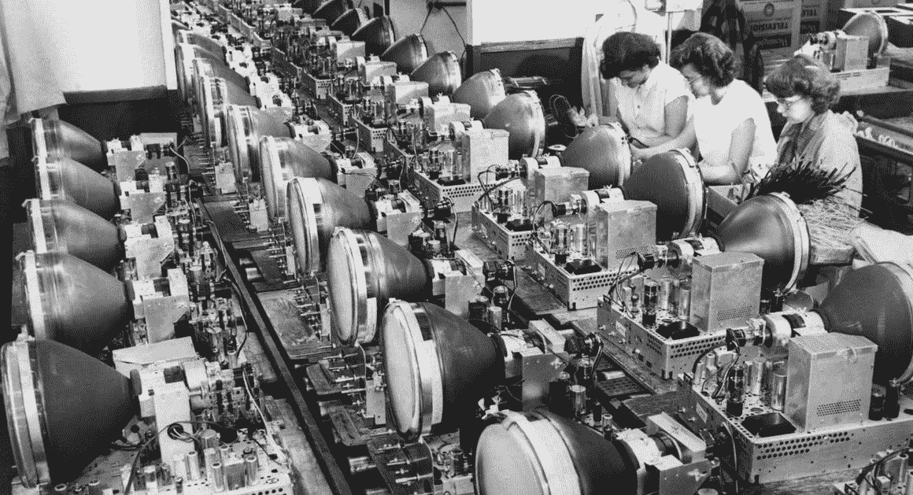
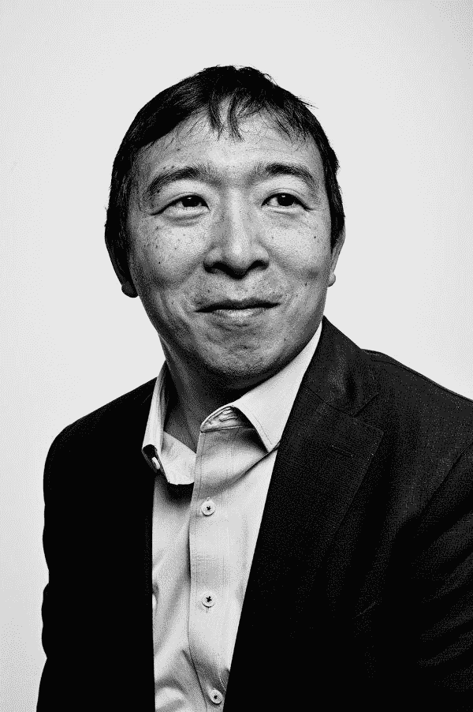

# 无意义的休闲、基本收入和人工智能

> 原文：<https://medium.datadriveninvestor.com/senseless-leisure-ubi-and-artificial-intelligence-3ff0312eed93?source=collection_archive---------8----------------------->

这篇文章是巴黎政治学院 [*技术革命史课程的作业。*](http://formation.sciences-po.fr/enseignement/2018/KAFP/3315) *该课程是公共政策硕士的政策流数字&新技术的一部分，由*[*laurène Tran*](https://medium.com/u/31b76182111a?source=post_page-----3ff0312eed93--------------------------------)*、*[*Besiana Balla*](https://medium.com/u/b57c90a0ecbd?source=post_page-----3ff0312eed93--------------------------------)*和*[*Nicolas Colin*](https://medium.com/u/c842401c1ec4?source=post_page-----3ff0312eed93--------------------------------)*指导。*

技术的独特之处在于有一天，人类将被人工智能或认知增强的生物智能超越。有人担心人工智能会取代绝大多数人的工作。我们必然会被人类的技能和需求所诅咒:也许是糟糕的数学推理，或者是人工智能不需要的睡眠。整个社会最终可能看起来像皮克斯的反乌托邦《瓦力》( WALL-E ),粘在全息屏幕上的路人被无休止地拖在悬浮椅上，而 AI 为我们完成剩下的工作。

*A less than ideal proposal of our future, according to WALL-E*

未来学家、经济学家和技术领袖提出了普遍基本收入(UBI)作为解决大多数以人为主导的劳动力市场潜在最小化的解决方案。UBI 的概念是所有公民，无论社会经济地位如何，都能得到津贴。个人收入多少及其节奏取决于具体情况，但前提仍然是:所有公民都得到报酬。句号。[史蒂芬·霍金](https://www.wired.com/brandlab/2015/10/stephen-hawkings-ama/)在他的第一个 Reddit 上问我任何问题，[马克·扎克伯格](http://time.com/money/4795625/mark-zuckerberg-harvard-speech-universal-basic-income/)在哈佛毕业典礼上的演讲和[埃隆·马斯克](https://www.cnbc.com/2018/06/18/elon-musk-automated-jobs-could-make-ubi-cash-handouts-necessary.html)都认为免费现金分发“随着时间的推移，如果人工智能接管大多数人类工作，将是必要的。”一个世纪前，著名的经济学家约翰·梅纳德·凯恩斯[曾预言过类似的事情](http://www.econ.yale.edu/smith/econ116a/keynes1.pdf):“我们将被一种新的疾病所折磨——即技术失业。这意味着失业，因为我们发现节约使用劳动力的方法的速度超过了我们发现劳动力新用途的速度。”

尽管人们一致认为，面对不断进步的技术，我们需要重新思考社会安全网，但 UBI 仍受到质疑，因为它意味着社会中最不富裕的人将获得相对较少的福利。同样有争议的是，由于先进的人工智能，实际上有多少人在经济上变得“无用”。我们以前见过技术革命和大规模自动化的威胁。尽管一些行业已经过时，但以前想象不到的工作已经遍地开花。想想产品经理、首席信息官和 UX 设计师。瓦力预言的我们的未来真的有多贴切？

**大规模自动化并不新奇……**

科技进步带来的自动化并不是一个新概念。技术和社会经济发展学者卡洛塔·佩雷斯(Carlota Perez)统计了自 1771 年以来工业历史上相当多的技术创新爆发:工业革命；钢铁和铁路；钢铁、电力和重型工程；石油、汽车和大规模生产，最后是信息和电信时代。每一次技术革命的到来都与上一次大同小异:都是以“大发展浪潮”的形式。在她看来，有不同的发展阶段。*安装*，新产业和基础设施挑战现有规范，一个*转折点*，新产业和现有规范之间的紧张关系达到顶点，最后*部署*，技术革命蔓延到整个经济。

佩雷斯的转折点是一个真正的社会痛处。安装阶段既有爆炸性增长的领域，也有停滞和衰退的领域。不公平的分配“泡沫的收益”给政治家和现存的社会结构带来压力，让他们为大多数人提供福利。她说，“重大金融危机意味着钟摆的摆动。”我们既经历了技术创新和自动化带来的劳动成果，也经历了日益加剧的不平等和政治动荡。但是，我们最终会度过难关。新技术的市场变得饱和，社会结构适应，金融资本转移到新的部门，成熟下一个大浪潮。

*Automation through the ages*

也许社会会像过去一样适应，而不是围绕人工智能的监控、许可和修复创造过多的新工作。我们不会被无意义的休闲或大规模失业所困扰，相反，我们将参与难以想象的劳动力市场。

**…但自动化 2.0 是。**

如果说过去的技术革命教会了我们什么，那就是重新想象我们的社会、政治和经济结构无异于一种创伤。然而，预测的人工智能导致的大规模自动化这次在一个基本方面有所不同:社会各个层面的自动化程度。当我们想到教育、医疗保健或住房等技术基本未触及的领域时，人工智能和深度学习只代表了我们生活的一小部分。然而，其预测的含义影响了我们社会存在的所有方面。经济合作与发展组织(OECD)预测，在经合组织国家中，14%或 6600 万个工作岗位被认为是“高度自动化”的。牛津大学的研究人员在 2013 年[预测了](https://www.oxfordmartin.ox.ac.uk/downloads/academic/The_Future_of_Employment.pdf)更加暗淡的事情。他们对 702 种职业的美国劳动力市场未来计算机化的分析表明，美国总就业人数的 47%面临自动化的风险。陷入困境的不仅仅是蓝领工人。我们大多数人都是，即使是那些参与知识经济的人。经济学家认为，高技能工人将无法按照技术变革的速度重塑他们的技能组合。

**总结思路**

不仅仅是科技巨头认为 UBI 是技术奇点的可行选择。许多市民认为他们非常需要它。在 2017 年对 28 个欧洲国家的调查中，68%的欧洲人将投票支持基本收入，高于去年的 64%。在肯尼亚、芬兰、加拿大和加利福尼亚等州也有一些 UBI 试点研究。事实上，企业家兼作家杨安泽[正在 UBI 的前提下竞选 2020 年美国民主党总统](https://www.yang2020.com/)。他称之为自由红利:从受益于人工智能的公司的增值税中每月收取 1000 美元。私人也为普及基本保健服务做出了努力。自由作家兼 UBI 活动家斯科特·桑坦斯(Scott Santens)，[利用分散的众筹来支付他的每月津贴。Y combinator 正在加州奥克兰资助自己的短期 UBI 试点项目。](https://www.theatlantic.com/business/archive/2015/05/what-if-everybody-didnt-have-to-work-to-get-paid/393428/)

*Andrew Yang, 2020 democratic presidential candidate, running on the platform of UBI*

虽然 UBI 可以为那些受人工智能自动化支配的人提供一些财政救济，但其他政策应该到位，以缓解我们对劳动力(或劳动力缺乏)的未来。培养技能、相关培训和求职援助应与 UBI 同步进行。著名历史学家尤瓦尔·赫拉利并不害怕他所声称的不可避免的自动化和“无用阶级”的崛起。相反，他更害怕大量闲暇带来的后果。他描绘了一幅社会的悲惨画面，这个社会利用他们的时间滥用药物来唤起情绪，否则就处于深度虚拟现实“游戏”状态。我们必须希望这不会成功，相反，我们会找到充满活力和创造性的方式来度过我们的时间。正如杨所说，“UBI 将是我们见过的艺术和创业的最大催化剂。”这也是缓解技术奇点导致的潜在大规模失业压力的一种方式。