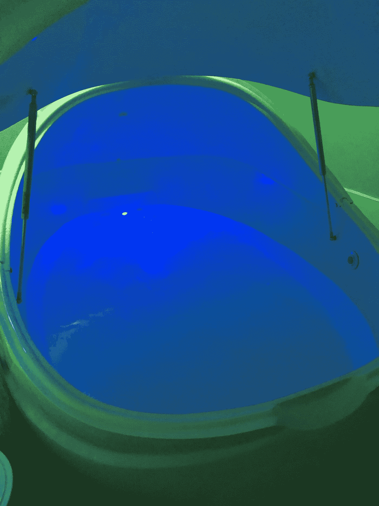

# 感官剥夺到平静

> 原文：<https://medium.datadriveninvestor.com/sensory-deprivation-to-calm-8143b82cd197?source=collection_archive---------20----------------------->

几年前，我尝试了漂浮疗法(又名感觉剥夺疗法)来帮助放松，发现它非常有帮助。面对生活中每天的挑战，我发现自己又开始关注漂浮了，并且对我的经历很感兴趣！

我的疗程总共是 90 分钟。75 分钟用于漂浮，15 分钟用于淋浴/穿衣。

我戴上耳塞，小心翼翼地走进吊舱，以免海水溅到脸上。

我在舱里没穿衣服。会议开始时有 10 分钟的音乐，然后音乐中断。它会在会话结束前 5 分钟返回。

如果运用得当，漂浮可以帮助减少压力、紧张和疼痛。如果你有任何问题，一定要咨询你的医生。

水中充满了浓缩的泻盐，有助于身体轻松自如地漂浮。

根据总部设在英国*的[漂浮中心](https://floatworks.com/journal/why-floatation-tanks-use-epsom-salts)的说法，“人们发现浸泡在泻盐中可以刺激淋巴引流，促进镁和硫酸盐的吸收。当使用漂浮罐时，由于自然分子扩散，镁通过皮肤被吸收，身体优化了镁的水平，因此长时间漂浮在盐中不会产生过载效应。”*

随着时间的推移，我发现我的头脑有些混乱。当我漂浮的时候，我感到我的思想进进出出。我确实感觉到被困在吊舱中的想法，因此，我不断提醒自己回到现在。我不确定我是否错过了结束会议的音乐，当我最终听到它回来时，我感到如释重负。

喝了一杯茶后，我感到轻松愉快，精神焕发。

你以前漂浮过吗？如果有，你的经历是什么？